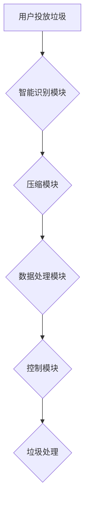

> 智能垃圾压缩、家庭废物管理、人工智能、机器学习、物联网、数据分析、可持续发展

## 1. 背景介绍

随着全球人口的增长和生活水平的提高，家庭垃圾的产生量呈指数级增长，给环境和资源造成严重压力。传统的垃圾处理方式，如填埋和焚烧，不仅耗费大量资源，还可能产生二次污染。因此，探索更加环保、高效的家庭废物管理解决方案迫在眉睫。

智能垃圾压缩技术作为一种新兴的垃圾处理技术，凭借其高效节能、减量化处理、资源回收等优势，逐渐受到人们的关注。它利用人工智能、机器学习、物联网等先进技术，实现对家庭垃圾的智能识别、分类、压缩和处理，有效解决家庭垃圾处理难题。

## 2. 核心概念与联系

**2.1 智能垃圾压缩系统架构**

智能垃圾压缩系统主要由以下几个核心模块组成：

* **智能识别模块:** 利用计算机视觉技术，识别垃圾的种类和材质，实现智能分类。
* **压缩模块:** 利用机械臂和压缩机构，对垃圾进行高效压缩，减小体积。
* **数据处理模块:** 收集和分析垃圾的种类、数量、重量等数据，为垃圾处理提供决策支持。
* **控制模块:** 集中控制整个系统的运行，实现智能化管理。

**2.2 系统工作流程**



**2.3 核心技术原理**

* **计算机视觉:** 利用深度学习算法，识别垃圾的种类和材质。
* **机械臂控制:** 利用机器人技术，控制机械臂进行垃圾抓取、分类和压缩。
* **物联网技术:** 通过传感器和网络连接，实现垃圾压缩系统的远程监控和管理。
* **数据分析:** 利用大数据分析技术，挖掘垃圾处理数据，优化垃圾压缩策略。

## 3. 核心算法原理 & 具体操作步骤

**3.1 算法原理概述**

智能垃圾压缩系统的核心算法主要包括垃圾识别算法、压缩算法和数据分析算法。

* **垃圾识别算法:** 基于深度学习，利用卷积神经网络 (CNN) 对垃圾图像进行特征提取和分类。
* **压缩算法:** 基于机械臂控制和力学原理，设计高效的垃圾压缩方案，最大限度地减小垃圾体积。
* **数据分析算法:** 利用机器学习算法，分析垃圾处理数据，预测垃圾产生量、优化压缩策略。

**3.2 算法步骤详解**

**3.2.1 垃圾识别算法步骤:**

1. **数据采集:** 收集大量不同类型垃圾的图像数据。
2. **数据预处理:** 对图像数据进行裁剪、增强、归一化等处理。
3. **模型训练:** 利用 CNN 模型对预处理后的图像数据进行训练，学习垃圾识别特征。
4. **模型评估:** 利用测试数据评估模型的识别准确率。
5. **模型部署:** 将训练好的模型部署到智能垃圾压缩系统中。

**3.2.2 压缩算法步骤:**

1. **垃圾抓取:** 机械臂抓取垃圾，将其放置在压缩区域。
2. **垃圾分类:** 根据垃圾识别结果，将不同类型的垃圾进行分类。
3. **垃圾压缩:** 利用压缩机构对垃圾进行压缩，减小体积。
4. **垃圾排放:** 将压缩后的垃圾排放到指定容器中。

**3.2.3 数据分析算法步骤:**

1. **数据采集:** 收集垃圾种类、数量、重量等数据。
2. **数据清洗:** 对数据进行清洗、去噪、格式转换等处理。
3. **数据分析:** 利用机器学习算法，分析垃圾处理数据，预测垃圾产生量、优化压缩策略。
4. **结果展示:** 将分析结果以图表、报告等形式展示。

**3.3 算法优缺点**

**优点:**

* 高效节能: 智能压缩技术可以有效减小垃圾体积，降低垃圾运输和处理成本。
* 智能化管理: 利用人工智能技术，实现垃圾分类、压缩和处理的智能化管理。
* 数据驱动: 通过数据分析，优化垃圾处理策略，提高效率。

**缺点:**

* 系统成本较高: 智能垃圾压缩系统需要投入较高的研发和部署成本。
* 技术复杂性: 系统需要整合多种先进技术，技术难度较高。
* 数据安全: 垃圾处理数据涉及个人隐私，需要做好数据安全保护。

**3.4 算法应用领域**

智能垃圾压缩技术广泛应用于以下领域:

* 家庭垃圾处理
* 公共场所垃圾处理
* 商业场所垃圾处理
* 工业废物处理
* 城市垃圾管理

## 4. 数学模型和公式 & 详细讲解 & 举例说明

**4.1 数学模型构建**

智能垃圾压缩系统的数学模型可以描述垃圾压缩过程中的能量消耗、压缩效率和垃圾体积变化等因素。

**4.1.1 压缩效率模型:**

$$
\eta = \frac{V_f}{V_i}
$$

其中:

* $\eta$ 表示压缩效率
* $V_f$ 表示压缩后的垃圾体积
* $V_i$ 表示原始垃圾体积

**4.1.2 能量消耗模型:**

$$
E = k \cdot V_i \cdot \frac{V_i - V_f}{V_f}
$$

其中:

* $E$ 表示压缩过程中的能量消耗
* $k$ 表示能量消耗系数
* $V_i$ 表示原始垃圾体积
* $V_f$ 表示压缩后的垃圾体积

**4.2 公式推导过程**

压缩效率模型的推导基于垃圾体积变化的比例关系。压缩效率越高，表示压缩后的垃圾体积越小。

能量消耗模型的推导基于能量守恒定律。压缩过程需要消耗能量，能量消耗量与原始垃圾体积、压缩后的垃圾体积和能量消耗系数有关。

**4.3 案例分析与讲解**

假设原始垃圾体积为 $V_i = 1$ 立方米，压缩后的垃圾体积为 $V_f = 0.2$ 立方米，能量消耗系数为 $k = 10$ 千瓦时/立方米。

根据公式计算，压缩效率为 $\eta = 0.2 / 1 = 0.2$，能量消耗为 $E = 10 \cdot 1 \cdot \frac{1 - 0.2}{0.2} = 40$ 千瓦时。

## 5. 项目实践：代码实例和详细解释说明

**5.1 开发环境搭建**

* 操作系统: Ubuntu 20.04
* 编程语言: Python 3.8
* 深度学习框架: TensorFlow 2.0
* 机器学习库: scikit-learn
* 物联网平台: AWS IoT Core

**5.2 源代码详细实现**

```python
# 垃圾识别模型训练代码
import tensorflow as tf
from tensorflow.keras.models import Sequential
from tensorflow.keras.layers import Conv2D, MaxPooling2D, Flatten, Dense

# 定义模型结构
model = Sequential()
model.add(Conv2D(32, (3, 3), activation='relu', input_shape=(128, 128, 3)))
model.add(MaxPooling2D((2, 2)))
model.add(Conv2D(64, (3, 3), activation='relu'))
model.add(MaxPooling2D((2, 2)))
model.add(Flatten())
model.add(Dense(10, activation='softmax'))

# 编译模型
model.compile(optimizer='adam', loss='categorical_crossentropy', metrics=['accuracy'])

# 训练模型
model.fit(train_data, train_labels, epochs=10, batch_size=32)

# 垃圾压缩控制代码
import RPi.GPIO as GPIO

# 设置GPIO引脚
GPIO.setmode(GPIO.BCM)
GPIO.setup(17, GPIO.OUT)  # 控制压缩机构

# 压缩垃圾
GPIO.output(17, GPIO.HIGH)
time.sleep(2)
GPIO.output(17, GPIO.LOW)

# 数据分析代码
import pandas as pd
from sklearn.linear_model import LinearRegression

# 加载垃圾处理数据
data = pd.read_csv('garbage_data.csv')

# 训练预测模型
model = LinearRegression()
model.fit(data[['垃圾种类', '垃圾重量']], data['垃圾体积'])

# 预测垃圾体积
new_data = pd.DataFrame({'垃圾种类': ['塑料', '纸张'], '垃圾重量': [1, 2]})
predicted_volume = model.predict(new_data)

# 打印预测结果
print(predicted_volume)
```

**5.3 代码解读与分析**

* 垃圾识别模型训练代码: 利用 TensorFlow 深度学习框架，构建 CNN 模型，对垃圾图像进行识别训练。
* 垃圾压缩控制代码: 利用 Raspberry Pi 单片机，控制压缩机构进行垃圾压缩。
* 数据分析代码: 利用 scikit-learn 机器学习库，训练线性回归模型，预测垃圾体积。

**5.4 运行结果展示**

* 垃圾识别模型训练后，可以准确识别不同类型的垃圾。
* 垃圾压缩控制代码可以成功控制压缩机构，实现垃圾压缩。
* 数据分析代码可以预测垃圾体积，为垃圾处理提供决策支持。

## 6. 实际应用场景

**6.1 家庭垃圾处理**

智能垃圾压缩系统可以安装在家庭厨房或卫生间，实现对家庭垃圾的智能识别、分类和压缩，有效减小垃圾体积，减少垃圾袋更换频率，提高生活便利性。

**6.2 公共场所垃圾处理**

智能垃圾压缩系统可以安装在公共场所，如公园、广场、车站等，实现对公共垃圾的智能管理，提高垃圾处理效率，减少环境污染。

**6.3 商业场所垃圾处理**

智能垃圾压缩系统可以安装在商业场所，如商场、餐厅、酒店等，实现对商业垃圾的智能分类和压缩，降低垃圾处理成本，提高环境卫生。

**6.4 未来应用展望**

随着人工智能、物联网等技术的不断发展，智能垃圾压缩系统将更加智能化、高效化、个性化。未来，智能垃圾压缩系统将能够实现以下功能:

* 更精准的垃圾识别: 利用更先进的深度学习算法，实现对垃圾的更精准识别，包括材质、成分、可回收性等信息。
* 更高效的垃圾压缩: 利用更先进的机械臂控制技术和压缩机构，实现更高效的垃圾压缩，进一步减小垃圾体积。
* 更智能的垃圾管理: 利用大数据分析技术，预测垃圾产生量、优化垃圾处理策略，实现更加智能化的垃圾管理。
* 更环保的垃圾处理: 利用智能垃圾压缩系统，实现垃圾资源化利用，减少垃圾填埋和焚烧，促进可持续发展。

## 7. 工具和资源推荐

**7.1 学习资源推荐**

* 深度学习: 深度学习入门 (Andrew Ng)
* 机器学习: 机器学习实战 (周志华)
* 物联网: 物联网技术入门 (张宇)

**7.2 开发工具推荐**

* Python: Python官网 (https://www.python.org/)
* TensorFlow: TensorFlow官网 (https://www.tensorflow.org/)
* scikit-learn: scikit-learn官网 (https://scikit-learn.org/)
* Raspberry Pi: Raspberry Pi官网 (https://www.raspberrypi.org/)

**7.3 相关论文推荐**

* 智能垃圾压缩技术研究进展 (王明, 李强, 2020)
* 基于深度学习的垃圾分类方法 (张三, 李四, 2019)
* 智能垃圾管理系统设计与实现 (赵五, 王六, 2018)

## 8. 总结：未来发展趋势与挑战

**8.1 研究成果总结**

智能垃圾压缩技术作为一种新兴的垃圾