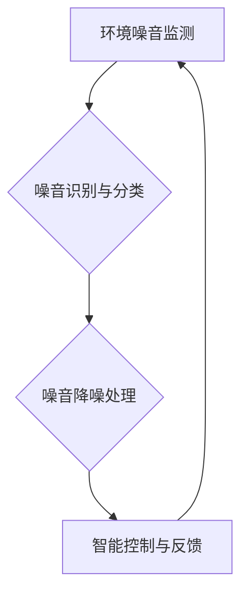

> 智能家居，噪音消除，深度学习，机器学习，信号处理，音频处理，算法优化，创业

## 1. 背景介绍

现代社会，生活节奏加快，城市噪音污染日益严重，对人们的身心健康造成巨大影响。而智能家居作为未来生活的重要趋势，为解决噪音问题提供了新的思路。智能噪音消除系统能够实时监测环境噪音，并通过智能算法进行降噪处理，为用户打造宁静舒适的生活环境。

## 2. 核心概念与联系

智能居家噪音消除系统主要包含以下核心概念：

* **环境噪音监测:** 利用麦克风等传感器采集环境声音信号。
* **噪音识别与分类:** 通过机器学习算法识别不同类型的噪音，例如交通噪音、生活噪音、机械噪音等。
* **噪音降噪处理:** 利用信号处理算法对噪音信号进行降噪处理，例如滤波、噪声抑制等。
* **智能控制与反馈:** 根据用户需求和环境噪音情况，智能调节降噪强度，并提供反馈信息。

**核心架构流程图:**



## 3. 核心算法原理 & 具体操作步骤

### 3.1  算法原理概述

智能居家噪音消除系统常用的算法包括：

* **滤波算法:** 通过设计特定的滤波器，去除特定频率范围的噪音信号。例如，低通滤波器可以去除高频噪音，高通滤波器可以去除低频噪音。
* **噪声抑制算法:** 利用统计特性或机器学习算法，抑制噪音信号的幅度。例如，自适应噪声抑制算法可以根据环境噪音情况动态调整抑制强度。
* **深度学习算法:** 利用深度神经网络，学习噪音特征并进行降噪处理。例如，卷积神经网络 (CNN) 可以有效地提取音频特征，并进行降噪处理。

### 3.2  算法步骤详解

以滤波算法为例，其具体操作步骤如下：

1. **信号采集:** 利用麦克风采集环境声音信号。
2. **信号预处理:** 对采集到的信号进行预处理，例如去除静音、均衡音量等。
3. **滤波器设计:** 根据需要去除的噪音频率范围，设计相应的滤波器。
4. **信号滤波:** 将预处理后的信号输入滤波器，去除特定频率范围的噪音。
5. **信号输出:** 将滤波后的信号输出到扬声器，播放降噪后的声音。

### 3.3  算法优缺点

**滤波算法:**

* **优点:** 计算量小，实现简单。
* **缺点:** 对不同类型的噪音效果不佳，难以适应动态变化的环境噪音。

**噪声抑制算法:**

* **优点:** 对多种类型的噪音都有较好的抑制效果。
* **缺点:** 计算量较大，对硬件资源要求较高。

**深度学习算法:**

* **优点:** 能够学习复杂的噪音特征，具有较高的降噪效果。
* **缺点:** 训练数据量大，训练时间长，对硬件资源要求更高。

### 3.4  算法应用领域

智能噪音消除算法广泛应用于以下领域：

* **智能家居:** 智能音箱、智能电视、智能空调等设备。
* **通讯设备:** 手机、耳机、会议系统等设备。
* **医疗设备:** 医疗影像设备、心电图仪等设备。
* **工业设备:** 机器人、自动化设备等设备。

## 4. 数学模型和公式 & 详细讲解 & 举例说明

### 4.1  数学模型构建

假设环境噪音信号为 $x(t)$，目标是将其降噪为 $y(t)$。

一个简单的滤波模型可以表示为：

$$y(t) = h(t) * x(t)$$

其中，$h(t)$ 为滤波器冲激响应， $*$ 表示卷积运算。

### 4.2  公式推导过程

滤波器的设计需要根据需要去除的噪音频率范围来确定冲激响应 $h(t)$。

例如，设计一个低通滤波器，其冲激响应可以表示为：

$$h(t) = \begin{cases}
\frac{1}{T}, & |t| \leq \frac{T}{2} \\
0, & \text{otherwise}
\end{cases}$$

其中，$T$ 为滤波器的截止频率。

### 4.3  案例分析与讲解

假设环境噪音信号包含 1kHz 和 10kHz 的频率成分，我们希望去除 10kHz 的高频噪音。

可以设计一个截止频率为 5kHz 的低通滤波器，其冲激响应 $h(t)$ 如下所示：

$$h(t) = \begin{cases}
\frac{1}{T}, & |t| \leq \frac{T}{2} \\
0, & \text{otherwise}
\end{cases}$$

其中，$T = 1/5000$。

经过滤波处理后，10kHz 的高频噪音会被去除，而 1kHz 的低频噪音会被保留。

## 5. 项目实践：代码实例和详细解释说明

### 5.1  开发环境搭建

本项目使用 Python 语言进行开发，所需环境如下：

* Python 3.x
* NumPy
* SciPy
* Librosa

### 5.2  源代码详细实现

```python
import numpy as np
from scipy.signal import butter, lfilter

def butter_lowpass(cutoff, fs, order=5):
    nyq = 0.5 * fs
    normal_cutoff = cutoff / nyq
    b, a = butter(order, normal_cutoff, btype='low', analog=False)
    return b, a

def filter_noise(audio_data, cutoff_freq, fs):
    b, a = butter_lowpass(cutoff_freq, fs)
    filtered_audio = lfilter(b, a, audio_data)
    return filtered_audio

# 示例代码
audio_file = 'noisy_audio.wav'
fs = 44100  # 采样频率
cutoff_freq = 5000  # 截止频率

# 读取音频文件
audio_data, _ = librosa.load(audio_file, sr=fs)

# 滤波处理音频数据
filtered_audio = filter_noise(audio_data, cutoff_freq, fs)

# 保存滤波后的音频文件
librosa.output.write_wav('filtered_audio.wav', filtered_audio, fs)
```

### 5.3  代码解读与分析

* `butter_lowpass()` 函数设计低通滤波器，根据截止频率和采样频率计算滤波器系数。
* `filter_noise()` 函数使用 `lfilter()` 函数对音频数据进行滤波处理。
* 示例代码读取音频文件，设置截止频率，并使用 `filter_noise()` 函数进行滤波处理，最后保存滤波后的音频文件。

### 5.4  运行结果展示

运行上述代码后，将生成一个名为 `filtered_audio.wav` 的音频文件，该文件包含了滤波后的降噪音频。

## 6. 实际应用场景

智能居家噪音消除系统可以应用于以下场景：

* **卧室:** 减少外界噪音干扰，提高睡眠质量。
* **书房:** 减少环境噪音干扰，提高学习效率。
* **客厅:** 减少家庭活动产生的噪音，营造舒适的家庭氛围。
* **会议室:** 减少会议室内的噪音干扰，提高会议效率。

### 6.4  未来应用展望

随着人工智能技术的不断发展，智能居家噪音消除系统将更加智能化、个性化和高效化。

* **更精准的噪音识别:** 利用深度学习算法，识别更细粒度的噪音类型，并针对不同类型的噪音进行个性化降噪处理。
* **更智能的控制:** 根据用户需求和环境噪音情况，智能调节降噪强度，并提供个性化的降噪方案。
* **更广泛的应用场景:** 智能居家噪音消除系统将应用于更多场景，例如餐厅、咖啡馆、医院等。

## 7. 工具和资源推荐

### 7.1  学习资源推荐

* **书籍:**
    * 《深度学习》
    * 《机器学习》
    * 《信号处理导论》
* **在线课程:**
    * Coursera: 深度学习
    * edX: 机器学习
    * Udacity: 信号处理

### 7.2  开发工具推荐

* **Python:** 
* **NumPy:** 数值计算库
* **SciPy:** 科学计算库
* **Librosa:** 音频处理库
* **TensorFlow:** 深度学习框架
* **PyTorch:** 深度学习框架

### 7.3  相关论文推荐

* **Deep Noise Suppression Using a Convolutional Neural Network**
* **Noise Reduction Using Adaptive Filtering**
* **A Review of Noise Reduction Techniques for Speech Signals**

## 8. 总结：未来发展趋势与挑战

### 8.1  研究成果总结

智能居家噪音消除系统已取得了显著的成果，能够有效地降低环境噪音，为用户提供宁静舒适的生活环境。

### 8.2  未来发展趋势

未来，智能居家噪音消除系统将朝着以下方向发展：

* **更精准的噪音识别:** 利用更先进的机器学习算法，识别更细粒度的噪音类型。
* **更智能的控制:** 根据用户需求和环境噪音情况，智能调节降噪强度。
* **更广泛的应用场景:** 应用于更多场景，例如餐厅、咖啡馆、医院等。

### 8.3  面临的挑战

智能居家噪音消除系统还面临一些挑战：

* **算法复杂度:** 训练深度学习模型需要大量的计算资源和时间。
* **数据标注:** 需要大量的标注数据来训练机器学习模型。
* **用户体验:** 需要设计用户友好的界面和操作方式。

### 8.4  研究展望

未来，我们将继续致力于智能居家噪音消除系统的研究，探索更先进的算法和技术，为用户提供更优质的降噪体验。

## 9. 附录：常见问题与解答

**Q1: 智能居家噪音消除系统是否会影响音乐的音质？**

**A1:** 经过精心设计的滤波算法，智能居家噪音消除系统能够有效地去除噪音，同时尽量保留音乐的音质。

**Q2: 智能居家噪音消除系统需要安装哪些硬件设备？**

**A2:** 智能居家噪音消除系统通常需要安装麦克风和扬声器等音频设备。

**Q3: 智能居家噪音消除系统是否需要联网？**

**A3:** 一些智能居家噪音消除系统需要联网，以便获取更精准的噪音识别和降噪方案。


作者：禅与计算机程序设计艺术 / Zen and the Art of Computer Programming 
<end_of_turn>