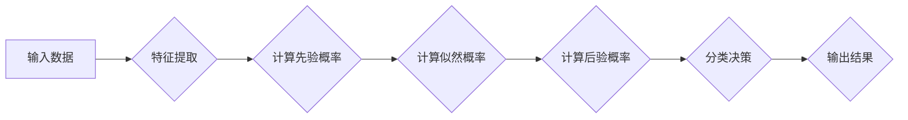

>朴素贝叶斯，贝叶斯分类，概率论，机器学习，文本分类，垃圾邮件过滤

## 1. 背景介绍

在机器学习领域，分类问题占据着重要地位。分类问题旨在将数据点划分为预先定义的类别。朴素贝叶斯算法是一种经典的概率性分类算法，以其简单易懂、训练速度快、效果良好而备受关注。它广泛应用于文本分类、垃圾邮件过滤、情感分析、医疗诊断等领域。

朴素贝叶斯算法基于贝叶斯定理，假设特征之间相互独立，从而简化了计算过程。尽管这个“朴素”的假设在现实世界中并不总是成立，但朴素贝叶斯算法仍然表现出令人印象深刻的性能，尤其是在高维数据和文本分类任务中。

## 2. 核心概念与联系

### 2.1 贝叶斯定理

贝叶斯定理是朴素贝叶斯算法的核心基础。它描述了在已知证据条件下，事件发生的概率如何更新。

$$P(A|B) = \frac{P(B|A)P(A)}{P(B)}$$

其中：

* $P(A|B)$ 是事件 A 在已知事件 B 发生的条件下发生的概率。
* $P(B|A)$ 是事件 B 在已知事件 A 发生的条件下发生的概率。
* $P(A)$ 是事件 A 发生的概率。
* $P(B)$ 是事件 B 发生的概率。

### 2.2 朴素贝叶斯假设

朴素贝叶斯算法的核心假设是特征之间相互独立。这意味着，一个特征的取值不会影响其他特征的取值。

**Mermaid 流程图**



## 3. 核心算法原理 & 具体操作步骤

### 3.1 算法原理概述

朴素贝叶斯算法的基本思想是：根据已有的训练数据，计算每个类别出现的概率以及每个特征在每个类别下出现的概率。然后，对于新的数据点，根据贝叶斯定理计算它属于每个类别的概率，并选择概率最高的类别作为预测结果。

### 3.2 算法步骤详解

1. **数据准备:** 收集并预处理训练数据，将数据转换为数字格式。
2. **特征提取:** 从数据中提取特征，例如文本中的词频、图像中的颜色分布等。
3. **计算先验概率:** 计算每个类别的先验概率，即在没有观察到任何特征的情况下，该类别出现的概率。
4. **计算似然概率:** 计算每个特征在每个类别下出现的概率，例如，在“垃圾邮件”类别中，“免费”这个词出现的频率。
5. **计算后验概率:** 使用贝叶斯定理计算每个数据点属于每个类别的后验概率。
6. **分类决策:** 选择后验概率最高的类别作为预测结果。

### 3.3 算法优缺点

**优点:**

* 简单易懂，易于实现。
* 训练速度快，适合处理大规模数据。
* 对缺失数据处理能力较强。

**缺点:**

* 朴素贝叶斯算法假设特征之间相互独立，这在现实世界中并不总是成立。
* 对训练数据质量要求较高，如果训练数据不充分或存在噪声，算法性能会下降。

### 3.4 算法应用领域

朴素贝叶斯算法广泛应用于以下领域：

* 文本分类：垃圾邮件过滤、情感分析、主题分类
* 医疗诊断：疾病预测、药物副作用分析
* 图像识别：图像分类、目标检测
* 自然语言处理：机器翻译、文本摘要

## 4. 数学模型和公式 & 详细讲解 & 举例说明

### 4.1 数学模型构建

假设我们有 $N$ 个训练样本，每个样本包含 $M$ 个特征。我们想要将这些样本分类到 $K$ 个类别中。

* $x_i$ 表示第 $i$ 个样本。
* $y_i$ 表示第 $i$ 个样本所属的类别。
* $C_k$ 表示第 $k$ 个类别。
* $f_j$ 表示第 $j$ 个特征。

### 4.2 公式推导过程

根据贝叶斯定理，我们可以计算样本 $x_i$ 属于类别 $C_k$ 的后验概率：

$$P(C_k|x_i) = \frac{P(x_i|C_k)P(C_k)}{P(x_i)}$$

其中：

* $P(C_k)$ 是类别 $C_k$ 的先验概率。
* $P(x_i|C_k)$ 是样本 $x_i$ 属于类别 $C_k$ 的似然概率。
* $P(x_i)$ 是样本 $x_i$ 出现的概率。

我们可以进一步分解似然概率：

$$P(x_i|C_k) = \prod_{j=1}^{M} P(f_j|C_k)$$

其中，$P(f_j|C_k)$ 是特征 $f_j$ 在类别 $C_k$ 下出现的概率。

### 4.3 案例分析与讲解

假设我们有一个文本分类任务，需要将邮件分类为“垃圾邮件”或“正常邮件”。

* **特征:** 文本中的词频。
* **类别:** “垃圾邮件”和“正常邮件”。

我们可以使用朴素贝叶斯算法训练一个分类器。训练过程中，我们会计算每个词在“垃圾邮件”和“正常邮件”类别下的概率，以及每个类别的先验概率。

然后，对于一个新的邮件，我们可以计算它属于“垃圾邮件”和“正常邮件”的概率，并选择概率最高的类别作为预测结果。

## 5. 项目实践：代码实例和详细解释说明

### 5.1 开发环境搭建

* Python 3.x
* scikit-learn 库

### 5.2 源代码详细实现

```python
from sklearn.naive_bayes import MultinomialNB
from sklearn.model_selection import train_test_split
from sklearn.metrics import accuracy_score

# 加载数据
# ...

# 将数据转换为特征和标签
X = ...
y = ...

# 将数据划分为训练集和测试集
X_train, X_test, y_train, y_test = train_test_split(X, y, test_size=0.2, random_state=42)

# 创建朴素贝叶斯分类器
clf = MultinomialNB()

# 训练分类器
clf.fit(X_train, y_train)

# 对测试集进行预测
y_pred = clf.predict(X_test)

# 计算准确率
accuracy = accuracy_score(y_test, y_pred)
print(f"准确率: {accuracy}")
```

### 5.3 代码解读与分析

* `MultinomialNB()` 创建一个朴素贝叶斯分类器，适用于文本分类任务。
* `train_test_split()` 将数据划分为训练集和测试集。
* `fit()` 方法训练分类器。
* `predict()` 方法对测试集进行预测。
* `accuracy_score()` 计算预测结果与真实标签的准确率。

### 5.4 运行结果展示

运行代码后，会输出测试集的准确率。

## 6. 实际应用场景

### 6.1 垃圾邮件过滤

朴素贝叶斯算法广泛应用于垃圾邮件过滤。通过训练数据，算法可以学习到垃圾邮件中常见的特征，例如“免费”、“赢奖”、“点击链接”等词语。然后，对于新的邮件，算法可以根据这些特征判断其是否为垃圾邮件。

### 6.2 情感分析

朴素贝叶斯算法也可以用于情感分析，即分析文本表达的情感倾向。例如，可以训练一个分类器，将文本分类为“正面”、“负面”或“中性”。

### 6.3 医疗诊断

在医疗领域，朴素贝叶斯算法可以用于疾病预测和药物副作用分析。例如，可以训练一个分类器，根据患者的症状和病史预测其患病概率。

### 6.4 未来应用展望

随着机器学习技术的不断发展，朴素贝叶斯算法在未来将有更广泛的应用场景。例如，可以将其应用于个性化推荐、欺诈检测、自然语言理解等领域。

## 7. 工具和资源推荐

### 7.1 学习资源推荐

* **书籍:**
    * 《机器学习》 - 周志华
    * 《Python机器学习实战》 - 塞缪尔·阿布拉姆斯
* **在线课程:**
    * Coursera: Machine Learning
    * edX: Introduction to Machine Learning

### 7.2 开发工具推荐

* **Python:** 
    * scikit-learn 库
    * NLTK 库

### 7.3 相关论文推荐

* **朴素贝叶斯分类算法** - Thomas M. Mitchell
* **朴素贝叶斯算法在文本分类中的应用** - David Lewis

## 8. 总结：未来发展趋势与挑战

### 8.1 研究成果总结

朴素贝叶斯算法是一种简单易懂、高效的分类算法，在文本分类、垃圾邮件过滤等领域取得了显著的成果。

### 8.2 未来发展趋势

* **改进朴素贝叶斯假设:** 研究更合理的特征依赖关系模型，以提高算法的准确性。
* **结合深度学习:** 将朴素贝叶斯算法与深度学习模型结合，例如将朴素贝叶斯作为深度学习模型的分类器。
* **应用于新领域:** 将朴素贝叶斯算法应用于更多新的领域，例如医疗诊断、金融风险评估等。

### 8.3 面临的挑战

* **特征选择:** 如何选择最有效的特征对于朴素贝叶斯算法的性能至关重要。
* **数据稀疏性:** 当数据稀疏时，朴素贝叶斯算法的性能会下降。
* **类别不平衡:** 当类别分布不平衡时，朴素贝叶斯算法的性能也会受到影响。

### 8.4 研究展望

未来，朴素贝叶斯算法的研究将继续朝着更准确、更鲁棒、更灵活的方向发展。


## 9. 附录：常见问题与解答

**1. 朴素贝叶斯算法为什么被称为“朴素”的？**

朴素贝叶斯算法假设特征之间相互独立，这在现实世界中并不总是成立。因此，它被称为“朴素”的。

**2. 朴素贝叶斯算法的训练时间复杂度是多少？**

朴素贝叶斯算法的训练时间复杂度为 O(N * M)，其中 N 是训练样本数量，M 是特征数量。

**3. 朴素贝叶斯算法适用于哪些类型的数据？**

朴素贝叶斯算法适用于离散型数据，例如文本数据、分类数据等。

**4. 如何选择朴素贝叶斯算法中的超参数？**

朴素贝叶斯算法的超参数包括平滑参数等。可以使用交叉验证等方法选择最优的超参数。


作者：禅与计算机程序设计艺术 / Zen and the Art of Computer Programming 
<end_of_turn>