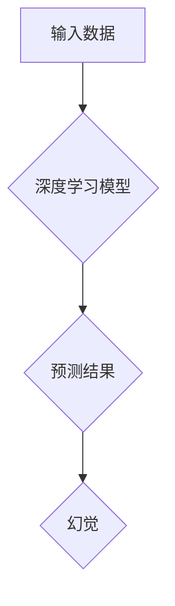

> 架构设计, 幻觉, 深度学习, 神经网络, 模型解释, 可解释性, 泛化能力, 鲁棒性, 安全性

## 1. 背景介绍

在人工智能领域，深度学习模型取得了令人瞩目的成就，在图像识别、自然语言处理等领域展现出强大的能力。然而，这些模型的内部工作机制往往是“黑箱”，难以理解其决策过程。这种缺乏可解释性的问题被称为“幻觉问题”，指的是模型在面对某些输入时，会产生与真实世界相悖的预测结果，甚至产生令人难以置信的“幻觉”。

幻觉问题不仅影响了模型的可靠性，也阻碍了人们对人工智能的理解和信任。因此，如何设计可解释、鲁棒的架构，并有效解决幻觉问题，成为人工智能领域的重要研究方向。

## 2. 核心概念与联系

### 2.1 架构设计

架构设计是软件系统设计的重要环节，它决定了系统的整体结构、组件之间的关系以及数据流向。在深度学习领域，架构设计是指设计神经网络的结构，包括层数、节点数量、激活函数等。

### 2.2 幻觉

幻觉是指深度学习模型在面对某些输入时，会产生与真实世界相悖的预测结果。例如，在图像识别任务中，模型可能会将一只猫识别为一只狗，或者将一张正常图片识别为一张扭曲的图片。

### 2.3 联系

幻觉问题与架构设计密切相关。一些特定的架构设计，例如过深的网络、过多的参数，更容易导致模型产生幻觉。

**Mermaid 流程图**



## 3. 核心算法原理 & 具体操作步骤

### 3.1 算法原理概述

解决幻觉问题的核心算法主要包括：

* **正则化技术:** 通过添加惩罚项到损失函数中，抑制模型的过拟合，提高模型的泛化能力。
* **对抗训练:** 通过生成对抗样本，训练模型对对抗样本的鲁棒性。
* **可解释性方法:** 通过分析模型的内部结构和决策过程，识别导致幻觉的因素。

### 3.2 算法步骤详解

**正则化技术:**

1. 在损失函数中添加惩罚项，例如L1正则化或L2正则化。
2. 训练模型时，最小化损失函数和惩罚项的总和。

**对抗训练:**

1. 生成对抗样本，即对输入数据进行微小的扰动，使得模型的预测结果发生改变。
2. 使用对抗样本训练模型，提高模型对对抗样本的鲁棒性。

**可解释性方法:**

1. 使用可视化技术，例如激活图或梯度图，分析模型的内部结构和决策过程。
2. 使用模型解释方法，例如LIME或SHAP，解释模型对输入数据的敏感度。

### 3.3 算法优缺点

**正则化技术:**

* 优点: 简单易行，有效抑制过拟合。
* 缺点: 无法直接解决幻觉问题，只能提高模型的泛化能力。

**对抗训练:**

* 优点: 可以有效提高模型对对抗样本的鲁棒性。
* 缺点: 训练过程复杂，需要大量的对抗样本。

**可解释性方法:**

* 优点: 可以帮助理解模型的决策过程，识别导致幻觉的因素。
* 缺点: 复杂度较高，解释结果可能难以理解。

### 3.4 算法应用领域

* **图像识别:** 识别物体、场景、人脸等。
* **自然语言处理:** 文本分类、情感分析、机器翻译等。
* **医疗诊断:** 辅助医生诊断疾病、预测患者风险。
* **金融风险管理:** 识别欺诈交易、预测市场风险。

## 4. 数学模型和公式 & 详细讲解 & 举例说明

### 4.1 数学模型构建

假设我们有一个深度学习模型，其输出为预测结果y，输入为数据x。我们可以用以下数学模型来描述模型的预测过程：

$$y = f(W x + b)$$

其中：

* $f$ 是激活函数，例如ReLU或Sigmoid。
* $W$ 是权重矩阵，决定了输入数据在不同层之间的权重。
* $b$ 是偏置向量，用于调整模型的输出。

### 4.2 公式推导过程

我们可以通过反向传播算法来训练模型参数W和b。反向传播算法的核心思想是：

1. 计算模型预测结果与真实值的误差。
2. 根据误差反向传播，更新权重和偏置。

反向传播算法的具体推导过程较为复杂，涉及到微积分和线性代数的知识。

### 4.3 案例分析与讲解

**举例说明:**

假设我们有一个简单的线性回归模型，其目标是预测房价。输入数据包括房屋面积、房间数量等特征，输出为房价。我们可以使用最小二乘法来训练模型参数，并计算模型的预测误差。

## 5. 项目实践：代码实例和详细解释说明

### 5.1 开发环境搭建

* Python 3.x
* TensorFlow 或 PyTorch 深度学习框架
* Jupyter Notebook 或 VS Code 开发环境

### 5.2 源代码详细实现

```python
import tensorflow as tf

# 定义模型结构
model = tf.keras.models.Sequential([
    tf.keras.layers.Dense(64, activation='relu', input_shape=(784,)),
    tf.keras.layers.Dense(10, activation='softmax')
])

# 编译模型
model.compile(optimizer='adam',
              loss='sparse_categorical_crossentropy',
              metrics=['accuracy'])

# 训练模型
model.fit(x_train, y_train, epochs=10)

# 评估模型
loss, accuracy = model.evaluate(x_test, y_test)
print('Loss:', loss)
print('Accuracy:', accuracy)
```

### 5.3 代码解读与分析

* 代码首先定义了一个简单的深度学习模型，包含两层全连接层。
* 然后，模型被编译，指定了优化器、损失函数和评估指标。
* 接着，模型被训练，使用训练数据进行迭代训练。
* 最后，模型被评估，使用测试数据计算模型的损失和准确率。

### 5.4 运行结果展示

运行结果将显示模型的训练过程和最终的评估结果，包括损失值和准确率。

## 6. 实际应用场景

### 6.1 图像识别

* 自动驾驶汽车：识别道路标志、行人、车辆等。
* 医疗诊断：识别病灶、肿瘤等。
* 物流管理：识别商品、包裹等。

### 6.2 自然语言处理

* 机器翻译：将文本从一种语言翻译成另一种语言。
* 情感分析：分析文本的情感倾向。
* 聊天机器人：与用户进行自然语言对话。

### 6.3 其他应用场景

* 金融风险管理：识别欺诈交易、预测市场风险。
* 人工智能辅助设计：辅助设计师进行产品设计。
* 个性化推荐：根据用户的兴趣爱好推荐商品或服务。

### 6.4 未来应用展望

随着人工智能技术的不断发展，幻觉问题将得到越来越多的关注。未来，我们将看到更多针对幻觉问题的解决方案，例如：

* 更鲁棒的架构设计：设计能够抵抗对抗样本的模型架构。
* 更有效的可解释性方法：开发更易于理解的模型解释方法。
* 更强大的数据增强技术：生成更多高质量的训练数据，提高模型的泛化能力。

## 7. 工具和资源推荐

### 7.1 学习资源推荐

* **书籍:**
    * 深度学习
    * 人工智能：一种现代方法
* **在线课程:**
    * Coursera 深度学习课程
    * Udacity 深度学习工程师 Nanodegree

### 7.2 开发工具推荐

* **TensorFlow:** 开源深度学习框架
* **PyTorch:** 开源深度学习框架
* **Jupyter Notebook:** 用于深度学习开发的交互式笔记本

### 7.3 相关论文推荐

* **关于幻觉问题的论文:**
    * Explaining and Harnessing Adversarial Examples
    * Adversarial Examples in the Physical World
* **关于可解释性方法的论文:**
    * LIME: Local Interpretable Model-Agnostic Explanations
    * SHAP: A Unified Approach to Interpreting Model Predictions

## 8. 总结：未来发展趋势与挑战

### 8.1 研究成果总结

近年来，在解决幻觉问题方面取得了显著进展，包括：

* 提出了一些新的架构设计，例如对抗训练和正则化技术。
* 开发了一些新的可解释性方法，例如LIME和SHAP。
* 积累了大量的对抗样本数据集，用于训练更鲁棒的模型。

### 8.2 未来发展趋势

未来，解决幻觉问题将继续是人工智能领域的重要研究方向。一些潜在的发展趋势包括：

* 设计更鲁棒的模型架构，能够抵抗各种类型的对抗样本。
* 开发更有效的可解释性方法，能够更深入地理解模型的决策过程。
* 探索新的数据增强技术，生成更多高质量的训练数据。

### 8.3 面临的挑战

解决幻觉问题仍然面临一些挑战：

* 幻觉问题非常复杂，难以找到通用的解决方案。
* 现有的可解释性方法仍然存在局限性，难以解释所有类型的模型决策。
* 缺乏高质量的对抗样本数据集，限制了模型的训练和评估。

### 8.4 研究展望

未来，我们将继续探索新的方法和技术，以解决幻觉问题，推动人工智能技术的健康发展。


## 9. 附录：常见问题与解答

**常见问题:**

* 什么是幻觉？
* 幻觉问题是如何产生的？
* 如何解决幻觉问题？

**解答:**

* 幻觉是指深度学习模型在面对某些输入时，会产生与真实世界相悖的预测结果。
* 幻觉问题是由模型的训练数据、模型架构和算法等因素造成的。
* 解决幻觉问题的方法包括正则化技术、对抗训练和可解释性方法等。


作者：禅与计算机程序设计艺术 / Zen and the Art of Computer Programming 
<end_of_turn>