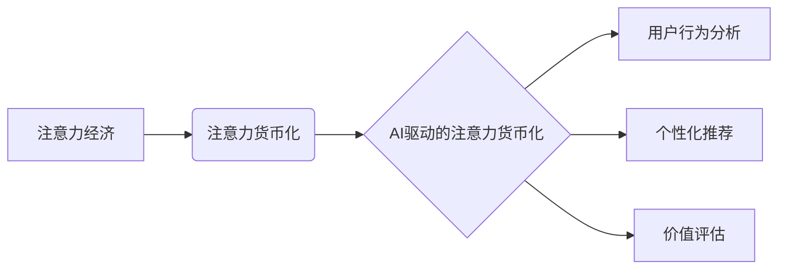

>  注意力经济、注意力货币化、AI算法、深度学习、用户行为分析、数据驱动、个性化推荐、价值评估

## 1. 背景介绍

在数字时代，人们的注意力成为最稀缺的资源。互联网平台、社交媒体、内容创作平台等，都在争夺用户的有限注意力。如何有效地获取、利用和货币化用户注意力，成为当今科技领域的核心议题。

注意力经济的兴起，标志着一种新的经济模式的诞生。它强调用户注意力作为一种有价值的资产，并通过各种手段，例如个性化推荐、内容碎片化、算法驱动等，来吸引和引导用户的注意力。

然而，传统的注意力货币化策略往往依赖于广告收入，存在着用户体验差、广告泛滥等问题。随着人工智能技术的快速发展，AI驱动的注意力货币化策略逐渐成为新的趋势。

## 2. 核心概念与联系

**2.1 注意力经济**

注意力经济是指以用户注意力为核心资源的经济模式。它认为，在信息爆炸的时代，用户的注意力是稀缺的，而能够有效地获取和利用用户注意力的平台和内容，能够获得巨大的经济价值。

**2.2 注意力货币化**

注意力货币化是指将用户注意力转化为经济价值的过程。它可以通过多种方式实现，例如广告收入、付费订阅、数据交易等。

**2.3 AI驱动的注意力货币化**

AI驱动的注意力货币化是指利用人工智能技术，例如机器学习、深度学习等，来分析用户行为、预测用户兴趣，并提供个性化内容推荐和体验，从而提高注意力货币化效率。

**2.4 核心概念关系图**



## 3. 核心算法原理 & 具体操作步骤

**3.1 算法原理概述**

AI驱动的注意力货币化策略的核心算法通常基于深度学习模型，例如Transformer、BERT等。这些模型能够学习用户行为、内容特征、时间序列等多方面信息，并预测用户对特定内容的注意力持续时间、点击率、转化率等指标。

**3.2 算法步骤详解**

1. **数据收集与预处理:** 收集用户行为数据、内容特征数据、时间序列数据等，并进行清洗、转换、编码等预处理操作。
2. **模型训练:** 使用深度学习模型，例如Transformer、BERT等，对收集到的数据进行训练，学习用户行为模式和内容特征关系。
3. **模型评估:** 使用测试数据对训练好的模型进行评估，评估模型的预测精度和泛化能力。
4. **个性化推荐:** 根据用户的历史行为、兴趣偏好等信息，利用训练好的模型预测用户对特定内容的注意力持续时间、点击率、转化率等指标，并推荐个性化的内容。
5. **价值评估:** 对推荐的内容进行价值评估，例如广告收入、付费订阅、数据交易等，并根据评估结果调整推荐策略。

**3.3 算法优缺点**

**优点:**

* **精准度高:** 深度学习模型能够学习用户行为模式和内容特征关系，实现精准的注意力预测。
* **个性化强:** 可以根据用户的历史行为、兴趣偏好等信息，提供个性化的内容推荐。
* **可扩展性强:** 可以扩展到各种类型的注意力货币化场景，例如广告、订阅、数据交易等。

**缺点:**

* **数据依赖性强:** 需要大量的用户行为数据和内容特征数据进行训练。
* **计算资源消耗大:** 深度学习模型训练需要大量的计算资源。
* **黑盒效应:** 深度学习模型的决策过程难以解释，存在一定的透明度问题。

**3.4 算法应用领域**

* **内容平台:** 推荐个性化内容，提高用户粘性和留存率。
* **社交媒体:** 推送个性化广告，提高广告转化率。
* **电商平台:** 推荐个性化商品，提高用户购买意愿。
* **教育平台:** 提供个性化学习内容，提高学习效率。

## 4. 数学模型和公式 & 详细讲解 & 举例说明

**4.1 数学模型构建**

注意力货币化策略可以建模为一个优化问题，目标是最大化用户注意力价值。

**用户注意力价值:**

$$V = \sum_{i=1}^{n} w_i \cdot t_i$$

其中:

* $V$：用户注意力价值
* $n$：用户关注的内容数量
* $w_i$：第 $i$ 个内容的权重
* $t_i$：用户对第 $i$ 个内容的注意力持续时间

**权重计算:**

$$w_i = f(c_i, u_i, t)$$

其中:

* $c_i$：第 $i$ 个内容的特征向量
* $u_i$：用户的特征向量
* $t$：时间因素

**4.2 公式推导过程**

用户注意力价值的计算公式可以根据不同的注意力货币化场景进行调整。例如，在广告场景下，用户注意力价值可以定义为广告点击率或转化率。

**4.3 案例分析与讲解**

假设一个视频平台想要利用AI驱动的注意力货币化策略，提高广告收入。

1. **数据收集:** 收集用户观看视频的历史数据、视频内容特征数据、广告信息数据等。
2. **模型训练:** 使用深度学习模型，例如Transformer，对收集到的数据进行训练，学习用户观看视频的模式和广告点击率的关系。
3. **个性化推荐:** 根据用户的观看历史、兴趣偏好等信息，利用训练好的模型预测用户对特定广告的点击率，并推荐个性化的广告。
4. **价值评估:** 根据广告点击率和转化率等指标，评估广告价值，并根据评估结果调整广告推荐策略。

## 5. 项目实践：代码实例和详细解释说明

**5.1 开发环境搭建**

* 操作系统：Linux/macOS
* Python 版本：3.7+
* 深度学习框架：TensorFlow/PyTorch
* 其他依赖库：numpy, pandas, matplotlib等

**5.2 源代码详细实现**

```python
# 导入必要的库
import tensorflow as tf

# 定义模型结构
model = tf.keras.Sequential([
    tf.keras.layers.Embedding(input_dim=vocab_size, output_dim=embedding_dim),
    tf.keras.layers.LSTM(units=hidden_units),
    tf.keras.layers.Dense(units=1, activation='sigmoid')
])

# 编译模型
model.compile(optimizer='adam', loss='binary_crossentropy', metrics=['accuracy'])

# 训练模型
model.fit(x_train, y_train, epochs=epochs, batch_size=batch_size)

# 评估模型
loss, accuracy = model.evaluate(x_test, y_test)
print('Loss:', loss)
print('Accuracy:', accuracy)

# 使用模型预测
predictions = model.predict(x_new)
```

**5.3 代码解读与分析**

* 代码首先导入必要的库。
* 然后定义一个简单的深度学习模型，使用Embedding层、LSTM层和Dense层。
* 模型使用Adam优化器、二分类交叉熵损失函数和准确率作为评估指标。
* 训练模型后，使用测试数据评估模型的性能。
* 最后，使用训练好的模型预测新的数据。

**5.4 运行结果展示**

训练好的模型可以用于预测用户对特定内容的注意力持续时间、点击率、转化率等指标，并根据预测结果进行个性化推荐和价值评估。

## 6. 实际应用场景

**6.1 内容平台**

* 个性化推荐：根据用户的阅读历史、兴趣偏好等信息，推荐个性化的文章、视频、音频等内容。
* 内容分发：根据用户注意力价值，优化内容的排序和分发策略，提高用户粘性和留存率。

**6.2 社交媒体**

* 个性化广告：根据用户的兴趣爱好、行为特征等信息，推荐个性化的广告，提高广告点击率和转化率。
* 内容推荐：根据用户的社交关系、兴趣爱好等信息，推荐个性化的内容，提高用户参与度和互动率。

**6.3 电商平台**

* 商品推荐：根据用户的购买历史、浏览记录、兴趣偏好等信息，推荐个性化的商品，提高用户购买意愿。
* 促銷活動：根据用户的注意力价值，优化促销活动的推广策略，提高活动参与度和转化率。

**6.4 未来应用展望**

AI驱动的注意力货币化策略将应用于更多领域，例如教育、医疗、金融等。

## 7. 工具和资源推荐

**7.1 学习资源推荐**

* **书籍:**
    * 《深度学习》
    * 《自然语言处理》
    * 《机器学习》
* **在线课程:**
    * Coursera
    * edX
    * Udacity

**7.2 开发工具推荐**

* **深度学习框架:** TensorFlow, PyTorch
* **数据处理工具:** Pandas, NumPy
* **可视化工具:** Matplotlib, Seaborn

**7.3 相关论文推荐**

* Attention Is All You Need
* BERT: Pre-training of Deep Bidirectional Transformers for Language Understanding
* Transformer-XL: Attentive Language Modeling Beyond Millions of Tokens

## 8. 总结：未来发展趋势与挑战

**8.1 研究成果总结**

AI驱动的注意力货币化策略取得了显著的成果，能够精准预测用户注意力，提供个性化推荐，提高注意力货币化效率。

**8.2 未来发展趋势**

* **模型更深更广:** 探索更深层次、更广范围的深度学习模型，提高注意力预测精度。
* **跨模态融合:** 将文本、图像、音频等多模态数据融合，构建更全面的用户画像，实现更精准的注意力预测。
* **隐私保护:** 研究隐私保护机制，确保用户数据安全，构建可信的注意力货币化生态。

**8.3 面临的挑战**

* **数据安全与隐私:** 如何保护用户数据安全，避免数据泄露和滥用。
* **算法公平性:** 如何避免算法歧视，确保注意力货币化策略公平公正。
* **用户体验:** 如何平衡注意力货币化目标和用户体验，避免过度推送广告和内容。

**8.4 研究展望**

未来，AI驱动的注意力货币化策略将继续发展，朝着更精准、更个性化、更可持续的方向发展。


## 9. 附录：常见问题与解答

**9.1 如何评估用户注意力价值？**

用户注意力价值可以根据不同的注意力货币化场景进行定义，例如广告点击率、转化率、阅读时长、点赞数等。

**9.2 如何避免算法歧视？**

在设计和训练注意力货币化算法时，需要关注算法的公平性，避免算法歧视特定用户群体。可以采用多种方法来缓解算法歧视，例如数据预处理、算法调参、公平性评估等。

**9.3 如何保护用户数据安全？**

在收集和使用用户数据时，需要遵守相关法律法规，并采取相应的安全措施，例如数据加密、访问控制、匿名化处理等，确保用户数据安全。


作者：禅与计算机程序设计艺术 / Zen and the Art of Computer Programming 
<end_of_turn>