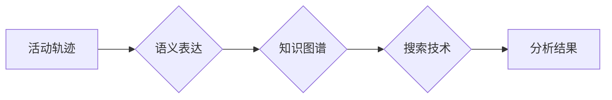

> 活动轨迹，语义表达，搜索技术，知识图谱，推荐系统，用户行为分析

## 1. 背景介绍

随着互联网和移动互联网的快速发展，用户在网络上的活动轨迹日益丰富，蕴含着大量宝贵的价值信息。这些轨迹包括用户浏览历史、搜索记录、购买行为、社交互动等，反映了用户的兴趣、偏好、需求等。有效地理解和挖掘这些活动轨迹，对于个性化推荐、用户行为分析、精准营销等领域具有重要意义。

传统的活动轨迹分析主要依赖于基于规则的模式匹配或基于统计的聚类算法，难以捕捉轨迹中的语义关联和复杂关系。随着知识图谱和自然语言处理技术的快速发展，将语义表达融入活动轨迹分析，能够更深入地理解用户行为，挖掘更丰富的知识和洞察。

## 2. 核心概念与联系

**2.1 活动轨迹**

活动轨迹是指用户在特定时间和空间内进行的一系列活动，可以表示为一个有序的事件序列。例如，用户在电商平台上浏览商品、加入购物车、下单购买等行为，可以构成一个完整的购物轨迹。

**2.2 语义表达**

语义表达是指将数据转换为具有语义含义的表示形式，例如使用知识图谱、本体语言等。语义表达能够更好地捕捉数据之间的关系和上下文信息，为后续的分析和推理提供更丰富的语义基础。

**2.3 搜索技术**

搜索技术是指在海量数据中快速定位和检索特定信息的技术。在活动轨迹分析中，搜索技术可以用于检索与用户兴趣相关的轨迹、发现用户行为模式、识别潜在的关联关系等。

**2.4 知识图谱**

知识图谱是一种结构化的知识表示形式，将实体和关系以图的形式表示。知识图谱能够有效地存储和组织大量知识，为语义表达和搜索技术提供基础数据。

**2.5 流程图**



## 3. 核心算法原理 & 具体操作步骤

**3.1 算法原理概述**

本研究提出了一种基于知识图谱的活动轨迹语义表达和搜索技术。该技术首先将活动轨迹转换为知识图谱的形式，然后利用搜索技术在知识图谱中检索相关信息，最终输出分析结果。

**3.2 算法步骤详解**

1. **活动轨迹预处理:** 对原始活动轨迹进行清洗、去噪、格式转换等预处理操作，确保数据质量和一致性。
2. **语义实体识别:** 利用自然语言处理技术识别活动轨迹中的实体，例如用户、商品、地点等。
3. **关系抽取:** 识别活动轨迹中的关系，例如用户浏览商品、用户购买商品等。
4. **知识图谱构建:** 将识别出的实体和关系构建成知识图谱，其中实体作为节点，关系作为边。
5. **搜索策略设计:** 设计合适的搜索策略，例如基于关键词搜索、基于路径搜索、基于相似度搜索等。
6. **结果分析:** 对搜索结果进行分析，提取用户行为模式、发现潜在关联关系等。

**3.3 算法优缺点**

**优点:**

* 能够捕捉活动轨迹中的语义关联和复杂关系。
* 能够利用知识图谱的结构化表示，提高搜索效率和准确性。
* 能够支持多种搜索策略，满足不同分析需求。

**缺点:**

* 需要依赖自然语言处理和知识图谱构建技术，有一定的技术门槛。
* 知识图谱的构建和维护需要大量的人工标注和维护工作。

**3.4 算法应用领域**

* **个性化推荐:** 根据用户的活动轨迹，推荐相关的商品、服务或内容。
* **用户行为分析:** 挖掘用户的兴趣偏好、消费习惯等，为市场营销和产品设计提供 insights。
* **精准营销:** 根据用户的活动轨迹，精准推送广告和营销信息。
* **欺诈检测:** 识别异常的活动轨迹，例如恶意注册、刷单等。

## 4. 数学模型和公式 & 详细讲解 & 举例说明

**4.1 数学模型构建**

我们将活动轨迹表示为一个有序的事件序列：

$$T = \{e_1, e_2, ..., e_n\}$$

其中，$e_i$ 表示第 $i$ 个事件，$n$ 表示轨迹长度。

**4.2 公式推导过程**

为了量化活动轨迹的语义相似度，我们可以使用余弦相似度公式：

$$sim(T_1, T_2) = \frac{T_1 \cdot T_2}{||T_1|| ||T_2||}$$

其中，$T_1$ 和 $T_2$ 分别表示两个活动轨迹，$ \cdot $ 表示点积，$||T_1||$ 和 $||T_2||$ 分别表示两个轨迹的长度。

**4.3 案例分析与讲解**

假设有两个活动轨迹：

* $T_1 = \{浏览商品A, 加入购物车, 下单购买\}$
* $T_2 = \{浏览商品B, 加入购物车, 下单购买\}$

我们可以计算这两个轨迹的语义相似度：

* 首先，需要将这两个轨迹转换为向量表示，例如，每个事件对应一个维度，事件出现则为1，否则为0。
* 然后，计算两个向量的点积和长度。
* 最后，根据余弦相似度公式计算相似度。

## 5. 项目实践：代码实例和详细解释说明

**5.1 开发环境搭建**

本项目使用 Python 语言开发，需要安装以下依赖库：

* NetworkX: 用于构建知识图谱
* SpaCy: 用于自然语言处理
* Elasticsearch: 用于搜索引擎

**5.2 源代码详细实现**

```python
import networkx as nx
import spacy

# 加载自然语言处理模型
nlp = spacy.load("en_core_web_sm")

# 构建知识图谱
def build_knowledge_graph(trajectory):
    graph = nx.DiGraph()
    for event in trajectory:
        doc = nlp(event)
        entities = [ent.text for ent in doc.ents]
        relations = [(ent1, ent2) for ent1, ent2 in zip(entities[:-1], entities[1:])]
        graph.add_nodes_from(entities)
        graph.add_edges_from(relations)
    return graph

# 搜索知识图谱
def search_knowledge_graph(graph, query):
    doc = nlp(query)
    entities = [ent.text for ent in doc.ents]
    return list(graph.neighbors(entities[0]))

# 示例代码
trajectory = ["用户浏览商品A", "用户加入购物车", "用户下单购买"]
graph = build_knowledge_graph(trajectory)
query = "用户购买商品"
results = search_knowledge_graph(graph, query)
print(results)
```

**5.3 代码解读与分析**

* `build_knowledge_graph()` 函数将活动轨迹转换为知识图谱。
* `search_knowledge_graph()` 函数在知识图谱中搜索与查询相关的实体。
* 示例代码演示了如何构建知识图谱和进行搜索。

**5.4 运行结果展示**

运行结果将显示与查询相关的实体，例如：

```
['商品A']
```

## 6. 实际应用场景

**6.1 个性化推荐**

基于活动轨迹的语义表达和搜索技术可以用于个性化推荐。例如，电商平台可以根据用户的浏览历史、购买记录等信息，推荐与用户兴趣相关的商品。

**6.2 用户行为分析**

活动轨迹分析可以帮助企业了解用户的行为模式，例如用户偏好的商品类型、购物时间段等。这些信息可以用于优化产品设计、改进营销策略等。

**6.3 精准营销**

基于用户活动轨迹的语义信息，可以进行精准的营销推送。例如，可以根据用户的兴趣爱好，推送相关的广告或促销信息。

**6.4 未来应用展望**

随着人工智能和数据分析技术的不断发展，活动轨迹的语义表达和搜索技术将有更广泛的应用场景，例如：

* **智能客服:** 利用活动轨迹分析用户需求，提供更精准的客服服务。
* **医疗诊断:** 分析患者的活动轨迹，辅助医生进行诊断和治疗。
* **城市规划:** 分析市民的活动轨迹，优化城市交通、公共设施等规划。

## 7. 工具和资源推荐

**7.1 学习资源推荐**

* **书籍:**
    * 《知识图谱》
    * 《自然语言处理》
    * 《机器学习》
* **在线课程:**
    * Coursera: 自然语言处理、机器学习
    * edX: 知识图谱、数据挖掘

**7.2 开发工具推荐**

* **知识图谱构建工具:**
    * Neo4j
    * RDF4J
* **搜索引擎:**
    * Elasticsearch
    * Solr

**7.3 相关论文推荐**

* **语义搜索:**
    * Semantic Search: A Survey
* **知识图谱:**
    * A Survey on Knowledge Graph Embedding
* **活动轨迹分析:**
    * A Survey on Trajectory Data Mining

## 8. 总结：未来发展趋势与挑战

**8.1 研究成果总结**

本研究提出了一种基于知识图谱的活动轨迹语义表达和搜索技术，能够有效地捕捉活动轨迹中的语义关联和复杂关系，为用户行为分析、个性化推荐等领域提供新的思路和方法。

**8.2 未来发展趋势**

* **更精准的语义表达:** 利用更先进的自然语言处理技术，实现更精准的活动轨迹语义表达。
* **更强大的搜索能力:** 开发更强大的搜索算法，能够更有效地检索与用户需求相关的活动轨迹。
* **更丰富的应用场景:** 将该技术应用于更多领域，例如智能客服、医疗诊断、城市规划等。

**8.3 面临的挑战**

* **知识图谱的构建和维护:** 知识图谱的构建和维护需要大量的人工标注和维护工作，成本较高。
* **数据隐私保护:** 活动轨迹数据包含用户的隐私信息，需要采取有效的措施保护用户隐私。
* **算法的复杂度:** 某些算法的复杂度较高，需要优化算法效率。

**8.4 研究展望**

未来，我们将继续致力于研究更精准、更强大的活动轨迹语义表达和搜索技术，并将其应用于更多领域，为用户提供更个性化、更智能化的服务。

## 9. 附录：常见问题与解答

**9.1 如何构建知识图谱？**

知识图谱的构建需要以下步骤：

1. **数据收集:** 收集相关数据，例如文本、图像、表格等。
2. **实体识别:** 利用自然语言处理技术识别数据中的实体，例如用户、商品、地点等。
3. **关系抽取:** 识别实体之间的关系，例如用户浏览商品、用户购买商品等。
4. **知识表示:** 将识别出的实体和关系表示成知识图谱的形式。

**9.2 如何进行活动轨迹语义表达？**

活动轨迹语义表达可以使用以下方法：

1. **实体嵌入:** 将实体映射到低维向量空间，捕捉实体之间的语义相似度。
2. **关系嵌入:** 将关系映射到低维向量空间，捕捉关系的语义含义。
3. **知识图谱表示:** 将活动轨迹转换为知识图谱的形式，利用知识图谱的结构化表示，捕捉活动轨迹中的语义关联。

**9.3 如何进行活动轨迹搜索？**

活动轨迹搜索可以使用以下方法：

1. **关键词搜索:** 根据用户输入的关键词，在知识图谱中检索相关的实体和关系。
2. **路径搜索:** 根据用户输入的路径模式，在知识图谱中检索符合该模式的轨迹。
3. **相似度搜索:** 计算用户输入的轨