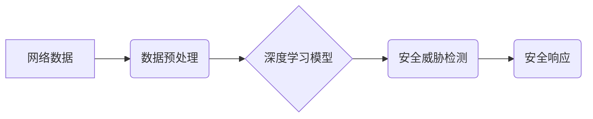

> 深度学习，网络安全，入侵检测，恶意软件识别，数据分析，机器学习，神经网络

## 1. 背景介绍

网络安全已成为当今社会面临的重大挑战。随着互联网的快速发展和数字化转型进程的加速，网络攻击的频率和复杂性不断增加，传统的安全防护手段已难以有效应对。深度学习作为机器学习领域的一项重要突破，凭借其强大的数据处理能力和模式识别能力，在网络安全领域展现出巨大的应用潜力。

深度学习算法能够从海量网络数据中自动学习特征，识别潜在的威胁，并做出相应的防护措施。与传统的基于规则的安全系统相比，深度学习系统具有以下优势：

* **自学习能力:** 深度学习模型能够通过不断学习网络数据，自动识别新的攻击模式和威胁。
* **鲁棒性:** 深度学习模型对数据噪声和干扰具有较强的鲁棒性，能够更准确地识别恶意行为。
* **适应性:** 深度学习模型能够适应不断变化的网络环境和攻击手段。

## 2. 核心概念与联系

**2.1 深度学习概述**

深度学习是一种机器学习的子领域，它利用多层神经网络来模拟人类大脑的学习过程。深度学习模型由多个神经层组成，每层神经元之间通过连接权重进行信息传递。通过训练数据，模型能够调整连接权重，从而学习数据中的模式和特征。

**2.2 网络安全概述**

网络安全是指保护计算机网络和数据免受未经授权访问、使用、披露、修改或破坏的措施。网络安全面临着各种威胁，包括病毒、恶意软件、网络攻击、数据泄露等。

**2.3 深度学习与网络安全的关系**

深度学习可以应用于网络安全领域中的多个方面，例如：

* **入侵检测:** 利用深度学习模型识别网络流量中的异常行为，例如恶意代码注入、数据窃取等。
* **恶意软件识别:** 利用深度学习模型识别恶意软件的特征，例如代码结构、行为模式等。
* **网络钓鱼攻击检测:** 利用深度学习模型识别网络钓鱼邮件和网站，例如伪造的登录页面、钓鱼链接等。
* **数据泄露检测:** 利用深度学习模型识别数据泄露的迹象，例如敏感数据被上传到外部服务器等。

**2.4 深度学习在网络安全中的架构**



## 3. 核心算法原理 & 具体操作步骤

### 3.1  算法原理概述

深度学习在网络安全中的应用主要依赖于以下几种算法：

* **卷积神经网络 (CNN):** CNN擅长处理图像数据，可以用于识别恶意软件的图标、网页的视觉特征等。
* **循环神经网络 (RNN):** RNN擅长处理序列数据，可以用于分析网络流量的时序特征，识别攻击行为的模式。
* **长短期记忆网络 (LSTM):** LSTM是一种RNN的变体，能够更好地处理长序列数据，更适合识别复杂的攻击行为。

### 3.2  算法步骤详解

**3.2.1 数据收集和预处理:**

首先需要收集大量的网络数据，例如网络流量、恶意软件样本、安全事件日志等。然后对数据进行预处理，例如清洗、格式化、特征提取等。

**3.2.2 模型训练:**

选择合适的深度学习模型，并使用训练数据进行模型训练。训练过程包括调整模型参数，使模型能够准确地识别网络威胁。

**3.2.3 模型评估:**

使用测试数据评估模型的性能，例如准确率、召回率、F1-score等。根据评估结果，对模型进行调优，提高模型的性能。

**3.2.4 模型部署:**

将训练好的模型部署到生产环境中，用于实时检测网络威胁。

### 3.3  算法优缺点

**优点:**

* **高准确率:** 深度学习模型能够学习复杂的模式，识别难以检测的威胁。
* **自适应性:** 深度学习模型能够适应不断变化的网络环境和攻击手段。
* **自动化:** 深度学习模型可以自动化网络安全任务，例如入侵检测、恶意软件识别等。

**缺点:**

* **数据依赖:** 深度学习模型需要大量的训练数据才能达到较高的准确率。
* **计算资源需求:** 训练深度学习模型需要大量的计算资源。
* **可解释性:** 深度学习模型的决策过程难以解释，这可能导致安全事件的调查和处理更加困难。

### 3.4  算法应用领域

深度学习在网络安全领域具有广泛的应用前景，例如：

* **入侵检测系统 (IDS):** 利用深度学习模型识别网络流量中的异常行为，例如恶意代码注入、数据窃取等。
* **恶意软件检测系统 (AV):** 利用深度学习模型识别恶意软件的特征，例如代码结构、行为模式等。
* **网络钓鱼攻击检测系统:** 利用深度学习模型识别网络钓鱼邮件和网站，例如伪造的登录页面、钓鱼链接等。
* **数据泄露检测系统:** 利用深度学习模型识别数据泄露的迹象，例如敏感数据被上传到外部服务器等。

## 4. 数学模型和公式 & 详细讲解 & 举例说明

### 4.1  数学模型构建

深度学习模型通常由多层神经网络组成，每层神经元之间通过连接权重进行信息传递。

**4.1.1 神经网络结构:**

一个典型的深度学习模型包含以下几层：

* **输入层:**接收原始数据，例如网络流量、恶意软件样本等。
* **隐藏层:**对输入数据进行特征提取和表示学习。
* **输出层:**输出模型的预测结果，例如攻击类型、恶意软件类别等。

**4.1.2 激活函数:**

激活函数用于引入非线性，使神经网络能够学习复杂的模式。常见的激活函数包括 sigmoid 函数、ReLU 函数、tanh 函数等。

**4.1.3 损失函数:**

损失函数用于衡量模型预测结果与真实值的差异。常见的损失函数包括均方误差 (MSE)、交叉熵损失 (Cross-Entropy Loss) 等。

### 4.2  公式推导过程

**4.2.1 前向传播:**

前向传播过程是指输入数据通过神经网络层层传递，最终得到输出结果的过程。

**公式:**

$$
y = f(W^L x^L + b^L)
$$

其中：

* $y$ 是输出结果
* $f$ 是激活函数
* $W^L$ 是第 L 层的权重矩阵
* $x^L$ 是第 L 层的输入向量
* $b^L$ 是第 L 层的偏置向量

**4.2.2 反向传播:**

反向传播过程是指根据损失函数的梯度，调整神经网络的权重和偏置，使模型的预测结果更加准确的过程。

**公式:**

$$
\Delta W = \eta \frac{\partial L}{\partial W}
$$

其中：

* $\Delta W$ 是权重更新量
* $\eta$ 是学习率
* $\frac{\partial L}{\partial W}$ 是损失函数对权重的梯度

### 4.3  案例分析与讲解

**4.3.1 恶意软件识别:**

可以使用 CNN 模型识别恶意软件的特征，例如代码结构、行为模式等。

**4.3.2 网络入侵检测:**

可以使用 RNN 模型分析网络流量的时序特征，识别攻击行为的模式。

## 5. 项目实践：代码实例和详细解释说明

### 5.1  开发环境搭建

* **操作系统:** Ubuntu 18.04
* **编程语言:** Python 3.6
* **深度学习框架:** TensorFlow 2.0
* **其他工具:** Jupyter Notebook, Git

### 5.2  源代码详细实现

```python
import tensorflow as tf

# 定义模型结构
model = tf.keras.models.Sequential([
    tf.keras.layers.Conv1D(filters=32, kernel_size=3, activation='relu', input_shape=(1000, 1)),
    tf.keras.layers.MaxPooling1D(pool_size=2),
    tf.keras.layers.Conv1D(filters=64, kernel_size=3, activation='relu'),
    tf.keras.layers.MaxPooling1D(pool_size=2),
    tf.keras.layers.Flatten(),
    tf.keras.layers.Dense(10, activation='softmax')
])

# 编译模型
model.compile(optimizer='adam',
              loss='sparse_categorical_crossentropy',
              metrics=['accuracy'])

# 训练模型
model.fit(x_train, y_train, epochs=10)

# 评估模型
loss, accuracy = model.evaluate(x_test, y_test)
print('Loss:', loss)
print('Accuracy:', accuracy)
```

### 5.3  代码解读与分析

* **模型结构:** 该代码定义了一个简单的 CNN 模型，用于识别网络流量中的攻击行为。模型包含两层卷积层、两层最大池化层、一层全连接层和一层输出层。
* **激活函数:** 模型中使用 ReLU 激活函数，可以提高模型的学习能力。
* **损失函数:** 模型使用交叉熵损失函数，用于衡量模型预测结果与真实值的差异。
* **优化器:** 模型使用 Adam 优化器，可以加速模型训练。

### 5.4  运行结果展示

训练完成后，可以使用测试数据评估模型的性能。

## 6. 实际应用场景

### 6.1  入侵检测系统

深度学习可以用于构建更智能的入侵检测系统，能够识别更复杂的攻击行为，例如零日漏洞攻击、APT 攻击等。

### 6.2  恶意软件检测系统

深度学习可以用于识别新的恶意软件，即使这些恶意软件没有被以前检测到。

### 6.3  网络钓鱼攻击检测系统

深度学习可以用于识别网络钓鱼邮件和网站，保护用户免受钓鱼攻击的侵害。

### 6.4  未来应用展望

随着深度学习技术的不断发展，其在网络安全领域的应用将更加广泛和深入。例如：

* **自动化安全响应:** 深度学习可以用于自动化安全响应，例如隔离受感染主机、封堵漏洞等。
* **威胁情报分析:** 深度学习可以用于分析威胁情报，识别新的攻击趋势和威胁。
* **安全意识培训:** 深度学习可以用于个性化安全意识培训，提高用户的安全意识。

## 7. 工具和资源推荐

### 7.1  学习资源推荐

* **书籍:**
    * Deep Learning by Ian Goodfellow, Yoshua Bengio, and Aaron Courville
    * Hands-On Machine Learning with Scikit-Learn, Keras & TensorFlow by Aurélien Géron
* **在线课程:**
    * TensorFlow Tutorials: https://www.tensorflow.org/tutorials
    * Deep Learning Specialization by Andrew Ng: https://www.deeplearning.ai/

### 7.2  开发工具推荐

* **深度学习框架:** TensorFlow, PyTorch, Keras
* **数据处理工具:** Pandas, NumPy
* **可视化工具:** Matplotlib, Seaborn

### 7.3  相关论文推荐

* **Deep Learning for Intrusion Detection: A Survey**
* **Malware Detection Using Deep Learning: A Comprehensive Review**
* **Deep Learning for Phishing Detection: A Survey**

## 8. 总结：未来发展趋势与挑战

### 8.1  研究成果总结

深度学习在网络安全领域取得了显著的成果，例如提高了入侵检测、恶意软件识别和网络钓鱼攻击检测的准确率。

### 8.2  未来发展趋势

* **模型规模和复杂度:** 深度学习模型将继续朝着更大、更复杂的方向发展，以学习更复杂的网络威胁。
* **数据增强和合成:** 将使用数据增强和合成技术来生成更多高质量的训练数据，提高模型的泛化能力。
* **联邦学习:** 将使用联邦学习技术来训练模型，保护敏感数据不被泄露。

### 8.3  面临的挑战

* **数据安全和隐私:** 深度学习模型