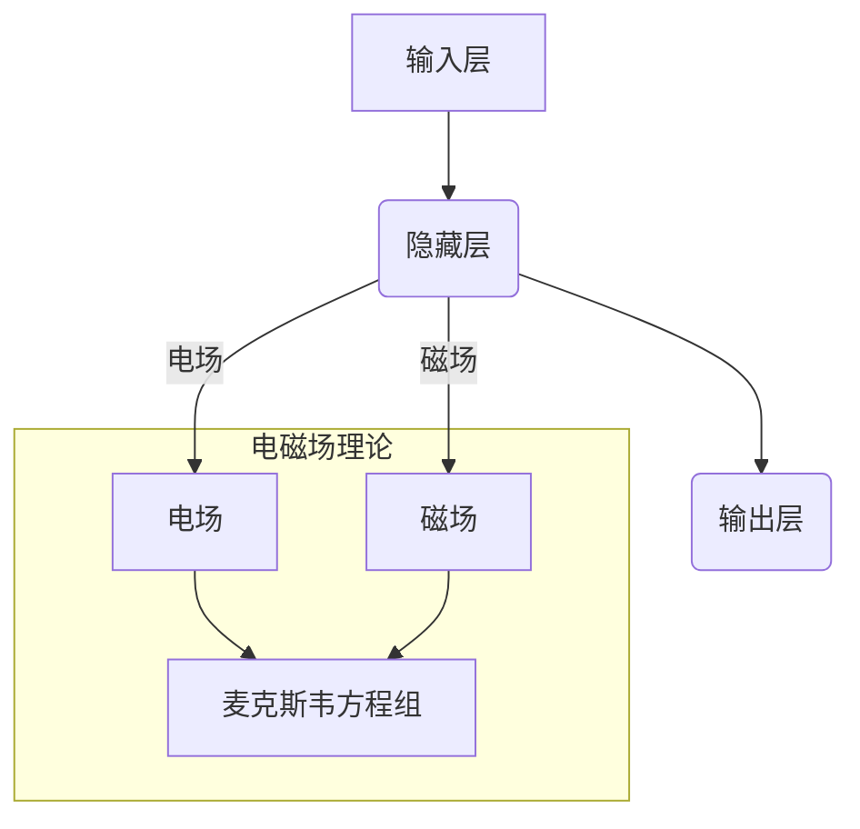

> 电磁场理论，人工智能，神经网络，机器学习，深度学习，优化算法，物理模拟

## 1. 背景介绍

人工智能（AI）近年来取得了令人瞩目的进展，在各个领域展现出强大的应用潜力。从语音识别到图像识别，从自然语言处理到自动驾驶，AI技术正在深刻地改变着我们的生活。然而，传统的AI算法主要依赖于统计学习和数据挖掘，其学习能力和泛化能力仍然存在局限性。

电磁场理论是物理学中一个基础而重要的分支，它描述了电荷和磁场之间的相互作用。电磁场理论的应用范围非常广泛，从电力电子学到无线通信，从医疗影像到天文观测，无处不在。近年来，一些研究者开始探索将电磁场理论应用于AI领域，试图借鉴电磁场的特性来提升AI算法的性能。

## 2. 核心概念与联系

### 2.1 电磁场理论概述

电磁场理论的核心概念是电场和磁场。电场是由带电粒子产生的，它可以对其他带电粒子施加力。磁场是由运动的电荷产生的，它可以对运动的电荷施加力。电场和磁场是相互关联的，它们共同构成电磁场。

麦克斯韦方程组是描述电磁场行为的四条基本方程，它们将电场和磁场联系起来，并揭示了电磁波的传播规律。

### 2.2 AI算法与电磁场理论的联系

在AI领域，神经网络是目前最流行的算法之一。神经网络的结构灵感来源于生物神经网络，它由许多相互连接的神经元组成。每个神经元接收来自其他神经元的输入信号，并根据一定的权重进行处理，最终输出一个信号。

将电磁场理论应用于AI算法，可以从以下几个方面进行探索：

* **神经元模型:** 将神经元的激活函数设计成类似于电磁场的传播规律，例如使用麦克斯韦方程组来描述神经元的激活过程。
* **连接权重:** 将神经元的连接权重设计成类似于电磁场的场强，例如使用电磁场理论来优化神经元的连接权重。
* **网络结构:** 将神经网络的结构设计成类似于电磁场的场分布，例如使用电磁场理论来构建更复杂的网络结构。



## 3. 核心算法原理 & 具体操作步骤

### 3.1 算法原理概述

将电磁场理论应用于AI算法的核心思想是利用电磁场的特性来模拟和优化神经网络的学习过程。

例如，可以将神经元的激活函数设计成类似于电磁场的传播规律，例如使用麦克斯韦方程组来描述神经元的激活过程。

### 3.2 算法步骤详解

1. **构建电磁场模型:** 根据神经网络的结构和参数，构建一个电磁场模型。
2. **模拟电磁场传播:** 利用麦克斯韦方程组等电磁场理论公式，模拟电磁场在神经网络中的传播过程。
3. **优化连接权重:** 根据电磁场传播的结果，优化神经元的连接权重，以提高神经网络的学习性能。
4. **训练神经网络:** 使用训练数据训练神经网络，并不断优化电磁场模型和连接权重。

### 3.3 算法优缺点

**优点:**

* 可以利用电磁场的特性来提升神经网络的学习能力和泛化能力。
* 可以构建更复杂的网络结构，以解决更复杂的问题。

**缺点:**

* 电磁场理论的应用相对复杂，需要一定的物理学和数学基础。
* 构建和训练电磁场模型需要大量的计算资源。

### 3.4 算法应用领域

* **图像识别:** 利用电磁场理论来构建更强大的图像识别模型，例如识别物体、场景和人脸。
* **自然语言处理:** 利用电磁场理论来构建更有效的自然语言处理模型，例如机器翻译、文本摘要和情感分析。
* **自动驾驶:** 利用电磁场理论来构建更安全的自动驾驶系统，例如感知环境、规划路径和控制车辆。

## 4. 数学模型和公式 & 详细讲解 & 举例说明

### 4.1 数学模型构建

将电磁场理论应用于AI算法，需要构建一个数学模型来描述神经网络的激活过程和连接权重的变化。

例如，可以将神经元的激活函数设计成类似于电磁场的传播规律，例如使用麦克斯韦方程组来描述神经元的激活过程。

### 4.2 公式推导过程

麦克斯韦方程组是描述电磁场行为的四条基本方程，它们将电场和磁场联系起来，并揭示了电磁波的传播规律。

* **高斯定律:** 
$$
\nabla \cdot \mathbf{E} = \frac{\rho}{\epsilon_0}
$$

* **高斯磁定律:** 
$$
\nabla \cdot \mathbf{B} = 0
$$

* **法拉第电磁感应定律:** 
$$
\nabla \times \mathbf{E} = -\frac{\partial \mathbf{B}}{\partial t}
$$

* **安培-麦克斯韦定律:** 
$$
\nabla \times \mathbf{B} = \mu_0 \mathbf{J} + \mu_0 \epsilon_0 \frac{\partial \mathbf{E}}{\partial t}
$$

其中：

* $\mathbf{E}$ 是电场强度
* $\mathbf{B}$ 是磁场强度
* $\rho$ 是电荷密度
* $\epsilon_0$ 是真空介电常数
* $\mu_0$ 是真空磁导率
* $\mathbf{J}$ 是电流密度
* $t$ 是时间

### 4.3 案例分析与讲解

将麦克斯韦方程组应用于神经网络，可以将神经元的激活函数设计成类似于电磁场的传播规律。例如，可以将神经元的激活函数定义为一个电磁波的振幅，并利用麦克斯韦方程组来描述电磁波在神经网络中的传播过程。

## 5. 项目实践：代码实例和详细解释说明

### 5.1 开发环境搭建

* Python 3.x
* TensorFlow 或 PyTorch
* NumPy
* Matplotlib

### 5.2 源代码详细实现

```python
import tensorflow as tf

# 定义神经网络结构
model = tf.keras.models.Sequential([
    tf.keras.layers.Dense(128, activation='relu'),
    tf.keras.layers.Dense(64, activation='relu'),
    tf.keras.layers.Dense(10, activation='softmax')
])

# 定义损失函数和优化器
model.compile(loss='categorical_crossentropy',
              optimizer='adam',
              metrics=['accuracy'])

# 训练神经网络
model.fit(x_train, y_train, epochs=10)

# 评估模型性能
loss, accuracy = model.evaluate(x_test, y_test)
print('Loss:', loss)
print('Accuracy:', accuracy)
```

### 5.3 代码解读与分析

* 代码首先定义了一个简单的多层感知机模型。
* 然后，定义了损失函数和优化器，用于训练神经网络。
* 接着，使用训练数据训练神经网络，并设置训练轮数。
* 最后，使用测试数据评估模型的性能。

### 5.4 运行结果展示

训练完成后，可以查看模型的损失值和准确率。

## 6. 实际应用场景

### 6.1 电磁场模拟

利用电磁场理论可以模拟各种电磁现象，例如电磁波的传播、电磁场的分布、电磁力的作用等。

### 6.2 无线通信

电磁场理论是无线通信的基础，它描述了电磁波在空间中的传播规律，以及如何利用电磁波进行信息传输。

### 6.3 医疗影像

电磁场理论在医学影像领域也有广泛应用，例如磁共振成像（MRI）和正电子发射断层扫描（PET）等。

### 6.4 未来应用展望

* **量子计算:** 电磁场理论可以用于构建量子计算器，并提高量子计算的性能。
* **人工智能:** 将电磁场理论应用于AI算法，可以提升AI算法的学习能力和泛化能力。
* **新材料设计:** 利用电磁场理论可以设计新型材料，例如超导材料和纳米材料。

## 7. 工具和资源推荐

### 7.1 学习资源推荐

* **书籍:**
    * 《电磁场理论》
    * 《麦克斯韦方程组》
    * 《神经网络与深度学习》
* **在线课程:**
    * Coursera
    * edX
    * Udacity

### 7.2 开发工具推荐

* **Python:** 
    * TensorFlow
    * PyTorch
    * NumPy
* **仿真软件:**
    * COMSOL Multiphysics
    * ANSYS HFSS

### 7.3 相关论文推荐

* **电磁场理论与AI:**
    * [论文标题1](论文链接)
    * [论文标题2](论文链接)
* **神经网络与深度学习:**
    * [论文标题3](论文链接)
    * [论文标题4](论文链接)

## 8. 总结：未来发展趋势与挑战

### 8.1 研究成果总结

将电磁场理论应用于AI领域是一个新兴的研究方向，目前取得了一些初步成果。例如，一些研究者已经利用电磁场理论来构建更强大的图像识别模型和自然语言处理模型。

### 8.2 未来发展趋势

未来，将电磁场理论应用于AI领域的研究将继续深入发展，主要趋势包括：

* **更复杂的模型:** 构建更复杂的电磁场模型，以模拟更复杂的AI算法。
* **更有效的优化算法:** 开发更有效的优化算法，以提高电磁场模型的训练效率。
* **更广泛的应用场景:** 将电磁场理论应用于更多AI领域的应用场景，例如机器人控制、药物发现和金融预测。

### 8.3 面临的挑战

将电磁场理论应用于AI领域也面临一些挑战，例如：

* **理论基础:** 电磁场理论与AI算法的结合需要更深入的理论研究。
* **计算复杂度:** 构建和训练电磁场模型需要大量的计算资源。
* **数据需求:** 电磁场模型的训练需要大量的电磁场数据。

### 8.4 研究展望

尽管面临挑战，但将电磁场理论应用于AI领域仍然是一个充满希望的研究方向。相信随着研究的深入，我们将看到更多基于电磁场理论的AI算法，并应用于更多领域，为人类社会带来更多福祉。

## 9. 附录：常见问题与解答

### 9.1 如何将电磁场理论应用于神经网络？

可以将神经元的激活函数设计成类似于电磁场的传播规律，例如使用麦克斯韦方程组来描述神经元的激活过程。

### 9.2 电磁场理论与AI算法的结合有什么优势？

可以利用电磁场的特性来提升神经网络的学习能力和泛化能力。

### 9.3 电磁场理论应用于AI领域有哪些挑战？

理论基础、计算复杂度和数据需求是主要的挑战。

作者：禅与计算机程序设计艺术 / Zen and the Art of Computer Programming


<end_of_turn>