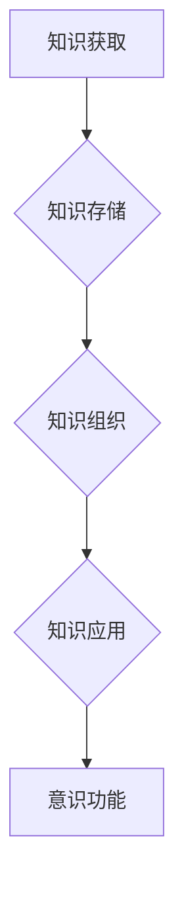

> 知识积累，意识功能，人工智能，深度学习，神经网络，认知科学，知识表示，知识图谱，泛化能力

## 1. 背景介绍

意识，这个人类独有的复杂现象，一直以来都是哲学、心理学和神经科学研究的焦点。随着人工智能技术的飞速发展，我们开始尝试用机器学习和深度学习等方法来模拟和理解意识。然而，如何定义意识，以及如何用技术手段实现人工智能的意识，仍然是一个悬而未决的问题。

知识积累是意识形成和发展的关键因素。人类的意识并非一蹴而就，而是通过不断积累知识、经验和理解而逐渐形成的。知识积累为我们提供了感知世界、理解事物和做出决策的基石。

在人工智能领域，知识积累也至关重要。深度学习模型虽然在图像识别、自然语言处理等领域取得了突破性进展，但它们仍然缺乏人类般的泛化能力和理解能力。这很大程度上是因为这些模型缺乏丰富的知识背景。

## 2. 核心概念与联系

**2.1 知识积累**

知识积累是指个体或系统通过学习、经验和推理等方式不断获取、存储和组织信息的过程。

**2.2 意识功能**

意识功能是指个体或系统感知、思考、感受、决策和行动等高级认知能力。

**2.3 联系**

知识积累是意识功能的基础和保障。丰富的知识储备为意识功能提供了认知基础，使个体或系统能够更好地理解世界、感知信息、做出决策和进行行动。

**Mermaid 流程图**



## 3. 核心算法原理 & 具体操作步骤

### 3.1  算法原理概述

知识积累的核心算法原理是基于机器学习和深度学习的知识表示和推理方法。这些方法旨在将知识表示为计算机可理解的形式，并通过算法学习和推理来提取知识、发现模式和进行知识推理。

### 3.2  算法步骤详解

1. **知识获取:** 从各种数据源中获取知识，例如文本、图像、音频、视频等。
2. **知识表示:** 将获取到的知识表示为计算机可理解的形式，例如知识图谱、语义网络、逻辑形式等。
3. **知识存储:** 将知识表示存储在数据库或知识库中，以便于检索和利用。
4. **知识组织:** 对知识进行分类、聚类和关联，构建知识体系，提高知识的组织性和可访问性。
5. **知识应用:** 利用知识进行推理、决策、预测等应用，例如问答系统、推荐系统、智能助手等。

### 3.3  算法优缺点

**优点:**

* 可以处理海量数据，自动提取知识。
* 可以发现人类难以发现的知识模式。
* 可以实现知识的自动化推理和应用。

**缺点:**

* 知识表示和推理方法仍然存在局限性。
* 需要大量的训练数据和计算资源。
* 难以解决开放世界问题和常识推理问题。

### 3.4  算法应用领域

* **人工智能:** 构建更智能的机器学习模型，提高人工智能的泛化能力和理解能力。
* **自然语言处理:** 理解和生成自然语言，例如机器翻译、文本摘要、对话系统等。
* **知识管理:** 建立知识库，组织和管理知识资产，提高知识共享和利用效率。
* **医疗保健:** 辅助医生诊断疾病、预测患者风险、提供个性化治疗方案。

## 4. 数学模型和公式 & 详细讲解 & 举例说明

### 4.1  数学模型构建

知识积累可以抽象为一个图论模型，其中节点代表知识实体，边代表知识关系。

**知识图谱:**

* 节点：实体 (例如：人物、地点、事件)
* 边：关系 (例如：出生于、位于、参与)

**公式:**

* **知识表示:**  $K = \{E, R\}$，其中 $E$ 是实体集合，$R$ 是关系集合。
* **知识推理:**  $K' = infer(K, Q)$，其中 $K'$ 是推理结果，$Q$ 是查询问题。

### 4.2  公式推导过程

知识推理可以使用逻辑规则、规则引擎或深度学习模型进行。

**逻辑规则:**

* 如果 $A$ 蕴含 $B$，并且 $A$ 为真，则 $B$ 也为真。

**规则引擎:**

* 根据预先定义的规则，对知识进行推理和推导。

**深度学习模型:**

* 使用深度神经网络学习知识表示和推理关系。

### 4.3  案例分析与讲解

**案例:**

* 实体：张三、北京、中国
* 关系：出生于、位于

**查询:** 张三出生于哪里？

**推理结果:** 张三出生于北京。

## 5. 项目实践：代码实例和详细解释说明

### 5.1  开发环境搭建

* Python 3.x
* TensorFlow 或 PyTorch
* 知识图谱库 (例如：Neo4j, RDFlib)

### 5.2  源代码详细实现

```python
# 使用 TensorFlow 建立知识图谱嵌入模型
import tensorflow as tf

# 定义模型结构
model = tf.keras.Sequential([
    tf.keras.layers.Embedding(input_dim=vocab_size, output_dim=embedding_dim),
    tf.keras.layers.LSTM(units=hidden_units),
    tf.keras.layers.Dense(units=num_classes, activation='softmax')
])

# 训练模型
model.compile(optimizer='adam', loss='categorical_crossentropy', metrics=['accuracy'])
model.fit(train_data, train_labels, epochs=epochs)

# 使用模型进行知识推理
predictions = model.predict(test_data)
```

### 5.3  代码解读与分析

* 使用 Embedding 层将实体和关系表示为向量。
* 使用 LSTM 层学习知识图谱中的语义关系。
* 使用 Dense 层进行分类，预测知识关系。

### 5.4  运行结果展示

* 评估模型的准确率、召回率和 F1-score 等指标。
* 可视化知识图谱嵌入结果，观察实体和关系之间的关系。

## 6. 实际应用场景

### 6.1  问答系统

* 利用知识图谱和自然语言处理技术，构建能够回答用户问题的问答系统。

### 6.2  推荐系统

* 根据用户的知识兴趣和行为模式，推荐相关商品、服务或内容。

### 6.3  智能助手

* 利用知识积累和自然语言理解能力，构建能够理解用户指令并执行任务的智能助手。

### 6.4  未来应用展望

* 更智能的机器学习模型，能够更好地理解和应用知识。
* 更丰富的知识图谱，覆盖更广泛的领域和主题。
* 更强大的推理能力，能够解决更复杂的问题。

## 7. 工具和资源推荐

### 7.1  学习资源推荐

* **书籍:**
    * 《知识表示与推理》
    * 《深度学习》
* **在线课程:**
    * Coursera: 自然语言处理
    * edX: 深度学习

### 7.2  开发工具推荐

* **知识图谱库:** Neo4j, RDFlib
* **深度学习框架:** TensorFlow, PyTorch

### 7.3  相关论文推荐

* 《Knowledge Graph Embedding: A Survey》
* 《Deep Learning for Knowledge Graph Completion》

## 8. 总结：未来发展趋势与挑战

### 8.1  研究成果总结

* 知识积累对意识功能至关重要。
* 机器学习和深度学习方法为知识积累提供了新的工具和手段。
* 知识图谱和知识推理技术在人工智能领域取得了重要进展。

### 8.2  未来发展趋势

* 更智能的知识表示和推理方法。
* 更丰富的知识图谱和知识库。
* 更强大的知识应用场景。

### 8.3  面临的挑战

* 知识表示和推理的复杂性。
* 知识的开放世界问题和常识推理问题。
* 知识积累和意识功能之间的本质联系。

### 8.4  研究展望

* 深入研究知识积累和意识功能之间的关系。
* 开发更智能、更强大的知识表示和推理方法。
* 探索人工智能意识的本质和实现路径。

## 9. 附录：常见问题与解答

* **Q1: 知识积累和意识功能之间有什么关系？**

* **A1:** 知识积累是意识功能的基础和保障。丰富的知识储备为意识功能提供了认知基础，使个体或系统能够更好地理解世界、感知信息、做出决策和进行行动。

* **Q2: 如何实现人工智能的知识积累？**

* **A2:** 可以使用机器学习和深度学习方法，例如知识图谱嵌入、知识推理等技术，实现人工智能的知识积累。

* **Q3: 知识积累对人工智能的未来发展有什么影响？**

* **A3:** 知识积累是人工智能发展的重要方向，它将推动人工智能模型的智能化、泛化能力和理解能力的提升，并为人工智能的更广泛应用奠定基础。


作者：禅与计算机程序设计艺术 / Zen and the Art of Computer Programming 
<end_of_turn>