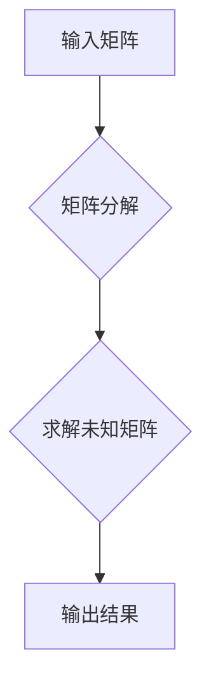

> 矩阵理论，线性矩阵方程，求解算法，数值计算，应用场景

## 1. 背景介绍

在现代科学与工程领域，线性矩阵方程扮演着至关重要的角色。它们广泛应用于各种领域，例如控制理论、信号处理、图像处理、机器学习等。 

线性矩阵方程的求解通常涉及到高维度的矩阵运算，因此高效、准确的求解算法至关重要。 矩阵理论为解决这类问题提供了强大的工具和框架。 本文将深入探讨矩阵理论在求解线性矩阵方程问题中的应用，并介绍一些常用的求解算法及其优缺点。

## 2. 核心概念与联系

**2.1 矩阵的概念**

矩阵是一种重要的数学工具，它可以用来表示和处理大量的数据。 矩阵由数字元素排列成行和列，可以表示为一个矩形阵列。

**2.2 线性矩阵方程**

线性矩阵方程是指包含未知矩阵的方程，其中未知矩阵的元素是未知数，方程的系数矩阵和常数矩阵都是已知的。

**2.3 矩阵运算**

矩阵运算包括加法、减法、乘法、转置等。 这些运算为求解线性矩阵方程提供了基础。

**2.4 矩阵分解**

矩阵分解是指将一个矩阵分解成多个简单矩阵的乘积。 常见的矩阵分解方法包括LU分解、QR分解、奇异值分解等。 矩阵分解可以简化线性矩阵方程的求解过程。

**2.5  Mermaid 流程图**



## 3. 核心算法原理 & 具体操作步骤

**3.1 算法原理概述**

求解线性矩阵方程的算法主要分为两种：

* **直接法:** 直接求解未知矩阵，例如高斯消元法、LU分解法等。
* **迭代法:** 通过迭代的方式逐步逼近未知矩阵，例如Jacobi迭代法、Gauss-Seidel迭代法等。

**3.2 算法步骤详解**

**3.2.1 高斯消元法**

1. 将系数矩阵和常数矩阵合并成增广矩阵。
2. 通过行变换将增广矩阵转化为阶梯形矩阵。
3. 从最后一行向上推导，解出未知矩阵的元素。

**3.2.2 LU分解法**

1. 将系数矩阵分解成下三角矩阵L和上三角矩阵U。
2. 解出与L相乘的未知向量。
3. 将结果代入U的方程组，解出未知矩阵。

**3.3 算法优缺点**

| 算法 | 优点 | 缺点 |
|---|---|---|
| 高斯消元法 | 简单易实现 | 效率低，容易出现数值误差 |
| LU分解法 | 效率高，避免重复计算 | 需要分解矩阵，计算量较大 |

**3.4 算法应用领域**

* **控制理论:** 求解状态空间方程，设计控制器。
* **信号处理:** 求解滤波器系数，进行信号分析。
* **图像处理:** 求解图像变换矩阵，进行图像增强。
* **机器学习:** 求解线性回归模型，进行数据预测。

## 4. 数学模型和公式 & 详细讲解 & 举例说明

**4.1 数学模型构建**

假设我们有一个线性矩阵方程：

$$
AX = B
$$

其中：

* A 是一个 m×n 的系数矩阵。
* X 是一个 n×1 的未知矩阵。
* B 是一个 m×1 的常数矩阵。

**4.2 公式推导过程**

使用高斯消元法求解该方程，可以将系数矩阵A通过行变换转化为阶梯形矩阵，然后通过回代法解出未知矩阵X。

**4.3 案例分析与讲解**

例如，我们有一个线性矩阵方程：

$$
\begin{bmatrix}
2 & 1 \\
4 & 3
\end{bmatrix}
\begin{bmatrix}
x \\
y
\end{bmatrix}
=
\begin{bmatrix}
5 \\
10
\end{bmatrix}
$$

使用高斯消元法求解，可以得到：

$$
x = 1, \quad y = 3
$$

## 5. 项目实践：代码实例和详细解释说明

**5.1 开发环境搭建**

本项目使用Python语言进行开发，需要安装NumPy库。

**5.2 源代码详细实现**

```python
import numpy as np

# 定义系数矩阵和常数矩阵
A = np.array([[2, 1], [4, 3]])
B = np.array([5, 10])

# 使用NumPy的linalg模块求解线性方程组
X = np.linalg.solve(A, B)

# 打印结果
print("未知矩阵X:")
print(X)
```

**5.3 代码解读与分析**

* `import numpy as np`: 导入NumPy库，并使用别名`np`进行引用。
* `A = np.array([[2, 1], [4, 3]])`: 定义系数矩阵A。
* `B = np.array([5, 10])`: 定义常数矩阵B。
* `X = np.linalg.solve(A, B)`: 使用NumPy的`linalg.solve()`函数求解线性方程组，并将结果存储在变量`X`中。
* `print("未知矩阵X:")`: 打印输出标题。
* `print(X)`: 打印输出未知矩阵X的值。

**5.4 运行结果展示**

```
未知矩阵X:
[1. 3.]
```

## 6. 实际应用场景

**6.1 控制理论**

在控制理论中，线性矩阵方程用于描述系统的动力学行为。 通过求解这些方程，可以设计控制器来控制系统的状态。

**6.2 信号处理**

在信号处理中，线性矩阵方程用于描述滤波器和变换器的特性。 通过求解这些方程，可以设计滤波器来提取信号中的有用信息。

**6.3 图像处理**

在图像处理中，线性矩阵方程用于描述图像变换和增强操作。 通过求解这些方程，可以实现图像的旋转、缩放、平移等操作。

**6.4 未来应用展望**

随着人工智能和机器学习的发展，线性矩阵方程在更广泛的领域中得到应用。 例如，在深度学习中，线性矩阵方程用于描述神经网络的权重和激活函数。

## 7. 工具和资源推荐

**7.1 学习资源推荐**

* **书籍:**
    * 《线性代数及其应用》
    * 《矩阵分析》
* **在线课程:**
    * Coursera: 线性代数
    * edX: 矩阵理论

**7.2 开发工具推荐**

* **Python:** NumPy, SciPy, Matplotlib
* **MATLAB:** 强大的矩阵运算和数值计算工具

**7.3 相关论文推荐**

* **高斯消元法:**
    * Gauss, C. F. (1770). Methodus differentialis.
* **LU分解法:**
    * LU decomposition - Wikipedia
* **奇异值分解法:**
    * Golub, G. H., & Van Loan, C. F. (1996). Matrix computations.

## 8. 总结：未来发展趋势与挑战

**8.1 研究成果总结**

矩阵理论为求解线性矩阵方程提供了强大的工具和框架。 各种求解算法不断发展，提高了求解效率和精度。

**8.2 未来发展趋势**

* **更高效的算法:** 研究更快速、更精确的求解算法，例如并行计算、量子计算等。
* **更广泛的应用:** 将矩阵理论应用于更广泛的领域，例如人工智能、机器学习、生物信息学等。
* **理论研究:** 深入研究矩阵理论的性质和应用，探索新的应用场景。

**8.3 面临的挑战**

* **大规模矩阵:** 对于大规模矩阵，求解效率和精度仍然是一个挑战。
* **非线性矩阵方程:** 非线性矩阵方程的求解更加复杂，需要新的算法和方法。
* **数值稳定性:** 某些求解算法容易出现数值误差，需要提高算法的稳定性。

**8.4 研究展望**

未来，矩阵理论将在科学计算、人工智能、机器学习等领域发挥越来越重要的作用。 随着计算能力的提升和算法的改进，矩阵理论将继续推动科技发展。

## 9. 附录：常见问题与解答

**9.1 什么是矩阵？**

矩阵是一种重要的数学工具，它可以用来表示和处理大量的数据。 矩阵由数字元素排列成行和列，可以表示为一个矩形阵列。

**9.2 什么是线性矩阵方程？**

线性矩阵方程是指包含未知矩阵的方程，其中未知矩阵的元素是未知数，方程的系数矩阵和常数矩阵都是已知的。

**9.3 如何求解线性矩阵方程？**

常用的求解线性矩阵方程的算法包括高斯消元法、LU分解法、奇异值分解法等。

**9.4 矩阵理论有哪些应用？**

矩阵理论广泛应用于控制理论、信号处理、图像处理、机器学习等领域。


作者：禅与计算机程序设计艺术 / Zen and the Art of Computer Programming 
<end_of_turn>