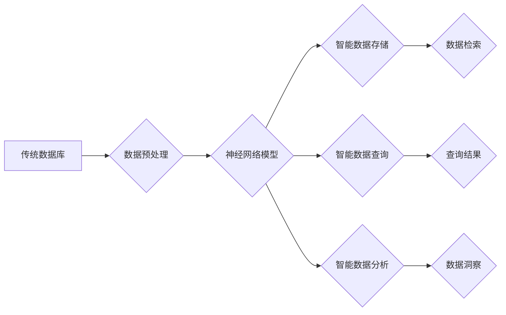

> 神经网络, 数据库, 知识图谱, 关系型数据库, NoSQL 数据库, 深度学习, 自然语言处理, 图像识别

## 1. 背景介绍

随着数据量的爆炸式增长，传统数据库技术面临着新的挑战。关系型数据库，作为长期以来主导数据库领域的模式，在处理海量结构化数据方面表现出色。然而，面对海量非结构化数据，如文本、图像、音频等，传统数据库的处理能力显得捉襟见肘。同时，随着人工智能技术的快速发展，对数据分析和挖掘的需求日益增长，传统数据库的查询和分析能力也难以满足。

神经网络作为人工智能领域的核心技术之一，凭借其强大的学习和推理能力，为数据库技术带来了新的革新。神经网络能够从海量数据中学习模式和规律，并将其应用于数据存储、查询、分析等方面，从而提升数据库的效率和智能化水平。

## 2. 核心概念与联系

**2.1 数据库与神经网络的融合**

传统数据库主要关注数据存储、查询和管理，而神经网络则擅长学习和推理。将两者融合，可以构建一种新型的智能数据库，具备以下特点：

* **智能数据存储:** 利用神经网络对数据进行编码和压缩，提高存储效率和数据质量。
* **智能数据查询:** 利用神经网络对用户查询进行理解和分析，提供更精准和高效的查询结果。
* **智能数据分析:** 利用神经网络对数据进行挖掘和分析，发现隐藏的模式和规律，为决策提供支持。

**2.2 核心架构**



**2.3 核心技术**

* **知识图谱:** 将数据以知识图谱的形式存储，可以更好地表达数据之间的关系和语义，为神经网络提供更丰富的输入信息。
* **深度学习:** 利用深度神经网络的强大学习能力，对数据进行更深入的分析和挖掘。
* **自然语言处理:** 利用自然语言处理技术，对用户查询进行理解和分析，提高查询的准确性和效率。

## 3. 核心算法原理 & 具体操作步骤

### 3.1 算法原理概述

神经网络数据库的核心算法原理是利用深度学习技术对数据进行编码和压缩，并构建一个神经网络模型来进行数据存储、查询和分析。

* **数据编码:** 将数据转换为神经网络可以理解的格式，例如向量表示。
* **神经网络模型训练:** 利用训练数据训练神经网络模型，使其能够学习数据之间的模式和规律。
* **数据存储:** 将编码后的数据存储在神经网络模型中。
* **数据查询:** 利用神经网络模型对用户查询进行理解和分析，并从模型中检索相关数据。
* **数据分析:** 利用神经网络模型对数据进行挖掘和分析，发现隐藏的模式和规律。

### 3.2 算法步骤详解

1. **数据预处理:** 对原始数据进行清洗、转换和特征提取，使其适合神经网络模型的训练。
2. **数据编码:** 利用编码器网络将数据转换为向量表示。
3. **神经网络模型训练:** 利用训练数据训练编码器网络和解码器网络。
4. **数据存储:** 将编码后的数据存储在神经网络模型中。
5. **数据查询:** 利用查询语句和解码器网络从模型中检索相关数据。
6. **数据分析:** 利用神经网络模型对数据进行挖掘和分析，发现隐藏的模式和规律。

### 3.3 算法优缺点

**优点:**

* **高效存储:** 神经网络可以对数据进行压缩和编码，提高存储效率。
* **智能查询:** 神经网络可以理解用户查询的语义，提供更精准的查询结果。
* **数据挖掘:** 神经网络可以发现数据中的隐藏模式和规律，为决策提供支持。

**缺点:**

* **训练成本高:** 神经网络模型的训练需要大量的计算资源和时间。
* **可解释性差:** 神经网络的决策过程难以解释，难以理解模型的内部机制。
* **数据依赖性强:** 神经网络模型的性能依赖于训练数据的质量和数量。

### 3.4 算法应用领域

* **搜索引擎:** 利用神经网络对用户查询进行理解和分析，提供更精准的搜索结果。
* **推荐系统:** 利用神经网络对用户行为进行分析，推荐个性化的商品或服务。
* **图像识别:** 利用神经网络对图像进行识别和分类。
* **自然语言处理:** 利用神经网络进行文本分类、情感分析、机器翻译等任务。

## 4. 数学模型和公式 & 详细讲解 & 举例说明

### 4.1 数学模型构建

神经网络数据库的核心数学模型是多层感知机 (MLP)，它由多个神经元层组成，每个神经元接收来自上一层的输入信号，并通过激活函数进行处理，输出到下一层。

**4.1.1 神经元模型:**

每个神经元可以表示为以下公式：

$$
y = f(w^T x + b)
$$

其中：

* $y$ 是神经元的输出值。
* $f$ 是激活函数。
* $w$ 是神经元的权重向量。
* $x$ 是神经元的输入向量。
* $b$ 是神经元的偏置值。

**4.1.2 多层感知机模型:**

多层感知机由多个神经元层组成，每个层的神经元数量可以不同。输入层接收原始数据，输出层输出最终结果。隐藏层位于输入层和输出层之间，用于提取数据的特征和模式。

### 4.2 公式推导过程

神经网络的训练过程是通过反向传播算法来实现的。反向传播算法的核心思想是通过计算误差信号，并反向传播到各层神经元，调整神经元的权重和偏置值，使得模型的输出与真实值之间的误差最小化。

**4.2.1 损失函数:**

损失函数用于衡量模型的预测结果与真实值的差异。常用的损失函数包括均方误差 (MSE) 和交叉熵 (Cross-Entropy)。

**4.2.2 反向传播算法:**

反向传播算法通过计算梯度来更新神经元的权重和偏置值。梯度表示损失函数对权重和偏置值的导数，方向指示权重和偏置值需要调整的方向。

### 4.3 案例分析与讲解

**4.3.1 图像识别:**

利用神经网络进行图像识别，可以将图像转换为向量表示，并训练一个分类模型，识别图像中的物体。

**4.3.2 文本分类:**

利用神经网络进行文本分类，可以将文本转换为向量表示，并训练一个分类模型，将文本分类到不同的类别。

## 5. 项目实践：代码实例和详细解释说明

### 5.1 开发环境搭建

* **操作系统:** Ubuntu 20.04 LTS
* **编程语言:** Python 3.8
* **深度学习框架:** TensorFlow 2.0
* **数据库:** MySQL 8.0

### 5.2 源代码详细实现

```python
import tensorflow as tf

# 定义神经网络模型
model = tf.keras.models.Sequential([
    tf.keras.layers.Dense(128, activation='relu', input_shape=(1024,)),
    tf.keras.layers.Dense(64, activation='relu'),
    tf.keras.layers.Dense(10, activation='softmax')
])

# 编译模型
model.compile(optimizer='adam',
              loss='sparse_categorical_crossentropy',
              metrics=['accuracy'])

# 训练模型
model.fit(x_train, y_train, epochs=10)

# 保存模型
model.save('neural_network_model.h5')

# 加载模型
loaded_model = tf.keras.models.load_model('neural_network_model.h5')

# 使用模型进行预测
predictions = loaded_model.predict(x_test)
```

### 5.3 代码解读与分析

* **定义神经网络模型:** 使用 TensorFlow 的 `keras` API 定义一个多层感知机模型，包含三个全连接层和一个 softmax 输出层。
* **编译模型:** 使用 Adam 优化器、稀疏类别交叉熵损失函数和准确率指标编译模型。
* **训练模型:** 使用训练数据训练模型，设置训练轮数为 10。
* **保存模型:** 将训练好的模型保存为 `.h5` 文件。
* **加载模型:** 从 `.h5` 文件加载训练好的模型。
* **使用模型进行预测:** 使用测试数据对模型进行预测，并获取预测结果。

### 5.4 运行结果展示

训练完成后，可以查看模型的训练和验证准确率，以及预测结果的准确率。

## 6. 实际应用场景

### 6.1 搜索引擎优化

神经网络可以用于搜索引擎的排名算法，通过分析用户搜索行为和网页内容，提高搜索结果的准确性和相关性。

### 6.2 个性化推荐

神经网络可以用于个性化推荐系统，通过分析用户的历史行为和偏好，推荐个性化的商品或服务。

### 6.3 欺诈检测

神经网络可以用于欺诈检测系统，通过分析交易数据和用户行为，识别潜在的欺诈行为。

### 6.4 未来应用展望

* **智能问答:** 利用神经网络构建智能问答系统，能够理解用户的自然语言问题，并提供准确的答案。
* **自动驾驶:** 利用神经网络构建自动驾驶系统，能够感知周围环境，并做出安全可靠的驾驶决策。
* **医疗诊断:** 利用神经网络辅助医生进行医疗诊断，提高诊断的准确性和效率。

## 7. 工具和资源推荐

### 7.1 学习资源推荐

* **TensorFlow 官方文档:** https://www.tensorflow.org/
* **PyTorch 官方文档:** https://pytorch.org/
* **深度学习书籍:**
    * 深度学习 (Deep Learning) - Ian Goodfellow, Yoshua Bengio, Aaron Courville
    * 构建深度学习模型 (Hands-On Machine Learning with Scikit-Learn, Keras & TensorFlow) - Aurélien Géron

### 7.2 开发工具推荐

* **Jupyter Notebook:** https://jupyter.org/
* **VS Code:** https://code.visualstudio.com/
* **PyCharm:** https://www.jetbrains.com/pycharm/

### 7.3 相关论文推荐

* **Attention Is All You Need:** https://arxiv.org/abs/1706.03762
* **BERT: Pre-training of Deep Bidirectional Transformers for Language Understanding:** https://arxiv.org/abs/1810.04805

## 8. 总结：未来发展趋势与挑战

### 8.1 研究成果总结

神经网络数据库技术在数据存储、查询、分析等方面取得了显著的成果，为数据库技术带来了新的革新。

### 8.2 未来发展趋势

* **模型压缩和加速:** 研究更有效的模型压缩和加速技术，降低神经网络数据库的计算成本。
* **联邦学习:** 利用联邦学习技术，在不泄露敏感数据的情况下，训练和更新神经网络模型。
* **异构数据融合:** 研究如何将不同类型的数据融合到神经网络数据库中，提高数据的丰富性和分析能力。

### 8.3 面临的挑战

* **可解释性:** 神经网络的决策过程难以解释，难以理解模型的内部机制。
* **数据安全:** 神经网络数据库需要处理大量敏感数据，需要加强数据安全保护。
* **可维护性:** 神经网络模型的训练和维护成本较高，需要开发更有效的维护和更新机制。

### 8.4 研究展望

未来，神经网络数据库技术将继续发展，并应用于更多领域，为数据分析和挖掘提供更强大的工具和手段。


## 9. 附录：常见问题与解答

**9.1 如何选择合适的激活函数？**

激活函数的选择