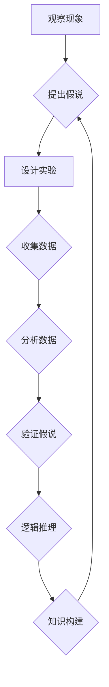

> 科学探究, 假说, 实验验证, 逻辑推理, 知识构建, 算法, 数学模型, 代码实现, 应用场景, 未来趋势

## 1. 背景介绍

在瞬息万变的科技时代，科学探究扮演着至关重要的角色。从最初的朴素观察到如今的复杂实验，人类不断探索着世界的奥秘，并通过逻辑推理和知识构建，逐步揭示着自然规律。而对于计算机科学领域而言，科学探究的精髓同样适用。

无论是设计高效的算法，构建完善的数学模型，还是实现可行的软件系统，都需要遵循严谨的科学探究方法。本文将以“从假说到真理”为主题，探讨计算机科学领域中的科学探究过程，并通过具体的案例分析，阐明其核心概念、原理和实践方法。

## 2. 核心概念与联系

科学探究的核心在于从观察和假设出发，通过实验验证和逻辑推理，逐步逼近真理。

**2.1 假说:** 假说是一种对现象或问题的初步解释，它基于现有知识和观察结果，并提出了一种可能的解释。

**2.2 实验验证:** 实验验证是检验假说的重要手段。通过设计合理的实验，收集数据并进行分析，可以判断假说的合理性。

**2.3 逻辑推理:** 逻辑推理是运用逻辑规则和知识，从已知条件出发，推导出新的结论。

**2.4 知识构建:** 知识构建是将实验结果和逻辑推理的结论整合在一起，形成更完整的知识体系。

**2.5 迭代改进:** 科学探究是一个不断迭代改进的过程。通过反复实验、分析和总结，可以不断完善假说，最终逼近真理。

**Mermaid 流程图:**



## 3. 核心算法原理 & 具体操作步骤

### 3.1 算法原理概述

算法是一种解决特定问题的步骤序列，它可以被计算机理解和执行。

**3.1.1 算法特征:**

* **明确性:** 算法的每个步骤都必须明确定义，没有歧义。
* **有限性:** 算法必须在有限的时间内完成。
* **有效性:** 算法的每个步骤都必须能够被有效地执行。
* **输入输出:** 算法必须有输入和输出，输入是算法处理的数据，输出是算法处理的结果。

**3.1.2 算法分类:**

* **搜索算法:** 用于在数据集合中查找特定元素。
* **排序算法:** 用于对数据集合进行排序。
* **图算法:** 用于处理图结构的数据。
* **动态规划算法:** 用于解决具有重叠子问题的优化问题。

### 3.2 算法步骤详解

以冒泡排序算法为例，详细说明其步骤：

1. **比较相邻元素:** 从数组的第一个元素开始，与下一个元素进行比较。
2. **交换元素:** 如果两个元素的顺序错误，则交换它们的位置。
3. **重复步骤1和2:** 重复上述步骤，直到整个数组排序完成。

### 3.3 算法优缺点

**冒泡排序算法的优点:**

* 实现简单，易于理解。

**冒泡排序算法的缺点:**

* 时间复杂度较高，效率较低。

### 3.4 算法应用领域

冒泡排序算法广泛应用于各种场景，例如：

* **数据排序:** 对数据进行从小到大或从大到小的排序。
* **列表排列:** 对列表中的元素进行排列。
* **游戏开发:** 在游戏中排序玩家的排名或物品的属性。

## 4. 数学模型和公式 & 详细讲解 & 举例说明

### 4.1 数学模型构建

数学模型是利用数学语言和符号来描述现实世界现象或问题的抽象表示。

**4.1.1 数学模型的构建步骤:**

1. **确定研究对象:** 明确需要建模的现象或问题。
2. **收集数据:** 收集与研究对象相关的实证数据。
3. **建立变量关系:** 确定研究对象中的关键变量及其之间的关系。
4. **选择数学工具:** 根据研究对象的特点选择合适的数学工具，例如代数、微积分、概率论等。
5. **构建数学模型:** 利用数学工具和变量关系，构建数学模型。

### 4.2 公式推导过程

以线性回归模型为例，推导其公式：

**目标:** 建立一个线性模型，预测变量y与自变量x之间的关系。

**假设:** y与x之间存在线性关系，即y = ax + b，其中a和b为待求参数。

**步骤:**

1. **最小二乘法:** 利用最小二乘法，求解参数a和b，使得模型预测值与实际值之间的误差最小。
2. **公式推导:** 通过最小二乘法的原理，可以推导出线性回归模型的公式：

```latex
a = \frac{\sum_{i=1}^{n}(x_i - \bar{x})(y_i - \bar{y})}{\sum_{i=1}^{n}(x_i - \bar{x})^2}
b = \bar{y} - a\bar{x}
```

其中：

* $x_i$ 和 $y_i$ 分别为第i个样本的x值和y值。
* $\bar{x}$ 和 $\bar{y}$ 分别为x值和y值的平均值。
* n为样本数量。

### 4.3 案例分析与讲解

**案例:** 假设我们收集了以下数据，用于预测房屋价格：

| 房屋面积 (平方米) | 房屋价格 (万元) |
|---|---|
| 60 | 120 |
| 80 | 150 |
| 100 | 180 |
| 120 | 210 |

**分析:**

1. **构建数学模型:** 我们假设房屋价格与房屋面积之间存在线性关系，即y = ax + b。
2. **求解参数:** 利用公式推导出的线性回归模型，我们可以求解出参数a和b。
3. **预测价格:** 利用求解出的参数，我们可以预测其他房屋价格。

## 5. 项目实践：代码实例和详细解释说明

### 5.1 开发环境搭建

* **操作系统:** Windows/macOS/Linux
* **编程语言:** Python
* **IDE:** PyCharm/VS Code

### 5.2 源代码详细实现

```python
import numpy as np
import matplotlib.pyplot as plt

# 数据集
x = np.array([60, 80, 100, 120])
y = np.array([120, 150, 180, 210])

# 线性回归模型
a = np.sum((x - np.mean(x)) * (y - np.mean(y))) / np.sum((x - np.mean(x))**2)
b = np.mean(y) - a * np.mean(x)

# 预测
y_pred = a * x + b

# 可视化
plt.scatter(x, y, color='blue', label='实际数据')
plt.plot(x, y_pred, color='red', label='线性回归模型')
plt.xlabel('房屋面积 (平方米)')
plt.ylabel('房屋价格 (万元)')
plt.legend()
plt.show()
```

### 5.3 代码解读与分析

* **数据准备:** 首先，我们定义了房屋面积和房屋价格的数据集。
* **线性回归模型:** 我们利用公式推导出的线性回归模型，计算出参数a和b。
* **预测:** 利用求解出的参数，我们可以预测其他房屋价格。
* **可视化:** 我们使用matplotlib库绘制了实际数据和线性回归模型的图形，以便直观地观察模型的拟合效果。

### 5.4 运行结果展示

运行代码后，会生成一个图形，其中蓝色点表示实际数据，红色曲线表示线性回归模型。

## 6. 实际应用场景

### 6.1 房屋价格预测

利用线性回归模型，可以预测房屋价格，帮助购房者做出更明智的决策。

### 6.2 股票价格预测

利用时间序列分析和机器学习算法，可以预测股票价格，帮助投资者制定投资策略。

### 6.3 销售预测

利用历史销售数据和市场趋势分析，可以预测未来销售额，帮助企业制定生产计划和营销策略。

### 6.4 未来应用展望

随着人工智能技术的不断发展，科学探究在计算机科学领域的应用将更加广泛。例如：

* **自动代码生成:** 利用机器学习算法，自动生成代码，提高开发效率。
* **软件缺陷检测:** 利用机器学习算法，自动检测软件缺陷，提高软件质量。
* **科学发现:** 利用人工智能技术，加速科学发现，推动科技进步。

## 7. 工具和资源推荐

### 7.1 学习资源推荐

* **书籍:**
    * 《算法导论》
    * 《深入理解深度学习》
    * 《机器学习》
* **在线课程:**
    * Coursera
    * edX
    * Udacity

### 7.2 开发工具推荐

* **编程语言:** Python, Java, C++
* **IDE:** PyCharm, VS Code, Eclipse
* **机器学习库:** TensorFlow, PyTorch, scikit-learn

### 7.3 相关论文推荐

* **机器学习:**
    * 《ImageNet Classification with Deep Convolutional Neural Networks》
    * 《Attention Is All You Need》
* **自然语言处理:**
    * 《BERT: Pre-training of Deep Bidirectional Transformers for Language Understanding》
    * 《GPT-3: Language Models are Few-Shot Learners》

## 8. 总结：未来发展趋势与挑战

### 8.1 研究成果总结

本文探讨了计算机科学领域中的科学探究方法，并通过具体的案例分析，阐明了其核心概念、原理和实践方法。

### 8.2 未来发展趋势

* **人工智能的进一步发展:** 人工智能技术将继续发展，在科学探究领域发挥更重要的作用。
* **跨学科研究的增多:** 科学探究将更加注重跨学科合作，融合不同领域的知识和方法。
* **数据驱动的科学探究:** 数据将成为科学探究的重要驱动力，数据分析和机器学习技术将得到更广泛的应用。

### 8.3 面临的挑战

* **算法复杂度:** 随着科学问题的复杂性增加，算法的复杂度也随之提高，需要开发更有效的算法。
* **数据获取和处理:** 获取高质量的数据和有效地处理数据仍然是一个挑战。
* **伦理问题:** 人工智能技术的应用引发了伦理问题，需要认真思考和解决。

### 8.4 研究展望

未来，我们将继续探索科学探究在计算机科学领域的应用，并致力于开发更先进的算法、工具和方法，推动科技进步，造福人类社会。

## 9. 附录：常见问题与解答

**问题1:** 如何选择合适的算法？

**解答:** 选择合适的算法需要根据具体问题特点和数据特点进行分析。

**问题2:** 如何评估算法的性能？

**解答:** 可以通过准确率、召回率、F1-score等指标来评估算法的性能。

**问题3:** 如何处理不完整的数据？

**解答:** 可以使用数据填充、数据聚合等方法处理不完整的数据。


作者：禅与计算机程序设计艺术 / Zen and the Art of Computer Programming 
<end_of_turn>