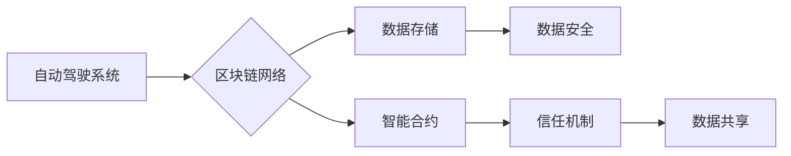

> 自动驾驶, 区块链, 数据安全, 透明度, 可信性, 智能合约, 供应链管理, 数据共享

## 1. 背景介绍

自动驾驶技术作为未来交通运输的重要发展方向，其核心在于实现车辆感知环境、决策规划和控制执行的智能化。然而，自动驾驶系统的安全性和可靠性一直是业界关注的焦点。数据安全、隐私保护、信任机制等问题也成为自动驾驶技术发展的瓶颈。

区块链技术作为一种去中心化、分布式、不可篡改的底层技术，具有天然的安全性、透明性和可信性，为解决自动驾驶技术中的挑战提供了新的思路。

## 2. 核心概念与联系

**2.1 区块链技术概述**

区块链是一种分布式账本技术，其特点是：

* **去中心化:** 数据存储在多个节点上，不存在单点故障。
* **分布式:** 数据副本分布在网络中，任何节点都可以访问和验证数据。
* **不可篡改:** 数据一旦写入区块链，就无法修改，保证数据安全和完整性。
* **透明度:** 所有交易记录都公开透明，任何人都可以查看。

**2.2 自动驾驶技术概述**

自动驾驶技术是指车辆能够感知周围环境、自主决策并控制行驶，实现无人驾驶的目标。其主要技术包括：

* **感知技术:** 利用传感器（如摄像头、雷达、激光雷达等）获取周围环境信息。
* **决策规划技术:** 基于感知信息，规划车辆行驶路线和控制策略。
* **控制执行技术:** 将决策规划转化为车辆的实际控制指令。

**2.3 区块链与自动驾驶的结合**

区块链技术可以应用于自动驾驶系统的多个环节，例如：

* **数据安全和隐私保护:** 利用区块链的不可篡改特性，保障自动驾驶数据安全和隐私。
* **信任机制:** 通过智能合约，建立自动驾驶系统之间的信任机制，实现数据共享和协作。
* **供应链管理:** 利用区块链追踪自动驾驶系统的零部件来源和生产过程，提高供应链透明度和安全性。

**2.4 架构图**



## 3. 核心算法原理 & 具体操作步骤

**3.1 算法原理概述**

区块链技术的核心算法包括：

* **哈希算法:** 用于生成数据块的唯一标识。
* **共识算法:** 用于验证交易和生成新区块。
* **加密算法:** 用于保护数据隐私和安全。

**3.2 算法步骤详解**

1. **数据生成:** 自动驾驶系统收集数据并将其打包成数据块。
2. **哈希计算:** 对数据块进行哈希计算，生成数据块的唯一标识。
3. **验证交易:** 节点验证数据块的合法性，并通过共识算法达成共识。
4. **区块生成:** 验证通过的数据块被添加到区块链中，形成新的区块。
5. **数据存储:** 新区块被存储在所有节点的本地数据库中。

**3.3 算法优缺点**

**优点:**

* **安全性:** 数据不可篡改，保证数据安全。
* **透明度:** 所有交易记录公开透明，提高信任度。
* **去中心化:** 避免单点故障，提高系统可靠性。

**缺点:**

* **性能:** 区块链的处理速度相对较慢。
* **可扩展性:** 区块链的规模有限，难以扩展到更大的网络。

**3.4 算法应用领域**

* **金融:** 数字货币、支付结算、资产管理。
* **供应链:** 物流追踪、产品溯源、供应链金融。
* **医疗:** 电子病历、药品溯源、医疗数据共享。

## 4. 数学模型和公式 & 详细讲解 & 举例说明

**4.1 数学模型构建**

自动驾驶系统的决策规划可以建模为一个优化问题，目标是找到最优的控制策略，使得车辆在满足安全约束的前提下，达到目的地。

**4.2 公式推导过程**

假设车辆的运动状态可以用位置、速度和加速度来描述，则车辆的运动方程可以表示为：

$$
\dot{x} = v
$$

$$
\dot{v} = a
$$

其中，$x$ 是车辆的位置，$v$ 是车辆的速度，$a$ 是车辆的加速度。

目标函数可以定义为车辆到达目的地的时间，即：

$$
J = \int_{t_0}^{t_f} dt
$$

约束条件包括：

* 安全约束：车辆在行驶过程中不能超出安全边界。
* 路径约束：车辆必须沿着指定的路径行驶。

**4.3 案例分析与讲解**

例如，假设车辆需要从起点A到终点B，路径为一条直线。目标函数是车辆到达终点的最短时间。安全约束是车辆的速度不能超过最大速度限制。

通过优化算法，可以找到最优的控制策略，使得车辆在满足安全约束的前提下，最短时间到达终点。

## 5. 项目实践：代码实例和详细解释说明

**5.1 开发环境搭建**

* 操作系统：Ubuntu 20.04
* 编程语言：Python 3.8
* 开发工具：PyCharm

**5.2 源代码详细实现**

```python
# 自动驾驶系统数据处理模块

import hashlib

class DataBlock:
    def __init__(self, data):
        self.data = data
        self.hash = self.calculate_hash()

    def calculate_hash(self):
        return hashlib.sha256(self.data.encode()).hexdigest()

# 区块链网络模块

class Blockchain:
    def __init__(self):
        self.chain = [self.create_genesis_block()]

    def create_genesis_block(self):
        return DataBlock("Genesis Block")

    def add_block(self, new_block):
        new_block.previous_hash = self.chain[-1].hash
        new_block.hash = new_block.calculate_hash()
        self.chain.append(new_block)

# 自动驾驶系统与区块链网络交互模块

class AutoDrivingSystem:
    def __init__(self, blockchain):
        self.blockchain = blockchain

    def send_data(self, data):
        data_block = DataBlock(data)
        self.blockchain.add_block(data_block)

# 示例代码

if __name__ == "__main__":
    blockchain = Blockchain()
    auto_driving_system = AutoDrivingSystem(blockchain)

    # 模拟自动驾驶系统收集数据并发送到区块链
    data = "自动驾驶系统数据"
    auto_driving_system.send_data(data)
```

**5.3 代码解读与分析**

* `DataBlock` 类表示一个数据块，包含数据和哈希值。
* `Blockchain` 类表示区块链网络，包含一个链条，每个链条是一个数据块。
* `AutoDrivingSystem` 类表示自动驾驶系统，可以与区块链网络交互，发送数据。

**5.4 运行结果展示**

运行代码后，会生成一个包含自动驾驶系统数据的数据块，并添加到区块链网络中。

## 6. 实际应用场景

**6.1 数据安全和隐私保护**

自动驾驶系统收集大量用户数据，例如驾驶行为、位置信息等。区块链技术可以将这些数据存储在分布式网络中，并使用加密算法保护数据隐私，防止数据泄露和滥用。

**6.2 信任机制**

自动驾驶系统需要与其他车辆、基础设施和服务进行交互。区块链技术可以建立一个信任机制，使得不同参与方可以安全地共享数据和进行交易。

**6.3 供应链管理**

自动驾驶系统的零部件需要经过严格的质量控制和认证。区块链技术可以追踪零部件的来源和生产过程，提高供应链透明度和安全性。

**6.4 未来应用展望**

* **自动驾驶保险:** 利用区块链技术，实现自动驾驶保险的智能化和透明化。
* **自动驾驶数据交易:** 建立一个自动驾驶数据交易平台，允许自动驾驶系统之间安全地共享数据。
* **自动驾驶监管:** 利用区块链技术，实现自动驾驶系统的监管和认证。

## 7. 工具和资源推荐

**7.1 学习资源推荐**

* **书籍:**
    * 《区块链技术入门》
    * 《自动驾驶技术》
* **在线课程:**
    * Coursera: Blockchain Specialization
    * Udacity: Self-Driving Car Engineer Nanodegree

**7.2 开发工具推荐**

* **区块链开发框架:** Hyperledger Fabric, Ethereum
* **自动驾驶开发平台:** ROS, Autoware

**7.3 相关论文推荐**

* **区块链与自动驾驶:**
    * Blockchain-Based Secure Data Sharing for Autonomous Vehicles
    * A Blockchain-Based Framework for Trust Management in Autonomous Driving Systems
* **自动驾驶算法:**
    * Deep Reinforcement Learning for Autonomous Driving
    * A Survey of Deep Learning for Autonomous Driving

## 8. 总结：未来发展趋势与挑战

**8.1 研究成果总结**

区块链技术与自动驾驶技术的结合，为解决自动驾驶系统中的安全、隐私、信任等问题提供了新的思路和解决方案。

**8.2 未来发展趋势**

* **更广泛的应用场景:** 区块链技术将应用于更多自动驾驶场景，例如自动驾驶保险、自动驾驶数据交易等。
* **更强大的功能:** 区块链技术将与其他新兴技术融合，例如人工智能、物联网等，为自动驾驶系统提供更强大的功能。
* **更完善的生态系统:** 区块链与自动驾驶技术的生态系统将更加完善，包括更多的开发者、企业和用户参与。

**8.3 面临的挑战**

* **技术挑战:** 区块链技术在性能、可扩展性和隐私保护等方面仍面临挑战。
* **标准化挑战:** 区块链与自动驾驶技术的标准化仍处于初期阶段，需要更多的合作和共识。
* **监管挑战:** 区块链与自动驾驶技术的监管框架仍不完善，需要政府和行业共同努力。

**8.4 研究展望**

未来，我们将继续研究区块链技术与自动驾驶技术的结合，探索更安全、更可靠、更智能的自动驾驶解决方案。

## 9. 附录：常见问题与解答

**9.1 如何保证区块链数据的安全性？**

区块链数据的安全性基于哈希算法、共识算法和加密算法。哈希算法确保数据不可篡改，共识算法保证数据一致性，加密算法保护数据隐私。

**9.2 区块链技术是否适用于所有自动驾驶场景？**

区块链技术可以应用于许多自动驾驶场景，例如数据安全、信任机制和供应链管理。但并非所有场景都适合使用区块链技术，需要根据具体情况进行评估。

**9.3 区块链与自动驾驶技术的未来发展趋势如何？**

区块链技术与自动驾驶技术的未来发展趋势是更加广泛的应用场景、更强大的功能和更完善的生态系统。


作者：禅与计算机程序设计艺术 / Zen and the Art of Computer Programming 
<end_of_turn>