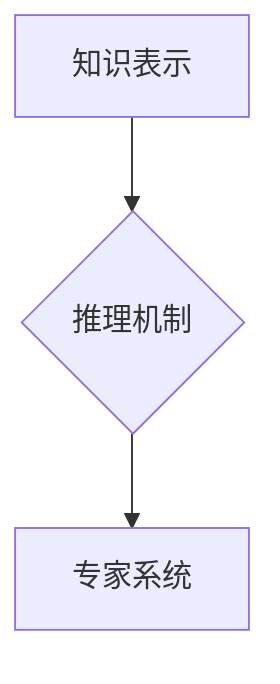

> 人工智能、知识驱动、专家系统、推理机制、知识表示、机器学习、深度学习

## 1. 背景介绍

人工智能（AI）作为一项前沿技术，近年来发展迅速，取得了令人瞩目的成就。从语音识别、图像识别到自然语言处理，AI已经渗透到我们生活的方方面面。然而，在AI发展初期，人们对AI的理解还停留在模仿人类智能的层面，而忽略了知识在AI发展中的重要作用。

第一代人工智能，也称为“知识驱动型人工智能”，强调知识的获取、存储和利用。它认为，人工智能的核心在于构建一个能够理解和推理的知识库，并通过推理机制对知识进行加工和应用。与后来的机器学习和深度学习不同，第一代人工智能更注重人工构建知识，并通过规则和逻辑进行推理。

## 2. 核心概念与联系

**2.1 知识表示**

知识表示是人工智能的核心概念之一，它指将知识以计算机可理解的形式进行存储和组织。常见的知识表示方法包括：

* **符号逻辑:** 使用符号和逻辑规则来表示知识，例如命题逻辑、描述逻辑等。
* **框架:** 使用框架结构来表示知识，例如实体-关系框架、概念网等。
* **语义网络:** 使用网络结构来表示知识，例如节点和边，节点代表实体，边代表关系。

**2.2 推理机制**

推理机制是人工智能系统进行知识加工和应用的关键。它通过对知识库中的知识进行逻辑推理，得出新的结论或预测结果。常见的推理机制包括：

* **规则推理:** 根据预先定义的规则进行推理，例如专家系统中的规则库。
* **逻辑推理:** 使用逻辑规则进行推理，例如命题逻辑、描述逻辑等。
* **概率推理:** 使用概率模型进行推理，例如贝叶斯网络、Markov链等。

**2.3 专家系统**

专家系统是第一代人工智能的典型代表，它通过模拟人类专家的知识和推理能力，解决特定领域的复杂问题。专家系统通常由以下几个部分组成：

* **知识库:** 存储专家知识的数据库。
* **推理引擎:** 根据知识库中的知识进行推理。
* **用户界面:** 与用户进行交互。

**Mermaid 流程图**



## 3. 核心算法原理 & 具体操作步骤

**3.1 算法原理概述**

第一代人工智能的核心算法原理是基于符号逻辑和规则推理。它将知识表示为符号和规则，并使用推理引擎根据规则进行逻辑推理，得出新的结论。

**3.2 算法步骤详解**

1. **知识获取:** 从专家或其他数据源中获取知识，并将其表示为符号和规则。
2. **知识库构建:** 将获取到的知识存储到知识库中。
3. **推理引擎构建:** 根据需要选择合适的推理引擎，例如规则推理引擎、逻辑推理引擎等。
4. **推理过程:** 用户提出问题或输入数据，推理引擎根据知识库中的知识进行逻辑推理，得出结论或预测结果。
5. **结果输出:** 将推理结果以可理解的形式输出给用户。

**3.3 算法优缺点**

**优点:**

* **可解释性强:** 规则推理过程透明易懂，可以解释推理结果的依据。
* **知识表达能力强:** 可以表达复杂的逻辑关系和知识。
* **适用于特定领域:** 在特定领域积累了大量专家知识的情况下，可以构建高效的专家系统。

**缺点:**

* **知识获取困难:** 需要大量的人工投入进行知识获取和编码。
* **知识更新困难:** 当知识库中的知识发生变化时，需要进行人工更新。
* **推理能力有限:** 难以处理开放式问题和不确定性问题。

**3.4 算法应用领域**

* **医疗诊断:** 辅助医生进行疾病诊断。
* **金融分析:** 进行风险评估和投资决策。
* **法律咨询:** 提供法律建议和分析。
* **制造业:** 自动化生产流程和故障诊断。

## 4. 数学模型和公式 & 详细讲解 & 举例说明

**4.1 数学模型构建**

知识表示和推理机制可以基于数学模型进行建模。例如，可以使用逻辑公式来表示知识，可以使用概率模型来表示知识的置信度。

**4.2 公式推导过程**

例如，可以使用命题逻辑的规则进行推理。命题逻辑中的基本元素是命题，命题可以是真或假。命题逻辑的规则包括：

* **蕴涵规则:** 如果A蕴涵B，并且A为真，那么B也为真。
* **析取规则:** 如果A或B为真，那么至少有一个命题为真。
* **合取规则:** 如果A和B都为真，那么A与B的合取也为真。

**4.3 案例分析与讲解**

例如，假设我们有一个知识库，其中包含以下知识：

* 所有猫都是哺乳动物。
* 小明有一只猫。

我们可以使用命题逻辑的规则进行推理，得出以下结论：

* 小明的猫是哺乳动物。

**4.4 数学公式**

* **命题逻辑公式:**

$$
A \Rightarrow B
$$

* **解释:** A蕴涵B，即如果A为真，那么B也为真。

## 5. 项目实践：代码实例和详细解释说明

**5.1 开发环境搭建**

可以使用Python语言和相关库进行开发，例如：

* **Prolog:** 用于逻辑推理。
* **NLTK:** 用于自然语言处理。
* **Scikit-learn:** 用于机器学习。

**5.2 源代码详细实现**

```python
# 使用Prolog进行规则推理

# 定义规则
cat(X) :- mammal(X).
mammal(小明猫).

# 查询
?- cat(X).
X = 小明猫.
```

**5.3 代码解读与分析**

* `cat(X)`: 定义一个谓词，表示X是一只猫。
* `mammal(X)`: 定义一个谓词，表示X是哺乳动物。
* `cat(X) :- mammal(X).`: 定义一个规则，表示如果X是哺乳动物，那么X是一只猫。
* `mammal(小明猫).`: 定义一个事实，表示小明有一只猫。
* `?- cat(X).`: 查询所有满足条件的X，即所有猫。

**5.4 运行结果展示**

运行上述代码，输出结果为：

```
X = 小明猫.
```

## 6. 实际应用场景

第一代人工智能在医疗诊断、金融分析、法律咨询等领域都有实际应用。例如，专家系统可以辅助医生进行疾病诊断，根据患者的症状和病史，给出可能的诊断结果和治疗方案。

**6.4 未来应用展望**

随着人工智能技术的不断发展，第一代人工智能的应用场景将会更加广泛。例如，可以利用知识图谱技术构建更智能的专家系统，可以利用自然语言处理技术实现人机交互更加自然流畅。

## 7. 工具和资源推荐

**7.1 学习资源推荐**

* **人工智能导论:** 周志华
* **专家系统:** 谢晓东
* **知识表示与推理:** 王晓东

**7.2 开发工具推荐**

* **Prolog:** 逻辑推理引擎
* **CLIPS:** 专家系统开发工具
* **OntoGraf:** 知识图谱编辑器

**7.3 相关论文推荐**

* **Expert Systems: The Next Generation**
* **Knowledge Representation and Reasoning**
* **Semantic Web Technologies**

## 8. 总结：未来发展趋势与挑战

**8.1 研究成果总结**

第一代人工智能取得了显著的成果，为人工智能的发展奠定了基础。

**8.2 未来发展趋势**

* **知识图谱技术:** 将知识表示为图结构，提高知识的组织性和可推理性。
* **自然语言处理:** 使人工智能能够理解和生成自然语言，实现人机交互更加自然流畅。
* **机器学习与深度学习:** 将机器学习和深度学习技术与知识驱动人工智能相结合，提高人工智能的学习和适应能力。

**8.3 面临的挑战**

* **知识获取和更新:** 知识获取和更新仍然是人工智能发展面临的重大挑战。
* **知识表示和推理:** 如何更有效地表示和推理知识，是人工智能研究的重要方向。
* **可解释性和信任度:** 提高人工智能的透明度和可解释性，增强用户对人工智能的信任度。

**8.4 研究展望**

未来，人工智能将朝着更加智能、更加通用、更加安全的方向发展。知识驱动人工智能将继续发挥重要作用，推动人工智能技术的进步。

## 9. 附录：常见问题与解答

**9.1 问题:** 知识驱动人工智能与机器学习有什么区别？

**9.2 答案:** 知识驱动人工智能强调知识的获取、存储和利用，而机器学习则强调从数据中学习知识。

**9.3 问题:** 知识驱动人工智能的未来发展趋势是什么？

**9.4 答案:** 知识驱动人工智能将与知识图谱技术、自然语言处理技术和机器学习技术相结合，发展更加智能、更加通用、更加安全的人工智能。


作者：禅与计算机程序设计艺术 / Zen and the Art of Computer Programming 
<end_of_turn>