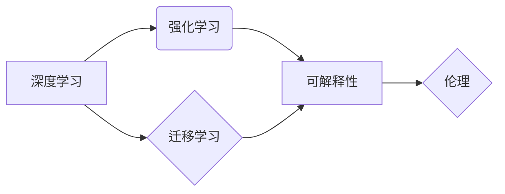

> 第三代人工智能，通用人工智能，深度学习，强化学习，神经网络，迁移学习，可解释性，伦理

## 1. 背景介绍

人工智能（AI）的发展历程可以大致分为三代：第一代人工智能（1950s-1970s）以符号逻辑和规则系统为主，能够解决特定领域的简单问题，但缺乏泛化能力和学习能力；第二代人工智能（1980s-2000s）以专家系统和机器学习为主，能够处理更复杂的问题，并具备一定的学习能力，但仍然依赖大量人工标注数据，难以实现真正的智能；第三代人工智能（2010s至今）以深度学习、强化学习和迁移学习为主，具有更强的学习能力、泛化能力和适应能力，朝着通用人工智能（AGI）的目标迈进。

近年来，深度学习的突破性进展推动了第三代人工智能的发展。深度神经网络能够从海量数据中自动学习特征，实现图像识别、语音识别、自然语言处理等领域的突破性进展。强化学习则赋予人工智能系统自主学习和决策的能力，使其能够在复杂环境中进行决策和行动。迁移学习则通过知识迁移，使模型能够在新的任务和领域中快速学习，降低了模型训练的成本和时间。

## 2. 核心概念与联系

**2.1 深度学习**

深度学习是一种基于多层神经网络的机器学习方法。它能够从海量数据中自动学习特征，并进行复杂的模式识别和预测。深度学习模型通常由多个隐藏层组成，每层神经元之间通过权重连接，通过前向传播和反向传播算法进行训练。

**2.2 强化学习**

强化学习是一种基于奖励机制的机器学习方法。它训练智能体在环境中采取行动，以最大化累积的奖励。智能体通过与环境交互，学习策略，并不断调整策略以获得更高的奖励。

**2.3 迁移学习**

迁移学习是一种利用已学习知识解决新任务的方法。它通过将预训练模型在源任务上的知识迁移到目标任务中，提高目标任务的学习效率和性能。

**2.4 可解释性**

可解释性是指人工智能模型决策过程的透明度和可理解性。可解释性模型能够解释其决策依据，帮助人类理解模型的决策逻辑，并提高对模型的信任度。

**2.5 伦理**

人工智能伦理是指人工智能技术应用过程中需要遵循的道德准则和社会规范。人工智能伦理问题包括数据隐私、算法偏见、责任归属等方面。

**2.6 核心概念关系图**



## 3. 核心算法原理 & 具体操作步骤

### 3.1 算法原理概述

深度学习算法的核心是多层神经网络，通过前向传播和反向传播算法进行训练。前向传播是指将输入数据通过神经网络层层传递，最终得到输出结果。反向传播是指根据输出结果与真实值的误差，调整神经网络权重，使模型预测结果更加准确。

### 3.2 算法步骤详解

1. **数据预处理:** 将原始数据进行清洗、转换和特征工程，使其适合深度学习模型训练。
2. **模型构建:** 根据任务需求选择合适的深度学习模型架构，例如卷积神经网络（CNN）、循环神经网络（RNN）等。
3. **模型训练:** 使用训练数据训练深度学习模型，通过前向传播和反向传播算法不断调整模型参数，使模型预测结果更加准确。
4. **模型评估:** 使用测试数据评估模型的性能，例如准确率、召回率、F1-score等。
5. **模型调优:** 根据模型评估结果，调整模型参数、学习率等超参数，进一步提高模型性能。
6. **模型部署:** 将训练好的模型部署到实际应用场景中，用于预测和决策。

### 3.3 算法优缺点

**优点:**

* 能够自动学习特征，无需人工特征工程。
* 能够处理海量数据，学习复杂模式。
* 性能优异，在图像识别、语音识别、自然语言处理等领域取得突破性进展。

**缺点:**

* 训练成本高，需要大量计算资源和训练数据。
* 模型解释性差，难以理解模型的决策逻辑。
* 容易受到数据偏差的影响，可能产生算法偏见。

### 3.4 算法应用领域

深度学习算法广泛应用于各个领域，例如：

* **计算机视觉:** 图像识别、物体检测、图像分割、人脸识别等。
* **自然语言处理:** 文本分类、情感分析、机器翻译、对话系统等。
* **语音识别:** 语音转文本、语音合成等。
* **推荐系统:** 商品推荐、内容推荐等。
* **医疗诊断:** 疾病诊断、影像分析等。

## 4. 数学模型和公式 & 详细讲解 & 举例说明

### 4.1 数学模型构建

深度学习模型的数学基础是神经网络。神经网络由多个层组成，每层包含多个神经元。每个神经元接收来自上一层的输入信号，并通过激活函数进行处理，输出到下一层。

**4.1.1 神经元模型:**

一个神经元的数学模型可以表示为：

$$
y = f(w^T x + b)
$$

其中：

* $x$ 是输入向量。
* $w$ 是权重向量。
* $b$ 是偏置项。
* $f$ 是激活函数。
* $y$ 是输出值。

**4.1.2 损失函数:**

损失函数用于衡量模型预测结果与真实值的差异。常用的损失函数包括均方误差（MSE）、交叉熵损失等。

**4.1.3 优化算法:**

优化算法用于更新模型参数，使损失函数最小化。常用的优化算法包括梯度下降法、Adam算法等。

### 4.2 公式推导过程

**4.2.1 梯度下降法:**

梯度下降法是一种迭代优化算法，其核心思想是沿着梯度方向更新模型参数，逐步降低损失函数的值。

梯度下降法的更新公式为：

$$
\theta = \theta - \alpha \nabla L(\theta)
$$

其中：

* $\theta$ 是模型参数。
* $\alpha$ 是学习率。
* $\nabla L(\theta)$ 是损失函数对模型参数的梯度。

**4.2.2 Adam算法:**

Adam算法是一种自适应学习率的优化算法，它结合了梯度下降法和动量法，能够更快地收敛到最优解。

Adam算法的更新公式为：

$$
v_t = \beta_1 v_{t-1} + (1 - \beta_1) \nabla L(\theta_t)
$$

$$
s_t = \beta_2 s_{t-1} + (1 - \beta_2) (\nabla L(\theta_t))^2
$$

$$
\theta_{t+1} = \theta_t - \frac{\alpha}{\sqrt{s_t} + \epsilon} v_t
$$

其中：

* $v_t$ 是动量项。
* $s_t$ 是二阶矩估计。
* $\beta_1$ 和 $\beta_2$ 是动量衰减系数。
* $\epsilon$ 是一个小常数，用于避免分母为零。

### 4.3 案例分析与讲解

**4.3.1 图像分类:**

使用深度学习模型进行图像分类，例如识别猫和狗的图片。

**4.3.2 文本生成:**

使用深度学习模型进行文本生成，例如生成新闻文章、诗歌等。

**4.3.3 机器翻译:**

使用深度学习模型进行机器翻译，例如将英文翻译成中文。

## 5. 项目实践：代码实例和详细解释说明

### 5.1 开发环境搭建

使用Python语言和深度学习框架TensorFlow或PyTorch进行开发。

### 5.2 源代码详细实现

```python
# 使用TensorFlow构建一个简单的图像分类模型

import tensorflow as tf

# 定义模型结构
model = tf.keras.models.Sequential([
    tf.keras.layers.Conv2D(32, (3, 3), activation='relu', input_shape=(28, 28, 1)),
    tf.keras.layers.MaxPooling2D((2, 2)),
    tf.keras.layers.Conv2D(64, (3, 3), activation='relu'),
    tf.keras.layers.MaxPooling2D((2, 2)),
    tf.keras.layers.Flatten(),
    tf.keras.layers.Dense(10, activation='softmax')
])

# 编译模型
model.compile(optimizer='adam',
              loss='sparse_categorical_crossentropy',
              metrics=['accuracy'])

# 训练模型
model.fit(x_train, y_train, epochs=5)

# 评估模型
loss, accuracy = model.evaluate(x_test, y_test)
print('Test loss:', loss)
print('Test accuracy:', accuracy)
```

### 5.3 代码解读与分析

这段代码定义了一个简单的卷积神经网络模型，用于图像分类任务。

* `tf.keras.models.Sequential` 创建了一个顺序模型，将层级依次连接。
* `tf.keras.layers.Conv2D` 定义了一个卷积层，用于提取图像特征。
* `tf.keras.layers.MaxPooling2D` 定义了一个最大池化层，用于降维和提高模型鲁棒性。
* `tf.keras.layers.Flatten` 将多维特征转换为一维向量。
* `tf.keras.layers.Dense` 定义了一个全连接层，用于分类。
* `model.compile` 编译模型，指定优化器、损失函数和评价指标。
* `model.fit` 训练模型，使用训练数据进行训练。
* `model.evaluate` 评估模型，使用测试数据评估模型性能。

### 5.4 运行结果展示

训练完成后，模型能够对图像进行分类，并输出分类结果的准确率。

## 6. 实际应用场景

### 6.1 医疗诊断

深度学习模型能够分析医学影像，辅助医生诊断疾病，例如癌症、心血管疾病等。

### 6.2 自动驾驶

深度学习模型能够识别道路场景、车辆和行人，为自动驾驶汽车提供决策支持。

### 6.3 金融风险管理

深度学习模型能够分析金融数据，识别欺诈行为和风险，帮助金融机构进行风险管理。

### 6.4 未来应用展望

第三代人工智能将继续在各个领域发挥重要作用，例如：

* **个性化教育:** 根据学生的学习情况，提供个性化的学习方案。
* **智能客服:** 使用自然语言处理技术，提供更智能的客服服务。
* **科学研究:** 加速科学研究，例如药物研发、材料科学等。

## 7. 工具和资源推荐

### 7.1 学习资源推荐

* **书籍:**
    * 深度学习 (Deep Learning) - Ian Goodfellow, Yoshua Bengio, Aaron Courville
    * 人工智能：一种现代方法 (Artificial Intelligence: A Modern Approach) - Stuart Russell, Peter Norvig
* **在线课程:**
    * Coursera: 深度学习 Specialization
    * Udacity: 
    * fast.ai: Practical Deep Learning for Coders

### 7.2 开发工具推荐

* **深度学习框架:** TensorFlow, PyTorch, Keras
* **编程语言:** Python
* **数据处理工具:** Pandas, NumPy

### 7.3 相关论文推荐

* **AlphaGo论文:** Mastering the game of Go with deep neural networks and tree search
* **BERT论文:** BERT: Pre-training of Deep Bidirectional Transformers for Language Understanding
* **GPT-3论文:** Language Models are Few-Shot Learners

## 8. 总结：未来发展趋势与挑战

### 8.1 研究成果总结

第三代人工智能取得了显著进展，在图像识别、语音识别、自然语言