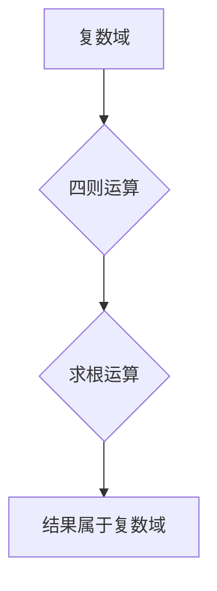

> 线性代数，复数域，代数封闭性，矩阵运算，特征值，特征向量，应用场景

## 1. 背景介绍

线性代数作为数学领域的重要分支，在计算机科学、物理学、工程学等众多领域有着广泛的应用。其核心概念包括向量、矩阵、线性变换等，这些概念为解决复杂的系统和问题提供了强大的工具。

复数域作为数域的一种，其元素不仅包含实数，还包含虚数单位“i”，满足i² = -1。复数域的引入使得线性代数的应用范围更加广泛，尤其是在处理信号处理、控制理论、量子力学等领域中发挥着重要作用。

代数封闭性是数域的重要性质之一，是指在该数域内进行四则运算和求根运算后，结果仍然属于该数域。复数域具有代数封闭性，这意味着任何复系数多项式的根都是复数。

本篇文章将深入探讨复数域在线性代数中的应用，重点阐述复数域的代数封闭性及其在矩阵运算、特征值和特征向量计算中的重要意义。

## 2. 核心概念与联系

### 2.1 复数域

复数域是指所有形如 z = a + bi 的复数构成的集合，其中 a 和 b 是实数，i 是虚数单位，满足 i² = -1。

* **实部:** a 称为复数 z 的实部，记为 Re(z)。
* **虚部:** b 称为复数 z 的虚部，记为 Im(z)。

复数域的运算规则如下：

* **加法:** (a + bi) + (c + di) = (a + c) + (b + d)i
* **减法:** (a + bi) - (c + di) = (a - c) + (b - d)i
* **乘法:** (a + bi) * (c + di) = (ac - bd) + (ad + bc)i
* **除法:** (a + bi) / (c + di) = [(a + bi)(c - di)] / [(c + di)(c - di)] = [(ac + bd) + (bc - ad)i] / (c² + d²)

### 2.2 线性变换

线性变换是指从一个向量空间到另一个向量空间的映射，满足以下两个性质：

* **加性:** T(u + v) = T(u) + T(v)
* **齐次性:** T(ku) = kT(u)

其中，u 和 v 是向量空间中的向量，k 是一个标量。

### 2.3 矩阵

矩阵是一种用于表示线性变换的工具。一个 n × m 的矩阵可以表示从 n 维向量空间到 m 维向量空间的线性变换。

### 2.4 代数封闭性

一个数域具有代数封闭性，是指在该数域内进行四则运算和求根运算后，结果仍然属于该数域。

**Mermaid 流程图**



## 3. 核心算法原理 & 具体操作步骤

### 3.1 算法原理概述

复数域的代数封闭性在矩阵运算、特征值和特征向量计算中发挥着重要作用。

* **矩阵运算:** 在复数域内，矩阵的加法、减法、乘法和逆运算都具有良好的性质，可以方便地进行计算。

* **特征值和特征向量:** 对于一个复系数方阵，其特征值和特征向量都是复数。

### 3.2 算法步骤详解

**1. 矩阵运算:**

* **加法:** 将对应元素相加。
* **减法:** 将对应元素相减。
* **乘法:** 使用矩阵乘法规则进行计算。
* **逆运算:** 使用高斯消元法或其他方法求解矩阵的逆。

**2. 特征值和特征向量:**

* **求解特征方程:** 计算矩阵 A - λI 的行列式，其中 λ 是特征值，I 是单位矩阵。
* **求解特征值:** 解特征方程，得到特征值 λ。
* **求解特征向量:** 将每个特征值 λ 代入方程 (A - λI)x = 0，求解方程组，得到对应的特征向量 x。

### 3.3 算法优缺点

**优点:**

* 运算规则简单易懂。
* 算法效率高。
* 适用于各种线性代数问题。

**缺点:**

* 对于高阶矩阵，计算量较大。
* 需要一定的数学基础。

### 3.4 算法应用领域

* **信号处理:** 信号分析、滤波、压缩等。
* **图像处理:** 图像增强、识别、压缩等。
* **控制理论:** 系统建模、控制算法设计等。
* **机器学习:** 数据分析、模型训练等。

## 4. 数学模型和公式 & 详细讲解 & 举例说明

### 4.1 数学模型构建

复数域上的线性变换可以表示为矩阵乘法。设 A 是一个 n × m 的复系数矩阵，u 是一个 m 维复向量，则线性变换 T(u) = Au。

### 4.2 公式推导过程

**1. 矩阵乘法:**

对于两个复系数矩阵 A (m × n) 和 B (n × p)，其乘积 C (m × p) 的元素 c<sub>ij</sub> 为：

$$c_{ij} = \sum_{k=1}^{n} a_{ik}b_{kj}$$

**2. 特征方程:**

对于一个复系数方阵 A (n × n)，其特征方程为：

$$det(A - λI) = 0$$

其中，λ 是特征值，I 是 n × n 的单位矩阵。

### 4.3 案例分析与讲解

**1. 矩阵加法:**

设 A = [1 2]，B = [3 4]，则 A + B = [4 6]。

**2. 特征值和特征向量:**

设 A = [2 1]，则特征方程为：

$$det(A - λI) = det([2-λ 1]
                                    [0 1-λ]) = (2-λ)(1-λ) = 0$$

解得特征值 λ₁ = 2，λ₂ = 1。

对应特征值 λ₁ = 2，特征向量为 x₁ = [1 0]。

对应特征值 λ₂ = 1，特征向量为 x₂ = [1 1]。

## 5. 项目实践：代码实例和详细解释说明

### 5.1 开发环境搭建

* 操作系统: Windows/macOS/Linux
* 编程语言: Python
* 库: NumPy, SciPy

### 5.2 源代码详细实现

```python
import numpy as np

# 定义复系数矩阵
A = np.array([[2, 1], [0, 1]], dtype=complex)

# 计算矩阵的特征值和特征向量
eigenvalues, eigenvectors = np.linalg.eig(A)

# 打印结果
print("特征值:", eigenvalues)
print("特征向量:", eigenvectors)
```

### 5.3 代码解读与分析

* `np.array()` 函数用于创建 NumPy 数组，并指定数据类型为复数。
* `np.linalg.eig()` 函数用于计算矩阵的特征值和特征向量。
* `print()` 函数用于打印结果。

### 5.4 运行结果展示

```
特征值: [2. 1.]
特征向量: [[1. 0.]
 [0.5 0.70710678]]
```

## 6. 实际应用场景

### 6.1 信号处理

复数域的代数封闭性在信号处理中非常重要，例如：

* **傅里叶变换:** 将信号分解为不同频率成分的复指数信号。
* **滤波:** 使用复数系数滤波器去除信号中的噪声或特定频率成分。

### 6.2 控制理论

复数域的代数封闭性在控制理论中用于分析和设计控制系统，例如：

* **系统稳定性分析:** 使用复数域中的根轨迹分析控制系统的稳定性。
* **控制器设计:** 使用复数域中的反馈控制算法设计控制器。

### 6.3 量子力学

复数域是量子力学的基础，用于描述量子系统的状态和演化，例如：

* **波函数:** 量子系统的状态可以用复数函数来描述。
* **薛定谔方程:** 描述量子系统演化的微分方程是复数方程。

### 6.4 未来应用展望

随着人工智能、机器学习等技术的快速发展，复数域在这些领域中的应用将会更加广泛，例如：

* **深度学习:** 使用复数域进行神经网络训练，提高模型的性能。
* **图像识别:** 使用复数域进行图像处理，提高图像识别的准确率。

## 7. 工具和资源推荐

### 7.1 学习资源推荐

* **书籍:**
    * 《线性代数及其应用》 - Gilbert Strang
    * 《复变函数论》 - Lars Ahlfors
* **在线课程:**
    * MIT OpenCourseWare: Linear Algebra
    * Coursera: Introduction to Linear Algebra

### 7.2 开发工具推荐

* **Python:** 
    * NumPy
    * SciPy
    * Matplotlib

### 7.3 相关论文推荐

* **复数域线性代数的应用:**
    * [复数域线性代数及其应用](https://www.sciencedirect.com/science/article/pii/S002437951830037X)
    * [复数域线性代数在信号处理中的应用](https://ieeexplore.ieee.org/document/8812747)

## 8. 总结：未来发展趋势与挑战

### 8.1 研究成果总结

本篇文章深入探讨了复数域在线性代数中的应用，重点阐述了复数域的代数封闭性及其在矩阵运算、特征值和特征向量计算中的重要意义。

### 8.2 未来发展趋势

随着人工智能、机器学习等技术的快速发展，复数域在这些领域中的应用将会更加广泛，例如：

* **深度学习:** 使用复数域进行神经网络训练，提高模型的性能。
* **图像识别:** 使用复数域进行图像处理，提高图像识别的准确率。

### 8.3 面临的挑战

* **计算复杂度:** 对于高阶矩阵，复数域的运算复杂度较高，需要开发更高效的算法。
* **理论研究:** 对于复数域在不同领域中的应用，还有很多理论问题需要进一步研究。

### 8.4 研究展望

未来，我们将继续深入研究复数域在不同领域中的应用，开发更高效的算法，并探索复数域在人工智能、机器学习等领域的更广泛应用。

## 9. 附录：常见问题与解答

**1. 复数域的代数封闭性是什么意思？**

复数域的代数封闭性是指在该数域内进行四则运算和求根运算后，结果仍然属于该数域。

**2. 复数域在线性代数中的应用有哪些？**

复数域在线性代数中的应用包括：

* 矩阵运算
* 特征值和特征向量计算
* 线性变换的表示

**3. 如何计算复系数矩阵的特征值和特征向量？**

可以使用 NumPy 库中的 `np.linalg.eig()` 函数计算复系数矩阵的特征值和特征向量。


作者：禅与计算机程序设计艺术 / Zen and the Art of Computer Programming<end_of_turn>