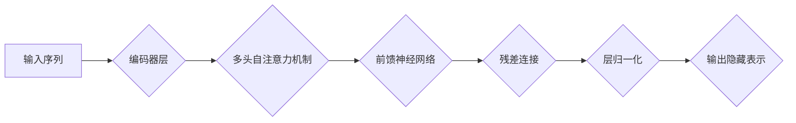

> 编码器、Transformer、位置编码、自注意力机制、自然语言处理

## 1. 背景介绍

自然语言处理 (NLP) 领域近年来取得了显著进展，其中 Transformer 架构扮演着至关重要的角色。Transformer 模型的核心在于其自注意力机制，能够捕捉文本序列中单词之间的长距离依赖关系。然而，Transformer 模型在处理序列数据时面临一个关键挑战：如何对单词在序列中的位置信息进行编码。

传统的循环神经网络 (RNN) 可以通过其隐状态自然地学习单词的顺序信息。然而，RNN 存在训练速度慢、长序列梯度消失等问题。Transformer 模型摒弃了 RNN 的循环结构，而是通过位置编码将单词的位置信息编码到输入向量中，从而能够有效地处理长序列数据。

## 2. 核心概念与联系

### 2.1 编码器

编码器是 Transformer 模型的核心组件之一，负责将输入序列映射到一个隐藏表示空间。编码器由多个相同的编码器层组成，每个编码器层包含以下模块：

* **多头自注意力机制 (Multi-Head Self-Attention)**：捕捉序列中单词之间的关系，学习单词之间的依赖关系。
* **前馈神经网络 (Feed-Forward Network)**：对每个单词的隐藏表示进行非线性变换，进一步提取语义信息。
* **残差连接 (Residual Connection)**：缓解梯度消失问题，提高模型训练的稳定性。
* **层归一化 (Layer Normalization)**：规范化每个层的输出，加速模型训练。

### 2.2 位置编码

位置编码是 Transformer 模型中解决单词顺序问题的重要机制。由于 Transformer 模型没有循环结构，无法像 RNN 一样自然地学习单词的顺序信息。因此，需要通过位置编码将单词在序列中的位置信息编码到输入向量中。

### 2.3 Mermaid 流程图



## 3. 核心算法原理 & 具体操作步骤

### 3.1 算法原理概述

位置编码的原理是将每个单词的索引映射到一个特定的向量，这个向量包含了单词在序列中的位置信息。常用的位置编码方法包括：

* **绝对位置编码**: 每个位置都有一个固定的向量表示，例如 sinusoidal 函数。
* **相对位置编码**: 编码单词之间的相对位置信息，而不是绝对位置信息。

### 3.2 算法步骤详解

**1. 确定位置编码的维度**: 位置编码的维度通常与词嵌入的维度相同。

**2. 选择位置编码方法**: 根据实际应用场景选择合适的绝对位置编码或相对位置编码方法。

**3. 生成位置编码向量**: 根据选择的编码方法，生成每个位置的编码向量。

**4. 将位置编码添加到词嵌入**: 将每个单词的词嵌入向量与对应的位置编码向量相加，得到最终的输入向量。

### 3.3 算法优缺点

**优点**:

* 能够有效地捕捉单词在序列中的位置信息。
* 不依赖于循环结构，能够处理长序列数据。

**缺点**:

* 位置编码的维度需要与词嵌入的维度相同，这可能会增加模型的内存占用。
* 对于非常长的序列，位置编码的表达能力可能不足。

### 3.4 算法应用领域

位置编码在 Transformer 模型的各种应用领域中都发挥着重要作用，例如：

* **机器翻译**: 捕捉源语言和目标语言中单词的相对位置信息，提高翻译质量。
* **文本摘要**: 识别重要信息和关键句子的位置，生成高质量的文本摘要。
* **问答系统**: 理解问题和答案之间的关系，提高问答系统的准确率。

## 4. 数学模型和公式 & 详细讲解 & 举例说明

### 4.1 数学模型构建

假设我们有一个长度为 $T$ 的输入序列，每个单词都对应一个词嵌入向量 $x_i \in \mathbb{R}^d$，其中 $d$ 是词嵌入的维度。位置编码的目标是为每个单词生成一个位置向量 $p_i \in \mathbb{R}^d$，并将位置向量添加到词嵌入向量中，得到最终的输入向量 $h_i \in \mathbb{R}^d$：

$$h_i = x_i + p_i$$

### 4.2 公式推导过程

**绝对位置编码**:

可以使用 sinusoidal 函数生成位置编码向量：

$$p_i^j = sin(\frac{i}{10000^{2j/d}})$$

$$p_i^j = cos(\frac{i}{10000^{2j/d}})$$

其中 $j$ 是位置编码向量的维度，$i$ 是单词的索引。

**相对位置编码**:

可以使用矩阵运算来生成相对位置编码向量。假设我们有一个 $d \times d$ 的矩阵 $W_r$，可以用来计算两个单词之间的相对位置编码向量。

$$r_{ij} = W_r \cdot [x_i, x_j]$$

其中 $r_{ij}$ 是单词 $i$ 和单词 $j$ 之间的相对位置编码向量。

### 4.3 案例分析与讲解

**绝对位置编码**:

假设我们有一个长度为 5 的输入序列，每个单词的词嵌入维度为 128。我们可以使用 sinusoidal 函数生成 128 维的位置编码向量，每个位置都有一个唯一的向量表示。

**相对位置编码**:

假设我们有两个单词，它们的词嵌入向量分别为 $x_1$ 和 $x_2$。我们可以使用一个 $128 \times 128$ 的矩阵 $W_r$ 计算它们之间的相对位置编码向量 $r_{12}$。

## 5. 项目实践：代码实例和详细解释说明

### 5.1 开发环境搭建

* Python 3.6+
* PyTorch 1.0+
* CUDA 10.0+ (可选)

### 5.2 源代码详细实现

```python
import torch
import torch.nn as nn

class PositionalEncoding(nn.Module):
    def __init__(self, d_model, dropout=0.1, max_len=5000):
        super(PositionalEncoding, self).__init__()
        self.dropout = nn.Dropout(p=dropout)

        pe = torch.zeros(max_len, d_model)
        position = torch.arange(0, max_len, dtype=torch.float).unsqueeze(1)
        div_term = torch.exp(torch.arange(0, d_model, 2).float() * (-math.log(10000.0) / d_model))
        pe[:, 0::2] = torch.sin(position * div_term)
        pe[:, 1::2] = torch.cos(position * div_term)
        pe = pe.unsqueeze(0).transpose(0, 1)
        self.register_buffer('pe', pe)

    def forward(self, x):
        x = x + self.pe[:x.size(0), :]
        return self.dropout(x)

```

### 5.3 代码解读与分析

* `PositionalEncoding` 类定义了位置编码模块。
* `__init__` 方法初始化模块参数，包括词嵌入维度 `d_model`、dropout 率 `dropout` 和最大序列长度 `max_len`。
* `pe` 变量存储了预先计算好的位置编码向量。
* `forward` 方法将位置编码向量添加到输入向量中，并应用 dropout 层。

### 5.4 运行结果展示

运行上述代码，可以生成位置编码向量，并将其添加到词嵌入向量中。

## 6. 实际应用场景

### 6.1 机器翻译

在机器翻译任务中，位置编码可以帮助模型捕捉源语言和目标语言中单词之间的相对位置信息，提高翻译质量。例如，在翻译句子 "The cat sat on the mat" 时，位置编码可以帮助模型理解 "cat" 和 "sat" 之间的动宾关系，以及 "sat" 和 "mat" 之间的动作地点关系。

### 6.2 文本摘要

在文本摘要任务中，位置编码可以帮助模型识别重要信息和关键句子的位置，生成高质量的文本摘要。例如，在生成新闻摘要时，位置编码可以帮助模型识别标题、重要事件和结论等关键信息。

### 6.3 问答系统

在问答系统中，位置编码可以帮助模型理解问题和答案之间的关系，提高问答系统的准确率。例如，在回答 "What is the capital of France?" 时，位置编码可以帮助模型识别 "capital" 和 "France" 之间的语义关系。

### 6.4 未来应用展望

随着 Transformer 模型的不断发展，位置编码将在更多 NLP 应用领域发挥重要作用。例如，在对话系统、文本生成、代码生成等领域，位置编码可以帮助模型更好地理解上下文信息，生成更自然、更流畅的文本。

## 7. 工具和资源推荐

### 7.1 学习资源推荐

* **Transformer 论文**: https://arxiv.org/abs/1706.03762
* **Hugging Face Transformers 库**: https://huggingface.co/transformers/
* **Deep Learning Specialization**: https://www.deeplearning.ai/

### 7.2 开发工具推荐

* **PyTorch**: https://pytorch.org/
* **TensorFlow**: https://www.tensorflow.org/

### 7.3 相关论文推荐

* **BERT**: https://arxiv.org/abs/1810.04805
* **GPT-3**: https://openai.com/blog/gpt-3/
* **T5**: https://arxiv.org/abs/1910.10683

## 8. 总结：未来发展趋势与挑战

### 8.1 研究成果总结

位置编码是 Transformer 模型中解决单词顺序问题的重要机制，它能够有效地捕捉单词在序列中的位置信息，提高模型的性能。

### 8.2 未来发展趋势

* **更有效的相对位置编码**: 探索更有效的相对位置编码方法，提高模型对长序列数据的处理能力。
* **自适应位置编码**: 研究自适应位置编码方法，根据不同的任务和数据自动学习最佳位置编码。
* **跨模态位置编码**: 将位置编码扩展到跨模态任务，例如图像和文本的联合理解。

### 8.3 面临的挑战

* **位置编码的表达能力**: 对于非常长的序列，位置编码的表达能力可能不足。
* **位置编码的计算复杂度**: 一些位置编码方法的计算复杂度较高，可能会影响模型的训练速度。
* **位置编码的可解释性**: 位置编码的机制相对复杂，其对模型性能的影响机制尚待深入研究。

### 8.4 研究展望

未来，位置编码的研究将继续朝着更有效、更灵活、更可解释的方向发展。随着 Transformer 模型的不断发展，位置编码将继续发挥重要作用，推动 NLP 领域的进步。

## 9. 附录：常见问题与解答

**1. 为什么需要位置编码？**

Transformer 模型没有循环结构，无法像 RNN 一样自然地学习单词的顺序信息。位置编码的作用是将单词在序列中的位置信息编码到输入向量中，帮助模型理解单词的顺序关系。

**2. 常见的绝对位置编码方法有哪些？**

常见的绝对位置编码方法包括 sinusoidal 函数和 Learned Positional Embeddings。

**3. 常见的相对位置编码方法有哪些？**

常见的相对位置编码方法包括 Relative Positional Encodings 和 Rotated Positional Encodings。

**4. 如何选择合适的绝对位置编码或相对位置编码方法？**

选择合适的编码方法取决于具体的应用场景和数据特点。例如，对于短序列数据，绝对位置编码可能效果较好；而对于长序列数据，相对位置编码可能更有效。

**5. 位置编码的维度应该与词嵌入的维度相同吗？**

是的，位置编码的维度通常与词嵌入的维度相同，这样可以保证位置信息和词义信息在同一个向量空间中进行表达。


作者：禅与计算机程序