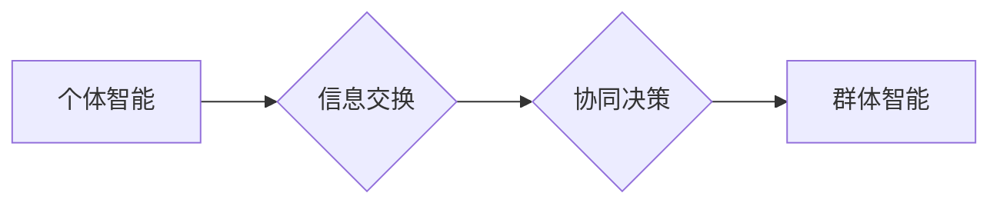

>群体智慧，协同决策，人工智能，机器学习，优化算法，分布式计算，大数据分析

## 1. 背景介绍

在当今数据爆炸和计算能力飞速发展的时代，传统的决策模式面临着越来越大的挑战。单一决策者往往难以处理海量数据和复杂问题，而群体智慧则为解决这一难题提供了新的思路。群体智慧是指由多个个体协同决策而产生的智能，其决策结果往往优于任何单个个体的决策。

群体智慧的概念源于自然界中蜂群、鸟群等群体行为的观察。这些群体通过简单的规则和信息交换，能够实现复杂的协同行为，例如寻觅食物、避开危险、迁徙等。人类社会也存在着许多群体智慧的例子，例如市场预测、科学发现、艺术创作等。

近年来，随着人工智能、机器学习等技术的快速发展，群体智慧的研究取得了显著进展。科学家们开发了各种群体智慧算法，并将其应用于各个领域，例如金融、医疗、交通、能源等。

## 2. 核心概念与联系

群体智慧的核心概念包括：

* **个体智能:** 每个个体都拥有基本的智能和决策能力。
* **信息交换:** 个体之间能够交换信息，分享知识和经验。
* **协同决策:** 个体根据信息交换的结果，共同做出决策。
* **群体智能:** 群体整体的智能水平高于任何单个个体。

群体智慧的实现需要以下关键要素：

* **个体多样性:** 个体之间拥有不同的知识、经验和观点，能够提供更全面的信息和更有效的决策方案。
* **信息共享机制:** 个体之间能够高效地共享信息，避免重复劳动和信息孤岛。
* **协同决策算法:** 能够有效地整合个体决策，并产生更优的群体决策结果。

**Mermaid 流程图**



## 3. 核心算法原理 & 具体操作步骤

### 3.1  算法原理概述

群体智慧算法通常基于以下原理：

* **启发式搜索:** 通过启发式规则，引导个体探索决策空间，并逐步逼近最优解。
* **模拟退火:** 从一个初始状态开始，逐步降低温度，允许个体接受一些次优解，最终收敛到一个局部最优解。
* **遗传算法:** 通过模拟自然选择和遗传机制，不断优化个体，并产生更优的群体决策结果。

### 3.2  算法步骤详解

以遗传算法为例，其具体操作步骤如下：

1. **初始化种群:** 创建一个初始的个体群体，每个个体代表一个决策方案。
2. **评估适应度:** 计算每个个体的适应度，即其决策方案的优劣程度。
3. **选择个体:** 根据适应度，选择部分个体进行繁殖。
4. **交叉操作:** 将选中的个体进行交叉操作，产生新的个体。
5. **变异操作:** 对新的个体进行变异操作，增加个体多样性。
6. **更新种群:** 将新的个体加入种群，并重复上述步骤，直到达到终止条件。

### 3.3  算法优缺点

**优点:**

* 能够处理复杂、多变量的决策问题。
* 不需要明确的优化目标函数。
* 能够找到全局最优解或局部最优解。

**缺点:**

* 计算复杂度较高。
* 算法参数的选择对结果影响较大。
* 难以保证算法收敛到全局最优解。

### 3.4  算法应用领域

群体智慧算法广泛应用于以下领域：

* **金融投资:** 股票预测、风险管理、资产配置等。
* **医疗诊断:** 疾病诊断、药物研发、个性化治疗等。
* **交通运输:** 路线规划、交通流量控制、智能驾驶等。
* **能源管理:** 能源调度、电力预测、节能减排等。

## 4. 数学模型和公式 & 详细讲解 & 举例说明

### 4.1  数学模型构建

群体智慧算法的数学模型通常基于以下几个方面：

* **个体状态:** 用向量或矩阵表示个体的决策方案或特征。
* **适应度函数:** 用数学函数表示个体决策方案的优劣程度。
* **信息交换机制:** 用概率分布或规则描述个体之间信息交换的方式。
* **协同决策规则:** 用数学公式描述个体如何根据信息交换结果进行决策。

### 4.2  公式推导过程

以遗传算法为例，其适应度函数可以定义为：

$$
f(x) = \sum_{i=1}^{n} w_i \cdot g_i(x)
$$

其中：

* $f(x)$ 是个体 $x$ 的适应度。
* $w_i$ 是第 $i$ 个目标函数的权重。
* $g_i(x)$ 是第 $i$ 个目标函数的值。

### 4.3  案例分析与讲解

假设我们要用遗传算法优化一个函数 $f(x) = x^2$，目标是找到最小值。

1. **初始化种群:** 创建一个包含 10 个个体的种群，每个个体的初始值随机生成。
2. **评估适应度:** 计算每个个体的适应度，即其函数值 $f(x)$。
3. **选择个体:** 根据适应度，选择适应度最高的个体进行繁殖。
4. **交叉操作:** 将选中的个体进行交叉操作，产生新的个体。
5. **变异操作:** 对新的个体进行变异操作，增加个体多样性。
6. **更新种群:** 将新的个体加入种群，并重复上述步骤，直到达到终止条件。

通过迭代优化，遗传算法最终会找到函数 $f(x) = x^2$ 的最小值，即 $x = 0$。

## 5. 项目实践：代码实例和详细解释说明

### 5.1  开发环境搭建

本项目使用 Python 语言进行开发，所需的库包括：

* NumPy: 用于数值计算。
* matplotlib: 用于数据可视化。

### 5.2  源代码详细实现

```python
import numpy as np
import matplotlib.pyplot as plt

# 定义适应度函数
def fitness_function(x):
    return x**2

# 定义遗传算法
def genetic_algorithm(population_size, generations, mutation_rate):
    # 初始化种群
    population = np.random.rand(population_size)

    # 迭代优化
    for generation in range(generations):
        # 评估适应度
        fitness_values = fitness_function(population)

        # 选择个体
        selected_indices = np.argsort(fitness_values)[:population_size // 2]
        selected_population = population[selected_indices]

        # 交叉操作
        offspring = np.zeros_like(selected_population)
        for i in range(0, population_size // 2, 2):
            crossover_point = np.random.randint(1, len(selected_population[0]) - 1)
            offspring[i] = np.concatenate((selected_population[i][:crossover_point], selected_population[i + 1][crossover_point:]))
            offspring[i + 1] = np.concatenate((selected_population[i + 1][:crossover_point], selected_population[i][crossover_point:]))

        # 变异操作
        for i in range(population_size):
            if np.random.rand() < mutation_rate:
                mutation_index = np.random.randint(len(offspring[i]))
                offspring[i][mutation_index] = np.random.rand()

        # 更新种群
        population = offspring

    # 返回最优解
    return population[np.argmin(fitness_function(population))]

# 设置参数
population_size = 100
generations = 100
mutation_rate = 0.1

# 执行遗传算法
best_solution = genetic_algorithm(population_size, generations, mutation_rate)

# 打印结果
print(f"最佳解: {best_solution}")

# 可视化结果
plt.plot(fitness_function(population))
plt.xlabel("Generation")
plt.ylabel("Fitness")
plt.title("Genetic Algorithm Optimization")
plt.show()
```

### 5.3  代码解读与分析

这段代码实现了遗传算法的原理，并通过一个简单的函数优化案例进行了演示。

* **适应度函数:** `fitness_function(x)` 定义了目标函数，即需要优化的函数。
* **遗传算法函数:** `genetic_algorithm(population_size, generations, mutation_rate)` 实现遗传算法的核心逻辑，包括初始化种群、评估适应度、选择个体、交叉操作、变异操作和更新种群。
* **参数设置:** `population_size`, `generations`, `mutation_rate` 分别设置了种群大小、迭代次数和变异概率。
* **结果输出:** 代码打印了最佳解，并绘制了适应度随迭代次数变化的曲线。

### 5.4  运行结果展示

运行代码后，会输出最佳解，并显示适应度随迭代次数变化的曲线。曲线会逐渐下降，表明算法正在不断优化目标函数。

## 6. 实际应用场景

群体智慧算法在各个领域都有着广泛的应用场景：

### 6.1  金融投资

* **股票预测:** 利用市场数据和投资者行为，预测股票价格走势。
* **风险管理:** 分析投资组合的风险，并制定相应的风险控制策略。
* **资产配置:** 根据投资者风险偏好和投资目标，优化资产配置方案。

### 6.2  医疗诊断

* **疾病诊断:** 基于患者症状、检查结果和医学知识库，辅助医生诊断疾病。
* **药物研发:** 利用生物信息学数据和机器学习算法，加速药物研发过程。
* **个性化治疗:** 根据患者基因信息和病史，制定个性化的治疗方案。

### 6.3  交通运输

* **路线规划:** 根据实时交通状况和用户需求，规划最优路线。
* **交通流量控制:** 利用智能交通信号灯和车辆通信技术，优化交通流量。
* **智能驾驶:** 利用传感器数据和机器学习算法，实现车辆自动驾驶。

### 6.4  能源管理

* **能源调度:** 根据供需情况和能源价格，优化能源调度方案。
* **电力预测:** 利用历史数据和天气预报，预测电力需求。
* **节能减排:** 利用智能控制系统和数据分析，提高能源利用效率。

## 7. 工具和资源推荐

### 7.1  学习资源推荐

* **书籍:**
    * 《群体智慧》
    * 《人工智能：现代方法》
    * 《机器学习》
* **在线课程:**
    * Coursera: 人工智能、机器学习课程
    * edX: 群体智慧、数据科学课程

### 7.2  开发工具推荐

* **Python:** 广泛应用于人工智能和机器学习开发。
* **NumPy:** 用于数值计算。
* **Scikit-learn:** 机器学习库。
* **TensorFlow:** 深度学习框架。

### 7.3  相关论文推荐

* **《群体智慧：概念、算法和应用》**
* **《遗传算法原理与应用》**
* **《模拟退火算法及其应用》**

## 8. 总结：未来发展趋势与挑战

### 8.1  研究成果总结

群体智慧研究取得了显著进展，为解决复杂决策问题提供了新的思路和方法。

### 8.2  未来发展趋势

* **更智能的群体智慧算法:** 开发更智能、更鲁棒的群体智慧算法，能够处理更复杂、更动态的决策问题。
* **更广泛的应用场景:** 将群体智慧算法应用于更多领域，例如社会治理、环境保护、科学研究等。
* **更强大的计算能力:** 利用云计算、大数据分析等技术，为群体智慧算法提供