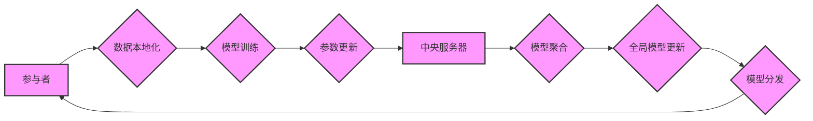

> 联邦学习，激励机制，安全隐私，数据本地化，信任问题，经济模型

## 1. 背景介绍

联邦学习（Federated Learning，FL）作为一种分布式机器学习方法，在保护数据隐私和安全方面具有显著优势。它允许模型训练在数据分散的设备上进行，无需将原始数据传输到中央服务器，从而有效缓解了数据泄露和隐私侵犯的风险。然而，FL也面临着一些挑战，其中之一就是如何激励参与者积极参与训练过程。

传统的集中式机器学习模型训练中，参与者通常是数据拥有者，他们将数据提供给训练平台，并获得相应的收益。但在FL中，数据被本地化在各个设备上，参与者难以直接获得训练收益。因此，设计有效的激励机制至关重要，以鼓励参与者共享数据和参与训练，从而保证FL系统的稳定性和效率。

## 2. 核心概念与联系

**2.1 联邦学习核心概念**

* **数据本地化:** 数据存储在各个参与者的设备上，不会被传输到中央服务器。
* **模型参数更新:** 参与者在本地训练模型，并仅将模型参数更新发送到中央服务器。
* **全局模型更新:** 中央服务器聚合所有参与者的参数更新，并生成全局模型。
* **模型分发:** 中央服务器将更新后的全局模型分发给所有参与者。

**2.2 FL激励机制设计联系**

激励机制的设计需要考虑以下几个方面：

* **参与者激励:** 如何激励参与者积极参与训练过程，并提供高质量的数据。
* **公平性:** 确保所有参与者都能获得公平的收益，避免某些参与者过度受益。
* **安全性:** 保证激励机制本身的安全性和可靠性，防止恶意参与者攻击系统。
* **可扩展性:** 能够适应不同规模的FL系统，并支持多种类型的参与者。

**2.3 FL激励机制设计流程图**



## 3. 核心算法原理 & 具体操作步骤

**3.1 算法原理概述**

联邦学习中的激励机制设计通常基于经济模型，例如拍卖机制、分红机制、积分机制等。这些机制旨在通过提供奖励或惩罚来引导参与者行为，使其更倾向于积极参与训练过程。

**3.2 算法步骤详解**

1. **参与者注册:** 参与者需要注册并提供必要的身份信息，以便参与FL系统。
2. **数据分片:** 数据被分割成多个片段，并分配给不同的参与者。
3. **模型训练:** 参与者在本地训练模型，并根据训练结果生成参数更新。
4. **参数更新提交:** 参与者将参数更新提交到中央服务器。
5. **模型聚合:** 中央服务器聚合所有参与者的参数更新，并生成全局模型。
6. **模型分发:** 中央服务器将更新后的全局模型分发给所有参与者。
7. **激励机制执行:** 根据参与者的贡献和行为，中央服务器分配奖励或惩罚。

**3.3 算法优缺点**

* **优点:**

    * 可以有效激励参与者积极参与训练过程。
    * 可以提高FL系统的训练效率和模型性能。
    * 可以促进数据共享和协作。

* **缺点:**

    * 设计复杂的激励机制需要大量的计算资源和时间。
    * 需要考虑公平性、安全性等问题。
    * 难以应对恶意参与者的攻击。

**3.4 算法应用领域**

* **医疗保健:** 利用患者数据训练疾病诊断模型，保护患者隐私。
* **金融服务:** 利用客户数据训练欺诈检测模型，提高金融安全。
* **物联网:** 利用设备数据训练设备管理模型，提高设备效率。

## 4. 数学模型和公式 & 详细讲解 & 举例说明

**4.1 数学模型构建**

假设有N个参与者，每个参与者拥有一个数据片段，并根据模型训练结果生成参数更新。参与者的贡献可以根据参数更新的质量和数量进行评估。

**4.2 公式推导过程**

* 参与者i的贡献度：

$$C_i = \sum_{j=1}^{M} w_j \cdot \Delta \theta_{ij}$$

其中：

* $C_i$：参与者i的贡献度
* $M$：参数更新的数量
* $w_j$：每个参数更新的权重
* $\Delta \theta_{ij}$：参与者i在第j个参数更新的贡献

* 参与者i的奖励：

$$R_i = \alpha \cdot C_i + \beta \cdot S_i$$

其中：

* $R_i$：参与者i的奖励
* $\alpha$：贡献度的权重
* $\beta$：参与度的权重
* $S_i$：参与者i的参与度

**4.3 案例分析与讲解**

假设有三个参与者，每个参与者训练一个模型，并生成一个参数更新。每个参数更新的权重为1，参与度的权重为0.2。

参与者1的贡献度为：

$$C_1 = 1 \cdot \Delta \theta_{11} + 1 \cdot \Delta \theta_{12} + 1 \cdot \Delta \theta_{13} $$

参与者2的贡献度为：

$$C_2 = 1 \cdot \Delta \theta_{21} + 1 \cdot \Delta \theta_{22} + 1 \cdot \Delta \theta_{23} $$

参与者3的贡献度为：

$$C_3 = 1 \cdot \Delta \theta_{31} + 1 \cdot \Delta \theta_{32} + 1 \cdot \Delta \theta_{33} $$

根据参与者的贡献度和参与度，中央服务器可以分配相应的奖励。

## 5. 项目实践：代码实例和详细解释说明

**5.1 开发环境搭建**

* Python 3.7+
* TensorFlow 2.0+
* PyTorch 1.0+

**5.2 源代码详细实现**

```python
# 参与者类
class Participant:
    def __init__(self, data, model):
        self.data = data
        self.model = model

    def train_model(self):
        # 在本地训练模型
        pass

    def update_parameters(self):
        # 生成参数更新
        pass

# 中央服务器类
class Server:
    def __init__(self):
        self.participants = []

    def register_participant(self, participant):
        self.participants.append(participant)

    def aggregate_parameters(self):
        # 聚合所有参与者的参数更新
        pass

    def distribute_model(self):
        # 分发更新后的全局模型
        pass

# 主程序
if __name__ == "__main__":
    # 创建参与者
    participants = [Participant(data1, model1), Participant(data2, model2), Participant(data3, model3)]

    # 创建中央服务器
    server = Server()

    # 注册参与者
    for participant in participants:
        server.register_participant(participant)

    # 启动训练过程
    for epoch in range(num_epochs):
        # 参与者训练模型
        for participant in participants:
            participant.train_model()

        # 参与者更新参数
        for participant in participants:
            participant.update_parameters()

        # 中央服务器聚合参数
        aggregated_parameters = server.aggregate_parameters()

        # 中央服务器分发模型
        server.distribute_model()
```

**5.3 代码解读与分析**

* 参与者类负责本地训练模型和生成参数更新。
* 中央服务器类负责注册参与者、聚合参数更新和分发全局模型。
* 主程序模拟了FL训练过程，包括参与者注册、模型训练、参数更新、聚合和分发。

**5.4 运行结果展示**

运行代码后，可以观察到模型在各个参与者的设备上进行训练，并最终生成一个全局模型。

## 6. 实际应用场景

**6.1 医疗保健**

* 利用患者电子健康记录训练疾病诊断模型，保护患者隐私。
* 利用患者健康数据训练个性化医疗方案，提高医疗效率。

**6.2 金融服务**

* 利用客户交易数据训练欺诈检测模型，提高金融安全。
* 利用客户信用数据训练信用评分模型，降低贷款风险。

**6.3 物联网**

* 利用设备传感器数据训练设备管理模型，提高设备效率。
* 利用设备运行数据训练设备故障预测模型，降低设备故障率。

**6.4 未来应用展望**

* 随着联邦学习技术的不断发展，其应用场景将更加广泛。
* 未来，联邦学习将被应用于更多领域，例如教育、交通、能源等。

## 7. 工具和资源推荐

**7.1 学习资源推荐**

* **论文:**

    * Federated Learning: Strategies for Improving Communication Efficiency
    * Federated Learning: Challenges, Methods, and Future Directions

* **书籍:**

    * Federated Learning: A Comprehensive Guide

* **在线课程:**

    * Coursera: Federated Learning Specialization

**7.2 开发工具推荐**

* **TensorFlow Federated:** https://www.tensorflow.org/federated
* **PySyft:** https://www.openmined.org/

**7.3 相关论文推荐**

* **Federated Learning: Collaborative Machine Learning Without Centralized Training Data**
* **Communication-Efficient Learning of Deep Networks from Decentralized Data**

## 8. 总结：未来发展趋势与挑战

**8.1 研究成果总结**

* 联邦学习在保护数据隐私和安全方面取得了显著进展。
* 各种激励机制设计方案不断涌现，有效提高了FL系统的效率和稳定性。

**8.2 未来发展趋势**

* **模型压缩和加速:** 降低模型大小和训练时间，提高FL系统的效率。
* **隐私保护增强:** 进一步提高数据隐私保护水平，应对新的安全威胁。
* **异构数据融合:** 处理不同类型和格式的数据，提高模型泛化能力。

**8.3 面临的挑战**

* **数据质量和分布不均匀:** 影响模型训练效果。
* **恶意参与者攻击:** 威胁FL系统的安全性和可靠性。
* **计算资源限制:** 限制FL系统的规模和应用范围。

**8.4 研究展望**

* 研究更有效的激励机制设计方案，提高参与者的积极性。
* 开发更鲁棒的FL系统，应对恶意参与者攻击。
* 探索新的应用场景，推动FL技术的广泛应用。

## 9. 附录：常见问题与解答

* **Q1: 联邦学习与集中式机器学习相比有什么优势？**

* **A1:** 联邦学习可以保护数据隐私和安全，避免数据泄露和滥用。

* **Q2: 联邦学习有哪些局限性？**

* **A2:** 联邦学习需要更多的计算资源和时间，并且难以应对数据质量和分布不均匀的问题。

* **Q3: 如何设计有效的激励机制？**

* **A3