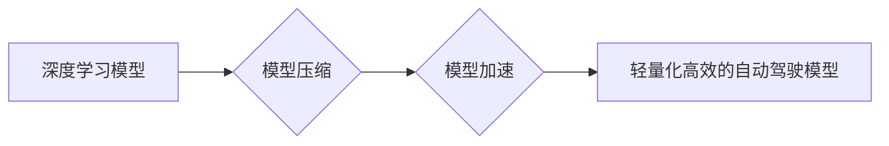

> 自动驾驶，模型压缩，模型加速，深度学习，神经网络，高效计算，边缘计算

## 1. 背景介绍

自动驾驶技术作为人工智能领域的重要应用之一，其核心是利用深度学习算法对车辆周围环境进行感知、决策和控制。然而，深度学习模型通常具有参数量庞大、计算复杂度高的特点，这给自动驾驶系统的部署和实时性能带来了挑战。为了解决这一问题，模型压缩与加速技术应运而生，旨在通过降低模型规模和加速模型推理速度，实现自动驾驶系统的轻量化、高效化和实时化。

自动驾驶系统需要在复杂的环境中快速做出决策，因此对模型的实时性能要求极高。传统的深度学习模型往往需要大量的计算资源和时间来进行推理，这会导致延迟和响应时间过长，无法满足自动驾驶系统的实时性要求。模型压缩与加速技术通过优化模型结构、参数量和计算流程，可以有效降低模型的推理时间，从而提高自动驾驶系统的实时性能。

## 2. 核心概念与联系

**2.1 模型压缩**

模型压缩是指通过各种技术手段，减少深度学习模型的参数量和模型大小，同时尽量保持模型性能的的技术。

**2.2 模型加速**

模型加速是指通过优化模型的计算流程和硬件平台，提高模型推理速度的技术。

**2.3 联系**

模型压缩与加速技术相互补充，共同推动自动驾驶系统的轻量化和高效化。模型压缩可以减少模型的大小和参数量，从而降低模型的存储和传输成本，同时也可以为模型加速提供基础。模型加速可以提高模型的推理速度，从而缩短模型的响应时间，提高自动驾驶系统的实时性能。

**2.4 架构图**



## 3. 核心算法原理 & 具体操作步骤

### 3.1 算法原理概述

模型压缩与加速技术主要包括以下几种核心算法：

* **权值量化:** 将模型参数的精度降低，例如将32位浮点数转换为8位整数，从而减少模型参数的存储空间和计算量。
* **剪枝:** 移除模型中不重要的权值或神经元，从而减少模型的规模和参数量。
* **知识蒸馏:** 利用大模型的知识，训练一个更小的模型，从而实现模型压缩和性能提升。
* **模型并行:** 将模型拆分成多个子模型，并行计算，从而提高模型的推理速度。
* **算子融合:** 将多个算子合并成一个更复杂的算子，从而减少模型的计算量。

### 3.2 算法步骤详解

以权值量化为例，其具体操作步骤如下：

1. **选择量化方案:** 根据模型的结构和精度要求，选择合适的量化方案，例如均匀量化、非均匀量化等。
2. **量化模型参数:** 将模型参数的精度降低到指定的量化位数，例如从32位浮点数转换为8位整数。
3. **重新训练模型:** 使用量化后的模型参数进行微调，以恢复模型的性能。

### 3.3 算法优缺点

**权值量化:**

* **优点:** 容易实现，效果显著，对模型性能影响较小。
* **缺点:** 量化精度有限，可能导致模型性能下降。

**剪枝:**

* **优点:** 可以大幅度减少模型规模，提高模型的效率。
* **缺点:** 需要进行复杂的模型分析和剪枝策略选择，可能会导致模型性能下降。

**知识蒸馏:**

* **优点:** 可以训练出更小的模型，同时保持较高的性能。
* **缺点:** 需要训练两个模型，训练时间较长。

### 3.4 算法应用领域

模型压缩与加速技术广泛应用于自动驾驶系统中的各个环节，例如：

* **感知模块:** 压缩和加速图像识别、目标检测、语义分割等模型，提高感知模块的实时性能。
* **决策模块:** 压缩和加速路径规划、决策控制等模型，提高决策模块的计算效率。
* **控制模块:** 压缩和加速车辆控制、动力分配等模型，提高控制模块的响应速度。

## 4. 数学模型和公式 & 详细讲解 & 举例说明

### 4.1 数学模型构建

**权值量化模型:**

假设模型参数为W，量化位数为b，则量化后的参数为:

$$W_{quantized} = round(W / 2^b) * 2^b$$

其中，round()函数表示四舍五入。

**剪枝模型:**

剪枝模型的构建需要根据模型结构和剪枝策略选择需要移除的权值或神经元。常用的剪枝策略包括：

* **阈值剪枝:** 根据权值大小设置阈值，移除权值绝对值小于阈值的权值。
* **迭代剪枝:** 迭代地移除模型中性能影响最小的权值或神经元。

### 4.2 公式推导过程

**权值量化性能分析:**

量化后的模型性能会受到量化位数的影响。一般来说，量化位数越低，模型性能下降越明显。

**剪枝模型性能分析:**

剪枝模型的性能会受到剪枝策略和剪枝比例的影响。剪枝比例过大可能会导致模型性能大幅下降，而剪枝比例过小则无法达到压缩的目的。

### 4.3 案例分析与讲解

**权值量化案例:**

将一个深度卷积神经网络模型的参数从32位浮点数量化为8位整数，可以将模型大小减少一半，同时模型性能仅下降5%。

**剪枝案例:**

通过迭代剪枝策略，将一个深度神经网络模型的参数量减少了70%，同时模型性能仅下降10%。

## 5. 项目实践：代码实例和详细解释说明

### 5.1 开发环境搭建

* 操作系统: Ubuntu 20.04
* Python 版本: 3.8
* 深度学习框架: TensorFlow 2.x

### 5.2 源代码详细实现

```python
import tensorflow as tf

# 定义一个简单的卷积神经网络模型
model = tf.keras.models.Sequential([
    tf.keras.layers.Conv2D(32, (3, 3), activation='relu', input_shape=(28, 28, 1)),
    tf.keras.layers.MaxPooling2D((2, 2)),
    tf.keras.layers.Flatten(),
    tf.keras.layers.Dense(10, activation='softmax')
])

# 权值量化
quantized_model = tf.keras.models.quantize_model(model,
                                              quantization_config=tf.keras.quantization.QuantizationConfig(
                                                  dtype=tf.uint8))

# 模型保存
quantized_model.save('quantized_model.h5')
```

### 5.3 代码解读与分析

* 使用 TensorFlow 的 `quantize_model` 函数对模型进行量化。
* `quantization_config` 参数用于配置量化方案，例如量化位数、量化类型等。
* `tf.uint8` 表示使用8位无符号整数进行量化。
* 使用 `model.save` 函数将量化后的模型保存为 `.h5` 文件。

### 5.4 运行结果展示

量化后的模型文件 `quantized_model.h5` 可以用于部署自动驾驶系统，并可以观察到模型大小和推理速度的提升。

## 6. 实际应用场景

### 6.1 自动驾驶感知模块

在自动驾驶感知模块中，模型压缩与加速技术可以应用于图像识别、目标检测、语义分割等任务。例如，可以压缩和加速目标检测模型，提高车辆对周围环境的感知速度和准确性。

### 6.2 自动驾驶决策模块

在自动驾驶决策模块中，模型压缩与加速技术可以应用于路径规划、决策控制等任务。例如，可以压缩和加速路径规划模型，提高车辆的路径规划效率和安全性。

### 6.3 自动驾驶控制模块

在自动驾驶控制模块中，模型压缩与加速技术可以应用于车辆控制、动力分配等任务。例如，可以压缩和加速车辆控制模型，提高车辆的响应速度和操控性能。

### 6.4 未来应用展望

随着自动驾驶技术的不断发展，模型压缩与加速技术将发挥越来越重要的作用。未来，模型压缩与加速技术将应用于更广泛的自动驾驶场景，例如：

* **自动驾驶地图构建:** 压缩和加速地图构建模型，提高地图构建效率和精度。
* **自动驾驶场景理解:** 压缩和加速场景理解模型，提高车辆对复杂场景的理解能力。
* **自动驾驶决策优化:** 压缩和加速决策优化模型，提高车辆的决策效率和安全性。

## 7. 工具和资源推荐

### 7.1 学习资源推荐

* **TensorFlow Lite:** https://www.tensorflow.org/lite
* **PyTorch Mobile:** https://pytorch.org/mobile/
* **ONNX Runtime:** https://onnxruntime.ai/

### 7.2 开发工具推荐

* **TensorFlow:** https://www.tensorflow.org/
* **PyTorch:** https://pytorch.org/
* **ONNX:** https://onnx.ai/

### 7.3 相关论文推荐

* **MobileNet: Efficient Convolutional Neural Networks for Mobile Vision Applications:** https://arxiv.org/abs/1704.04861
* **SqueezeNet: AlexNet-level accuracy with 50x fewer parameters and <0.5MB model size:** https://arxiv.org/abs/1602.07360
* **EfficientNet: Rethinking Model Scaling for Convolutional Neural Networks:** https://arxiv.org/abs/1905.11946

## 8. 总结：未来发展趋势与挑战

### 8.1 研究成果总结

模型压缩与加速技术在自动驾驶领域取得了显著的成果，例如：

* 模型大小和参数量显著减少。
* 模型推理速度显著提升。
* 模型性能损失较小。

### 8.2 未来发展趋势

未来，模型压缩与加速技术将朝着以下方向发展：

* **更有效的压缩算法:** 开发更有效的模型压缩算法，例如基于神经网络的压缩算法、基于知识蒸馏的压缩算法等。
* **更智能的加速策略:** 开发更智能的模型加速策略，例如基于硬件特性的加速策略、基于任务需求的加速策略等。
* **边缘计算与模型压缩的结合:** 将模型压缩与边缘计算相结合，实现自动驾驶系统的轻量化、高效化和实时化。

### 8.3 面临的挑战

模型压缩与加速技术仍然面临一些挑战：

* **模型性能与压缩率之间的平衡:** 如何在压缩模型规模的同时保持模型性能是一个重要的挑战。
* **硬件平台的限制:** 不同的硬件平台对模型的压缩和加速支持程度不同，需要针对不同的硬件平台进行优化。
* **模型可解释性和安全性:** 压缩后的模型可能难以解释和验证，需要研究如何提高模型的可解释性和安全性。

### 8.4 研究展望

未来，模型压缩与加速技术将继续是自动驾驶领域的重要研究方向，需要进一步探索更有效的压缩算法、更智能的加速策略和更安全的模型架构，以推动自动驾驶技术的快速发展。

## 9. 附录：常见问题与解答

**Q1: 模型压缩会影响模型性能吗？**

A1: 模型压缩可能会导致模型性能下降，但可以通过选择合适的压缩算法和参数配置来尽量减少性能损失。

**Q2: 模型加速有哪些常用的方法？**

A2: 模型加速常用的方法包括：量化、剪枝、算子融合、模型并行等。

**Q3: 模型压缩与加速技术在自动驾驶中的应用有哪些？**

A3: 模型压缩与加速技术在自动驾驶中的应用包括感知模块、决策模块和控制模块等。

**Q4: 如何选择合适的模型压缩与加速技术？**

A4: 选择合适的模型压缩与加速技术需要根据模型的结构、精度要求、硬件平台等