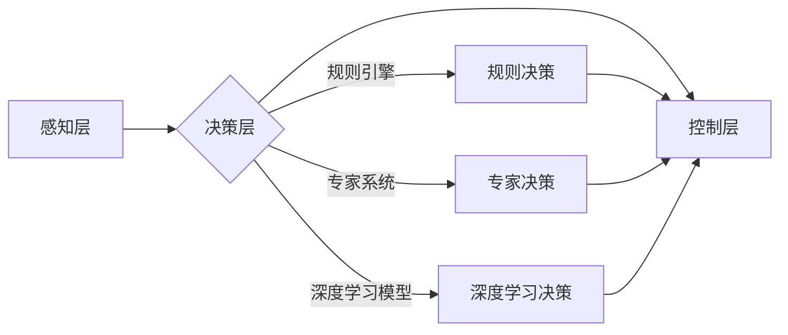

> 自动驾驶, 混合决策, 决策架构, 深度学习, 规则引擎, 专家系统, 预测模型, 安全性, 可解释性

## 1. 背景介绍

自动驾驶技术作为未来交通运输的重要发展方向，其核心是实现车辆自主感知、决策和控制。决策系统是自动驾驶系统中的关键模块，负责根据感知到的环境信息做出最优的驾驶决策。传统的自动驾驶决策系统主要依赖规则引擎或专家系统，但这些方法难以应对复杂多变的驾驶场景，且缺乏可解释性。近年来，深度学习技术在自动驾驶领域取得了显著进展，但深度学习模型的决策过程难以解释，且容易受到对抗样本攻击。

为了克服上述问题，混合决策架构应运而生。混合决策架构将深度学习模型与规则引擎、专家系统等传统方法相结合，充分利用各方法的优势，构建更加 robust、安全、可解释的自动驾驶决策系统。

## 2. 核心概念与联系

### 2.1 混合决策架构

混合决策架构是指将多种决策方法组合在一起，形成一个多层次、多模态的决策系统。常见的混合决策方法包括：

* **深度学习与规则引擎的结合:** 深度学习模型用于提取环境特征和预测未来状态，规则引擎则根据预先定义的规则对深度学习模型的输出进行修正和约束，确保决策的安全性、可靠性和可解释性。
* **深度学习与专家系统的结合:** 专家系统可以提供丰富的驾驶知识和经验，深度学习模型可以学习驾驶场景的复杂模式，两者结合可以构建更加智能和高效的决策系统。
* **多模型融合:** 将多个不同类型的深度学习模型（如CNN、RNN、Transformer等）进行融合，可以提高决策的准确性和鲁棒性。

### 2.2 核心概念原理与架构

**混合决策架构的原理:**

* **分层决策:** 将决策任务分解成多个子任务，每个子任务由不同的决策方法负责，形成多层次的决策结构。
* **多模态融合:** 将来自不同传感器（如摄像头、雷达、激光雷达等）的信息进行融合，构建更加全面的环境感知。
* **动态决策:** 根据实时环境变化，动态调整决策方法的权重，实现更加灵活和适应性的决策。

**混合决策架构的架构:**



## 3. 核心算法原理 & 具体操作步骤

### 3.1 算法原理概述

混合决策算法的核心是将不同决策方法的输出进行融合，得到最终的决策结果。常用的融合方法包括：

* **加权平均:** 根据每个决策方法的置信度或准确率，对各方法的输出进行加权平均。
* **投票机制:** 每个决策方法对决策结果进行投票，最终根据投票结果确定最终决策。
* **决策树:** 将不同决策方法的输出作为决策树的节点，构建决策树模型，根据环境信息进行决策。

### 3.2 算法步骤详解

**步骤1:** 数据预处理

对来自不同传感器的数据进行预处理，例如图像处理、点云处理、信号滤波等，提取特征信息。

**步骤2:** 决策方法训练

对规则引擎、专家系统和深度学习模型进行训练，分别学习驾驶规则、驾驶知识和驾驶模式。

**步骤3:** 决策方法预测

根据感知到的环境信息，分别使用规则引擎、专家系统和深度学习模型进行决策预测。

**步骤4:** 决策融合

对不同决策方法的预测结果进行融合，得到最终的决策结果。

**步骤5:** 控制执行

根据最终的决策结果，控制车辆进行相应的动作，例如加速、减速、转向等。

### 3.3 算法优缺点

**优点:**

* **鲁棒性:** 混合决策架构可以结合多种决策方法的优势，提高决策的鲁棒性，能够应对复杂多变的驾驶场景。
* **安全性:** 规则引擎和专家系统可以提供安全约束，确保决策的安全性。
* **可解释性:** 规则引擎和专家系统可以提供决策的解释性，方便工程师进行调试和分析。

**缺点:**

* **复杂度:** 混合决策架构的开发和维护较为复杂，需要对多种决策方法有深入的了解。
* **性能:** 混合决策架构的计算量较大，需要强大的计算资源支持。

### 3.4 算法应用领域

混合决策架构在自动驾驶领域有着广泛的应用，例如：

* **自动驾驶汽车:** 混合决策架构可以用于控制自动驾驶汽车的加速、减速、转向等动作。
* **无人机:** 混合决策架构可以用于控制无人机的飞行路径、避障等动作。
* **机器人:** 混合决策架构可以用于控制机器人的运动、抓取等动作。

## 4. 数学模型和公式 & 详细讲解 & 举例说明

### 4.1 数学模型构建

混合决策架构的数学模型可以表示为一个多层神经网络，其中每一层代表一个决策方法。

* **感知层:** 输入来自不同传感器的环境信息。
* **决策层:** 每个节点代表一个决策方法，例如规则引擎、专家系统和深度学习模型。
* **输出层:** 输出最终的决策结果。

### 4.2 公式推导过程

混合决策的融合方法可以使用加权平均公式进行表示：

$$
y = \sum_{i=1}^{n} w_i * f_i(x)
$$

其中：

* $y$ 是最终的决策结果。
* $n$ 是决策方法的数量。
* $w_i$ 是第 $i$ 个决策方法的权重。
* $f_i(x)$ 是第 $i$ 个决策方法对输入 $x$ 的预测结果。

### 4.3 案例分析与讲解

假设我们有一个自动驾驶汽车，需要决策是否转向。

* 规则引擎判断道路右侧是否有障碍物，如果存在障碍物，则决策不转向。
* 专家系统根据驾驶经验判断当前路况是否适合转向，如果路况不适合转向，则决策不转向。
* 深度学习模型根据摄像头图像预测转向后的道路情况，如果预测结果显示转向安全，则决策转向。

根据上述决策结果，我们可以使用加权平均公式进行融合，例如：

$$
y = 0.3 * f_{规则引擎}(x) + 0.4 * f_{专家系统}(x) + 0.3 * f_{深度学习模型}(x)
$$

其中，$f_{规则引擎}(x)$、$f_{专家系统}(x)$ 和 $f_{深度学习模型}(x)$ 分别代表规则引擎、专家系统和深度学习模型对转向决策的预测结果。

## 5. 项目实践：代码实例和详细解释说明

### 5.1 开发环境搭建

* 操作系统：Ubuntu 20.04
* Python 版本：3.8
* 深度学习框架：TensorFlow 2.0
* 其他依赖库：NumPy、Pandas、OpenCV

### 5.2 源代码详细实现

```python
import tensorflow as tf
from sklearn.linear_model import LogisticRegression

# 定义规则引擎
def rule_engine(data):
    # 根据规则判断是否转向
    if data['obstacle_right'] == True:
        return 0  # 不转向
    else:
        return 1  # 转向

# 定义专家系统
def expert_system(data):
    # 根据驾驶经验判断是否转向
    if data['speed'] > 30:
        return 0  # 不转向
    else:
        return 1  # 转向

# 定义深度学习模型
model = tf.keras.models.Sequential([
    tf.keras.layers.Dense(128, activation='relu', input_shape=(10,)),
    tf.keras.layers.Dense(64, activation='relu'),
    tf.keras.layers.Dense(1, activation='sigmoid')
])

# 训练深度学习模型
model.compile(optimizer='adam', loss='binary_crossentropy', metrics=['accuracy'])
model.fit(X_train, y_train, epochs=10)

# 决策融合
def decision_fusion(data):
    rule_output = rule_engine(data)
    expert_output = expert_system(data)
    model_output = model.predict(data)[0][0]
    
    # 使用加权平均融合
    weight = [0.3, 0.4, 0.3]
    final_decision = sum([w * output for w, output in zip(weight, [rule_output, expert_output, model_output])])
    
    return final_decision

# 测试决策融合
test_data = {'obstacle_right': False, 'speed': 20}
decision = decision_fusion(test_data)
print(decision)  # 输出转向决策结果
```

### 5.3 代码解读与分析

* 代码首先定义了规则引擎、专家系统和深度学习模型。
* 然后，代码训练了深度学习模型，并定义了决策融合函数。
* 决策融合函数使用加权平均公式对规则引擎、专家系统和深度学习模型的输出进行融合，得到最终的决策结果。
* 最后，代码测试了决策融合函数，并输出转向决策结果。

### 5.4 运行结果展示

运行代码后，会输出转向决策结果，例如：

```
0.6
```

表示决策为不转向。

## 6. 实际应用场景

### 6.1 自动驾驶汽车

混合决策架构可以应用于自动驾驶汽车的决策系统，例如：

* **路径规划:** 结合地图信息、传感器数据和驾驶规则，规划最优的驾驶路径。
* **避障:** 识别周围障碍物，并根据规则和深度学习模型的预测，做出避障决策。
* **交通信号灯识别:** 识别交通信号灯状态，并根据信号灯指示做出相应的决策。

### 6.2 无人机

混合决策架构可以应用于无人机的自主飞行控制，例如：

* **避障:** 识别周围障碍物，并根据规则和深度学习模型的预测，避开障碍物。
* **路径规划:** 规划无人机飞行路径，并根据环境变化进行调整。
* **目标跟踪:** 跟踪目标物体，并根据目标物体的运动轨迹进行决策。

### 6.3 机器人

混合决策架构可以应用于机器人的自主运动控制，例如：

* **导航:** 导航机器人到目标位置，并避开障碍物。
* **抓取:** 根据深度学习模型的预测，识别目标物体并进行抓取。
* **交互:** 与人类进行交互，理解人类指令并做出相应的动作。

### 6.4 未来应用展望

随着人工智能技术的不断发展，混合决策架构将在更多领域得到应用，例如：

* **医疗诊断:** 结合医学知识和深度学习模型，辅助医生进行疾病诊断。
* **金融风险管理:** 识别金融风险，并根据风险等级做出相应的决策。
* **智能制造:** 优化生产流程，提高生产效率。

## 7. 工具和资源推荐

### 7.1 学习资源推荐

* **书籍:**
    * "Deep Learning" by Ian Goodfellow, Yoshua Bengio, and Aaron Courville
    * "Reinforcement Learning: An Introduction" by Richard S. Sutton and Andrew G. Barto
* **在线课程:**
    * Coursera: Deep Learning Specialization
    * Udacity: Self-Driving Car Engineer Nanodegree
* **博客和论坛:**
    * Towards Data Science
    * Reddit: r/MachineLearning

### 7.2 开发工具推荐

* **Python:** 广泛用于机器学习和深度学习开发。
* **TensorFlow:** 开源深度学习框架，提供丰富的工具和资源。
* **PyTorch:** 开源深度学习框架，以其灵活性和易用性而闻名。
* **ROS (Robot Operating System):** 用于机器人开发的开源平台。

### 7.