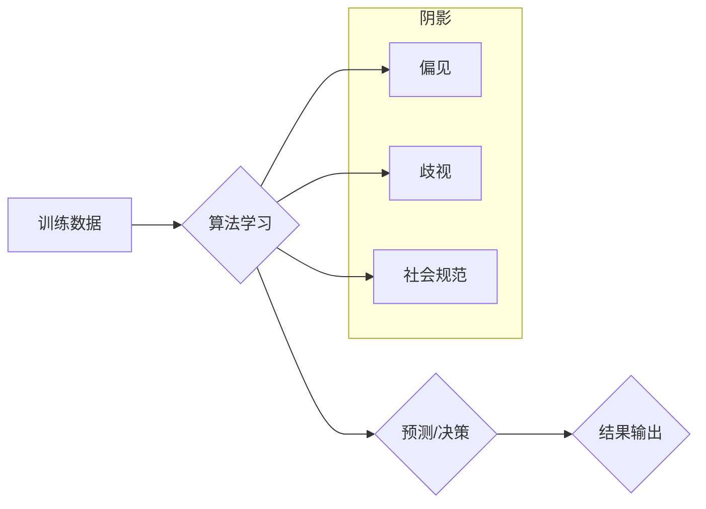

> 人工智能，深度学习，偏见，公平性，伦理，算法，荣格心理学

## 1. 背景介绍

在人工智能（AI）蓬勃发展的时代，我们见证了机器学习算法的惊人进步，它们在图像识别、自然语言处理、医疗诊断等领域取得了突破性的成就。然而，随着AI技术的日益普及，我们也开始意识到其潜在的风险和挑战。其中，算法偏见和公平性问题尤为突出。

算法偏见是指AI算法在训练数据中学习到的不公平或歧视性的模式，导致算法在对不同群体进行预测或决策时产生不公正的结果。例如，用于招聘的AI算法可能因为训练数据中存在性别或种族偏见，而导致对女性或少数族裔候选人的歧视。

解决算法偏见是一个复杂而具有挑战性的问题，需要从多个方面入手。本文将从荣格心理学角度出发，探讨如何理解和应对算法中的黑暗面，从而构建更加公平、公正的AI系统。

## 2. 核心概念与联系

荣格心理学认为，每个人内心都存在着“阴影”，即我们不愿承认或压抑的黑暗面。这些阴影可能包括负面情绪、冲动、欲望以及与社会规范相悖的思想。

在AI领域，算法的“阴影”指的是算法训练数据中潜在的偏见和歧视性信息。这些信息可能来自历史数据、社会文化背景、甚至开发者的自身偏见。

**Mermaid 流程图：**



## 3. 核心算法原理 & 具体操作步骤

### 3.1  算法原理概述

算法偏见通常源于训练数据的不均衡性和代表性不足。当算法训练数据中某个群体的数据比例过低或存在偏差时，算法就会学习到对该群体的错误或不公平的模式。

### 3.2  算法步骤详解

1. **数据收集和预处理:** 收集尽可能多的数据，并进行清洗、标准化和特征工程等预处理步骤，以确保数据质量和代表性。
2. **数据平衡:** 使用数据合成、过采样或欠采样等技术，平衡训练数据中不同群体的比例，减少数据偏差的影响。
3. **算法选择:** 选择合适的机器学习算法，并进行参数调优，以降低算法对偏见敏感度的影响。
4. **模型评估和监控:** 使用公平性指标评估算法的公平性，并持续监控算法在不同群体上的表现，及时发现和解决潜在的偏见问题。

### 3.3  算法优缺点

**优点:**

* 可以有效降低算法偏见的影响。
* 提高算法的公平性和公正性。

**缺点:**

* 需要投入更多的时间和资源进行数据收集、预处理和模型评估。
* 难以完全消除算法偏见，因为数据本身可能存在不可避免的偏差。

### 3.4  算法应用领域

* **招聘:** 避免基于性别、种族或其他敏感属性的歧视性招聘决策。
* **金融:** 确保贷款审批和风险评估等金融服务公平公正地对待所有客户。
* **司法:** 减少基于种族或社会经济地位的司法歧视。
* **医疗:** 确保医疗资源分配和诊断结果公平公正地对待所有患者。

## 4. 数学模型和公式 & 详细讲解 & 举例说明

### 4.1  数学模型构建

我们可以使用统计学模型来衡量算法的公平性。例如，我们可以使用**均值差异**来衡量不同群体在算法预测结果上的差异。

**公式:**

$$
\text{均值差异} = \frac{|\mu_1 - \mu_2|}{2}
$$

其中，$\mu_1$ 和 $\mu_2$ 分别代表两个群体的平均预测结果。

### 4.2  公式推导过程

均值差异的公式是通过比较两个群体的平均预测结果的绝对差值来计算的。

### 4.3  案例分析与讲解

假设我们有一个用于预测贷款风险的AI算法。我们发现，该算法对女性申请人的风险预测结果比对男性申请人的风险预测结果更高。

我们可以使用均值差异公式来衡量这种差异。假设女性申请人的平均风险预测值为 0.6，男性申请人的平均风险预测值为 0.4，则均值差异为：

$$
\text{均值差异} = \frac{|0.6 - 0.4|}{2} = 0.1
$$

这个结果表明，该算法对女性申请人的风险预测结果比对男性申请人的风险预测结果高 0.1。

## 5. 项目实践：代码实例和详细解释说明

### 5.1  开发环境搭建

* Python 3.x
* TensorFlow 或 PyTorch 等深度学习框架
* Jupyter Notebook 或 VS Code 等代码编辑器

### 5.2  源代码详细实现

```python
# 导入必要的库
import tensorflow as tf

# 定义模型
model = tf.keras.models.Sequential([
    tf.keras.layers.Dense(64, activation='relu', input_shape=(10,)),
    tf.keras.layers.Dense(1, activation='sigmoid')
])

# 编译模型
model.compile(optimizer='adam', loss='binary_crossentropy', metrics=['accuracy'])

# 训练模型
model.fit(X_train, y_train, epochs=10, batch_size=32)

# 评估模型
loss, accuracy = model.evaluate(X_test, y_test)
print('Loss:', loss)
print('Accuracy:', accuracy)
```

### 5.3  代码解读与分析

这段代码定义了一个简单的深度学习模型，用于预测二分类问题。

* `tf.keras.models.Sequential` 创建了一个顺序模型，即层级结构的模型。
* `tf.keras.layers.Dense` 定义了全连接层，每个神经元都连接到上一层的每个神经元。
* `activation='relu'` 指定了ReLU激活函数，用于引入非线性。
* `input_shape=(10,)` 指定了输入数据的形状，这里假设输入数据有10个特征。
* `optimizer='adam'` 指定了Adam优化器，用于更新模型参数。
* `loss='binary_crossentropy'` 指定了二分类交叉熵损失函数，用于衡量模型预测结果与真实标签之间的差异。
* `metrics=['accuracy']` 指定了准确率作为评估指标。

### 5.4  运行结果展示

运行这段代码后，会输出模型的训练损失和准确率。

## 6. 实际应用场景

### 6.1  案例分析

* **医疗诊断:** AI算法可以帮助医生更快、更准确地诊断疾病，但如果训练数据中存在种族或性别偏见，则可能导致对不同群体的诊断结果不公平。
* **金融风险评估:** AI算法可以帮助银行评估贷款风险，但如果训练数据中存在社会经济地位偏见，则可能导致对低收入人群的贷款审批率更低。

### 6.2  解决方案

* 使用公平性指标评估算法的公平性。
* 使用数据合成、过采样或欠采样等技术平衡训练数据中的不同群体比例。
* 选择对偏见敏感度较低的算法。
* 持续监控算法在不同群体上的表现，及时发现和解决潜在的偏见问题。

### 6.3  未来应用展望

随着AI技术的不断发展，算法偏见问题将变得更加突出。因此，我们需要更加重视算法的公平性，并开发出更加公平、公正的AI系统。

## 7. 工具和资源推荐

### 7.1  学习资源推荐

* **书籍:**
    * 《算法的公平性》
    * 《人工智能伦理》
* **在线课程:**
    * Coursera: Fairness in Machine Learning
    * edX: AI Ethics

### 7.2  开发工具推荐

* **AIF360:** 一个开源工具包，用于评估和缓解算法偏见。
* **Fairlearn:** 另一个开源工具包，用于公平性分析和算法调优。

### 7.3  相关论文推荐

* **On the Dangers of Stochastic Parrots: Can Language Models Be Too Big?**
* **Fairness and Machine Learning**

## 8. 总结：未来发展趋势与挑战

### 8.1  研究成果总结

近年来，在算法偏见和公平性方面取得了显著进展。

* 出现了许多新的公平性指标和算法。
* 开发了多种工具和技术，用于评估和缓解算法偏见。

### 8.2  未来发展趋势

* **更加注重算法的解释性和透明度:** 帮助人们更好地理解算法的决策过程，并识别潜在的偏见。
* **开发更加鲁棒和可解释的公平性算法:** 能够在面对复杂和动态的数据环境下，仍然保持公平性。
* **建立更加完善的AI伦理规范和监管框架:** 确保AI技术的发展符合人类的价值观和利益。

### 8.3  面临的挑战

* **数据偏差的根源:** 数据偏差往往来自社会文化背景和历史遗留问题，难以完全消除。
* **公平性的定义和衡量:** 对公平性的定义和衡量标准存在争议，难以达成共识。
* **算法的复杂性:** 许多AI算法非常复杂，难以解释其决策过程，这使得识别和解决偏见更加困难。

### 8.4  研究展望

未来，我们需要继续深入研究算法偏见和公平性问题，开发出更加有效的解决方案，并推动AI技术朝着更加公平、公正的方向发展。

## 9. 附录：常见问题与解答

### 9.1  常见问题

* **什么是算法偏见？**

算法偏见是指AI算法在训练数据中学习到的不公平或歧视性的模式，导致算法在对不同群体进行预测或决策时产生不公正的结果。

* **如何解决算法偏见？**

解决算法偏见是一个复杂而具有挑战性的问题，需要从多个方面入手，例如：

* 使用公平性指标评估算法的公平性。
* 使用数据合成、过采样或欠采样等技术平衡训练数据中的不同群体比例。
* 选择对偏见敏感度较低的算法。
* 持续监控算法在不同群体上的表现，及时发现和解决潜在的偏见问题。

* **为什么算法会产生偏见？**

算法会产生偏见，主要是因为训练数据本身可能存在偏见。例如，如果训练数据中女性的比例较低，则算法可能会学习到对女性的预测结果不准确。

### 9.2  解答

* **如何评估算法的公平性？**

可以使用多种公平性指标来评估算法的公平性，例如：

* 均值差异
* 平衡准确率
* 预测率

* **如何避免算法产生偏见？**

* 使用尽可能多的数据进行训练，并确保数据代表性。
* 使用公平性指标评估算法的公平性，并进行调整。
* 持续监控算法在不同群体上的表现，及时发现和解决潜在的偏见问题。

作者：禅与计算机程序设计艺术 / Zen and the Art of Computer Programming


<end_of_turn>