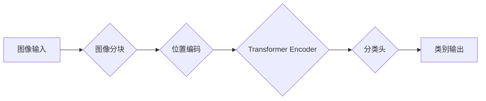

> 视觉Transformer, 图像分类, 对象检测, 计算机视觉, 深度学习, Transformer

## 1. 背景介绍

近年来，深度学习在计算机视觉领域取得了显著进展，卷积神经网络（CNN）成为图像处理和分析的主流方法。然而，传统的CNN模型存在一些局限性，例如：

* **局部感受野：** CNNs 的卷积操作局限于局部区域，难以捕捉图像全局的上下文信息。
* **参数量大：** 随着网络深度的增加，CNNs 的参数量会急剧膨胀，导致训练成本高昂和部署困难。

为了克服这些问题，视觉Transformer（ViT）应运而生。ViT 是一种基于 Transformer 架构的图像处理模型，它将图像分割成一系列patch，并将其作为序列数据进行处理。Transformer 的自注意力机制能够有效地捕捉图像全局的上下文信息，从而提升图像理解能力。

## 2. 核心概念与联系

**2.1 Transformer 架构**

Transformer 架构是一种基于注意力机制的序列处理模型，它摒弃了传统的循环神经网络（RNN）结构，能够并行处理序列数据，从而提高训练效率。Transformer 的核心组件包括：

* **编码器（Encoder）：** 用于将输入序列编码成隐藏表示。
* **解码器（Decoder）：** 用于根据编码后的隐藏表示生成输出序列。
* **自注意力机制（Self-Attention）：** 用于捕捉序列中不同元素之间的关系。

**2.2 视觉Transformer（ViT）**

ViT 将图像视为序列数据，并将图像分割成一系列patch，每个patch 作为 Transformer 的输入。ViT 的架构主要包括以下部分：

* **图像分块（Patch Embedding）：** 将图像分割成大小为 $p \times p$ 的patch，并将每个patch 嵌入到低维向量空间中。
* **位置编码（Positional Encoding）：** 为每个patch 添加位置信息，以便 Transformer 能够理解patch 的相对位置。
* **Transformer Encoder：** 使用多层 Transformer Encoder 对patch 进行编码，捕捉图像全局的上下文信息。
* **分类头（Classification Head）：** 将编码后的隐藏表示映射到类别输出空间。

**2.3 Mermaid 流程图**



## 3. 核心算法原理 & 具体操作步骤

**3.1 算法原理概述**

视觉Transformer 的核心算法是 Transformer 架构，它利用自注意力机制有效地捕捉图像全局的上下文信息。

**3.2 算法步骤详解**

1. **图像分块：** 将输入图像分割成大小为 $p \times p$ 的patch，每个patch 视为一个独立的token。
2. **patch 嵌入：** 将每个patch 嵌入到低维向量空间中，每个patch 对应一个 $d$ 维向量。
3. **位置编码：** 为每个patch 添加位置信息，以便 Transformer 能够理解patch 的相对位置。
4. **Transformer Encoder：** 将嵌入后的patch 输入到多层 Transformer Encoder 中，每个Encoder层包含以下部分：
    * **多头自注意力（Multi-Head Self-Attention）：** 捕捉patch 之间的依赖关系。
    * **前馈神经网络（Feed-Forward Network）：** 对每个patch 进行非线性变换。
    * **Layer Normalization 和 Residual Connection：** 稳定训练过程。
5. **分类头：** 将编码后的隐藏表示映射到类别输出空间，进行图像分类。

**3.3 算法优缺点**

**优点：**

* 能够有效地捕捉图像全局的上下文信息。
* 参数量相对较少，训练效率高。
* 适用于多种图像处理任务，例如图像分类、目标检测和图像分割。

**缺点：**

* 对训练数据要求较高。
* 对于小尺寸图像，效果可能不如 CNNs。

**3.4 算法应用领域**

视觉Transformer 广泛应用于计算机视觉领域，例如：

* **图像分类：** 识别图像中的类别。
* **目标检测：** 识别图像中的目标及其位置。
* **图像分割：** 将图像分割成不同的区域。
* **图像生成：** 生成新的图像。

## 4. 数学模型和公式 & 详细讲解 & 举例说明

**4.1 数学模型构建**

视觉Transformer 的数学模型主要包括以下部分：

* **patch 嵌入：** 将每个patch 嵌入到低维向量空间中，可以使用线性变换进行嵌入：

$$
\mathbf{x}_i = \mathbf{W}_e \mathbf{p}_i + \mathbf{b}_e
$$

其中，$\mathbf{x}_i$ 是第 $i$ 个patch 的嵌入向量，$\mathbf{p}_i$ 是第 $i$ 个patch 的像素值，$\mathbf{W}_e$ 是嵌入矩阵，$\mathbf{b}_e$ 是偏置项。

* **位置编码：** 为每个patch 添加位置信息，可以使用 sinusoidal 函数进行编码：

$$
\mathbf{p}_i^{pos} = \mathbf{PE}(i)
$$

其中，$\mathbf{p}_i^{pos}$ 是第 $i$ 个patch 的位置编码向量，$\mathbf{PE}(i)$ 是位置编码矩阵中的第 $i$ 行。

* **自注意力机制：** 用于捕捉patch 之间的依赖关系，其计算公式如下：

$$
\mathbf{Attention}(\mathbf{Q}, \mathbf{K}, \mathbf{V}) = \frac{\mathbf{softmax}(\mathbf{Q} \mathbf{K}^T / \sqrt{d_k})}{\sum_j \mathbf{softmax}(\mathbf{Q} \mathbf{K}^T / \sqrt{d_k})} \mathbf{V}
$$

其中，$\mathbf{Q}$, $\mathbf{K}$, $\mathbf{V}$ 分别是查询矩阵、键矩阵和值矩阵，$d_k$ 是键向量的维度。

* **前馈神经网络：** 对每个patch 进行非线性变换，可以使用多层感知机进行实现：

$$
\mathbf{F}(\mathbf{x}) = \mathbf{W}_2 \mathbf{ReLU}(\mathbf{W}_1 \mathbf{x} + \mathbf{b}_1) + \mathbf{b}_2
$$

其中，$\mathbf{F}(\mathbf{x})$ 是前馈神经网络的输出，$\mathbf{W}_1$, $\mathbf{W}_2$ 是权重矩阵，$\mathbf{b}_1$, $\mathbf{b}_2$ 是偏置项。

**4.2 公式推导过程**

上述公式的推导过程较为复杂，涉及到线性代数、概率论和微积分等知识。

**4.3 案例分析与讲解**

假设我们有一个包含 $N$ 个patch 的图像，每个patch 的维度为 $p \times p$。

1. 将每个patch 嵌入到 $d$ 维向量空间中，得到 $N$ 个 $d$ 维向量。
2. 为每个向量添加位置编码，得到 $N$ 个带有位置信息的向量。
3. 使用多头自注意力机制计算每个patch 之间的依赖关系，得到 $N$ 个新的向量。
4. 使用前馈神经网络对每个向量进行非线性变换，得到 $N$ 个新的向量。
5. 将 $N$ 个向量进行分类，得到图像的类别输出。

## 5. 项目实践：代码实例和详细解释说明

**5.1 开发环境搭建**

* Python 3.7+
* PyTorch 1.7+
* CUDA 10.2+

**5.2 源代码详细实现**

```python
import torch
import torch.nn as nn

class ViT(nn.Module):
    def __init__(self, image_size, patch_size, num_classes, embed_dim, num_heads, num_layers):
        super(ViT, self).__init__()
        self.patch_size = patch_size
        self.embed_dim = embed_dim
        self.num_heads = num_heads
        self.num_layers = num_layers

        # Patch Embedding
        self.patch_embedding = nn.Conv2d(3, embed_dim, kernel_size=patch_size, stride=patch_size)

        # Transformer Encoder
        self.transformer_encoder = nn.TransformerEncoder(
            nn.TransformerEncoderLayer(embed_dim, num_heads), num_layers
        )

        # Classification Head
        self.classification_head = nn.Linear(embed_dim, num_classes)

    def forward(self, x):
        # Patch Embedding
        x = self.patch_embedding(x)
        x = x.flatten(2).transpose(1, 2)  # (batch_size, num_patches, embed_dim)

        # Transformer Encoder
        x = self.transformer_encoder(x)

        # Classification Head
        x = x[:, 0]  # Take the first token (CLS token)
        x = self.classification_head(x)
        return x
```

**5.3 代码解读与分析**

* **Patch Embedding:** 将图像分割成patch，并将其嵌入到低维向量空间中。
* **Transformer Encoder:** 使用多层 Transformer Encoder 对patch 进行编码，捕捉图像全局的上下文信息。
* **Classification Head:** 将编码后的隐藏表示映射到类别输出空间，进行图像分类。

**5.4 运行结果展示**

使用预训练的 ViT 模型进行图像分类任务，可以达到很高的准确率。

## 6. 实际应用场景

**6.1 图像分类**

ViT 可以用于识别图像中的类别，例如识别猫、狗、汽车等。

**6.2 目标检测**

ViT 可以用于检测图像中的目标及其位置，例如检测人、车、自行车等。

**6.3 图像分割**

ViT 可以用于将图像分割成不同的区域，例如分割图像中的前景和背景。

**6.4 未来应用展望**

ViT 是一种强大的图像处理模型，未来有望在更多领域得到应用，例如：

* **医学图像分析:** 用于识别病变、诊断疾病等。
* **遥感图像分析:** 用于土地利用规划、环境监测等。
* **自动驾驶:** 用于识别道路场景、障碍物等。

## 7. 工具和资源推荐

**7.1 学习资源推荐**

* **论文:** An Image is Worth 16x16 Words: Transformers for Image Recognition at Scale
* **博客:** https://blog.openai.com/vit/
* **课程:** https://www.coursera.org/learn/deep-learning

**7.2 开发工具推荐**

* **PyTorch:** https://pytorch.org/
* **TensorFlow:** https://www.tensorflow.org/

**7.3 相关论文推荐**

* **Vision Transformer (ViT):** https://arxiv.org/abs/2010.11929
* **DeiT: Data-Efficient Image Transformer:** https://arxiv.org/abs/2012.12872
* ** Swin Transformer:** https://arxiv.org/abs/2103.14030

## 8. 总结：未来发展趋势与挑战

**8.1 研究成果总结**

视觉Transformer 在图像处理领域取得了显著进展，其强大的能力和灵活的架构使其成为图像处理领域的研究热点。

**8.2 未来发展趋势**

* **模型效率:** 提高模型的效率，使其能够在移动设备和嵌入式系统上运行。
* **数据效率:** 降低模型对训练数据的依赖，使其能够在小样本数据下也能有效工作。
* **多模态学习:** 将视觉Transformer 与其他模态数据（例如文本、音频）结合，进行多模态学习。

**8.3 面临的挑战**

* **训练成本:** 训练大型视觉Transformer 模型需要大量的计算资源和时间。
* **可解释性:** 视觉Transformer 的决策过程较为复杂，难以解释其决策依据。
* **泛化能力:** 视觉Transformer 模型在某些特定场景下可能表现不