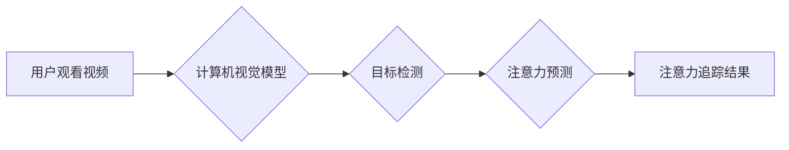

> 计算机视觉，注意力追踪，眼动追踪，深度学习，目标检测，行为分析

## 1. 背景介绍

注意力是人类认知的核心能力之一，它指我们对特定信息或刺激的集中和选择性关注。注意力追踪技术旨在记录和分析个体对视觉信息的关注模式，从而揭示其认知过程、行为偏好和情绪状态。传统的注意力追踪方法主要依赖于眼动追踪技术，但其成本高昂、受限于实验室环境，且难以捕捉脑电信号等更深层的认知信息。近年来，随着计算机视觉技术的飞速发展，基于深度学习的注意力追踪方法逐渐成为研究热点，其具有成本低、易于部署、可扩展性强等优势，为更广泛的应用场景提供了新的可能性。

## 2. 核心概念与联系

### 2.1  注意力追踪

注意力追踪是指记录和分析个体对视觉信息的关注模式，包括：

* **眼动追踪:** 记录眼球运动轨迹，分析注视点、停留时间、扫视路径等信息。
* **热力图:** 通过统计用户注视点分布，生成热力图，直观地展示用户关注区域。
* **眼动特征:** 从眼动数据中提取特征，如眨眼频率、瞳孔大小、眼球运动速度等，用于分析用户情绪、认知负荷等。

### 2.2  计算机视觉

计算机视觉是赋予计算机“看”的能力，使其能够理解和解释图像和视频信息。核心技术包括：

* **图像处理:** 对图像进行预处理、增强、分割等操作，提取目标特征。
* **目标检测:** 在图像或视频中识别和定位特定目标，如人脸、物体、场景等。
* **图像分类:** 将图像归类到预定义的类别中，如动物、植物、交通工具等。
* **深度学习:** 利用深度神经网络，从海量图像数据中学习特征，实现更准确的视觉理解。

### 2.3  注意力追踪与计算机视觉的结合

计算机视觉技术为注意力追踪提供了新的工具和方法，例如：

* **基于深度学习的注意力模型:** 利用深度神经网络学习用户注视模式，预测用户对特定区域的关注程度。
* **目标检测与注意力追踪的结合:** 将目标检测技术与注意力追踪技术相结合，分析用户对特定目标的关注行为。
* **视频注意力追踪:** 利用视频序列信息，追踪用户对动态场景的注意力变化。

**Mermaid 流程图**



## 3. 核心算法原理 & 具体操作步骤

### 3.1  算法原理概述

基于深度学习的注意力追踪算法通常采用卷积神经网络 (CNN) 和循环神经网络 (RNN) 的组合结构。CNN 用于提取图像特征，RNN 用于捕捉时间序列信息，从而预测用户对特定区域的关注程度。

### 3.2  算法步骤详解

1. **数据预处理:** 将视频序列预处理，包括帧提取、图像增强、尺寸调整等操作。
2. **特征提取:** 利用 CNN 模型提取每帧图像的特征，例如卷积层输出的特征图。
3. **时间序列建模:** 利用 RNN 模型处理特征序列，捕捉时间信息，例如用户注视点的变化趋势。
4. **注意力预测:** 利用注意力机制，预测用户对每个区域的关注程度，例如生成热力图或注意力权重图。
5. **结果输出:** 将注意力预测结果输出，用于分析用户行为、认知过程等。

### 3.3  算法优缺点

**优点:**

* **高精度:** 基于深度学习的算法能够学习复杂的视觉特征，实现更高的注意力追踪精度。
* **可扩展性强:** 可以处理高分辨率视频序列，并扩展到多摄像头、多用户场景。
* **实时性:** 某些算法能够实现实时注意力追踪，满足实时应用需求。

**缺点:**

* **数据依赖:** 需要大量的标注数据进行训练，数据获取成本较高。
* **计算复杂度高:** 深度学习模型训练和推理过程计算量大，需要强大的计算资源。
* **解释性差:** 深度学习模型的决策过程难以解释，难以理解模型是如何预测用户注意力的。

### 3.4  算法应用领域

* **用户体验研究:** 分析用户对网站、应用程序、产品等的设计和交互的关注模式，优化用户体验。
* **教育领域:** 跟踪学生的学习注意力，识别学习困难学生，提供个性化学习方案。
* **医疗诊断:** 分析患者的眼动行为，辅助医生诊断疾病，例如阿尔茨海默病、注意力缺陷多动障碍等。
* **广告营销:** 了解用户对广告的关注程度，优化广告投放策略。

## 4. 数学模型和公式 & 详细讲解 & 举例说明

### 4.1  数学模型构建

注意力机制的核心思想是学习一个权重向量，用于加权不同输入特征，从而突出重要信息。

**注意力权重计算公式:**

$$
\alpha_i = \frac{exp(e_i)}{\sum_{j=1}^{N} exp(e_j)}
$$

其中：

* $\alpha_i$ 是第 i 个输入特征的注意力权重。
* $e_i$ 是第 i 个输入特征的得分，通常通过一个神经网络计算得到。
* $N$ 是输入特征的总数。

**注意力输出计算公式:**

$$
\text{Attention}(x) = \sum_{i=1}^{N} \alpha_i x_i
$$

其中：

* $x$ 是输入特征向量。
* $\text{Attention}(x)$ 是注意力机制输出的特征向量。

### 4.2  公式推导过程

注意力权重计算公式基于 softmax 函数，其目的是将输入特征的得分转换为概率分布，使得每个特征的权重之和为 1。

**softmax 函数定义:**

$$
softmax(x_i) = \frac{exp(x_i)}{\sum_{j=1}^{N} exp(x_j)}
$$

其中：

* $x_i$ 是第 i 个输入特征的得分。
* $N$ 是输入特征的总数。

### 4.3  案例分析与讲解

假设我们有一个句子 "我爱学习编程"，我们想使用注意力机制来分析用户对每个词的关注程度。

1. 将句子中的每个词作为输入特征，并使用一个神经网络计算每个词的得分。
2. 使用 softmax 函数将得分转换为概率分布，得到每个词的注意力权重。
3. 将注意力权重与词向量相乘，得到注意力输出向量。

通过分析注意力输出向量，我们可以发现用户对 "编程" 这个词的关注程度最高，其次是 "学习" 和 "爱"。

## 5. 项目实践：代码实例和详细解释说明

### 5.1  开发环境搭建

* 操作系统: Ubuntu 20.04
* Python 版本: 3.8
* 深度学习框架: TensorFlow 2.x
* 其他依赖库: OpenCV, NumPy, Matplotlib

### 5.2  源代码详细实现

```python
import tensorflow as tf
from tensorflow.keras.models import Model
from tensorflow.keras.layers import Input, Conv2D, MaxPooling2D, Flatten, Dense, LSTM

# 定义注意力模型
def build_attention_model(input_shape):
    inputs = Input(shape=input_shape)
    x = Conv2D(32, (3, 3), activation='relu')(inputs)
    x = MaxPooling2D((2, 2))(x)
    x = Conv2D(64, (3, 3), activation='relu')(x)
    x = MaxPooling2D((2, 2))(x)
    x = Flatten()(x)
    x = LSTM(128)(x)
    outputs = Dense(input_shape[-1], activation='softmax')(x)
    model = Model(inputs=inputs, outputs=outputs)
    return model

# 训练模型
model = build_attention_model((224, 224, 3))
model.compile(optimizer='adam', loss='categorical_crossentropy', metrics=['accuracy'])
# ... 训练代码 ...

# 预测注意力
predictions = model.predict(video_frames)
```

### 5.3  代码解读与分析

* **模型结构:** 该代码定义了一个基于 CNN 和 RNN 的注意力模型，用于预测用户对视频帧的关注程度。
* **数据预处理:** 需要将视频帧预处理，包括尺寸调整、归一化等操作。
* **模型训练:** 使用 Adam 优化器和交叉熵损失函数训练模型。
* **注意力预测:** 使用训练好的模型预测每个视频帧的注意力权重。

### 5.4  运行结果展示

运行结果将显示每个视频帧的注意力权重图，直观地展示用户对视频内容的关注模式。

## 6. 实际应用场景

### 6.1  用户体验研究

* **网站设计优化:** 分析用户对网站不同区域的关注模式，优化布局、导航、内容呈现等，提高用户体验。
* **应用程序交互设计:** 研究用户对应用程序功能和交互方式的关注，改进用户界面设计，提高用户满意度。
* **产品设计改进:** 通过分析用户对产品不同部件的关注，改进产品设计，使其更符合用户需求。

### 6.2  教育领域

* **个性化学习:** 跟踪学生的学习注意力，识别学习困难学生，提供个性化学习方案，提高学习效率。
* **课堂互动:** 分析学生对课堂内容的关注程度，及时调整教学节奏和内容，提高课堂互动效果。
* **远程教育:** 利用注意力追踪技术，评估学生在线学习的专注度，提高远程教育的教学质量。

### 6.3  医疗诊断

* **神经疾病诊断:** 分析患者的眼动行为，辅助医生诊断阿尔茨海默病、注意力缺陷多动障碍等神经疾病。
* **精神疾病诊断:** 研究患者的眼动行为，辅助医生诊断抑郁症、焦虑症等精神疾病。
* **手术辅助:** 利用注意力追踪技术，监测医生的注意力，提高手术安全性和效率。

### 6.4  未来应用展望

* **虚拟现实和增强现实:** 在虚拟现实和增强现实场景中，注意力追踪技术可以帮助用户更好地沉浸在虚拟世界中，并提供更个性化的体验。
* **自动驾驶:** 利用注意力追踪技术，分析驾驶员的注意力状态，提高自动驾驶系统的安全性。
* **人机交互:** 开发更智能的人机交互系统，例如通过注意力追踪技术，实现更自然的语音控制和手势识别。

## 7. 工具和资源推荐

### 7.1  学习资源推荐

* **书籍:**
    * "Deep Learning" by Ian Goodfellow, Yoshua Bengio, and Aaron Courville
    * "Computer Vision: Algorithms and Applications" by Richard Szeliski
* **在线课程:**
    * Coursera: Deep Learning Specialization
    * Udacity: Computer Vision Nanodegree
* **博客和论坛:**
    * Towards Data Science
    * Reddit: r/MachineLearning

### 7.2  开发工具推荐

* **深度学习框架:** TensorFlow, PyTorch, Keras
* **图像处理库:** OpenCV
* **数据可视化库:** Matplotlib, Seaborn

### 7.3  相关论文推荐

* "Attention Is All You Need" by Vaswani et al. (2017)
* "Show, Attend and Tell: Neural Image Captioning with Visual Attention" by Xu et al. (2015)
* "Gaze Tracking with Deep Learning" by Wang et al. (2018)

## 8. 总结：未来发展趋势与挑战

### 8.1  研究成果总结

近年来，基于深度学习的注意力追踪技术取得了显著进展，在精度、效率、可扩展性等方面都取得了突破。

### 8.2  未来发展趋势

* **更准确的注意力预测:** 研究更先进的注意力机制，提高注意力预测的精度和鲁棒性。
* **多模态注意力追踪:** 将视觉注意力与其他模态信息，例如