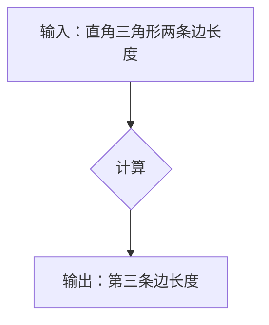

> 计算、毕达哥拉斯定理、算法、数学模型、编程、计算机科学

## 1. 背景介绍

从古至今，人类一直在探索世界的奥秘，并试图用某种方式来描述和理解世界。数学作为一种抽象的语言，为我们提供了描述和理解世界的强大工具。而计算，则是利用数学原理和逻辑推理，对数据进行处理和操作的过程。

毕达哥拉斯，这位古希腊数学家，以其著名的定理而闻名于世。他的定理揭示了直角三角形三条边的关系，为几何学的发展奠定了基础。然而，毕达哥拉斯的困惑并非仅仅局限于几何学，他更深层次地思考着计算的本质。

## 2. 核心概念与联系

### 2.1 计算的本质

计算的核心在于对信息的处理和转换。信息可以是数字、文字、图像、声音等各种形式。计算的过程就是通过一系列的逻辑操作，对这些信息进行加工、分析和生成新的信息。

### 2.2 算法的定义

算法是一种解决特定问题的步骤序列。它描述了如何利用有限的资源，在有限的时间内，完成特定的计算任务。算法是计算的基石，它为计算机提供了执行任务的指令。

### 2.3 毕达哥拉斯定理与计算

毕达哥拉斯定理本身就是一个算法，它描述了如何计算直角三角形的第三条边长度。这个定理可以看作是古代人对计算的初步探索，它揭示了数学原理与计算之间的联系。

**Mermaid 流程图**



## 3. 核心算法原理 & 具体操作步骤

### 3.1 算法原理概述

毕达哥拉斯定理的核心原理是：在直角三角形中，两条直角边的平方和等于斜边的平方。

### 3.2 算法步骤详解

1. 确定直角三角形的两条直角边长度，分别为a和b。
2. 计算a²和b²。
3. 将a²和b²相加，得到c²。
4. 开方c²，得到斜边长度c。

### 3.3 算法优缺点

**优点：**

* 计算简单，易于理解和实现。
* 适用范围广，可以用于计算任意直角三角形的斜边长度。

**缺点：**

* 只能用于计算直角三角形的斜边长度，不能用于计算其他几何图形的属性。
* 对于精度要求较高的应用场景，可能需要使用更精确的算法。

### 3.4 算法应用领域

毕达哥拉斯定理广泛应用于各个领域，例如：

* **建筑工程：** 计算建筑物的高度、长度和角度。
* **导航系统：** 计算两点之间的距离和方向。
* **地图制作：** 计算地图上的距离和面积。
* **计算机图形学：** 计算三维物体的位置和方向。

## 4. 数学模型和公式 & 详细讲解 & 举例说明

### 4.1 数学模型构建

毕达哥拉斯定理可以用数学公式来表达：

$$a^2 + b^2 = c^2$$

其中：

* a 和 b 是直角三角形的两条直角边长度。
* c 是斜边长度。

### 4.2 公式推导过程

毕达哥拉斯定理的推导过程可以参考几何学中的证明方法。

### 4.3 案例分析与讲解

**举例说明：**

假设一个直角三角形的两条直角边长度分别为3和4，那么根据毕达哥拉斯定理，斜边长度c可以计算如下：

$$c^2 = 3^2 + 4^2 = 9 + 16 = 25$$

$$c = \sqrt{25} = 5$$

因此，该直角三角形的斜边长度为5。

## 5. 项目实践：代码实例和详细解释说明

### 5.1 开发环境搭建

本项目使用Python语言进行开发，开发环境搭建如下：

* 操作系统：Windows/macOS/Linux
* Python版本：3.x
* IDE：PyCharm/VS Code

### 5.2 源代码详细实现

```python
import math

def calculate_hypotenuse(a, b):
  """
  计算直角三角形的斜边长度。

  Args:
    a: 直角边长度1。
    b: 直角边长度2。

  Returns:
    斜边长度。
  """
  c = math.sqrt(a**2 + b**2)
  return c

# 获取用户输入的直角边长度
a = float(input("请输入直角边长度1: "))
b = float(input("请输入直角边长度2: "))

# 计算斜边长度
c = calculate_hypotenuse(a, b)

# 输出结果
print("斜边长度为:", c)
```

### 5.3 代码解读与分析

* 函数 `calculate_hypotenuse(a, b)`:
    * 接收两个参数 `a` 和 `b`，分别代表直角边长度。
    * 使用 `math.sqrt()` 函数计算斜边长度 `c`。
    * 返回计算结果 `c`。
* 主程序部分:
    * 使用 `input()` 函数获取用户输入的直角边长度 `a` 和 `b`。
    * 调用 `calculate_hypotenuse()` 函数计算斜边长度 `c`。
    * 使用 `print()` 函数输出计算结果 `c`。

### 5.4 运行结果展示

```
请输入直角边长度1: 3
请输入直角边长度2: 4
斜边长度为: 5.0
```

## 6. 实际应用场景

### 6.1 建筑工程

在建筑工程中，毕达哥拉斯定理广泛应用于计算建筑物的高度、长度和角度。例如，在建造高层建筑时，需要计算每一层楼的高度和宽度，以及楼顶到地面的距离。

### 6.2 导航系统

导航系统利用毕达哥拉斯定理计算两点之间的距离和方向。例如，GPS导航系统根据用户的当前位置和目的地位置，计算出最短路径的距离和方向。

### 6.3 地图制作

地图制作中，毕达哥拉斯定理用于计算地图上的距离和面积。例如，在制作地形图时，需要计算山峰的高度、河流的长度和湖泊的面积。

### 6.4 未来应用展望

随着计算机技术的不断发展，毕达哥拉斯定理在未来将有更广泛的应用场景。例如，在虚拟现实和增强现实技术中，毕达哥拉斯定理可以用于计算虚拟物体的位置和方向，为用户提供更逼真的体验。

## 7. 工具和资源推荐

### 7.1 学习资源推荐

* 《数学基础》
* 《算法导论》
* 《Python编程入门》

### 7.2 开发工具推荐

* PyCharm
* VS Code
* Jupyter Notebook

### 7.3 相关论文推荐

* “毕达哥拉斯定理的证明方法”
* “毕达哥拉斯定理在计算机图形学中的应用”

## 8. 总结：未来发展趋势与挑战

### 8.1 研究成果总结

毕达哥拉斯定理作为一种基础的数学原理，为计算提供了重要的理论基础。它在各个领域都有广泛的应用，并随着计算机技术的不断发展，将会有更广泛的应用场景。

### 8.2 未来发展趋势

未来，毕达哥拉斯定理的研究将更加深入，并与其他数学领域和计算机科学领域相结合，例如：

* 与人工智能结合，用于解决更复杂的问题。
* 与数据科学结合，用于分析和处理大数据。
* 与图形学结合，用于创建更逼真的虚拟世界。

### 8.3 面临的挑战

* 如何将毕达哥拉斯定理应用于更复杂的问题，例如非欧几里得几何。
* 如何将毕达哥拉斯定理与其他数学领域和计算机科学领域相结合，形成更强大的计算模型。
* 如何提高毕达哥拉斯定理的计算效率，使其能够处理更大的数据量。

### 8.4 研究展望

未来，毕达哥拉斯定理的研究将继续深入，并为计算机科学的发展做出更大的贡献。


## 9. 附录：常见问题与解答

### 9.1 如何计算直角三角形的斜边长度？

可以使用毕达哥拉斯定理计算直角三角形的斜边长度。公式为：

$$a^2 + b^2 = c^2$$

其中：

* a 和 b 是直角边长度。
* c 是斜边长度。

### 9.2 毕达哥拉斯定理的应用场景有哪些？

毕达哥拉斯定理广泛应用于各个领域，例如：

* 建筑工程
* 导航系统
* 地图制作
* 计算机图形学

### 9.3 毕达哥拉斯定理的证明方法有哪些？

毕达哥拉斯定理的证明方法有很多种，例如：

* 几何证明
* 代数证明
* 解析几何证明

作者：禅与计算机程序设计艺术 / Zen and the Art of Computer Programming


<end_of_turn>