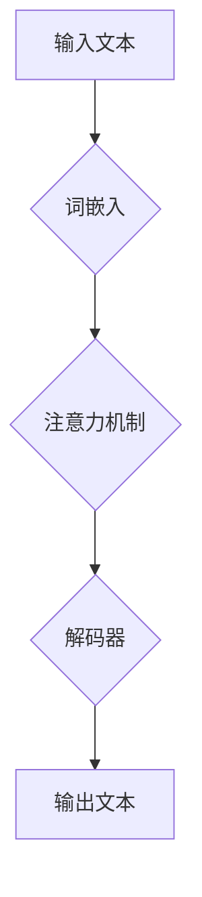

> 大语言模型、语言理解、思维模拟、认知科学、人工智能伦理

## 1. 背景介绍

近年来，大语言模型（LLM）的蓬勃发展，让人们对人工智能的潜力充满了憧憬。这些模型能够以惊人的速度处理和生成文本，在文本生成、翻译、问答等领域展现出令人瞩目的能力。然而，在庆祝这些成就的同时，我们也必须谨慎地思考：LLM真的能够理解语言，甚至模拟人类的思维吗？

LLM的训练方式基于大量的文本数据，通过统计学习的方式，学习语言的模式和结构。它们能够根据输入的文本，预测下一个最可能的词，从而生成流畅的文本。然而，这种统计学习的方式，仅仅是模仿了语言的表面结构，并没有真正理解语言背后的含义和逻辑。

## 2. 核心概念与联系

**2.1 语言与思维的本质**

语言是人类交流和表达思想的重要工具，也是人类思维的产物。然而，语言和思维之间并非简单的对应关系。语言是符号系统，它通过符号来表达概念和关系；而思维则是抽象、逻辑和创造性的过程，它超越了语言的局限性。

**2.2 大语言模型的局限性**

LLM虽然能够生成逼真的文本，但它们缺乏真正的理解能力。它们只能根据训练数据中的模式进行预测，无法理解文本背后的深层含义和逻辑关系。

**2.3 思维模拟的挑战**

模拟人类思维是一个极其复杂的任务，因为它涉及到认知、情感、经验等多方面的因素。目前，我们还没有找到一种能够完全模拟人类思维的模型。

**Mermaid 流程图**



## 3. 核心算法原理 & 具体操作步骤

**3.1 算法原理概述**

大语言模型的核心算法是基于Transformer架构的深度神经网络。Transformer架构的特点是利用注意力机制，能够捕捉文本中长距离依赖关系，从而提高语言理解能力。

**3.2 算法步骤详解**

1. **词嵌入:** 将输入的文本转换为向量表示，每个词对应一个向量。
2. **编码器:** 利用多层Transformer模块，将词向量编码成更深层的语义表示。
3. **注意力机制:** 在编码器中，注意力机制能够捕捉文本中不同词之间的关系，突出重要的信息。
4. **解码器:** 利用多层Transformer模块，将编码后的语义表示解码成输出文本。

**3.3 算法优缺点**

**优点:**

* 能够捕捉长距离依赖关系，提高语言理解能力。
* 训练效率高，能够处理海量文本数据。

**缺点:**

* 计算量大，需要强大的计算资源。
* 训练数据对模型性能影响很大，需要大量高质量的文本数据。

**3.4 算法应用领域**

* 文本生成
* 机器翻译
* 问答系统
* 文本摘要
* 代码生成

## 4. 数学模型和公式 & 详细讲解 & 举例说明

**4.1 数学模型构建**

Transformer模型的核心是注意力机制，其数学模型可以表示为：

$$
Attention(Q, K, V) = softmax(\frac{QK^T}{\sqrt{d_k}})V
$$

其中：

* $Q$：查询矩阵
* $K$：键矩阵
* $V$：值矩阵
* $d_k$：键向量的维度

**4.2 公式推导过程**

注意力机制的目的是计算查询向量与键向量的相似度，然后根据相似度加权求和值矩阵，得到最终的输出。

* $QK^T$：计算查询向量与键向量的点积，得到一个得分矩阵。
* $softmax(\frac{QK^T}{\sqrt{d_k}})$：对得分矩阵进行softmax归一化，得到每个键向量的权重。
* $V$：将权重与值矩阵相乘，得到最终的输出。

**4.3 案例分析与讲解**

假设我们有一个句子“我爱吃苹果”，我们需要计算“我”这个词与句子中其他词的注意力权重。

* $Q$：包含“我”的查询向量
* $K$：包含“爱”、“吃”、“苹果”的键向量
* $V$：包含“爱”、“吃”、“苹果”的值向量

通过计算$QK^T$，我们可以得到一个得分矩阵，表示“我”与其他词的相似度。然后通过softmax归一化，得到每个词的注意力权重。例如，“我”与“爱”的注意力权重可能较高，因为它们在语义上相关。

## 5. 项目实践：代码实例和详细解释说明

**5.1 开发环境搭建**

* Python 3.7+
* PyTorch 1.7+
* CUDA 10.2+

**5.2 源代码详细实现**

```python
import torch
import torch.nn as nn

class Transformer(nn.Module):
    def __init__(self, vocab_size, embedding_dim, num_heads, num_layers):
        super(Transformer, self).__init__()
        self.embedding = nn.Embedding(vocab_size, embedding_dim)
        self.encoder_layers = nn.ModuleList([EncoderLayer(embedding_dim, num_heads) for _ in range(num_layers)])
        self.decoder_layers = nn.ModuleList([DecoderLayer(embedding_dim, num_heads) for _ in range(num_layers)])

    def forward(self, src, tgt):
        src = self.embedding(src)
        tgt = self.embedding(tgt)
        # ... (编码器和解码器逻辑)
```

**5.3 代码解读与分析**

* `Transformer`类定义了Transformer模型的结构。
* `embedding`层将词向量化。
* `encoder_layers`和`decoder_layers`分别包含编码器和解码器的多层Transformer模块。
* `forward`方法定义了模型的输入和输出。

**5.4 运行结果展示**

通过训练Transformer模型，我们可以实现文本生成、机器翻译等任务。

## 6. 实际应用场景

**6.1 文本生成**

LLM可以用于生成各种类型的文本，例如小说、诗歌、新闻报道等。

**6.2 机器翻译**

LLM可以用于将一种语言翻译成另一种语言。

**6.3 问答系统**

LLM可以用于构建问答系统，能够回答用户提出的问题。

**6.4 未来应用展望**

LLM在未来将有更广泛的应用场景，例如：

* 个性化教育
* 医疗诊断
* 法律咨询

## 7. 工具和资源推荐

**7.1 学习资源推荐**

* Transformer论文：https://arxiv.org/abs/1706.03762
* Hugging Face Transformers库：https://huggingface.co/transformers/

**7.2 开发工具推荐**

* PyTorch：https://pytorch.org/
* TensorFlow：https://www.tensorflow.org/

**7.3 相关论文推荐**

* BERT：https://arxiv.org/abs/1810.04805
* GPT-3：https://openai.com/blog/gpt-3/

## 8. 总结：未来发展趋势与挑战

**8.1 研究成果总结**

近年来，LLM取得了显著的进展，在语言理解和生成方面展现出强大的能力。

**8.2 未来发展趋势**

* 模型规模的进一步扩大
* 跨模态理解和生成
* 增强安全性、可靠性和可解释性

**8.3 面临的挑战**

* 数据偏见和公平性
* 虚假信息和恶意使用
* 伦理和社会影响

**8.4 研究展望**

未来，LLM的研究将更加注重模型的安全性、可靠性和可解释性，以及与人类的协作和交互。

## 9. 附录：常见问题与解答

**9.1 如何训练一个LLM？**

训练一个LLM需要大量的计算资源和高质量的文本数据。可以使用预训练模型进行微调，也可以从头开始训练。

**9.2 如何评估LLM的性能？**

LLM的性能可以评估指标，例如困惑度、BLEU分数、ROUGE分数等。

**9.3 LLM有哪些伦理问题？**

LLM可能存在数据偏见、虚假信息生成、隐私泄露等伦理问题。


作者：禅与计算机程序设计艺术 / Zen and the Art of Computer Programming 
<end_of_turn>