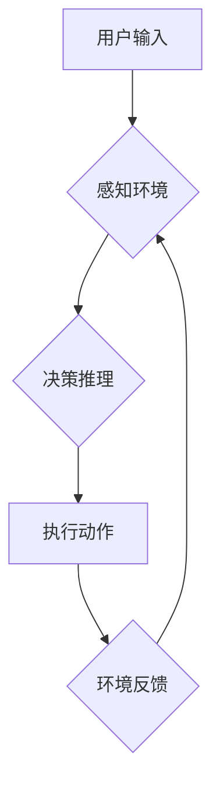

> AI Agent, 智能体, 传统软件, 强化学习, 决策推理, 知识表示, 应用场景

## 1. 背景介绍

人工智能（AI）技术近年来取得了飞速发展，从语音识别、图像识别到自然语言处理，AI已经渗透到我们生活的方方面面。然而，传统的AI模型大多是针对特定任务设计的，缺乏泛化能力和自主学习能力。

智能体（AI Agent）作为AI领域的新兴方向，旨在构建能够自主感知环境、做出决策并与环境交互的智能系统。与传统的AI模型相比，智能体具有以下特点：

* **自主性:** 智能体能够根据自身感知到的信息和目标，自主做出决策并执行行动。
* **适应性:** 智能体能够根据环境变化调整策略，并学习新的知识和技能。
* **交互性:** 智能体能够与环境和用户进行交互，并根据交互结果调整行为。

智能体的发展将推动AI技术向更高级的阶段迈进，并为我们带来更多创新应用。

## 2. 核心概念与联系

**2.1 智能体定义**

智能体是指能够感知环境、做出决策并与环境交互的智能系统。它是一个具有自主性、适应性和交互性的代理，其目标是通过与环境的交互来最大化自身的利益或实现预设的目标。

**2.2 智能体与传统软件的关系**

传统软件通常是按照预先定义的规则和流程运行的，而智能体则具有学习和适应能力，能够根据环境变化动态调整行为。

* **传统软件:**


* **智能体:**



**2.3 智能体架构**

智能体的架构通常包括以下几个主要模块：

* **感知模块:** 用于感知环境信息，例如传感器数据、用户输入等。
* **决策模块:** 用于根据感知到的信息和目标，做出决策。
* **执行模块:** 用于执行决策，并与环境进行交互。
* **学习模块:** 用于学习新的知识和技能，并不断改进决策能力。

## 3. 核心算法原理 & 具体操作步骤

**3.1 算法原理概述**

智能体算法的核心是决策推理和学习。常用的决策推理算法包括：

* **状态空间搜索:** 通过穷举搜索所有可能的行动序列，找到最优的决策。
* **蒙特卡罗树搜索:** 通过模拟多个可能的行动序列，评估每个行动的价值，并选择价值最高的行动。
* **强化学习:** 通过与环境交互，学习一个策略，使得在长期内获得最大的奖励。

**3.2 算法步骤详解**

以强化学习为例，其基本步骤如下：

1. **环境建模:** 建立一个数学模型来描述环境的动态行为。
2. **策略定义:** 定义一个策略函数，将环境状态映射到动作选择。
3. **奖励函数设计:** 设计一个奖励函数，根据智能体的行为和环境状态，给予相应的奖励或惩罚。
4. **训练过程:** 智能体通过与环境交互，不断更新策略，使得在长期内获得最大的奖励。

**3.3 算法优缺点**

* **优点:** 能够学习复杂的决策策略，并适应不断变化的环境。
* **缺点:** 训练过程可能需要大量的数据和计算资源，并且难以保证算法的收敛性。

**3.4 算法应用领域**

强化学习在许多领域都有广泛的应用，例如：

* **游戏:** 训练AI代理在游戏中取得胜利。
* **机器人:** 训练机器人完成复杂的任务，例如导航、抓取等。
* **金融:** 优化投资策略，降低风险。

## 4. 数学模型和公式 & 详细讲解 & 举例说明

**4.1 数学模型构建**

智能体可以被建模为一个马尔可夫决策过程（MDP），其中包括以下几个要素：

* **状态空间 (S):** 环境可能存在的各种状态。
* **动作空间 (A):** 智能体可以执行的各种动作。
* **转移概率 (P):** 从一个状态执行一个动作后，转移到另一个状态的概率。
* **奖励函数 (R):** 智能体在某个状态执行某个动作后获得的奖励。

**4.2 公式推导过程**

强化学习的目标是找到一个策略 π，使得智能体在长期内获得最大的累积奖励。

$$
J(π) = E[∑_{t=0}^{∞} γ^t R_t]
$$

其中：

* J(π) 是策略 π 的价值函数。
* E[⋅] 表示期望值。
* γ 是折扣因子，控制未来奖励的权重。
* R_t 是智能体在时间步 t 获得的奖励。

**4.3 案例分析与讲解**

例如，在一个简单的迷宫环境中，智能体的状态空间是迷宫中的每个位置，动作空间是上下左右四个方向。智能体在到达终点时获得奖励，在撞墙时获得惩罚。通过强化学习算法，智能体可以学习出最优的路径，从起点到达终点。

## 5. 项目实践：代码实例和详细解释说明

**5.1 开发环境搭建**

* Python 3.x
* TensorFlow 或 PyTorch 等深度学习框架
* OpenAI Gym 或其他强化学习环境

**5.2 源代码详细实现**

```python
import gym
import tensorflow as tf

# 定义神经网络模型
model = tf.keras.Sequential([
    tf.keras.layers.Dense(64, activation='relu'),
    tf.keras.layers.Dense(64, activation='relu'),
    tf.keras.layers.Dense(4, activation='softmax')
])

# 定义强化学习算法
agent = tf.keras.optimizers.Adam(learning_rate=0.001)

# 训练过程
for episode in range(1000):
    state = env.reset()
    done = False
    while not done:
        # 选择动作
        action = model.predict(state)[0]
        # 执行动作
        next_state, reward, done, _ = env.step(action)
        # 更新模型参数
        agent.train_on_batch(state, reward)
        # 更新状态
        state = next_state
```

**5.3 代码解读与分析**

* 代码首先定义了一个神经网络模型，用于将环境状态映射到动作选择。
* 然后定义了一个强化学习算法，例如DQN或A2C，用于更新模型参数。
* 训练过程是一个循环，智能体与环境交互，根据奖励更新模型参数，最终学习出最优的策略。

**5.4 运行结果展示**

训练完成后，智能体能够在环境中完成预设的任务，例如在迷宫中找到出口，或者在游戏游戏中取得胜利。

## 6. 实际应用场景

智能体在许多领域都有着广泛的应用前景，例如：

* **自动驾驶:** 智能体可以感知道路环境，做出驾驶决策，实现自动驾驶。
* **医疗诊断:** 智能体可以分析患者的病历和检查结果，辅助医生进行诊断。
* **金融交易:** 智能体可以分析市场数据，做出交易决策，实现自动交易。
* **客服机器人:** 智能体可以理解用户的自然语言，并提供智能客服服务。

**6.4 未来应用展望**

随着人工智能技术的不断发展，智能体将越来越智能化、个性化和泛化化，并应用于更多领域，为人类社会带来更多便利和福祉。

## 7. 工具和资源推荐

**7.1 学习资源推荐**

* **书籍:**
    * Reinforcement Learning: An Introduction by Sutton and Barto
    * Deep Reinforcement Learning Hands-On by Maxim Lapan
* **在线课程:**
    * Coursera: Reinforcement Learning Specialization
    * Udacity: Deep Reinforcement Learning Nanodegree

**7.2 开发工具推荐**

* **OpenAI Gym:** 强化学习环境
* **TensorFlow:** 深度学习框架
* **PyTorch:** 深度学习框架

**7.3 相关论文推荐**

* Deep Q-Network (DQN)
* Proximal Policy Optimization (PPO)
* Trust Region Policy Optimization (TRPO)

## 8. 总结：未来发展趋势与挑战

**8.1 研究成果总结**

近年来，智能体领域取得了显著进展，例如DQN、PPO等算法的提出，以及在游戏、机器人等领域的成功应用。

**8.2 未来发展趋势**

* **更强大的学习能力:** 研究更强大的学习算法，使得智能体能够学习更复杂的任务和环境。
* **更强的泛化能力:** 研究更通用的智能体架构，使得智能体能够适应更多不同的应用场景。
* **更安全的智能体:** 研究更安全的智能体算法，避免智能体出现不可预知的行为。

**8.3 面临的挑战**

* **数据获取和标注:** 强化学习算法需要大量的训练数据，而获取和标注高质量的数据仍然是一个挑战。
* **算法效率:** 训练智能体算法通常需要大量的计算资源，提高算法效率是一个重要的研究方向。
* **伦理问题:** 智能体技术的应用可能会带来一些伦理问题，例如智能体决策的透明度和可解释性，以及智能体对人类社会的影响。

**8.4 研究展望**

未来，智能体技术将继续发展，并为人类社会带来更多创新应用。我们需要加强对智能体技术的研究，并积极应对其带来的挑战，确保智能体技术能够安全、有效地服务于人类。

## 9. 附录：常见问题与解答

**9.1 什么是智能体？**

智能体是指能够感知环境、做出决策并与环境交互的智能系统。

**9.2 智能体与传统软件有什么区别？**

传统软件是按照预先定义的规则和流程运行的，而智能体则具有学习和适应能力，能够根据环境变化动态调整行为。

**9.3 强化学习是什么？**

强化学习是一种机器学习算法，通过与环境交互，学习一个策略，使得在长期内获得最大的奖励。

**9.4 智能体有哪些应用场景？**

智能体在许多领域都有着广泛的应用前景，例如自动驾驶、医疗诊断、金融交易、客服机器人等。


作者：禅与计算机程序设计艺术 / Zen and the Art of Computer Programming 
<end_of_turn>