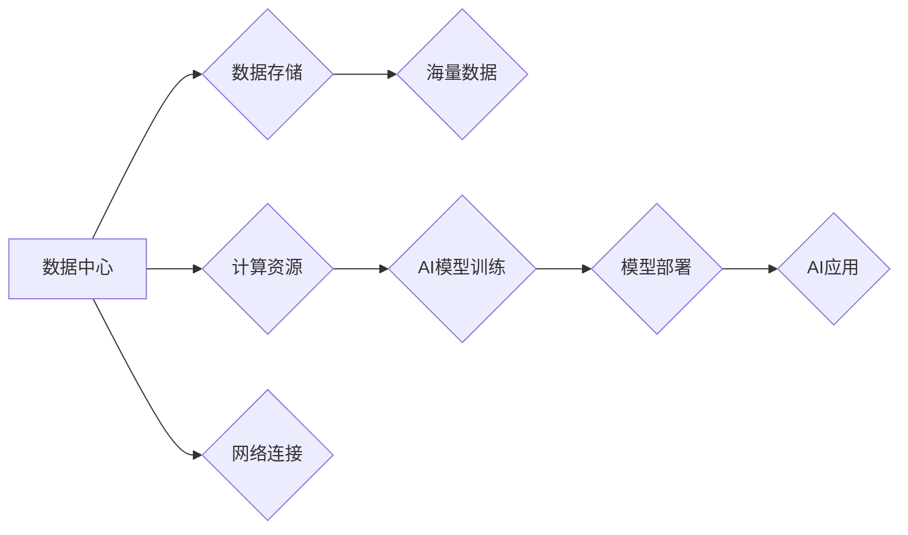

> AI大模型、数据中心、云计算、高性能计算、分布式存储、人工智能、机器学习

## 1. 背景介绍

近年来，人工智能（AI）技术取得了飞速发展，特别是大规模语言模型（LLM）的出现，如GPT-3、LaMDA等，展现出强大的文本生成、理解和翻译能力，为各行各业带来了革命性的变革。然而，训练和部署这些庞大的AI模型需要海量数据和强大的计算资源，这推动了数据中心建设和演进。

数据中心作为AI应用的基础设施，承担着海量数据存储、计算处理、模型训练和部署等关键任务。随着AI应用的不断扩展，数据中心面临着更高的性能要求、更低的延迟要求和更强的可扩展性要求。

## 2. 核心概念与联系

**2.1 数据中心架构**

数据中心通常由以下核心组件组成：

* **计算节点:** 负责执行计算任务，包括CPU、GPU、FPGA等硬件资源。
* **存储系统:** 负责存储海量数据，包括本地存储、网络存储、云存储等。
* **网络设备:** 负责数据传输和网络连接，包括交换机、路由器、防火墙等。
* **管理系统:** 负责监控、管理和维护整个数据中心。

**2.2 AI大模型与数据中心的关系**

AI大模型的训练和部署需要大量的数据和计算资源，而数据中心正是提供这些资源的关键基础设施。

* **数据存储:** 数据中心提供海量数据存储空间，满足AI模型训练和测试的需求。
* **计算能力:** 数据中心提供强大的计算能力，加速AI模型的训练和推理过程。
* **分布式训练:** 数据中心支持分布式训练，将模型训练任务分解到多个计算节点上，提高训练效率。
* **模型部署:** 数据中心提供平台和工具，方便部署和管理AI模型，使其能够服务于实际应用场景。

**2.3 数据中心技术与AI应用**

数据中心技术的发展直接推动了AI应用的进步。

* **高性能计算:** 高性能计算技术，如GPU加速、FPGA加速等，大幅提升了AI模型的训练速度和推理效率。
* **分布式存储:** 分布式存储技术，如对象存储、文件系统等，提供了海量数据存储空间和高可用性。
* **云计算:** 云计算平台提供了弹性、可扩展的计算和存储资源，降低了AI应用的部署成本和维护成本。

**2.4 Mermaid 流程图**



## 3. 核心算法原理 & 具体操作步骤

**3.1 算法原理概述**

深度学习算法是AI大模型的核心，其原理基于多层神经网络的结构和训练过程。

* **神经网络:** 神经网络由多个层组成，每层包含多个神经元，神经元之间通过连接和权重进行信息传递。
* **激活函数:** 激活函数用于引入非线性，使神经网络能够学习复杂的模式。
* **反向传播:** 反向传播算法用于更新神经网络的权重，使其能够更好地拟合数据。

**3.2 算法步骤详解**

1. **数据预处理:** 将原始数据转换为模型可理解的格式，例如文本数据需要进行词嵌入。
2. **模型构建:** 根据任务需求选择合适的网络架构，并初始化网络参数。
3. **模型训练:** 使用训练数据训练模型，通过反向传播算法更新网络参数，降低模型的损失函数值。
4. **模型评估:** 使用验证数据评估模型的性能，并根据评估结果调整模型参数或网络架构。
5. **模型部署:** 将训练好的模型部署到数据中心，使其能够服务于实际应用场景。

**3.3 算法优缺点**

* **优点:** 深度学习算法能够学习复杂的模式，并取得优异的性能。
* **缺点:** 深度学习算法需要大量数据和计算资源，训练时间长，且容易过拟合。

**3.4 算法应用领域**

深度学习算法广泛应用于图像识别、自然语言处理、语音识别、机器翻译等领域。

## 4. 数学模型和公式 & 详细讲解 & 举例说明

**4.1 数学模型构建**

深度学习模型可以看作是一个复杂的数学函数，其输入是数据，输出是预测结果。

* **神经网络层:** 每个神经网络层可以看作一个线性变换，加上一个非线性激活函数。
* **权重和偏置:** 每个神经元都有一个权重向量和一个偏置值，这些参数决定了神经元的激活程度。

**4.2 公式推导过程**

* **线性变换:**  $y = Wx + b$，其中 $x$ 是输入向量， $W$ 是权重矩阵， $b$ 是偏置向量， $y$ 是线性变换后的输出向量。
* **激活函数:** $a = f(y)$，其中 $f$ 是激活函数，例如ReLU函数、Sigmoid函数等。

**4.3 案例分析与讲解**

假设我们有一个简单的两层神经网络，用于分类手写数字。

* **输入层:** 784个神经元，对应于MNIST数据集中的图像像素。
* **隐藏层:** 128个神经元，使用ReLU激活函数。
* **输出层:** 10个神经元，对应于0-9的数字类别，使用Softmax激活函数。

训练过程中，通过反向传播算法更新网络参数，使得模型能够将输入图像映射到正确的数字类别。

## 5. 项目实践：代码实例和详细解释说明

**5.1 开发环境搭建**

* **操作系统:** Ubuntu 20.04
* **编程语言:** Python 3.8
* **深度学习框架:** TensorFlow 2.0
* **硬件环境:** GPU (NVIDIA GeForce RTX 3090)

**5.2 源代码详细实现**

```python
import tensorflow as tf

# 定义模型结构
model = tf.keras.models.Sequential([
    tf.keras.layers.Flatten(input_shape=(28, 28)),
    tf.keras.layers.Dense(128, activation='relu'),
    tf.keras.layers.Dense(10, activation='softmax')
])

# 编译模型
model.compile(optimizer='adam',
              loss='sparse_categorical_crossentropy',
              metrics=['accuracy'])

# 训练模型
model.fit(x_train, y_train, epochs=10)

# 评估模型
loss, accuracy = model.evaluate(x_test, y_test)
print('Test loss:', loss)
print('Test accuracy:', accuracy)
```

**5.3 代码解读与分析**

* **模型定义:** 使用`tf.keras.models.Sequential`定义一个顺序模型，包含两层全连接层。
* **编译模型:** 使用`adam`优化器、`sparse_categorical_crossentropy`损失函数和`accuracy`指标编译模型。
* **训练模型:** 使用`model.fit`方法训练模型，输入训练数据和指定训练轮数。
* **评估模型:** 使用`model.evaluate`方法评估模型，输入测试数据并输出测试损失和准确率。

**5.4 运行结果展示**

训练完成后，模型能够将输入图像映射到正确的数字类别，并达到一定的准确率。

## 6. 实际应用场景

**6.1 图像识别**

AI大模型可以用于识别图像中的物体、场景和人物，应用于自动驾驶、医疗诊断、安防监控等领域。

**6.2 自然语言处理**

AI大模型可以理解和生成自然语言，应用于机器翻译、文本摘要、聊天机器人等领域。

**6.3 语音识别**

AI大模型可以识别语音并将其转换为文本，应用于语音助手、语音搜索、语音识别等领域。

**6.4 其他应用场景**

AI大模型还可以应用于药物研发、金融预测、个性化推荐等领域。

**6.5 未来应用展望**

随着AI技术的不断发展，AI大模型将在更多领域发挥重要作用，例如：

* **智能家居:** AI大模型可以理解用户的语音指令，控制智能家居设备。
* **个性化教育:** AI大模型可以根据学生的学习情况提供个性化的学习内容和辅导。
* **医疗辅助:** AI大模型可以辅助医生诊断疾病、制定治疗方案。

## 7. 工具和资源推荐

**7.1 学习资源推荐**

* **课程:** 深度学习 Specialization (Coursera)
* **书籍:** 深度学习 (Ian Goodfellow)
* **博客:** TensorFlow Blog, PyTorch Blog

**7.2 开发工具推荐**

* **深度学习框架:** TensorFlow, PyTorch, Keras
* **云平台:** Google Cloud AI Platform, Amazon SageMaker, Microsoft Azure AI

**7.3 相关论文推荐**

* **Attention Is All You Need (Vaswani et al., 2017)**
* **BERT: Pre-training of Deep Bidirectional Transformers for Language Understanding (Devlin et al., 2018)**
* **GPT-3: Language Models are Few-Shot Learners (Brown et al., 2020)**

## 8. 总结：未来发展趋势与挑战

**8.1 研究成果总结**

近年来，AI大模型取得了显著进展，在多个领域取得了突破性成果。

**8.2 未来发展趋势**

* **模型规模:** 模型规模将继续扩大，训练更复杂的模型。
* **模型效率:** 研究更高效的训练和推理算法，降低模型训练和部署成本。
* **模型可解释性:** 研究更可解释的AI模型，提高模型的透明度和可信度。

**8.3 面临的挑战**

* **数据获取:** 训练大型AI模型需要海量数据，数据获取和标注成本高昂。
* **计算资源:** 训练大型AI模型需要大量的计算资源，成本高昂。
* **伦理问题:** AI模型可能存在偏见和歧视，需要解决伦理问题。

**8.4 研究展望**

未来，AI大模型将继续发展，在更多领域发挥重要作用。需要加强基础研究，解决模型效率、可解释性和伦理问题，推动AI技术安全、可持续发展。

## 9. 附录：常见问题与解答

**9.1 如何选择合适的AI模型？**

选择合适的AI模型需要根据具体的应用场景和数据特点进行选择。

**9.2 如何训练大型AI模型？**

训练大型AI模型需要强大的计算资源和海量数据，可以使用云平台或分布式训练框架进行训练。

**9.3 如何部署AI模型？**

AI模型可以部署到云平台、边缘设备或本地服务器上，根据应用场景选择合适的部署方式。


作者：禅与计算机程序设计艺术 / Zen and the Art of Computer Programming 
<end_of_turn>