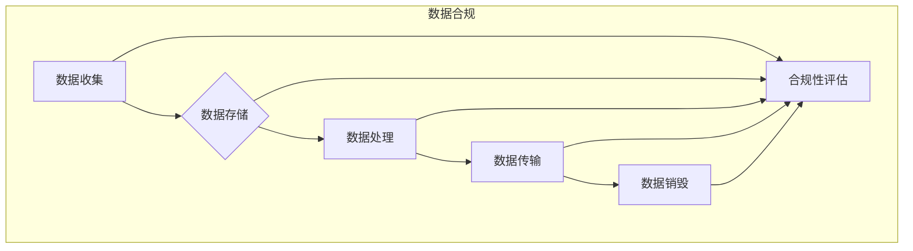

> AI大模型、数据中心、数据合规、隐私保护、安全保障、法规遵从、伦理规范

## 1. 背景介绍

随着人工智能（AI）技术的飞速发展，大规模人工智能模型（AI大模型）的应用日益广泛，涵盖了自然语言处理、计算机视觉、语音识别等多个领域。这些模型的训练和部署都需要海量数据作为基础，而数据中心作为数据存储和处理的核心设施，承担着AI大模型应用的关键角色。然而，数据中心所处理的敏感数据也面临着越来越多的安全和合规挑战。

数据合规是指数据处理活动必须符合相关法律法规、行业标准和组织政策的要求。在AI大模型应用数据中心中，数据合规问题尤为重要，因为它涉及到个人隐私保护、数据安全保障、算法公平性等多个方面。

## 2. 核心概念与联系

**2.1 数据中心**

数据中心是用于存储、处理和管理数据的物理设施，通常由大量服务器、网络设备、存储设备和电力系统组成。数据中心是现代企业和组织的基础设施，为各种应用提供数据服务。

**2.2 AI大模型**

AI大模型是指具有强大学习能力和泛化能力的深度学习模型，通常需要海量数据进行训练。AI大模型可以用于各种任务，例如自然语言理解、图像识别、语音合成等。

**2.3 数据合规**

数据合规是指数据处理活动必须符合相关法律法规、行业标准和组织政策的要求。数据合规涉及到数据收集、存储、处理、传输和销毁等各个环节。

**2.4 数据安全**

数据安全是指保护数据免受未经授权的访问、使用、披露、修改或销毁。数据安全措施包括访问控制、加密、备份和恢复等。

**2.5 隐私保护**

隐私保护是指保护个人信息免受未经授权的访问、使用、披露、修改或销毁。隐私保护措施包括匿名化、脱敏化、数据加密和访问控制等。

**2.6 算法公平性**

算法公平性是指AI算法在处理不同群体的数据时，不会产生歧视或偏见的结果。算法公平性是一个重要的伦理问题，需要在AI模型的开发和部署过程中予以关注。

**2.7 数据合规架构**

数据合规架构是指为确保数据处理活动符合合规要求而建立的组织架构、流程和技术体系。数据合规架构应涵盖数据生命周期的各个环节，并与数据安全和隐私保护措施相结合。



## 3. 核心算法原理 & 具体操作步骤

### 3.1  算法原理概述

数据合规算法通常基于以下核心原理：

* **最小化数据收集**: 仅收集必要的数据，避免收集敏感信息。
* **数据脱敏化**: 对敏感信息进行脱敏处理，例如替换真实姓名、地址等信息。
* **数据加密**: 对数据进行加密保护，防止未经授权的访问。
* **访问控制**: 对数据访问进行控制，确保只有授权人员才能访问数据。
* **审计日志**: 记录数据访问和处理活动，以便进行追溯和审计。

### 3.2  算法步骤详解

数据合规算法的具体操作步骤如下：

1. **数据收集**: 确定需要收集的数据，并制定数据收集策略。
2. **数据存储**: 选择安全的存储方式，例如加密存储或分布式存储。
3. **数据处理**: 对数据进行脱敏化、加密等处理，确保数据安全和合规。
4. **数据传输**: 使用安全的传输协议，例如HTTPS，保护数据在传输过程中的安全。
5. **数据销毁**: 定期清理不再需要的敏感数据，并采用安全销毁方法。
6. **合规性评估**: 定期评估数据处理活动是否符合合规要求，并进行必要的调整。

### 3.3  算法优缺点

**优点**:

* 能够有效保护数据安全和隐私。
* 能够帮助组织遵守相关法律法规和行业标准。
* 能够降低数据泄露和合规风险。

**缺点**:

* 需要投入一定的成本和资源进行实施。
* 需要不断更新和改进，以应对不断变化的威胁和法规。

### 3.4  算法应用领域

数据合规算法广泛应用于以下领域：

* 金融行业：保护客户金融数据安全。
* 医疗行业：保护患者医疗信息隐私。
* 电商行业：保护客户购物数据安全。
* 政府机构：保护公民个人信息安全。

## 4. 数学模型和公式 & 详细讲解 & 举例说明

### 4.1  数学模型构建

数据合规算法可以利用数学模型来评估数据风险和制定合规策略。例如，可以使用贝叶斯网络模型来评估不同数据处理操作的风险，并根据风险等级制定相应的安全措施。

### 4.2  公式推导过程

假设我们有一个包含n个数据点的集合D，每个数据点都具有一个敏感度值s，表示该数据点泄露的潜在风险。我们可以使用以下公式来计算集合D的整体风险R：

$$R = \sum_{i=1}^{n} s_i * p_i$$

其中，$p_i$表示数据点$i$泄露的概率。

### 4.3  案例分析与讲解

例如，假设我们有一个包含100个客户数据的集合D，每个客户数据都具有一个敏感度值，表示该客户数据泄露的潜在风险。假设我们使用贝叶斯网络模型评估每个客户数据的泄露概率，得到以下结果：

* 客户1: $p_1 = 0.1$
* 客户2: $p_2 = 0.05$
* ...
* 客户100: $p_{100} = 0.01$

我们可以使用上述公式计算集合D的整体风险R：

$$R = (s_1 * 0.1) + (s_2 * 0.05) + ... + (s_{100} * 0.01)$$

通过计算R的值，我们可以评估集合D的整体风险，并根据风险等级制定相应的安全措施。

## 5. 项目实践：代码实例和详细解释说明

### 5.1  开发环境搭建

为了演示数据合规算法的实现，我们可以使用Python语言和相关的库进行开发。开发环境搭建步骤如下：

1. 安装Python语言环境。
2. 安装必要的库，例如pandas、numpy、scikit-learn等。

### 5.2  源代码详细实现

```python
import pandas as pd

# 数据加载
data = pd.read_csv("customer_data.csv")

# 数据脱敏化
data["name"] = data["name"].apply(lambda x: "匿名用户")

# 数据加密
data["email"] = data["email"].apply(lambda x: encrypt(x))

# 数据存储
data.to_csv("deidentified_data.csv", index=False)
```

### 5.3  代码解读与分析

这段代码演示了数据脱敏化和加密的实现。

* `data = pd.read_csv("customer_data.csv")`：读取客户数据文件。
* `data["name"] = data["name"].apply(lambda x: "匿名用户")`：对姓名字段进行脱敏处理，替换为“匿名用户”。
* `data["email"] = data["email"].apply(lambda x: encrypt(x))`：对邮箱字段进行加密处理，使用加密函数`encrypt`加密邮箱地址。
* `data.to_csv("deidentified_data.csv", index=False)`：将脱敏化和加密后的数据保存到新的文件。

### 5.4  运行结果展示

运行这段代码后，将生成一个新的文件`deidentified_data.csv`，其中客户姓名和邮箱地址都已进行脱敏化和加密处理。

## 6. 实际应用场景

### 6.1  金融行业

在金融行业，数据合规算法可以用于保护客户金融数据安全。例如，银行可以使用数据合规算法来加密客户的账户信息、交易记录等敏感数据，防止数据泄露。

### 6.2  医疗行业

在医疗行业，数据合规算法可以用于保护患者医疗信息隐私。例如，医院可以使用数据合规算法来脱敏化患者的医疗记录，防止患者身份信息泄露。

### 6.3  电商行业

在电商行业，数据合规算法可以用于保护客户购物数据安全。例如，电商平台可以使用数据合规算法来加密客户的信用卡信息、收货地址等敏感数据，防止数据泄露。

### 6.4  未来应用展望

随着AI技术的不断发展，数据合规算法将应用于更多领域，例如智能家居、自动驾驶等。未来，数据合规算法将更加智能化、自动化，能够更好地保护数据安全和隐私。

## 7. 工具和资源推荐

### 7.1  学习资源推荐

* **书籍**:
    * 《数据安全与隐私保护》
    * 《人工智能伦理》
* **在线课程**:
    * Coursera: 数据安全与隐私保护
    * edX: 人工智能伦理

### 7.2  开发工具推荐

* **数据脱敏工具**:
    * OpenRefine
    * DataMask
* **数据加密工具**:
    * OpenSSL
    * GPG

### 7.3  相关论文推荐

* **数据合规算法**:
    * "A Survey of Data Privacy-Preserving Techniques"
    * "Federated Learning for Privacy-Preserving Machine Learning"
* **AI伦理**:
    * "On the Dangers of Stochastic Parrots: Can Language Models Be Too Big?"
    * "AI Ethics: A Guide for Developers"

## 8. 总结：未来发展趋势与挑战

### 8.1  研究成果总结

数据合规算法在保护数据安全和隐私方面取得了显著成果，为组织和个人提供了有效的合规保障。

### 8.2  未来发展趋势

未来，数据合规算法将朝着以下方向发展：

* **更加智能化**: 利用机器学习等技术，自动识别和处理数据风险。
* **更加自动化**: 自动执行数据合规操作，减少人工干预。
* **更加可解释**: 提高算法的可解释性，帮助用户理解算法的决策过程。

### 8.3  面临的挑战

数据合规算法也面临着一些挑战：

* **技术复杂性**: 数据合规算法的实现需要复杂的数学模型和算法，需要专业的技术人员进行开发和维护。
* **法规变化**: 数据保护法规不断变化，需要不断更新和改进数据合规算法。
* **伦理问题**: 数据合规算法的应用也可能引发一些伦理问题，例如数据隐私权和算法公平性等。

### 8.4  研究展望

未来，我们需要继续研究和开发更智能、更自动化、更可解释的数据合规算法，以更好地保护数据安全和隐私。同时，还需要加强对数据合规算法的伦理规范和监管，确保其安全、公平、可持续地发展。

## 9. 附录：常见问题与解答

**问题1**: 如何选择合适的脱敏化方法？

**解答**: 选择脱敏化方法需要根据数据的敏感程度和应用场景进行选择。常见的脱敏化方法包括替换、模糊化、加密等。

**问题2**: 如何确保数据加密的安全性？

**解答**: 数据加密需要使用强密码算法和安全的密钥管理机制。

**问题3**: 如何应对数据合规法规的不断变化？

**解答**: 需要定期关注数据保护法规的更新，并及时更新数据合规策略和技术措施。


作者：禅与计算机程序设计艺术 / Zen and the Art of Computer Programming 
<end_of_turn>