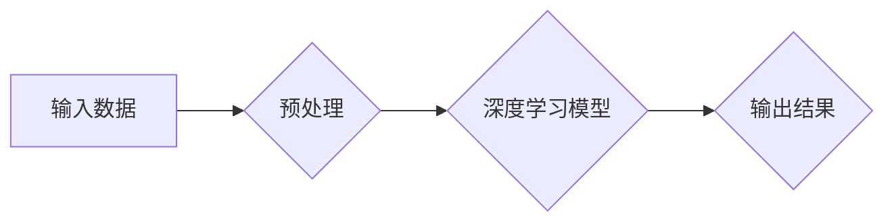

> AIGC, 文本生成, 图像生成, 算法原理, 数学模型, 项目实践, 应用场景, 未来趋势

## 1. 背景介绍

人工智能（AI）技术近年来发展迅速，特别是生成式人工智能（AIGC）的兴起，为人们的生活和工作带来了革命性的改变。AIGC是指能够根据输入的文本、图像、音频等数据生成新的文本、图像、音频等内容的AI模型。它打破了传统人工智能只能处理已知数据的局限性，赋予机器创造内容的能力，为人类创造无限可能。

AIGC技术在各个领域都有着广泛的应用前景，例如：

* **内容创作:** 自动生成新闻报道、广告文案、诗歌、小说等，提高内容生产效率，降低成本。
* **教育培训:** 个性化定制学习内容，提供智能辅导，提升学习效率。
* **艺术创作:** 生成绘画、音乐、视频等艺术作品，激发人类的创造力。
* **科学研究:** 自动生成实验数据、分析研究结果，加速科学发现。

## 2. 核心概念与联系

AIGC的核心概念包括：

* **深度学习:** AIGC模型通常基于深度学习算法，例如Transformer、GAN等，能够从海量数据中学习复杂的模式和规律。
* **自然语言处理 (NLP):** 用于处理和理解人类语言，例如文本分类、情感分析、机器翻译等。
* **计算机视觉 (CV):** 用于处理和理解图像和视频，例如图像识别、物体检测、图像生成等。

**Mermaid 流程图:**



## 3. 核心算法原理 & 具体操作步骤

### 3.1  算法原理概述

AIGC模型的训练过程通常采用监督学习或无监督学习的方式。

* **监督学习:** 使用标注好的训练数据，例如文本和对应的摘要、图像和对应的描述等，训练模型生成与输入数据相匹配的输出。
* **无监督学习:** 使用未标注的训练数据，例如大量的文本或图像，训练模型学习数据的内在结构和规律，从而能够生成新的内容。

### 3.2  算法步骤详解

1. **数据收集和预处理:** 收集大量相关数据，并进行清洗、格式化、编码等预处理操作，以确保数据质量和模型训练的有效性。
2. **模型选择和训练:** 选择合适的深度学习模型，例如Transformer、GAN等，并根据训练数据进行模型训练，调整模型参数，使其能够生成高质量的输出。
3. **模型评估和优化:** 使用测试数据评估模型的性能，例如准确率、流畅度、多样性等，并根据评估结果对模型进行优化，例如调整模型结构、训练参数等。
4. **模型部署和应用:** 将训练好的模型部署到实际应用场景中，例如网站、应用程序等，并根据用户需求生成新的内容。

### 3.3  算法优缺点

**优点:**

* **生成高质量内容:** AIGC模型能够生成逼真、流畅、富有创意的内容，满足人类多样化的需求。
* **提高效率:** 自动化内容生成过程，节省人力成本和时间成本。
* **拓展应用场景:** AIGC技术在各个领域都有着广泛的应用前景，为人类创造无限可能。

**缺点:**

* **数据依赖:** AIGC模型的性能取决于训练数据的质量和数量，数据不足或数据质量低会导致模型性能下降。
* **伦理风险:** AIGC技术可能被用于生成虚假信息、恶意内容等，需要加强伦理规范和监管。
* **技术挑战:** AIGC技术还处于发展初期，存在着许多技术挑战，例如如何生成更具创意和原创性的内容、如何解决模型偏见等问题。

### 3.4  算法应用领域

* **内容创作:** 自动生成新闻报道、广告文案、诗歌、小说等，提高内容生产效率，降低成本。
* **教育培训:** 个性化定制学习内容，提供智能辅导，提升学习效率。
* **艺术创作:** 生成绘画、音乐、视频等艺术作品，激发人类的创造力。
* **科学研究:** 自动生成实验数据、分析研究结果，加速科学发现。

## 4. 数学模型和公式 & 详细讲解 & 举例说明

### 4.1  数学模型构建

AIGC模型通常基于深度学习算法，例如Transformer、GAN等。这些算法的核心是神经网络，它由多个层级的神经元组成，每个神经元接收输入信号，进行计算，并输出信号。

**Transformer模型:**

Transformer模型是一种基于注意力机制的神经网络架构，能够处理长序列数据，例如文本。其核心结构包括编码器和解码器，编码器用于将输入文本编码成向量表示，解码器则根据编码后的向量表示生成输出文本。

**GAN模型:**

GAN模型由两个神经网络组成：生成器和判别器。生成器负责生成新的数据，判别器负责判断数据是否为真实数据或生成数据。这两个网络在对抗游戏中相互竞争，生成器试图生成越来越逼真的数据，判别器试图更好地区分真实数据和生成数据。

### 4.2  公式推导过程

Transformer模型的注意力机制公式如下：

$$
Attention(Q, K, V) = \frac{exp(Q \cdot K^T / \sqrt{d_k})}{exp(Q \cdot K^T / \sqrt{d_k})} \cdot V
$$

其中：

* $Q$：查询矩阵
* $K$：键矩阵
* $V$：值矩阵
* $d_k$：键向量的维度

GAN模型的损失函数通常采用二元交叉熵损失函数，用于衡量判别器对真实数据和生成数据的分类准确率。

### 4.3  案例分析与讲解

**Transformer模型应用案例:**

* **机器翻译:** Transformer模型在机器翻译领域取得了显著的成果，例如Google Translate、DeepL等翻译工具都采用了Transformer模型。

**GAN模型应用案例:**

* **图像生成:** GAN模型能够生成逼真的图像，例如DeepFake技术就是利用GAN模型生成人脸视频。

## 5. 项目实践：代码实例和详细解释说明

### 5.1  开发环境搭建

AIGC项目开发环境通常需要以下软件和工具：

* **Python:** AIGC模型开发的主要编程语言。
* **深度学习框架:** 例如TensorFlow、PyTorch等，用于构建和训练AIGC模型。
* **GPU:** 加速模型训练，提高效率。

### 5.2  源代码详细实现

以下是一个简单的文本生成AIGC模型的代码示例，使用PyTorch框架实现：

```python
import torch
import torch.nn as nn

class TextGenerator(nn.Module):
    def __init__(self, vocab_size, embedding_dim, hidden_dim):
        super(TextGenerator, self).__init__()
        self.embedding = nn.Embedding(vocab_size, embedding_dim)
        self.lstm = nn.LSTM(embedding_dim, hidden_dim)
        self.fc = nn.Linear(hidden_dim, vocab_size)

    def forward(self, x):
        embedded = self.embedding(x)
        output, (hidden, cell) = self.lstm(embedded)
        output = self.fc(output[:, -1, :])
        return output

# 模型参数
vocab_size = 10000
embedding_dim = 128
hidden_dim = 256

# 实例化模型
model = TextGenerator(vocab_size, embedding_dim, hidden_dim)

# 训练模型
# ...

# 生成文本
# ...
```

### 5.3  代码解读与分析

* **模型结构:** 该模型采用嵌入层、LSTM层和全连接层组成。嵌入层将单词转换为向量表示，LSTM层用于处理文本序列，全连接层用于预测下一个单词。
* **训练过程:** 模型训练过程通常使用随机梯度下降算法，通过调整模型参数，使模型能够生成与真实文本相似的输出。
* **文本生成:** 在训练完成后，可以输入一个文本片段作为种子，模型会根据输入文本生成后续的文本内容。

### 5.4  运行结果展示

AIGC模型的运行结果通常以文本形式展示，例如：

```
输入文本: 今天天气真好

模型输出: 阳光明媚，适合出去散步。
```

## 6. 实际应用场景

### 6.1  新闻报道生成

AIGC可以自动生成新闻报道，例如根据新闻事件的关键词和相关信息，自动生成新闻标题、新闻正文等。

### 6.2  广告文案创作

AIGC可以根据目标客户群和产品特点，自动生成吸引人的广告文案，例如广告标题、广告描述、广告语等。

### 6.3  教育内容生成

AIGC可以根据学生的学习进度和知识点，自动生成个性化的学习内容，例如习题、练习、讲解视频等。

### 6.4  未来应用展望

AIGC技术在未来将有更广泛的应用场景，例如：

* **虚拟助手:** 更智能、更人性化的虚拟助手，能够理解和响应用户的自然语言指令。
* **个性化娱乐:** 根据用户的喜好，自动生成个性化的音乐、视频、游戏等娱乐内容。
* **科学研究加速:** 自动生成实验数据、分析研究结果，加速科学发现。

## 7. 工具和资源推荐

### 7.1  学习资源推荐

* **书籍:**
    * 《深度学习》
    * 《自然语言处理》
    * 《生成对抗网络》
* **在线课程:**
    * Coursera
    * edX
    * Udacity

### 7.2  开发工具推荐

* **深度学习框架:** TensorFlow、PyTorch、Keras
* **文本处理工具:** NLTK、spaCy
* **图像处理工具:** OpenCV

### 7.3  相关论文推荐

* 《Attention Is All You Need》
* 《Generative Adversarial Nets》
* 《BERT: Pre-training of Deep Bidirectional Transformers for Language Understanding》

## 8. 总结：未来发展趋势与挑战

### 8.1  研究成果总结

AIGC技术近年来取得了显著的进展，能够生成高质量的文本、图像、音频等内容，为人类创造无限可能。

### 8.2  未来发展趋势

* **模型能力提升:** 模型将更加强大，能够生成更加逼真、更加原创性的内容。
* **应用场景拓展:** AIGC技术将应用到更多领域，例如医疗、金融、教育等。
* **伦理规范完善:** 随着AIGC技术的应用越来越广泛，伦理规范和监管将更加完善。

### 8.3  面临的挑战

* **数据安全:** AIGC模型的训练需要大量数据，数据安全问题需要得到重视。
* **模型偏见:** AIGC模型可能存在偏见，需要进行公平性评估和改进。
* **可解释性:** AIGC模型的决策过程难以理解，需要提高模型的可解释性。

### 8.4  研究展望

未来，AIGC技术将继续朝着更加智能、更加安全、更加可解释的方向发展，为人类社会带来更多福祉。

## 9. 附录：常见问题与解答

**常见问题:**

* **AIGC技术与传统人工智能有什么区别？**

**解答:**

传统人工智能通常只能处理已知数据，而AIGC能够生成新的内容，具有创造性。

* **AIGC技术有哪些应用场景？**

**解答:**

AIGC技术应用场景广泛，例如内容创作、教育培训、艺术创作等。

* **AIGC技术有哪些伦理风险？**

**解答:**

AIGC技术可能被用于生成虚假信息、恶意内容等，需要加强伦理规范和监管。

**作者：禅与计算机程序设计艺术 / Zen and the Art of Computer Programming**


<end_of_turn>