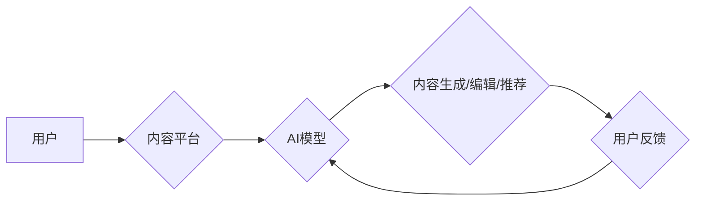

> AI、出版业、垂直领域、自然语言处理、机器学习、内容生成、个性化推荐、数据分析

## 1. 背景介绍

出版业作为文化传播的重要载体，近年来面临着前所未有的挑战。传统出版模式的局限性，如生产成本高、发行渠道单一、读者触达难等问题，逐渐暴露出来。而人工智能（AI）技术的快速发展，为出版业带来了前所未有的机遇。AI技术能够有效解决传统出版业面临的痛点，并赋予出版业全新的活力。

## 2. 核心概念与联系

**2.1 AI在出版业的应用场景**

AI技术在出版业的应用场景广泛，主要包括：

* **内容创作:** 利用AI技术生成新闻、小说、诗歌等各种类型的文本内容。
* **内容编辑:** 利用AI技术进行文本校对、语法检查、风格调整等编辑工作。
* **内容推荐:** 根据用户的阅读偏好，利用AI技术推荐个性化的书籍和文章。
* **数据分析:** 利用AI技术分析用户阅读数据，洞察市场趋势，优化出版策略。

**2.2 AI技术与出版业的融合**

AI技术与出版业的融合，主要体现在以下几个方面：

* **自然语言处理（NLP）:** NLP技术能够理解和生成人类语言，为内容创作、编辑和推荐提供了技术支撑。
* **机器学习（ML）:** ML技术能够从海量数据中学习模式，为内容推荐和数据分析提供了强大的工具。
* **深度学习（DL）:** DL技术能够学习更复杂的模式，为内容创作和理解提供了更高级的解决方案。

**2.3 AI出版业架构**



## 3. 核心算法原理 & 具体操作步骤

**3.1 算法原理概述**

本文将重点介绍基于Transformer架构的生成式预训练语言模型（GPT）在AI出版业中的应用。GPT模型通过大量的文本数据进行预训练，学习了语言的语法、语义和上下文关系，能够生成流畅、自然的文本内容。

**3.2 算法步骤详解**

1. **数据预处理:** 收集并清洗海量文本数据，将其转换为模型可识别的格式。
2. **模型训练:** 利用预训练的GPT模型，对文本数据进行微调，使其能够生成特定领域的文本内容。
3. **内容生成:** 根据用户的输入提示，利用微调后的GPT模型生成相应的文本内容。
4. **内容评估:** 对生成的文本内容进行评估，例如流畅度、准确性、相关性等，并根据评估结果进行优化。

**3.3 算法优缺点**

* **优点:**
    * 生成流畅、自然的文本内容。
    * 可以生成不同类型的文本内容，例如新闻、小说、诗歌等。
    * 可以根据用户的输入提示进行个性化生成。
* **缺点:**
    * 需要大量的文本数据进行预训练和微调。
    * 生成的内容可能存在偏差或错误。
    * 缺乏对真实世界的理解和常识。

**3.4 算法应用领域**

* **自动写作:** 自动生成新闻报道、产品描述、广告文案等。
* **内容创作辅助:** 帮助作家克服写作瓶颈，生成故事梗概、人物设定等。
* **个性化学习:** 根据学生的学习进度和需求，生成个性化的学习内容。

## 4. 数学模型和公式 & 详细讲解 & 举例说明

**4.1 数学模型构建**

GPT模型基于Transformer架构，其核心是自注意力机制（Self-Attention）。自注意力机制能够捕捉文本中单词之间的长距离依赖关系，从而提高模型的理解能力。

**4.2 公式推导过程**

自注意力机制的计算公式如下：

$$
Attention(Q, K, V) = softmax(\frac{QK^T}{\sqrt{d_k}})V
$$

其中：

* $Q$：查询矩阵
* $K$：键矩阵
* $V$：值矩阵
* $d_k$：键向量的维度
* $softmax$：softmax函数

**4.3 案例分析与讲解**

假设我们有一个句子：“我爱吃苹果”。

* $Q$：查询矩阵包含每个单词的查询向量。
* $K$：键矩阵包含每个单词的键向量。
* $V$：值矩阵包含每个单词的值向量。

通过计算$QK^T$，我们可以得到每个单词与其他单词之间的相似度得分。然后，使用softmax函数将得分归一化，得到每个单词对其他单词的注意力权重。最后，将注意力权重与值矩阵相乘，得到每个单词的加权和，即最终的输出向量。

## 5. 项目实践：代码实例和详细解释说明

**5.1 开发环境搭建**

* Python 3.7+
* TensorFlow 2.0+
* PyTorch 1.0+
* CUDA 10.0+

**5.2 源代码详细实现**

```python
# 使用GPT模型生成文本内容
from transformers import GPT2LMHeadModel, GPT2Tokenizer

# 加载预训练模型和词典
model_name = "gpt2"
tokenizer = GPT2Tokenizer.from_pretrained(model_name)
model = GPT2LMHeadModel.from_pretrained(model_name)

# 输入提示
prompt = "今天天气真好"

# Token化输入
input_ids = tokenizer.encode(prompt, return_tensors="pt")

# 生成文本内容
output = model.generate(input_ids, max_length=50)

# 解码输出
generated_text = tokenizer.decode(output[0], skip_special_tokens=True)

# 打印结果
print(generated_text)
```

**5.3 代码解读与分析**

* 使用`transformers`库加载预训练的GPT模型和词典。
* 使用`tokenizer`将输入提示转换为模型可识别的token序列。
* 使用`model.generate()`函数生成文本内容。
* 使用`tokenizer.decode()`函数将生成的token序列解码为文本内容。

**5.4 运行结果展示**

```
今天天气真好，阳光明媚，鸟儿歌唱。
```

## 6. 实际应用场景

**6.1 自动新闻生成**

利用GPT模型自动生成新闻报道，例如天气预报、股市走势等。

**6.2 个性化教育**

根据学生的学习进度和需求，生成个性化的学习内容，例如习题、练习、讲解视频等。

**6.3 内容营销**

利用GPT模型生成吸引人的广告文案、社交媒体内容等，提高营销效果。

**6.4 未来应用展望**

* 更智能、更个性化的内容推荐。
* 更逼真的虚拟人物和游戏角色。
* 更高效的科研和技术开发。

## 7. 工具和资源推荐

**7.1 学习资源推荐**

* **书籍:**
    * 《深度学习》
    * 《自然语言处理》
* **在线课程:**
    * Coursera
    * edX
    * fast.ai

**7.2 开发工具推荐**

* **TensorFlow:** 开源机器学习框架。
* **PyTorch:** 开源机器学习框架。
* **HuggingFace:** 提供预训练模型和工具。

**7.3 相关论文推荐**

* 《Attention Is All You Need》
* 《BERT: Pre-training of Deep Bidirectional Transformers for Language Understanding》

## 8. 总结：未来发展趋势与挑战

**8.1 研究成果总结**

AI技术在出版业的应用取得了显著成果，例如自动写作、个性化推荐等。

**8.2 未来发展趋势**

* 更强大的AI模型，能够生成更复杂、更具创造性的内容。
* 更智能的交互方式，例如语音交互、图像交互等。
* 更广泛的应用场景，例如虚拟现实、增强现实等。

**8.3 面临的挑战**

* 算法的可靠性和安全性。
* 数据隐私和版权问题。
* 人工智能伦理问题。

**8.4 研究展望**

未来，需要进一步研究AI模型的可靠性和安全性，以及人工智能伦理问题，确保AI技术在出版业的应用能够造福人类。

## 9. 附录：常见问题与解答

**9.1 如何选择合适的AI模型？**

选择合适的AI模型取决于具体的应用场景和需求。例如，如果需要生成新闻报道，可以选择基于Transformer架构的生成式预训练语言模型；如果需要进行文本分类，可以选择基于CNN或RNN架构的分类模型。

**9.2 如何评估AI生成的文本内容？**

可以从流畅度、准确性、相关性等方面进行评估。可以使用人工评估、自动评估等方法。

**9.3 AI技术会取代人类出版人吗？**

AI技术可以帮助出版人提高效率，但不会完全取代人类出版人。人类出版人仍然需要负责内容的策划、编辑、审校等工作。


作者：禅与计算机程序设计艺术 / Zen and the Art of Computer Programming 
<end_of_turn>