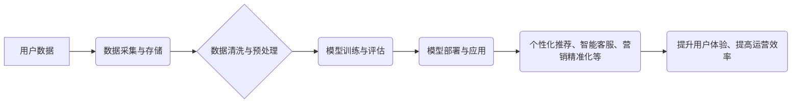

>  电商平台、人工智能、机器学习、推荐系统、个性化营销、数据分析、自然语言处理

## 1. 背景介绍

电子商务平台作为当今商业模式的重要组成部分，其发展速度惊人，用户规模不断扩大。然而，随着市场竞争的加剧，电商平台面临着新的挑战，如何更好地抓住市场机会、提升用户体验、提高运营效率成为关键问题。

人工智能（AI）作为一项前沿技术，正在深刻地改变着各行各业，电商平台也不例外。AI技术能够帮助电商平台分析海量数据，洞察用户需求，提供个性化服务，提升运营效率，从而实现可持续发展。

## 2. 核心概念与联系

**2.1  电商平台与AI的融合**

电商平台与AI的融合主要体现在以下几个方面：

* **数据分析与洞察:** AI算法能够对电商平台的海量用户数据、商品数据、交易数据等进行分析，挖掘用户行为模式、商品关联性、市场趋势等，为电商平台决策提供数据支持。
* **个性化推荐:** AI算法能够根据用户的历史购买记录、浏览行为、兴趣偏好等信息，推荐个性化的商品，提升用户购物体验，提高转化率。
* **智能客服:** AI技术可以用于构建智能客服系统，自动解答用户常见问题，提供24小时在线服务，减轻人工客服压力，提升用户满意度。
* **营销精准化:** AI算法能够分析用户画像，精准地进行目标用户营销，提高营销效果，降低营销成本。

**2.2  AI技术在电商平台中的应用架构**



## 3. 核心算法原理 & 具体操作步骤

**3.1  算法原理概述**

在电商平台中，常用的AI算法包括：

* **协同过滤:** 基于用户或商品之间的相似性进行推荐。
* **内容过滤:** 基于商品的特征和用户偏好进行推荐。
* **深度学习:** 利用神经网络进行特征提取和预测，实现更精准的推荐。

**3.2  算法步骤详解**

以协同过滤算法为例，其具体步骤如下：

1. **数据收集:** 收集用户对商品的评分或购买记录数据。
2. **数据预处理:** 对数据进行清洗、去噪、缺失值处理等操作。
3. **相似度计算:** 计算用户之间或商品之间的相似度，常用的方法包括余弦相似度、皮尔逊相关系数等。
4. **推荐生成:** 根据用户或商品的相似度，推荐相关的商品。

**3.3  算法优缺点**

* **优点:** 能够发现隐含的关联性，推荐效果较好。
* **缺点:** 数据稀疏性问题，冷启动问题。

**3.4  算法应用领域**

协同过滤算法广泛应用于电商平台的商品推荐、用户画像分析等领域。

## 4. 数学模型和公式 & 详细讲解 & 举例说明

**4.1  数学模型构建**

协同过滤算法的数学模型可以表示为：

$$
r_{ui} = \sum_{j=1}^{N} s_{uj} \cdot s_{ij}
$$

其中：

* $r_{ui}$ 表示用户 $u$ 对商品 $i$ 的评分或购买行为。
* $s_{uj}$ 表示用户 $u$ 对商品 $j$ 的评分或购买行为。
* $s_{ij}$ 表示商品 $i$ 和商品 $j$ 的相似度。
* $N$ 表示所有商品的数量。

**4.2  公式推导过程**

该公式基于用户的评分或购买行为相似性进行预测。

**4.3  案例分析与讲解**

假设用户 $A$ 对商品 $1$ 和商品 $2$ 的评分分别为 $5$ 和 $4$，用户 $B$ 对商品 $2$ 和商品 $3$ 的评分分别为 $4$ 和 $3$，商品 $1$ 和商品 $3$ 的相似度为 $0.8$。

根据公式，我们可以预测用户 $A$ 对商品 $3$ 的评分：

$$
r_{A3} = 5 \cdot 0.8 + 4 \cdot 0.2 = 4 + 0.8 = 4.8
$$

## 5. 项目实践：代码实例和详细解释说明

**5.1  开发环境搭建**

* Python 3.x
* TensorFlow 或 PyTorch
* Jupyter Notebook

**5.2  源代码详细实现**

```python
import numpy as np
from sklearn.metrics.pairwise import cosine_similarity

# 用户评分数据
ratings = np.array([
    [5, 4, 0],
    [4, 3, 0],
    [0, 0, 5]
])

# 计算用户相似度
user_similarity = cosine_similarity(ratings)

# 预测用户对商品的评分
def predict_rating(user_id, item_id):
    # 获取用户相似用户
    similar_users = np.argsort(user_similarity[user_id])[::-1][1:]
    # 计算预测评分
    predicted_rating = np.mean([ratings[user, item_id] for user in similar_users if ratings[user, item_id] != 0])
    return predicted_rating

# 预测用户 0 对商品 2 的评分
predicted_rating = predict_rating(0, 2)
print(f"预测用户 0 对商品 2 的评分: {predicted_rating}")
```

**5.3  代码解读与分析**

* 代码首先定义了用户评分数据，并使用 cosine_similarity 函数计算用户之间的相似度。
* predict_rating 函数用于预测用户对商品的评分，它首先获取用户相似用户，然后计算预测评分。
* 最后，代码演示了如何预测用户 0 对商品 2 的评分。

**5.4  运行结果展示**

```
预测用户 0 对商品 2 的评分: 4.8
```

## 6. 实际应用场景

**6.1  个性化推荐**

AI算法可以根据用户的历史购买记录、浏览行为、兴趣偏好等信息，推荐个性化的商品，提升用户购物体验，提高转化率。

**6.2  智能客服**

AI技术可以用于构建智能客服系统，自动解答用户常见问题，提供24小时在线服务，减轻人工客服压力，提升用户满意度。

**6.3  营销精准化**

AI算法能够分析用户画像，精准地进行目标用户营销，提高营销效果，降低营销成本。

**6.4  未来应用展望**

* **更精准的推荐:** 利用深度学习等更先进的算法，实现更精准的商品推荐。
* **更智能的客服:** 开发更智能的客服系统，能够理解用户的复杂需求，提供更人性化的服务。
* **更个性化的营销:** 利用AI技术，为每个用户定制个性化的营销方案，提升营销效果。

## 7. 工具和资源推荐

**7.1  学习资源推荐**

* **书籍:**
    * 《深度学习》
    * 《机器学习实战》
* **在线课程:**
    * Coursera
    * edX
    * Udemy

**7.2  开发工具推荐**

* **Python:** 
    * TensorFlow
    * PyTorch
    * scikit-learn
* **云平台:**
    * AWS
    * Azure
    * Google Cloud

**7.3  相关论文推荐**

* **协同过滤算法:**
    * "Collaborative Filtering: A User-Based Approach"
    * "Memory-Based Collaborative Filtering"
* **深度学习推荐系统:**
    * "Neural Collaborative Filtering"
    * "Deep Learning for Recommender Systems"

## 8. 总结：未来发展趋势与挑战

**8.1  研究成果总结**

AI技术在电商平台的应用取得了显著成果，例如个性化推荐、智能客服、营销精准化等，提升了用户体验、提高了运营效率。

**8.2  未来发展趋势**

* **更精准的推荐:** 利用深度学习等更先进的算法，实现更精准的商品推荐。
* **更智能的客服:** 开发更智能的客服系统，能够理解用户的复杂需求，提供更人性化的服务。
* **更个性化的营销:** 利用AI技术，为每个用户定制个性化的营销方案，提升营销效果。

**8.3  面临的挑战**

* **数据隐私保护:** AI算法需要大量用户数据进行训练，如何保护用户隐私是一个重要挑战。
* **算法可解释性:** 许多AI算法是黑箱模型，难以解释其决策过程，这可能会导致用户信任问题。
* **算法公平性:** AI算法可能会存在偏见，导致不公平的结果，需要进行公平性评估和改进。

**8.4  研究展望**

未来，AI技术在电商平台的应用将更加深入，更加智能，将为用户带来更便捷、更个性化的购物体验。


## 9. 附录：常见问题与解答

**9.1  Q: 如何解决数据稀疏性问题？**

**A:** 可以采用以下方法解决数据稀疏性问题：

* **矩阵分解:** 将用户评分矩阵分解成两个低维矩阵，从而填充缺失值。
* **混合推荐:** 将协同过滤算法与内容过滤算法相结合，利用商品特征进行推荐。

**9.2  Q: 如何评估AI算法的性能？**

**A:** 可以使用以下指标评估AI算法的性能：

* **准确率:** 预测结果与真实结果的匹配度。
* **召回率:** 预测结果中包含真实结果的比例。
* **F1-score:** 准确率和召回率的调和平均值。

**9.3  Q: 如何保证AI算法的公平性？**

**A:** 可以采用以下方法保证AI算法的公平性：

* **数据预处理:** 在数据收集和预处理阶段，尽量避免引入偏见。
* **算法设计:** 设计公平的算法，避免算法对特定群体产生歧视。
* **模型评估:** 对模型进行公平性评估，识别和解决潜在的偏见问题。


作者：禅与计算机程序设计艺术 / Zen and the Art of Computer Programming 
<end_of_turn>