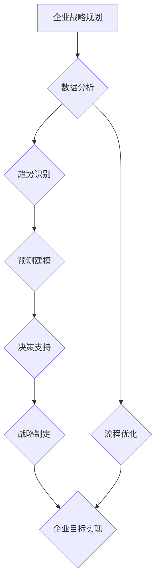

>  人工智能、企业战略规划、数据分析、预测模型、决策支持

## 1. 背景介绍

在当今数据爆炸和技术飞速发展的时代，企业面临着前所未有的挑战和机遇。传统企业战略规划模式往往依赖于经验和直觉，难以应对复杂多变的市场环境。人工智能（AI）技术的快速发展为企业战略规划提供了全新的思路和工具。AI能够通过分析海量数据，识别趋势和模式，为企业决策提供更精准、更有效的支持。

## 2. 核心概念与联系

**2.1 企业战略规划**

企业战略规划是指企业为了实现长期目标，制定并实施的一系列行动计划。它涵盖了企业的使命、愿景、价值观、目标、策略、资源配置等方面。

**2.2 人工智能（AI）**

人工智能是指模拟人类智能行为的计算机系统。AI技术涵盖了机器学习、深度学习、自然语言处理、计算机视觉等多个领域。

**2.3 AI在企业战略规划中的作用**

AI能够通过以下方式辅助企业战略规划：

* **数据分析：** AI算法能够从海量数据中提取有价值的信息，识别趋势和模式，为企业决策提供数据支持。
* **预测建模：** AI可以建立预测模型，预测未来市场趋势、客户行为、竞争对手动向等，帮助企业制定更有效的战略。
* **决策支持：** AI可以提供决策建议，帮助企业领导者做出更明智的决策。
* **流程优化：** AI可以自动化一些重复性任务，提高企业运营效率。

**2.4 AI与企业战略规划的联系**

AI技术为企业战略规划提供了强大的工具和手段，可以帮助企业更好地理解市场环境、预测未来趋势、制定更有效的战略，最终实现企业目标。



## 3. 核心算法原理 & 具体操作步骤

**3.1 算法原理概述**

在AI辅助企业战略规划中，常用的算法包括：

* **机器学习算法：** 

    * **监督学习：** 利用标记数据训练模型，预测未来结果。例如，预测客户流失概率。
    * **无监督学习：** 从未标记数据中发现模式和结构。例如，客户群聚分析。
    * **强化学习：** 通过试错学习，优化策略。例如，自动调整广告投放策略。

* **深度学习算法：** 利用多层神经网络，学习更复杂的特征表示。例如，图像识别、自然语言处理。

* **预测建模算法：** 

    * **时间序列分析：** 预测未来时间点的数据值。例如，预测销售额。
    * **回归分析：** 建立变量之间的关系模型。例如，预测房价。

**3.2 算法步骤详解**

以机器学习算法为例，其步骤如下：

1. **数据收集和预处理：** 收集相关数据，并进行清洗、转换、特征工程等预处理操作。
2. **模型选择：** 根据具体问题选择合适的机器学习算法。
3. **模型训练：** 利用训练数据训练模型，调整模型参数。
4. **模型评估：** 利用测试数据评估模型性能，选择最佳模型。
5. **模型部署：** 将训练好的模型部署到生产环境中，用于预测和决策。

**3.3 算法优缺点**

不同的算法具有不同的优缺点，需要根据具体问题选择合适的算法。

* **机器学习算法：** 优点：能够从数据中学习，适应变化的市场环境。缺点：需要大量数据训练，解释性较差。
* **深度学习算法：** 优点：能够学习更复杂的特征表示，性能优异。缺点：需要更多计算资源，训练时间较长。
* **预测建模算法：** 优点：能够提供定量预测结果，易于理解。缺点：对数据质量要求较高，难以捕捉非线性关系。

**3.4 算法应用领域**

AI算法在企业战略规划中的应用领域广泛，包括：

* **市场分析：** 预测市场趋势、客户需求、竞争对手动向。
* **产品开发：** 识别潜在的产品机会，优化产品设计。
* **营销推广：** 优化广告投放策略，提高营销效果。
* **风险管理：** 识别和评估企业风险，制定风险应对策略。

## 4. 数学模型和公式 & 详细讲解 & 举例说明

**4.1 数学模型构建**

在AI辅助企业战略规划中，常用的数学模型包括：

* **线性回归模型：** 用于预测连续变量，例如预测销售额。

$$
y = \beta_0 + \beta_1x_1 + \beta_2x_2 + ... + \beta_nx_n + \epsilon
$$

其中：

* $y$ 是预测变量
* $x_1, x_2, ..., x_n$ 是解释变量
* $\beta_0, \beta_1, ..., \beta_n$ 是模型参数
* $\epsilon$ 是随机误差项

* **逻辑回归模型：** 用于预测分类变量，例如预测客户是否流失。

$$
P(y=1|x) = \frac{1}{1 + e^{-( \beta_0 + \beta_1x_1 + \beta_2x_2 + ... + \beta_nx_n )}}
$$

其中：

* $P(y=1|x)$ 是预测客户流失概率
* $x_1, x_2, ..., x_n$ 是解释变量
* $\beta_0, \beta_1, ..., \beta_n$ 是模型参数

* **决策树模型：** 用于分类和回归问题，通过树状结构进行决策。

**4.2 公式推导过程**

具体的数学模型推导过程可以参考相关机器学习教材和论文。

**4.3 案例分析与讲解**

例如，一家电商公司可以使用机器学习算法预测客户流失概率。

* **数据收集：** 收集客户的历史购买记录、浏览记录、评价记录等数据。
* **特征工程：** 将原始数据转换为模型可以理解的特征，例如平均购买频率、平均购买金额、最近购买时间等。
* **模型训练：** 利用逻辑回归模型训练，预测客户流失概率。
* **模型评估：** 利用测试数据评估模型性能，选择最佳模型。
* **模型部署：** 将训练好的模型部署到生产环境中，实时预测客户流失概率。

## 5. 项目实践：代码实例和详细解释说明

**5.1 开发环境搭建**

* 操作系统：Windows/macOS/Linux
* Python版本：3.6+
* 必要的库：pandas, numpy, scikit-learn, matplotlib

**5.2 源代码详细实现**

```python
import pandas as pd
from sklearn.model_selection import train_test_split
from sklearn.linear_model import LogisticRegression
from sklearn.metrics import accuracy_score

# 加载数据
data = pd.read_csv('customer_data.csv')

# 划分训练集和测试集
X = data.drop('churn', axis=1)
y = data['churn']
X_train, X_test, y_train, y_test = train_test_split(X, y, test_size=0.2, random_state=42)

# 训练模型
model = LogisticRegression()
model.fit(X_train, y_train)

# 预测结果
y_pred = model.predict(X_test)

# 评估模型性能
accuracy = accuracy_score(y_test, y_pred)
print('模型准确率：', accuracy)
```

**5.3 代码解读与分析**

* 代码首先加载数据，然后将数据分为特征变量（X）和目标变量（y）。
* 使用 `train_test_split` 函数将数据划分为训练集和测试集。
* 使用 `LogisticRegression` 类创建逻辑回归模型，并使用 `fit` 方法训练模型。
* 使用 `predict` 方法预测测试集的标签。
* 使用 `accuracy_score` 函数评估模型性能。

**5.4 运行结果展示**

运行代码后，会输出模型的准确率。

## 6. 实际应用场景

**6.1 市场分析**

* 预测市场趋势：利用AI分析历史销售数据、市场调研报告等数据，预测未来市场需求。
* 识别客户群：利用AI分析客户数据，识别不同客户群的特点，制定针对性的营销策略。
* 评估竞争对手：利用AI分析竞争对手的产品、价格、营销策略等信息，评估竞争对手的优势和劣势。

**6.2 产品开发**

* 识别产品机会：利用AI分析市场需求、用户反馈等数据，识别潜在的产品机会。
* 优化产品设计：利用AI分析用户行为数据，优化产品设计，提高用户体验。
* 预测产品生命周期：利用AI分析产品销售数据，预测产品生命周期，制定产品迭代策略。

**6.3 营销推广**

* 优化广告投放：利用AI分析用户数据，优化广告投放策略，提高广告效果。
* 个性化营销：利用AI分析用户数据，提供个性化的产品推荐和营销信息。
* 预测营销效果：利用AI预测营销活动的成效，优化营销预算分配。

**6.4 风险管理**

* 识别风险因素：利用AI分析企业数据，识别潜在的风险因素。
* 评估风险程度：利用AI评估风险的可能性和影响程度。
* 制定风险应对策略：利用AI制定针对性的风险应对策略。

**6.5 未来应用展望**

随着AI技术的不断发展，AI在企业战略规划中的应用场景将更加广泛。例如：

* **智能决策支持系统：** 利用AI分析数据，为企业领导者提供智能决策建议。
* **自动化的战略规划工具：** 利用AI自动生成企业战略规划方案。
* **个性化的战略规划服务：** 利用AI为不同企业提供个性化的战略规划服务。

## 7. 工具和资源推荐

**7.1 学习资源推荐**

* **书籍：**
    * 《人工智能：一种现代方法》
    * 《机器学习》
    * 《深度学习》
* **在线课程：**
    * Coursera：机器学习、深度学习
    * edX：人工智能导论、机器学习
    * Udacity：人工智能工程师 nanodegree

**7.2 开发工具推荐**

* **Python：** 广泛应用于AI开发，拥有丰富的库和工具。
* **TensorFlow：** 开源深度学习框架，支持多种硬件平台。
* **PyTorch：** 开源深度学习框架，灵活易用。
* **Scikit-learn：** Python机器学习库，提供多种算法和工具。

**7.3 相关论文推荐**

* **AlphaGo：** 深度学习在围棋领域的突破。
* **BERT：** 自然语言处理领域的里程碑。
* **GPT-3：** 生成式预训练语言模型。

## 8. 总结：未来发展趋势与挑战

**8.1 研究成果总结**

AI技术在企业战略规划领域的应用取得了显著成果，例如：

* 提高了市场分析的准确性。
* 优化了产品开发和营销推广策略。
* 降低了风险管理成本。

**8.2 未来发展趋势**

* **更强大的AI算法：** 随着算法的不断发展，AI将能够处理更复杂的数据，提供更精准的预测和建议。
* **更广泛的应用场景：** AI将应用于更多企业战略规划领域，例如人力资源管理、供应链管理等。
* **更智能的决策支持系统：** AI将与人类决策者协同工作，提供更智能的决策支持。

**8.3 面临的挑战**

* **数据质量问题：** AI算法的性能依赖于数据质量，数据不完整、不准确会影响模型的准确性。
* **算法解释性