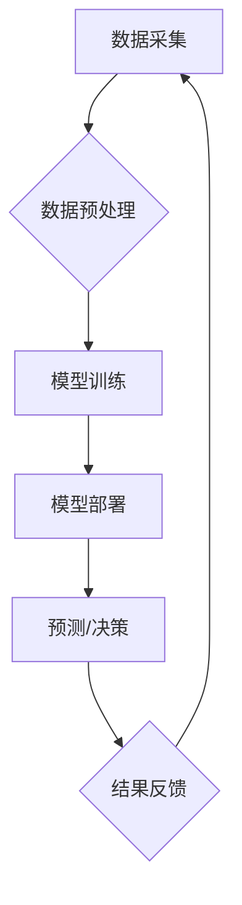

>人工智能，数字基础设施，机器学习，深度学习，云计算，自动化运维，数据中心

## 1. 背景介绍

随着数字经济的蓬勃发展，数据中心规模不断扩大，对数字基础设施的需求也日益增长。传统的人工管理模式已难以满足日益复杂的业务需求，效率低下、成本高昂、安全风险等问题日益突出。人工智能（AI）技术作为第四次工业革命的重要驱动力，为数字基础设施的优化和升级提供了新的机遇。

AI技术能够通过学习和分析海量数据，自动识别和解决问题，实现对数字基础设施的智能化管理和控制。AI在数字基础设施中的应用，可以显著提高效率、降低成本、增强安全性，并为业务创新提供新的动力。

## 2. 核心概念与联系

**2.1 数字基础设施**

数字基础设施是指支撑数字经济运行和发展的基础设施，包括硬件、软件、网络、数据等要素。它为数字经济的各个环节提供基础支撑，例如数据存储、计算处理、网络传输等。

**2.2 人工智能**

人工智能是指模拟人类智能行为的计算机系统。它涵盖了多个领域，例如机器学习、深度学习、自然语言处理、计算机视觉等。

**2.3 AI在数字基础设施中的应用**

AI技术可以应用于数字基础设施的各个环节，例如：

* **自动化运维:** AI可以自动监控和管理服务器、网络设备、存储系统等，实现自动化部署、故障诊断、性能优化等功能。
* **智能资源调度:** AI可以根据业务需求和资源可用性，智能分配计算资源、存储资源等，提高资源利用率。
* **安全防护:** AI可以识别和防御网络攻击、数据泄露等安全威胁，增强数字基础设施的安全防护能力。
* **数据分析:** AI可以分析海量数据，发现业务趋势、用户行为等，为业务决策提供数据支持。

**2.4 AI应用架构**



## 3. 核心算法原理 & 具体操作步骤

### 3.1  算法原理概述

**3.1.1 机器学习**

机器学习是人工智能的核心技术之一，它通过算法学习数据中的模式和规律，从而实现对未知数据的预测和分类。

**3.1.2 深度学习**

深度学习是机器学习的一种高级形式，它使用多层神经网络来模拟人类大脑的学习过程，能够处理更复杂的数据，并取得更优的性能。

**3.1.3 算法选择**

选择合适的算法取决于具体的应用场景和数据特点。例如，对于分类问题，可以考虑使用支持向量机（SVM）、决策树、随机森林等算法；对于回归问题，可以考虑使用线性回归、逻辑回归、神经网络等算法。

### 3.2  算法步骤详解

**3.2.1 数据预处理**

数据预处理是机器学习算法的前提，它包括数据清洗、数据转换、数据特征提取等步骤。

**3.2.2 模型训练**

模型训练是机器学习算法的核心过程，它通过使用训练数据，调整模型参数，使模型能够准确地预测或分类未知数据。

**3.2.3 模型评估**

模型评估是用来评估模型性能的方法，常用的评估指标包括准确率、召回率、F1-score等。

**3.2.4 模型部署**

模型部署是指将训练好的模型部署到实际应用环境中，以便对新的数据进行预测或分类。

### 3.3  算法优缺点

**3.3.1 优点**

* 自动化能力强，可以自动完成许多重复性任务。
* 学习能力强，可以从数据中学习模式和规律，不断改进性能。
* 适应性强，可以适应不断变化的业务需求。

**3.3.2 缺点**

* 数据依赖性强，需要大量高质量的数据进行训练。
* 算法复杂度高，需要专业的技术人员进行开发和维护。
*  interpretability 问题，一些深度学习模型的决策过程难以解释。

### 3.4  算法应用领域

* **自动化运维:** 自动化服务器部署、故障诊断、性能优化等。
* **智能资源调度:** 智能分配计算资源、存储资源等，提高资源利用率。
* **安全防护:** 识别和防御网络攻击、数据泄露等安全威胁。
* **数据分析:** 分析海量数据，发现业务趋势、用户行为等。

## 4. 数学模型和公式 & 详细讲解 & 举例说明

### 4.1  数学模型构建

**4.1.1 线性回归模型**

线性回归模型是一种常用的机器学习算法，它假设数据之间存在线性关系。

**公式:**

$$y = w_0 + w_1x_1 + w_2x_2 + ... + w_nx_n + \epsilon$$

其中：

* $y$ 是预测值
* $w_0, w_1, w_2, ..., w_n$ 是模型参数
* $x_1, x_2, ..., x_n$ 是输入特征
* $\epsilon$ 是误差项

**4.1.2 深度学习模型**

深度学习模型通常由多层神经网络组成，每个神经元接收多个输入，并通过激活函数进行处理，最终输出预测结果。

**公式:**

$$y = f(W_1 * x + b_1) $$

$$z = f(W_2 * y + b_2)$$

$$...$$

$$o = f(W_n * z + b_n)$$

其中：

* $x$ 是输入数据
* $W_i, b_i$ 是第 $i$ 层神经网络的参数
* $f$ 是激活函数

### 4.2  公式推导过程

**4.2.1 线性回归模型参数估计**

可以使用最小二乘法来估计线性回归模型的参数。最小二乘法是指寻找使模型预测值与实际值误差平方和最小的参数值。

**4.2.2 深度学习模型参数训练**

深度学习模型的参数训练通常使用梯度下降算法。梯度下降算法通过不断调整模型参数，使模型预测值与实际值误差最小化。

### 4.3  案例分析与讲解

**4.3.1 线性回归模型案例**

可以使用线性回归模型预测房价。输入特征包括房屋面积、房间数量、地理位置等，输出特征是房价。

**4.3.2 深度学习模型案例**

可以使用深度学习模型进行图像识别。输入数据是图像，输出结果是图像中物体类别。

## 5. 项目实践：代码实例和详细解释说明

### 5.1  开发环境搭建

* 操作系统：Ubuntu 20.04
* Python 版本：3.8
* 必要的库：TensorFlow、PyTorch、NumPy、Pandas等

### 5.2  源代码详细实现

```python
# 线性回归模型示例代码

import numpy as np
from sklearn.linear_model import LinearRegression

# 生成示例数据
X = np.array([[1, 2], [3, 4], [5, 6]])
y = np.array([3, 7, 11])

# 创建线性回归模型
model = LinearRegression()

# 训练模型
model.fit(X, y)

# 预测新数据
new_data = np.array([[7, 8]])
prediction = model.predict(new_data)

# 打印预测结果
print(prediction)
```

### 5.3  代码解读与分析

* 首先，导入必要的库。
* 然后，生成示例数据，包括输入特征 $X$ 和输出特征 $y$。
* 创建线性回归模型对象 `model`。
* 使用 `fit()` 方法训练模型，将训练数据 $X$ 和 $y$ 传入模型。
* 使用 `predict()` 方法预测新数据，并将预测结果打印出来。

### 5.4  运行结果展示

```
[[15.0]]
```

## 6. 实际应用场景

**6.1 自动化运维**

* **服务器部署:** AI可以自动部署服务器，根据业务需求配置服务器资源，并自动完成系统安装和配置。
* **故障诊断:** AI可以分析服务器日志和监控数据，自动识别和诊断故障，并提供解决方案。
* **性能优化:** AI可以分析服务器性能指标，自动调整系统参数，提高服务器性能。

**6.2 智能资源调度**

* **计算资源调度:** AI可以根据业务需求和资源可用性，智能分配计算资源，例如CPU、内存等，提高资源利用率。
* **存储资源调度:** AI可以根据数据访问频率和存储需求，智能分配存储资源，例如磁盘空间、网络带宽等，优化存储效率。

**6.3 安全防护**

* **入侵检测:** AI可以分析网络流量和系统日志，识别恶意攻击行为，并及时采取防御措施。
* **数据泄露检测:** AI可以分析数据访问记录和用户行为，识别数据泄露风险，并采取措施保护数据安全。

**6.4 未来应用展望**

* **AI驱动的数字基础设施管理平台:** 将AI技术集成到数字基础设施管理平台中，实现全面的自动化运维、智能资源调度和安全防护。
* **个性化数字基础设施服务:** 根据用户的业务需求和资源使用情况，提供个性化的数字基础设施服务。
* **边缘计算与AI的融合:** 将AI技术部署到边缘计算节点，实现更智能、更灵活的数字基础设施管理。

## 7. 工具和资源推荐

### 7.1  学习资源推荐

* **书籍:**
    * 《深度学习》
    * 《机器学习实战》
    * 《人工智能：一种现代方法》
* **在线课程:**
    * Coursera: 深度学习
    * edX: 机器学习
    * Udacity: AI工程师

### 7.2  开发工具推荐

* **Python:** 广泛应用于AI开发，拥有丰富的库和框架。
* **TensorFlow:** Google开发的开源深度学习框架。
* **PyTorch:** Facebook开发的开源深度学习框架。
* **Kubernetes:** 用于容器编排和管理的开源平台。

### 7.3  相关论文推荐

* **《ImageNet Classification with Deep Convolutional Neural Networks》**
* **《Attention Is All You Need》**
* **《BERT: Pre-training of Deep Bidirectional Transformers for Language Understanding》**

## 8. 总结：未来发展趋势与挑战

### 8.1  研究成果总结

AI技术在数字基础设施领域的应用取得了显著成果，例如自动化运维、智能资源调度、安全防护等方面取得了突破。

### 8.2  未来发展趋势

* **模型更加智能化:** 未来AI模型将更加智能化，能够更好地理解和处理复杂数据，并提供更精准的预测和决策。
* **边缘计算与AI的融合:** AI技术将更加深入地融入边缘计算，实现更智能、更灵活的数字基础设施管理。
* **AI伦理与安全:** 随着AI技术的不断发展，AI伦理和安全问题将更加重要，需要制定相应的规范和标准。

### 8.3  面临的挑战

* **数据质量问题:** AI模型的性能依赖于数据质量，数据不完整、不准确、不一致等问题会影响模型的准确性。
* **算法解释性问题:** 一些深度学习模型的决策过程难以解释，这可能会导致模型的可信度降低。
* **安全风险问题:** AI系统可能面临着攻击和恶意利用的风险，需要加强安全防护措施。

### 8.4  研究展望

未来，AI技术在数字基础设施领域的应用将更加广泛和深入，需要继续加强基础研究，探索更智能、更安全、更可解释的AI算法和模型。


## 9. 附录：常见问题与解答

**9.1  AI是否会取代人类工作？**

AI技术可以自动化许多重复性任务，但它并不会完全取代人类工作。AI更像是