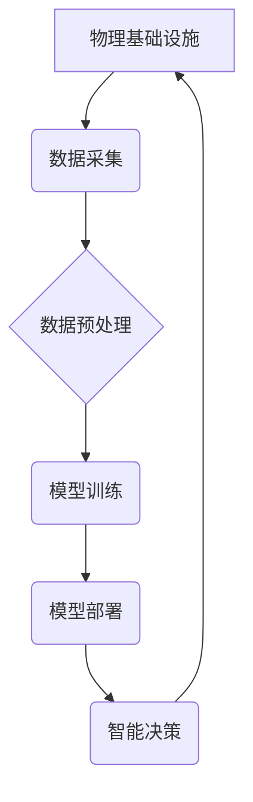

>人工智能，物理基础设施，机器学习，优化算法，预测维护，自动化运维，数据中心，智能能源管理

## 1. 背景介绍

随着全球数字化转型加速推进，物理基础设施（如数据中心、电网、交通网络等）承担着越来越重要的角色。传统物理基础设施管理模式面临着日益严峻的挑战，例如：

* **效率低下:**  物理基础设施的运维管理依赖于人工操作，效率低下，难以应对日益增长的数据流量和服务需求。
* **成本高昂:**  人工维护、能源消耗、设备故障等因素导致物理基础设施的运营成本不断攀升。
* **安全风险:**  物理基础设施的安全漏洞容易被攻击，导致数据泄露、服务中断等安全风险。

人工智能（AI）技术的快速发展为物理基础设施管理带来了新的机遇。AI算法能够从海量数据中提取有价值的信息，并根据这些信息进行智能决策，从而提高物理基础设施的效率、降低成本、增强安全性。

## 2. 核心概念与联系

**2.1 核心概念**

* **物理基础设施:** 指提供计算、存储、网络等基础服务的物理设备和系统，例如数据中心、电网、交通网络等。
* **人工智能 (AI):**  模拟人类智能的计算机系统，能够通过学习和推理来解决复杂问题。
* **机器学习 (ML):**  一种AI技术，通过算法从数据中学习，并根据学习到的知识进行预测或决策。
* **深度学习 (DL):**  一种更高级的机器学习技术，使用多层神经网络来模拟人类大脑的学习过程。

**2.2 联系**

AI技术可以应用于物理基础设施的各个方面，例如：

* **预测性维护:**  利用机器学习算法分析设备运行数据，预测设备故障，并提前进行维护，避免设备故障导致的服务中断。
* **自动化运维:**  利用AI算法自动化执行基础设施管理任务，例如监控、配置、故障处理等，提高运维效率。
* **智能能源管理:**  利用AI算法优化能源消耗，提高能源利用效率。
* **安全保障:**  利用AI算法识别和防御网络攻击，保障基础设施安全。

**2.3 架构图**



## 3. 核心算法原理 & 具体操作步骤

**3.1 算法原理概述**

在AI应用于物理基础设施管理中，常用的算法包括：

* **机器学习算法:**  例如线性回归、逻辑回归、决策树、支持向量机、神经网络等，用于预测设备故障、优化能源消耗等。
* **深度学习算法:**  例如卷积神经网络、循环神经网络等，用于图像识别、语音识别、自然语言处理等。
* **强化学习算法:**  用于训练智能代理，使其能够在物理基础设施环境中做出最优决策。

**3.2 算法步骤详解**

以预测性维护为例，其算法步骤如下：

1. **数据采集:**  从物理设备收集运行数据，例如温度、压力、振动等。
2. **数据预处理:**  对采集到的数据进行清洗、转换、特征提取等处理，使其适合机器学习算法的训练。
3. **模型训练:**  使用机器学习算法对预处理后的数据进行训练，建立预测设备故障的模型。
4. **模型评估:**  使用测试数据评估模型的性能，例如准确率、召回率等。
5. **模型部署:**  将训练好的模型部署到生产环境中，用于实时预测设备故障。

**3.3 算法优缺点**

* **优点:**  能够提高预测精度，提前预警设备故障，降低维护成本。
* **缺点:**  需要大量的数据进行训练，模型的准确性依赖于数据质量。

**3.4 算法应用领域**

* **工业设备维护:**  预测设备故障，提前进行维护，避免设备停机。
* **电力系统管理:**  预测电力需求，优化电力调度，提高电力系统可靠性。
* **交通运输管理:**  预测交通流量，优化交通信号灯控制，缓解交通拥堵。

## 4. 数学模型和公式 & 详细讲解 & 举例说明

**4.1 数学模型构建**

预测性维护模型通常采用回归模型，例如线性回归模型。

**4.2 公式推导过程**

线性回归模型的目标是找到一条直线，使得这条直线与数据点之间的距离最小。

假设我们有n个数据点，每个数据点包含设备运行时间x和设备故障概率y。线性回归模型的公式如下：

$$y = w_0 + w_1x$$

其中：

* $y$ 是设备故障概率
* $x$ 是设备运行时间
* $w_0$ 是截距
* $w_1$ 是斜率

**4.3 案例分析与讲解**

假设我们有以下数据：

| 设备运行时间 (小时) | 设备故障概率 |
|---|---|
| 100 | 0.1 |
| 200 | 0.2 |
| 300 | 0.3 |
| 400 | 0.4 |

我们可以使用线性回归模型来拟合这些数据，得到设备故障概率与运行时间的线性关系。

## 5. 项目实践：代码实例和详细解释说明

**5.1 开发环境搭建**

* Python 3.x
* TensorFlow 或 PyTorch 等深度学习框架
* Jupyter Notebook 或 VS Code 等代码编辑器

**5.2 源代码详细实现**

```python
import tensorflow as tf

# 定义模型
model = tf.keras.models.Sequential([
    tf.keras.layers.Dense(units=64, activation='relu', input_shape=(1,)),
    tf.keras.layers.Dense(units=1)
])

# 编译模型
model.compile(optimizer='adam', loss='mean_squared_error')

# 训练模型
model.fit(x_train, y_train, epochs=100)

# 评估模型
loss = model.evaluate(x_test, y_test)
print('Loss:', loss)

# 预测设备故障概率
prediction = model.predict(x_new)
print('Prediction:', prediction)
```

**5.3 代码解读与分析**

* 代码首先定义了一个简单的线性回归模型，包含两个全连接层。
* 然后，模型被编译，使用 Adam 优化器和均方误差损失函数。
* 接着，模型使用训练数据进行训练，训练过程持续 100 个 epochs。
* 训练完成后，模型的性能被评估，并使用测试数据计算损失值。
* 最后，模型用于预测新的设备故障概率。

**5.4 运行结果展示**

运行结果将显示模型的损失值和预测的设备故障概率。

## 6. 实际应用场景

**6.1 数据中心**

* **智能能源管理:**  利用AI算法优化数据中心能源消耗，降低运营成本。
* **自动化运维:**  利用AI算法自动化执行数据中心运维任务，提高运维效率。
* **故障预测:**  利用AI算法预测数据中心设备故障，提前进行维护，避免服务中断。

**6.2 电网**

* **电力预测:**  利用AI算法预测电力需求，优化电力调度，提高电力系统可靠性。
* **故障诊断:**  利用AI算法诊断电网故障，缩短故障修复时间。
* **智能配电:**  利用AI算法优化配电网络，提高配电效率。

**6.3 交通运输**

* **交通流量预测:**  利用AI算法预测交通流量，优化交通信号灯控制，缓解交通拥堵。
* **车辆故障预测:**  利用AI算法预测车辆故障，提前进行维护，提高车辆安全性和可靠性。
* **智能驾驶:**  利用AI算法实现自动驾驶功能，提高交通安全性和效率。

**6.4 未来应用展望**

随着AI技术的不断发展，其在物理基础设施管理中的应用将更加广泛和深入。未来，AI将能够：

* 更准确地预测设备故障，提高维护效率。
* 更智能地优化能源消耗，降低运营成本。
* 更安全地保障基础设施安全。
* 更高效地管理和控制物理基础设施。

## 7. 工具和资源推荐

**7.1 学习资源推荐**

* **书籍:**
    * 《深度学习》
    * 《机器学习实战》
    * 《人工智能：一种现代方法》
* **在线课程:**
    * Coursera: 深度学习
    * edX: 机器学习
    * Udacity: AI Nanodegree

**7.2 开发工具推荐**

* **Python:**  人工智能开发的常用语言
* **TensorFlow:**  开源深度学习框架
* **PyTorch:**  开源深度学习框架
* **Jupyter Notebook:**  交互式代码编辑器

**7.3 相关论文推荐**

* **《人工智能在物理基础设施管理中的应用》**
* **《基于机器学习的设备故障预测方法》**
* **《深度学习在智能能源管理中的应用》**

## 8. 总结：未来发展趋势与挑战

**8.1 研究成果总结**

AI技术在物理基础设施管理领域取得了显著的成果，例如：

* 提高了设备故障预测的准确性。
* 优化了能源消耗，降低了运营成本。
* 增强了基础设施的安全保障。

**8.2 未来发展趋势**

* **更智能的自动化:**  利用AI技术实现更智能的自动化运维，减少人工干预。
* **更精准的预测:**  利用更先进的AI算法，提高设备故障预测的准确性。
* **更安全的保障:**  利用AI技术增强基础设施安全保障，抵御网络攻击。

**8.3 面临的挑战**

* **数据质量:**  AI算法的性能依赖于数据质量，需要收集和处理高质量的数据。
* **算法复杂度:**  一些AI算法非常复杂，需要强大的计算能力进行训练和部署。
* **伦理问题:**  AI技术的应用需要考虑伦理问题，例如数据隐私和算法偏见。

**8.4 研究展望**

未来，需要继续研究和开发更先进的AI算法，并解决AI技术在物理基础设施管理中的挑战，以实现更智能、更安全、更高效的物理基础设施管理。

## 9. 附录：常见问题与解答

**9.1 如何选择合适的AI算法？**

选择合适的AI算法取决于具体的应用场景和数据特点。例如，对于预测设备故障的应用，可以使用回归模型或分类模型。

**9.2 如何保证数据质量？**

数据质量是AI算法性能的关键因素。需要收集可靠的数据，并进行清洗、转换、特征提取等处理，以提高数据质量。

**9.3 如何部署AI模型？**

AI模型的部署方式取决于具体的应用场景。可以使用云平台、边缘设备或本地服务器部署模型。

**9.4 如何解决算法偏见问题？**

算法偏见是AI技术面临的一个重要挑战。需要在数据收集、算法设计和模型评估阶段，采取措施来减少算法偏见。


作者：禅与计算机程序设计艺术 / Zen and the Art of Computer Programming 
<end_of_turn>