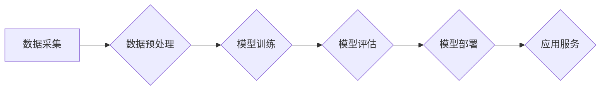

> AI大模型，创业，市场挑战，技术趋势，商业模式，应用场景，伦理风险

## 1. 背景介绍

近年来，人工智能（AI）技术取得了飞速发展，特别是大规模语言模型（LLM）的出现，如GPT-3、LaMDA等，展现出强大的文本生成、理解和翻译能力，为各行各业带来了革命性的变革。 

AI大模型的商业化应用前景广阔，吸引了众多创业者和企业的目光。然而，AI大模型创业也面临着诸多挑战，需要深入思考和应对。

## 2. 核心概念与联系

**2.1 AI大模型概述**

AI大模型是指训练规模庞大、参数数量众多的人工智能模型，通常拥有数十亿甚至数千亿个参数。它们通过学习海量数据，能够掌握复杂的语言模式和知识结构，从而实现各种高级人工智能任务，例如：

* 文本生成：创作小说、诗歌、剧本等；
* 语言翻译：将一种语言翻译成另一种语言；
* 聊天机器人：与人类进行自然流畅的对话；
* 代码生成：自动生成代码片段；
* 数据分析：从海量数据中提取有价值的信息。

**2.2 核心概念与联系**

* **深度学习:** AI大模型的核心技术是深度学习，它利用多层神经网络模拟人类大脑的学习机制，能够从数据中自动提取特征和模式。
* **Transformer架构:** Transformer是一种新型的神经网络架构，能够有效处理序列数据，例如文本，并展现出强大的文本理解和生成能力。
* **预训练与微调:** AI大模型通常采用预训练与微调的策略。首先在大量通用数据上进行预训练，然后针对特定任务进行微调，提高模型的性能。

**2.3  Mermaid 流程图**



## 3. 核心算法原理 & 具体操作步骤

**3.1 算法原理概述**

AI大模型的核心算法是深度学习，特别是Transformer架构。Transformer通过自注意力机制（Self-Attention）和多头注意力机制（Multi-Head Attention）能够捕捉文本中的长距离依赖关系，从而实现更准确的文本理解和生成。

**3.2 算法步骤详解**

1. **数据采集和预处理:** 收集大量文本数据，并进行清洗、格式化和分词等预处理操作。
2. **模型构建:** 根据Transformer架构设计模型结构，包括编码器（Encoder）、解码器（Decoder）和注意力机制等模块。
3. **模型训练:** 使用预训练数据训练模型，并通过反向传播算法（Backpropagation）更新模型参数。
4. **模型评估:** 使用测试数据评估模型的性能，例如准确率、困惑度等指标。
5. **模型微调:** 根据特定任务对模型进行微调，提高模型在目标任务上的性能。
6. **模型部署:** 将训练好的模型部署到服务器或云平台，提供应用服务。

**3.3 算法优缺点**

* **优点:**
    * 强大的文本理解和生成能力
    * 可以处理长距离依赖关系
    * 可迁移学习，在不同任务上进行微调
* **缺点:**
    * 训练成本高，需要大量计算资源
    * 模型参数量大，部署成本高
    * 容易受到训练数据偏差的影响

**3.4 算法应用领域**

* 自然语言处理：文本分类、情感分析、机器翻译、问答系统等
* 人机交互：聊天机器人、语音助手、虚拟助手等
* 内容创作：自动写作、诗歌创作、剧本生成等
* 代码生成：自动生成代码片段、代码补全等

## 4. 数学模型和公式 & 详细讲解 & 举例说明

**4.1 数学模型构建**

AI大模型的数学模型通常基于神经网络，其中每个神经元都接收来自其他神经元的输入，并通过激活函数进行处理，输出到下一个神经元。

**4.2 公式推导过程**

* **激活函数:** 常见的激活函数包括ReLU、Sigmoid、Tanh等，它们用于引入非线性，使神经网络能够学习复杂的模式。
* **损失函数:** 损失函数用于衡量模型预测结果与真实值的差异，例如交叉熵损失函数、均方误差损失函数等。
* **梯度下降算法:** 梯度下降算法用于更新模型参数，使其朝着降低损失函数的方向进行调整。

**4.3 案例分析与讲解**

例如，在文本分类任务中，我们可以使用softmax函数将神经网络的输出映射到多个类别概率，然后选择概率最高的类别作为预测结果。

**4.3.1 Softmax函数**

$$
\text{softmax}(x_i) = \frac{e^{x_i}}{\sum_{j=1}^{C} e^{x_j}}
$$

其中，$x_i$ 是第 $i$ 个类别的得分，$C$ 是总类别数。

## 5. 项目实践：代码实例和详细解释说明

**5.1 开发环境搭建**

* Python 3.x
* TensorFlow 或 PyTorch 深度学习框架
* CUDA 和 cuDNN (可选，用于GPU加速)

**5.2 源代码详细实现**

```python
import tensorflow as tf

# 定义模型结构
model = tf.keras.Sequential([
    tf.keras.layers.Embedding(input_dim=vocab_size, output_dim=embedding_dim),
    tf.keras.layers.LSTM(units=hidden_size),
    tf.keras.layers.Dense(units=num_classes, activation='softmax')
])

# 编译模型
model.compile(optimizer='adam',
              loss='sparse_categorical_crossentropy',
              metrics=['accuracy'])

# 训练模型
model.fit(x_train, y_train, epochs=num_epochs, batch_size=batch_size)

# 评估模型
loss, accuracy = model.evaluate(x_test, y_test)
print('Test Loss:', loss)
print('Test Accuracy:', accuracy)
```

**5.3 代码解读与分析**

* **Embedding层:** 将词向量化，将每个词映射到一个低维向量空间。
* **LSTM层:** 用于处理序列数据，捕捉文本中的长距离依赖关系。
* **Dense层:** 全连接层，用于将LSTM层的输出映射到多个类别概率。
* **softmax激活函数:** 将输出映射到概率分布，用于分类任务。

**5.4 运行结果展示**

训练完成后，可以将模型部署到服务器或云平台，提供文本分类服务。

## 6. 实际应用场景

**6.1 文本分类**

* 垃圾邮件过滤
* 情感分析
* 新闻主题分类

**6.2 聊天机器人**

* 客户服务机器人
* 虚拟助手

**6.3 内容创作**

* 自动写作
* 代码生成

**6.4 未来应用展望**

* 个性化教育
* 医疗诊断
* 法律文本分析

## 7. 工具和资源推荐

**7.1 学习资源推荐**

* 深度学习书籍：
    * 《深度学习》
    * 《动手学深度学习》
* 在线课程：
    * Coursera
    * edX
    * fast.ai

**7.2 开发工具推荐**

* TensorFlow
* PyTorch
* Keras

**7.3 相关论文推荐**

* 《Attention Is All You Need》
* 《BERT: Pre-training of Deep Bidirectional Transformers for Language Understanding》

## 8. 总结：未来发展趋势与挑战

**8.1 研究成果总结**

近年来，AI大模型取得了显著进展，在文本理解、生成和应用等方面展现出强大的能力。

**8.2 未来发展趋势**

* 模型规模进一步扩大
* 多模态学习
* 联邦学习
* 伦理与可解释性

**8.3 面临的挑战**

* 计算资源需求高
* 数据安全和隐私问题
* 算法偏见和伦理风险

**8.4 研究展望**

未来，AI大模型将继续朝着更强大、更安全、更可解释的方向发展，并将在更多领域发挥重要作用。

## 9. 附录：常见问题与解答

* **Q1: 如何选择合适的AI大模型？**
* **A1:** 选择合适的AI大模型需要考虑任务类型、数据规模、计算资源等因素。

* **Q2: 如何应对AI大模型的伦理风险？**
* **A2:** 需要制定相应的伦理规范和监管机制，确保AI大模型的公平、公正、透明和可控。


作者：禅与计算机程序设计艺术 / Zen and the Art of Computer Programming 
<end_of_turn>