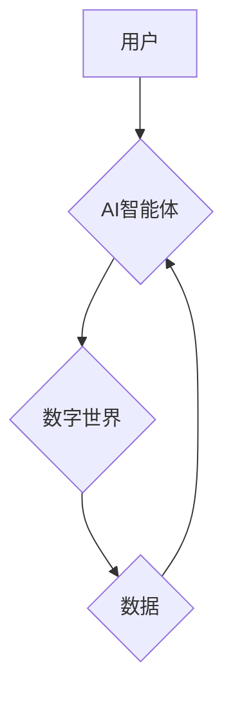

> AI智能体,数字世界,交互,机器学习,深度学习,自然语言处理,计算机视觉,人机交互

## 1. 背景介绍

数字世界正在以惊人的速度发展，它涵盖了从互联网到虚拟现实、增强现实等各种形式。在这个数字世界中，AI智能体扮演着越来越重要的角色。AI智能体是指能够感知、理解和交互于数字世界的智能系统，它们能够学习、推理、决策，并与人类进行自然、流畅的交互。

AI智能体与数字世界的交互，是推动数字世界发展和人类社会进步的关键驱动力。它将深刻地改变我们生活、工作和娱乐的方式。例如，AI智能体可以帮助我们：

* **个性化体验：**根据用户的喜好和需求，提供个性化的内容推荐、产品服务和互动体验。
* **自动化任务：**自动完成重复性、繁琐的任务，提高工作效率和生产力。
* **智能决策：**基于大数据分析和机器学习，提供更准确、更有效的决策支持。
* **增强创造力：**为人类提供新的创作工具和灵感，促进艺术、文化和科技的创新发展。

## 2. 核心概念与联系

**2.1 AI智能体**

AI智能体是指能够感知、理解和交互于数字世界的智能系统。它们通常基于机器学习、深度学习等人工智能技术，能够学习和改进自身的行为。

**2.2 数字世界**

数字世界是指以数字信息为基础的虚拟世界，它包括互联网、虚拟现实、增强现实等各种形式。数字世界提供了AI智能体感知、交互和学习的环境。

**2.3 交互机制**

AI智能体与数字世界交互的机制主要包括：

* **自然语言处理 (NLP)：**使AI智能体能够理解和生成人类语言，实现与人类的自然对话。
* **计算机视觉 (CV)：**使AI智能体能够感知和理解图像和视频信息，例如识别物体、场景和人脸。
* **机器人技术：**使AI智能体能够在物理世界中行动和交互，例如控制机器人手臂、移动机器人等。

**2.4 核心架构**



**2.5 核心关系**

AI智能体与数字世界之间存在着相互依赖、相互促进的关系。AI智能体通过与数字世界的交互，获取数据、学习知识、提升能力；而数字世界则通过AI智能体的参与，变得更加智能、更加人性化。

## 3. 核心算法原理 & 具体操作步骤

### 3.1  算法原理概述

**3.1.1 机器学习**

机器学习是AI智能体学习和改进自身行为的核心算法。它通过训练模型，使模型能够从数据中学习规律，并根据学习到的规律进行预测或决策。

**3.1.2 深度学习**

深度学习是机器学习的一种高级形式，它使用多层神经网络来模拟人类大脑的学习过程。深度学习能够处理更复杂的数据，并取得更优的性能。

**3.1.3 自然语言处理 (NLP)**

NLP算法能够使AI智能体理解和生成人类语言。常见的NLP算法包括词嵌入、语言模型、序列标注等。

**3.1.4 计算机视觉 (CV)**

CV算法能够使AI智能体感知和理解图像和视频信息。常见的CV算法包括图像分类、目标检测、图像分割等。

### 3.2  算法步骤详解

**3.2.1 机器学习算法步骤**

1. **数据收集和预处理:** 收集相关数据，并进行清洗、转换、特征提取等预处理工作。
2. **模型选择:** 根据任务需求选择合适的机器学习模型，例如线性回归、逻辑回归、决策树、支持向量机等。
3. **模型训练:** 使用训练数据训练模型，调整模型参数，使模型能够准确地预测或决策。
4. **模型评估:** 使用测试数据评估模型的性能，例如准确率、召回率、F1-score等。
5. **模型部署:** 将训练好的模型部署到实际应用场景中，用于进行预测或决策。

**3.2.2 深度学习算法步骤**

深度学习算法步骤与机器学习算法类似，但更加复杂，需要更多的计算资源和数据。

**3.2.3 自然语言处理 (NLP) 算法步骤**

NLP算法步骤具体取决于具体的任务，例如文本分类、情感分析、机器翻译等。

**3.2.4 计算机视觉 (CV) 算法步骤**

CV算法步骤具体取决于具体的任务，例如图像分类、目标检测、图像分割等。

### 3.3  算法优缺点

**3.3.1 机器学习算法**

* **优点:** 能够从数据中学习规律，并进行预测或决策；适应性强，能够处理各种类型的数据。
* **缺点:** 需要大量的训练数据，训练时间较长；对数据质量要求较高；难以解释模型的决策过程。

**3.3.2 深度学习算法**

* **优点:** 能够处理更复杂的数据，并取得更优的性能；自动提取特征，减少人工特征工程。
* **缺点:** 需要更多的计算资源和数据；训练时间较长；难以解释模型的决策过程。

**3.3.3 自然语言处理 (NLP) 算法**

* **优点:** 能够理解和生成人类语言，实现与人类的自然对话。
* **缺点:** 语言理解和生成仍然是一个复杂的任务，存在一定的误差率。

**3.3.4 计算机视觉 (CV) 算法**

* **优点:** 能够感知和理解图像和视频信息，应用广泛。
* **缺点:** 对图像质量和拍摄角度敏感；难以处理复杂场景下的图像理解。

### 3.4  算法应用领域

* **医疗保健:** 疾病诊断、药物研发、医疗影像分析。
* **金融服务:** 欺诈检测、风险评估、客户服务自动化。
* **制造业:** 质量控制、预测性维护、生产优化。
* **零售业:** 商品推荐、个性化营销、库存管理。
* **交通运输:** 自动驾驶、交通流量预测、物流优化。

## 4. 数学模型和公式 & 详细讲解 & 举例说明

### 4.1  数学模型构建

**4.1.1 线性回归模型**

线性回归模型假设数据之间存在线性关系，可以用以下公式表示：

$$y = mx + c$$

其中：

* $y$ 是预测值
* $x$ 是输入特征
* $m$ 是斜率
* $c$ 是截距

**4.1.2 Logistic回归模型**

Logistic回归模型用于二分类问题，将输入特征映射到0到1之间的概率值，表示样本属于某一类别的概率。

$$P(y=1|x) = \frac{1}{1 + e^{-(wx + b)}}$$

其中：

* $P(y=1|x)$ 是样本属于类别1的概率
* $x$ 是输入特征
* $w$ 是权重向量
* $b$ 是偏置项

### 4.2  公式推导过程

**4.2.1 线性回归模型参数估计**

可以使用最小二乘法估计线性回归模型的参数 $m$ 和 $c$。最小二乘法目标是使模型预测值与真实值之间的误差平方和最小。

**4.2.2 Logistic回归模型参数估计**

可以使用最大似然估计法估计Logistic回归模型的参数 $w$ 和 $b$。最大似然估计法目标是找到参数值，使得模型能够最大化观测数据的似然概率。

### 4.3  案例分析与讲解

**4.3.1 线性回归模型案例**

假设我们想要预测房屋价格，输入特征包括房屋面积、房间数量等。我们可以使用线性回归模型建立预测模型，并根据训练数据估计模型参数。

**4.3.2 Logistic回归模型案例**

假设我们想要预测客户是否会点击广告，输入特征包括客户年龄、性别、浏览历史等。我们可以使用Logistic回归模型建立预测模型，并根据训练数据估计模型参数。

## 5. 项目实践：代码实例和详细解释说明

### 5.1  开发环境搭建

* **操作系统:** Ubuntu 20.04 LTS
* **编程语言:** Python 3.8
* **深度学习框架:** TensorFlow 2.0
* **其他工具:** Jupyter Notebook, Git

### 5.2  源代码详细实现

```python
import tensorflow as tf

# 定义模型
model = tf.keras.models.Sequential([
    tf.keras.layers.Dense(64, activation='relu', input_shape=(784,)),
    tf.keras.layers.Dense(10, activation='softmax')
])

# 编译模型
model.compile(optimizer='adam',
              loss='sparse_categorical_crossentropy',
              metrics=['accuracy'])

# 训练模型
model.fit(x_train, y_train, epochs=10)

# 评估模型
loss, accuracy = model.evaluate(x_test, y_test)
print('Test loss:', loss)
print('Test accuracy:', accuracy)
```

### 5.3  代码解读与分析

* **模型定义:** 使用 `tf.keras.models.Sequential` 创建一个顺序模型，包含两层全连接层。第一层有64个神经元，使用ReLU激活函数；第二层有10个神经元，使用softmax激活函数，用于分类任务。
* **模型编译:** 使用 `adam` 优化器、`sparse_categorical_crossentropy` 损失函数和 `accuracy` 评估指标编译模型。
* **模型训练:** 使用 `model.fit` 方法训练模型，输入训练数据 `x_train` 和标签 `y_train`，训练10个 epochs。
* **模型评估:** 使用 `model.evaluate` 方法评估模型在测试数据 `x_test` 和标签 `y_test` 上的性能。

### 5.4  运行结果展示

训练完成后，可以查看模型在测试数据上的损失值和准确率。

## 6. 实际应用场景

### 6.1  智能客服

AI智能体可以作为智能客服，通过自然语言处理技术，理解用户的咨询需求，并提供准确、及时、个性化的回复。

### 6.2  个性化推荐

AI智能体可以根据用户的浏览历史、购买记录等数据，学习用户的喜好，并推荐个性化的商品、服务和内容。

### 6.3  自动驾驶

AI智能体可以感知周围环境，做出驾驶决策，实现自动驾驶功能。

### 6.4  未来应用展望

AI智能体与数字世界的交互将继续推动数字世界的发展，并带来更多创新应用，例如：

* **虚拟助手:** 更智能、更人性化的虚拟助手，能够帮助人们完成更多任务，例如日程安排、信息查询、娱乐等。
* **沉浸式体验:** 更逼真的虚拟现实和增强现实体验，例如虚拟旅游、虚拟会议、虚拟游戏等。
* **个性化教育:** 更个性化的教育体验，例如智能辅导、个性化学习路径、虚拟课堂等。

## 7. 工具和资源推荐

### 7.1  学习资源推荐

* **在线课程:** Coursera, edX, Udacity
* **书籍:** 《深度学习》、《机器学习》、《自然语言处理》
* **博客:** Towards Data Science, Machine Learning Mastery

### 7.2  开发工具推荐

* **深度学习框架:** TensorFlow, PyTorch, Keras
* **编程语言:** Python
* **数据处理工具:** Pandas, NumPy

### 7.3  相关论文推荐

* **深度学习:** 《ImageNet Classification with Deep Convolutional Neural Networks》
* **自然语言处理:** 《Attention Is All You Need》
* **机器人技术:** 《Deep Reinforcement Learning》

## 8. 总结：未来发展趋势与挑战

### 8.1  研究成果总结

AI智能体与数字世界的交互已经取得了显著的成果，例如智能客服、个性化推荐、自动驾驶等应用已经广泛应用于各个领域。

### 8.2  未来发展趋势

* **更智能的AI智能体:** 随着算法和计算能力的提升，AI智能体将更加