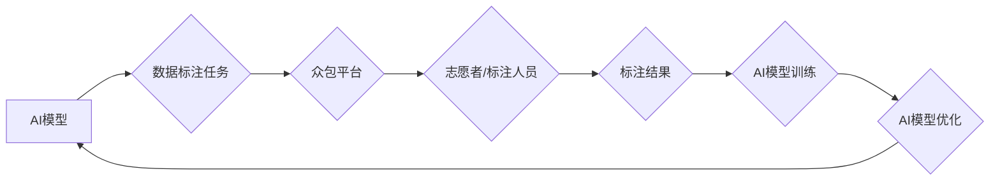

> 人工智能，众包，人类计算，协同智能，数据标注，机器学习，深度学习，创新

## 1. 背景介绍

人工智能（AI）正以惊人的速度发展，其影响力正在深刻地改变着我们生活的方方面面。从自动驾驶汽车到智能语音助手，AI技术正在不断突破边界，为人类社会带来前所未有的机遇。然而，AI的发展也面临着一些挑战，其中之一就是数据标注问题。

数据标注是机器学习和深度学习的基础，它指的是将原始数据标记为特定类别或属性的过程。例如，在训练图像识别模型时，需要将大量的图像标注为不同的物体类别，才能让模型学习识别这些物体。然而，数据标注是一个耗时、费力且需要专业知识的任务，传统的标注方式难以满足AI发展对海量高质量数据的需求。

众包，即利用互联网平台招募大众参与特定任务，为解决数据标注难题提供了一种新的思路。众包平台可以将数据标注任务分解成一个个小的单元，并通过竞赛机制或任务分配的方式，将这些任务分配给全球范围内的志愿者或专业标注人员。

## 2. 核心概念与联系

**2.1 众包与人类计算**

众包是一种利用互联网平台，将任务分解成一个个小的单元，并通过竞赛机制或任务分配的方式，将这些任务分配给全球范围内的志愿者或专业标注人员，从而完成大型复杂任务的模式。

人类计算是指利用人类的智慧和认知能力，来解决计算机难以处理的问题。它可以是通过众包平台，也可以是通过其他形式的合作，例如，科学家们利用公民科学项目，收集公众的观测数据，来帮助研究自然现象。

**2.2 AI驱动的创新**

AI技术可以大大提高众包平台的效率和质量。例如，AI可以自动识别图像中的物体，并提供标注建议，从而减少人工标注的时间和成本。此外，AI还可以分析标注者的表现，并提供个性化的反馈，帮助标注者提高标注质量。

**2.3 协同智能**

AI驱动的众包平台，本质上是一种协同智能的体现。它将人类的智慧和计算机的计算能力相结合，形成了一种新的智能模式。

**Mermaid 流程图**



## 3. 核心算法原理 & 具体操作步骤

**3.1 算法原理概述**

AI驱动的众包平台通常采用以下核心算法：

* **机器学习算法**: 用于训练AI模型，识别图像中的物体，并提供标注建议。常见的机器学习算法包括支持向量机（SVM）、决策树、随机森林和深度学习算法等。
* **推荐算法**: 用于推荐合适的标注任务给志愿者或标注人员，并根据他们的技能和经验进行匹配。常见的推荐算法包括协同过滤、内容过滤和混合推荐算法等。
* **质量控制算法**: 用于评估标注结果的质量，并识别潜在的错误或偏差。常见的质量控制算法包括统计分析、规则匹配和机器学习模型等。

**3.2 算法步骤详解**

1. **数据预处理**: 将原始数据进行清洗、格式化和转换，使其适合AI模型的训练。
2. **模型训练**: 使用机器学习算法，训练AI模型，使其能够识别图像中的物体，并提供标注建议。
3. **任务分配**: 根据志愿者的技能和经验，将标注任务分配给合适的标注人员。
4. **标注完成**: 标注人员根据AI模型的建议，完成标注任务。
5. **质量控制**: 使用质量控制算法，评估标注结果的质量，并识别潜在的错误或偏差。
6. **结果反馈**: 将标注结果反馈给AI模型，用于模型的优化和更新。

**3.3 算法优缺点**

**优点**:

* **提高效率**: AI可以自动识别图像中的物体，并提供标注建议，从而大大提高标注效率。
* **提高质量**: AI模型可以学习和识别复杂的模式，从而提高标注质量。
* **降低成本**: 众包平台可以利用全球范围内的志愿者或标注人员，从而降低标注成本。

**缺点**:

* **数据依赖**: AI模型的性能取决于训练数据的质量和数量。
* **算法偏差**: AI模型可能存在算法偏差，导致标注结果不准确。
* **伦理问题**: 众包平台的利用可能引发一些伦理问题，例如数据隐私和劳动权益等。

**3.4 算法应用领域**

AI驱动的众包平台在以下领域具有广泛的应用前景：

* **图像识别**: 用于自动识别图像中的物体、场景和人物。
* **自然语言处理**: 用于自动分析和理解文本内容，例如文本分类、情感分析和机器翻译。
* **语音识别**: 用于将语音转换为文本，例如语音助手和语音搜索。
* **医疗诊断**: 用于辅助医生进行疾病诊断，例如图像分析和病历解读。
* **金融风险控制**: 用于识别和预防金融欺诈和风险。

## 4. 数学模型和公式 & 详细讲解 & 举例说明

**4.1 数学模型构建**

在AI驱动的众包平台中，我们可以使用以下数学模型来描述标注结果的质量：

* **准确率**: 指标注结果中正确标注的比例。
* **召回率**: 指标注结果中包含所有真实标注的比例。
* **F1-score**: 准确率和召回率的调和平均数，用于综合评估标注结果的质量。

**4.2 公式推导过程**

* **准确率**:  
  $$Accuracy = \frac{TP + TN}{TP + TN + FP + FN}$$
  其中，TP表示真阳性，TN表示真阴性，FP表示假阳性，FN表示假阴性。

* **召回率**:
  $$Recall = \frac{TP}{TP + FN}$$

* **F1-score**:
  $$F1-score = 2 * \frac{Precision * Recall}{Precision + Recall}$$

**4.3 案例分析与讲解**

假设我们有一个图像识别模型，用于识别猫和狗的图片。我们使用AI驱动的众包平台，收集了1000张图片的标注数据。

* 模型的准确率为80%，这意味着模型正确识别了800张图片。
* 模型的召回率为90%，这意味着模型识别出了90%的真实猫和狗图片。
* 模型的F1-score为85%，这意味着模型的整体标注质量较高。

## 5. 项目实践：代码实例和详细解释说明

**5.1 开发环境搭建**

* 操作系统：Ubuntu 20.04
* Python 版本：3.8
* 必要的库：TensorFlow、PyTorch、Scikit-learn、Numpy、Pandas

**5.2 源代码详细实现**

```python
# 数据预处理
import pandas as pd
data = pd.read_csv('data.csv')
data['label'] = data['label'].astype(int)

# 模型训练
from sklearn.linear_model import LogisticRegression
model = LogisticRegression()
model.fit(data[['feature1', 'feature2']], data['label'])

# 任务分配
# ...

# 标注完成
# ...

# 质量控制
# ...

# 结果反馈
# ...
```

**5.3 代码解读与分析**

* 数据预处理部分：读取数据并将其转换为适合模型训练的格式。
* 模型训练部分：使用逻辑回归模型训练一个图像识别模型。
* 任务分配部分：根据标注者的技能和经验，将标注任务分配给合适的标注人员。
* 标注完成部分：标注人员完成标注任务。
* 质量控制部分：使用质量控制算法，评估标注结果的质量。
* 结果反馈部分：将标注结果反馈给模型，用于模型的优化和更新。

**5.4 运行结果展示**

* 模型的准确率、召回率和F1-score等指标。
* 标注结果的分布情况。
* 标注人员的性能评估。

## 6. 实际应用场景

**6.1 图像识别**

AI驱动的众包平台可以用于训练图像识别模型，例如识别物体、场景和人物。

**6.2 自然语言处理**

AI驱动的众包平台可以用于训练自然语言处理模型，例如文本分类、情感分析和机器翻译。

**6.3 语音识别**

AI驱动的众包平台可以用于训练语音识别模型，例如将语音转换为文本。

**6.4 医疗诊断**

AI驱动的众包平台可以用于辅助医生进行疾病诊断，例如图像分析和病历解读。

**6.5 金融风险控制**

AI驱动的众包平台可以用于识别和预防金融欺诈和风险。

**6.6 未来应用展望**

AI驱动的众包平台在未来将有更广泛的应用场景，例如：

* 自动驾驶汽车
* 人机交互
* 个性化教育
* 科学研究

## 7. 工具和资源推荐

**7.1 学习资源推荐**

* **书籍**:
    * 《深度学习》
    * 《机器学习实战》
    * 《自然语言处理》
* **在线课程**:
    * Coursera
    * edX
    * Udacity

**7.2 开发工具推荐**

* **机器学习框架**: TensorFlow、PyTorch
* **数据处理工具**: Pandas、NumPy
* **众包平台**: Amazon Mechanical Turk、Figure Eight

**7.3 相关论文推荐**

* **论文**:
    * 《Human Computation》
    * 《Crowdsourcing Algorithms》
    * 《AI-Powered Crowdsourcing》

## 8. 总结：未来发展趋势与挑战

**8.1 研究成果总结**

AI驱动的众包平台已经取得了显著的成果，在图像识别、自然语言处理、语音识别等领域取得了突破性的进展。

**8.2 未来发展趋势**

* **更智能的AI模型**: 未来，AI模型将更加智能，能够更好地理解和处理复杂的任务。
* **更有效的众包平台**: 未来，众包平台将更加高效，能够更好地匹配任务和标注人员。
* **更广泛的应用场景**: 未来，AI驱动的众包平台将应用于更多领域，例如自动驾驶汽车、人机交互和个性化教育。

**8.3 面临的挑战**

* **数据隐私**: 众包平台需要确保标注数据的隐私安全。
* **算法偏差**: AI模型可能存在算法偏差，导致标注结果不准确。
* **伦理问题**: 众包平台的利用可能引发一些伦理问题，例如数据隐私和劳动权益等。

**8.4 研究展望**

未来，我们需要继续研究如何提高AI驱动的众包平台的效率、准确性和安全性，并解决其面临的挑战。


## 9. 附录：常见问题与解答

**9.1 如何选择合适的标注人员？**

* 考虑标注任务的复杂程度和专业性。
* 评估标注人员的技能和经验。
* 使用测试任务评估标注人员的质量。

**9.2 如何保证标注结果的质量？**

* 使用质量控制算法评估标注结果。
* 提供标注人员培训和指导。
* 建立标注结果审核机制。

**9.3 如何保护标注数据的隐私？**

* 使用匿名化技术处理标注数据。
* 遵守数据隐私法规。
* 建立数据安全管理制度。


作者：禅与计算机程序设计艺术 / Zen and the Art of Computer Programming 
<end_of_turn>