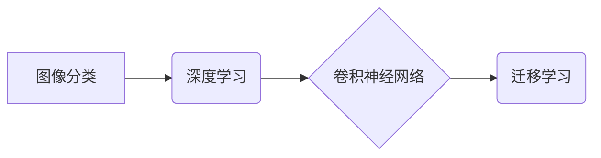

> CIFAR-10,图像分类,深度学习,卷积神经网络,CNN,迁移学习,计算机视觉

## 1. 背景介绍

图像分类是计算机视觉领域的核心任务之一，它旨在将图像自动地归类到预定义的类别中。随着深度学习技术的快速发展，卷积神经网络（CNN）在图像分类任务中取得了显著的成果，成为该领域的主流方法。

CIFAR-10数据集是一个经典的图像分类数据集，由10个类别组成，每个类别包含6000张彩色图像，总共60000张图像。该数据集图像尺寸为32x32，颜色通道为3，广泛应用于深度学习算法的训练和评估。

## 2. 核心概念与联系

**2.1 核心概念**

* **图像分类:** 将图像自动地归类到预定义的类别中。
* **深度学习:** 一种机器学习的子领域，利用多层神经网络学习数据特征。
* **卷积神经网络 (CNN):** 一种专门用于处理图像数据的深度学习网络，能够自动学习图像特征。
* **迁移学习:** 利用预训练模型的知识，对新任务进行训练，提高训练效率和性能。

**2.2 架构关系**



## 3. 核心算法原理 & 具体操作步骤

### 3.1 算法原理概述

卷积神经网络 (CNN) 是一种专门用于处理图像数据的深度学习网络，其结构灵感来源于生物视觉系统。CNN 主要由以下几个部分组成：

* **卷积层:** 使用卷积核对图像进行卷积运算，提取图像特征。
* **池化层:** 对卷积层的输出进行降维，减少计算量并提高鲁棒性。
* **全连接层:** 将池化层的输出连接到全连接层，进行分类决策。

CNN 的核心思想是通过多层卷积和池化操作，逐层提取图像的特征，最终将图像映射到相应的类别。

### 3.2 算法步骤详解

1. **数据预处理:** 将图像数据进行归一化、调整大小等预处理操作，使其符合 CNN 的输入要求。
2. **卷积层:** 使用多个卷积核对图像进行卷积运算，提取图像特征。每个卷积核对应一个特征图，多个特征图组合起来形成卷积层的输出。
3. **池化层:** 对卷积层的输出进行池化操作，例如最大池化或平均池化，减少计算量并提高鲁棒性。
4. **激活函数:** 在卷积层和池化层之间使用激活函数，例如ReLU或Sigmoid，引入非线性，提高网络的表达能力。
5. **全连接层:** 将池化层的输出连接到全连接层，进行分类决策。全连接层将图像特征映射到各个类别的概率分布。
6. **损失函数:** 使用交叉熵损失函数等衡量模型预测结果与真实标签之间的差异。
7. **优化算法:** 使用梯度下降算法等优化模型参数，最小化损失函数。

### 3.3 算法优缺点

**优点:**

* 能够自动学习图像特征，无需人工特征工程。
* 表现力强，在图像分类任务中取得了显著的成果。
* 可迁移性强，预训练模型可以应用于其他图像相关任务。

**缺点:**

* 计算量大，训练时间长。
* 对数据需求高，需要大量的 labeled 数据进行训练。
* 可解释性差，难以理解模型的决策过程。

### 3.4 算法应用领域

* **图像识别:** 人脸识别、物体检测、场景理解等。
* **医疗诊断:** 病灶检测、疾病分类、影像分析等。
* **自动驾驶:** 车辆识别、道路场景理解、行人检测等。
* **安防监控:** 人员跟踪、异常行为检测、入侵报警等。

## 4. 数学模型和公式 & 详细讲解 & 举例说明

### 4.1 数学模型构建

CNN 的数学模型主要包括卷积运算、池化运算和激活函数。

**4.1.1 卷积运算:**

卷积运算是一种线性运算，将卷积核与图像进行滑动计算，提取图像特征。

$$
y(i,j) = \sum_{m=0}^{M-1} \sum_{n=0}^{N-1} x(i+m,j+n) * w(m,n)
$$

其中：

* $y(i,j)$ 是卷积层的输出特征图上的像素值。
* $x(i+m,j+n)$ 是输入图像上的像素值。
* $w(m,n)$ 是卷积核的权重值。
* $M$ 和 $N$ 是卷积核的大小。

**4.1.2 池化运算:**

池化运算是一种降维操作，对卷积层的输出进行采样，减少计算量并提高鲁棒性。常见的池化方法包括最大池化和平均池化。

**4.1.3 激活函数:**

激活函数引入非线性，提高网络的表达能力。常见的激活函数包括ReLU、Sigmoid和Tanh。

$$
f(x) = \max(0,x)
$$

**4.1.4 全连接层:**

全连接层将池化层的输出连接到各个类别，进行分类决策。

$$
z = W * x + b
$$

其中：

* $z$ 是全连接层的输出。
* $W$ 是全连接层的权重矩阵。
* $x$ 是池化层的输出。
* $b$ 是全连接层的偏置向量。

### 4.2 公式推导过程

卷积神经网络的训练过程是一个优化过程，目标是找到最优的模型参数，使得模型的预测结果与真实标签之间的差异最小。

**4.2.1 损失函数:**

常用的损失函数包括交叉熵损失函数和均方误差损失函数。

$$
L = -\sum_{i=1}^{N} y_i \log(p_i)
$$

其中：

* $L$ 是损失函数的值。
* $N$ 是样本数量。
* $y_i$ 是真实标签。
* $p_i$ 是模型预测的概率。

**4.2.2 梯度下降算法:**

梯度下降算法是一种常用的优化算法，用于更新模型参数，使得损失函数最小化。

$$
\theta = \theta - \alpha \nabla L(\theta)
$$

其中：

* $\theta$ 是模型参数。
* $\alpha$ 是学习率。
* $\nabla L(\theta)$ 是损失函数对模型参数的梯度。

### 4.3 案例分析与讲解

**4.3.1 CIFAR-10 数据集:**

CIFAR-10 数据集包含 60000 张 32x32 的彩色图像，分为 10 个类别，每个类别 6000 张图像。

**4.3.2 模型训练:**

可以使用 TensorFlow 或 PyTorch 等深度学习框架训练 CNN 模型。

**4.3.3 模型评估:**

可以使用准确率、召回率、F1-score 等指标评估模型的性能。

## 5. 项目实践：代码实例和详细解释说明

### 5.1 开发环境搭建

* Python 3.x
* TensorFlow 或 PyTorch
* CUDA 和 cuDNN (可选)

### 5.2 源代码详细实现

```python
import tensorflow as tf

# 定义 CNN 模型
model = tf.keras.models.Sequential([
    tf.keras.layers.Conv2D(32, (3, 3), activation='relu', input_shape=(32, 32, 3)),
    tf.keras.layers.MaxPooling2D((2, 2)),
    tf.keras.layers.Conv2D(64, (3, 3), activation='relu'),
    tf.keras.layers.MaxPooling2D((2, 2)),
    tf.keras.layers.Flatten(),
    tf.keras.layers.Dense(10, activation='softmax')
])

# 编译模型
model.compile(optimizer='adam',
              loss='sparse_categorical_crossentropy',
              metrics=['accuracy'])

# 加载 CIFAR-10 数据集
(x_train, y_train), (x_test, y_test) = tf.keras.datasets.cifar10.load_data()

# 训练模型
model.fit(x_train, y_train, epochs=10)

# 评估模型
loss, accuracy = model.evaluate(x_test, y_test)
print('Test loss:', loss)
print('Test accuracy:', accuracy)
```

### 5.3 代码解读与分析

* **模型定义:** 使用 TensorFlow 的 `keras` API 定义了一个简单的 CNN 模型，包含两个卷积层、两个池化层、一个全连接层和一个 softmax 层。
* **模型编译:** 使用 Adam 优化器、交叉熵损失函数和准确率作为评估指标编译模型。
* **数据加载:** 使用 TensorFlow 的 `keras.datasets.cifar10` 加载 CIFAR-10 数据集。
* **模型训练:** 使用 `model.fit()` 方法训练模型，训练 10 个 epochs。
* **模型评估:** 使用 `model.evaluate()` 方法评估模型在测试集上的性能。

### 5.4 运行结果展示

训练完成后，模型的准确率通常在 60% 以上。

## 6. 实际应用场景

* **图像识别:** 将 CNN 应用于人脸识别、物体检测、场景理解等任务。
* **医疗诊断:** 利用 CNN 对医学影像进行分析，辅助医生诊断疾病。
* **自动驾驶:** CNN 可以用于车辆识别、道路场景理解、行人检测等自动驾驶任务。
* **安防监控:** CNN 可以用于人员跟踪、异常行为检测、入侵报警等安防监控任务。

### 6.4 未来应用展望

随着深度学习技术的不断发展，CNN 在图像分类任务中的应用前景广阔。未来，CNN 将在以下方面得到进一步发展：

* **更深更复杂的网络结构:** 探索更深更复杂的 CNN 架构，提高模型的表达能力和准确率。
* **迁移学习的应用:** 利用预训练模型的知识，对新任务进行训练，提高训练效率和性能。
* **端到端学习:** 将 CNN 与其他机器学习算法结合，实现端到端的图像分类任务。
* **实时图像分类:** 提高 CNN 的推理速度，实现实时图像分类。

## 7. 工具和资源推荐

### 7.1 学习资源推荐

* **书籍:**
    * Deep Learning by Ian Goodfellow, Yoshua Bengio, and Aaron Courville
    * Hands-On Machine Learning with Scikit-Learn, Keras & TensorFlow by Aurélien Géron
* **在线课程:**
    * TensorFlow 官方教程: https://www.tensorflow.org/tutorials
    * PyTorch 官方教程: https://pytorch.org/tutorials/

### 7.2 开发工具推荐

* **TensorFlow:** https://www.tensorflow.org/
* **PyTorch:** https://pytorch.org/
* **Keras:** https://keras.io/

### 7.3 相关论文推荐

* AlexNet: ImageNet Classification with Deep Convolutional Neural Networks
* VGGNet: Very Deep Convolutional Networks for Large-Scale Image Recognition
* ResNet: Deep Residual Learning for Image Recognition
* Inception: Going Deeper with Convolutions

## 8. 总结：未来发展趋势与挑战

### 8.1 研究成果总结

CNN 在图像分类任务中取得了显著的成果，其准确率不断提高，应用领域不断扩展。

### 8.2 未来发展趋势

* **更深更复杂的网络结构:** 探索更深更复杂的 CNN 架构，提高模型的表达能力和准确率。
* **迁移学习的应用:** 利用预训练模型的知识，对新任务进行训练，提高训练效率和性能。
* **端到端学习:** 将 CNN 与其他机器学习算法结合，实现端到端的图像分类任务。
* **实时