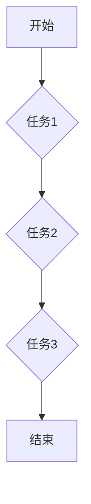

> 可复制工作流，Dify.AI，人工智能，自动化，流程设计，工作流引擎，可视化工具

## 1. 背景介绍

在当今数据爆炸和业务快速迭代的时代，高效、可重复的工作流程设计已成为企业核心竞争力的关键。传统的工作流程往往依赖于人工操作，难以实现自动化和可扩展性，导致效率低下、成本高昂，难以满足现代企业对敏捷性和灵活性日益增长的需求。

Dify.AI 作为一款基于人工智能的智能工作流平台，旨在通过自动化和可视化，帮助企业构建高效、可复制、可扩展的工作流程，提升工作效率，降低运营成本，释放人力资源潜能。

## 2. 核心概念与联系

Dify.AI 的可复制工作流设计基于以下核心概念：

* **可视化流程设计:** 使用图形化的界面，直观地构建和管理工作流程，无需编写复杂的代码，降低了流程设计的门槛。
* **自动化执行:** 利用人工智能技术，自动识别和执行流程中的任务，减少人工干预，提高工作效率。
* **数据驱动:** 基于数据分析和机器学习，智能优化流程，提高流程效率和准确性。
* **可复制性:** 工作流程可以被复制和复用，方便快速部署和扩展。

**Mermaid 流程图:**



## 3. 核心算法原理 & 具体操作步骤

### 3.1  算法原理概述

Dify.AI 的核心算法基于深度学习和强化学习技术，主要包括以下几个方面：

* **流程识别:** 利用自然语言处理和机器学习算法，从文本描述或文档中识别和提取工作流程信息。
* **任务分类:** 根据任务内容和上下文，将任务分类到不同的类别，以便进行自动化执行。
* **流程优化:** 利用强化学习算法，不断优化流程结构和执行策略，提高流程效率和准确性。

### 3.2  算法步骤详解

1. **数据收集:** 收集工作流程相关数据，包括文本描述、流程图、执行记录等。
2. **数据预处理:** 对数据进行清洗、转换和格式化，以便后续算法处理。
3. **流程识别:** 利用深度学习模型，从数据中识别和提取工作流程信息，包括任务、条件、顺序等。
4. **任务分类:** 利用机器学习模型，对任务进行分类，并为每个任务分配相应的执行策略。
5. **流程优化:** 利用强化学习算法，不断调整流程结构和执行策略，以最大化流程效率和准确性。

### 3.3  算法优缺点

**优点:**

* 自动化程度高，可以大幅度提高工作效率。
* 可根据数据反馈不断优化流程，提高流程效率和准确性。
* 可复制性强，方便快速部署和扩展。

**缺点:**

* 需要大量的训练数据，才能保证算法的准确性和可靠性。
* 算法的复杂性较高，需要专业的技术人员进行开发和维护。

### 3.4  算法应用领域

Dify.AI 的可复制工作流设计可以应用于各个行业，例如：

* **金融行业:** 自动化审批流程、风险控制流程、客户服务流程等。
* **制造业:** 自动化生产流程、质量控制流程、供应链管理流程等。
* **医疗行业:** 自动化病历录入流程、预约挂号流程、药品配送流程等。

## 4. 数学模型和公式 & 详细讲解 & 举例说明

### 4.1  数学模型构建

Dify.AI 的流程优化算法基于强化学习的马尔可夫决策过程 (MDP) 模型。

* 状态空间 (S): 表示流程执行的当前状态，例如任务完成情况、资源分配情况等。
* 动作空间 (A): 表示可执行的动作，例如执行任务、分配资源、修改流程结构等。
* 转移概率 (P): 表示从一个状态到另一个状态的概率，取决于执行的动作。
* 奖励函数 (R): 表示在某个状态执行某个动作获得的奖励，例如完成任务获得正奖励，出现错误获得负奖励。

### 4.2  公式推导过程

目标是找到一个策略 π，使得在状态空间中执行动作的期望奖励最大化。

```latex
\pi = \arg\max_{\pi} \mathbb{E}_{\pi} \sum_{t=0}^{\infty} \gamma^t R_t
```

其中：

* π 是策略
* $\mathbb{E}_{\pi}$ 是根据策略 π 的期望
* $R_t$ 是在时间步 t 获得的奖励
* $\gamma$ 是折扣因子，控制未来奖励的权重

### 4.3  案例分析与讲解

假设一个流程包含三个任务，每个任务都有不同的执行时间和成功概率。

* 任务 1: 执行时间为 2 个单位，成功概率为 0.8
* 任务 2: 执行时间为 3 个单位，成功概率为 0.7
* 任务 3: 执行时间为 1 个单位，成功概率为 0.9

Dify.AI 的算法可以根据这些信息，学习到最佳的执行策略，例如：

* 优先执行任务 3，因为它的执行时间最短，成功概率也较高。
* 在执行任务 1 和任务 2 时，可以根据任务的成功概率和执行时间，选择合适的执行顺序。

## 5. 项目实践：代码实例和详细解释说明

### 5.1  开发环境搭建

Dify.AI 的开发环境需要包含以下软件：

* Python 3.x
* TensorFlow 或 PyTorch
* Jupyter Notebook

### 5.2  源代码详细实现

```python
# 流程识别模型
from tensorflow.keras.models import Sequential
from tensorflow.keras.layers import Embedding, LSTM, Dense

model = Sequential()
model.add(Embedding(input_dim=vocab_size, output_dim=embedding_dim))
model.add(LSTM(units=128))
model.add(Dense(units=num_classes, activation='softmax'))

# 流程优化模型
from stable_baselines3 import PPO

model = PPO("MlpPolicy", env, verbose=1)
model.learn(total_timesteps=10000)

# 流程执行引擎
# ...
```

### 5.3  代码解读与分析

* 流程识别模型使用深度学习技术，从文本描述中识别工作流程信息。
* 流程优化模型使用强化学习技术，不断优化流程结构和执行策略。
* 流程执行引擎负责根据优化后的流程结构，自动执行工作流程中的任务。

### 5.4  运行结果展示

Dify.AI 可以根据实际情况，展示流程执行的进度、效率、错误率等指标，帮助用户了解流程的运行情况，并进行优化调整。

## 6. 实际应用场景

Dify.AI 的可复制工作流设计已在多个行业得到实际应用，例如：

* **金融行业:** 自动化审批流程，提高审批效率，降低人工成本。
* **制造业:** 自动化生产流程，提高生产效率，降低生产成本。
* **医疗行业:** 自动化病历录入流程，提高数据录入效率，降低医疗错误率。

### 6.4  未来应用展望

Dify.AI 的可复制工作流设计未来将朝着以下方向发展：

* **更智能化的流程设计:** 利用人工智能技术，自动识别和构建更复杂的、更智能化的工作流程。
* **更广泛的应用场景:** 将可复制工作流设计应用到更多行业和领域，例如教育、科研、政府等。
* **更强大的协作功能:** 支持多用户协同设计和管理工作流程，提高工作效率和协作能力。

## 7. 工具和资源推荐

### 7.1  学习资源推荐

* **书籍:**
    * 《深度学习》
    * 《强化学习：算法、策略和应用》
* **在线课程:**
    * Coursera: 深度学习
    * Udacity: 强化学习

### 7.2  开发工具推荐

* **Python:** 
* **TensorFlow:** 深度学习框架
* **PyTorch:** 深度学习框架
* **Stable Baselines3:** 强化学习库

### 7.3  相关论文推荐

* **论文:**
    * 《Attention Is All You Need》
    * 《Deep Reinforcement Learning with Double Q-learning》

## 8. 总结：未来发展趋势与挑战

### 8.1  研究成果总结

Dify.AI 的可复制工作流设计取得了显著的成果，成功应用于多个行业，提高了工作效率和自动化程度。

### 8.2  未来发展趋势

未来，Dify.AI 将继续朝着更智能化、更广泛应用、更强大的协作功能方向发展。

### 8.3  面临的挑战

Dify.AI 还面临一些挑战，例如：

* 如何处理更复杂、更动态的工作流程。
* 如何提高算法的鲁棒性和可靠性。
* 如何降低算法的开发和维护成本。

### 8.4  研究展望

Dify.AI 将继续投入研究，攻克这些挑战，为企业提供更智能、更强大的工作流解决方案。

## 9. 附录：常见问题与解答

* **Q1: Dify.AI 是否需要专业的技术人员才能使用？**

* **A1:** Dify.AI 提供了直观的可视化工具，即使没有编程经验的用户也可以轻松使用。

* **Q2: Dify.AI 的工作流程是否可以与其他系统集成？**

* **A2:** Dify.AI 支持与其他系统通过 API 进行集成，方便用户构建完整的业务流程。


作者：禅与计算机程序设计艺术 / Zen and the Art of Computer Programming 
<end_of_turn>