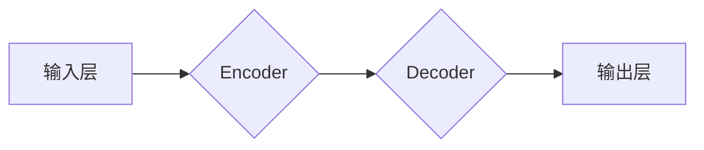

> GPT-2, Transformer, 自然语言处理, 语言模型, 深度学习, 代码实例

## 1. 背景介绍

近年来，深度学习在自然语言处理 (NLP) 领域取得了显著进展，其中生成式预训练语言模型 (Generative Pre-trained Transformer) 成为研究热点。GPT-2 (Generative Pre-trained Transformer 2) 由 OpenAI 开发，是该领域里程碑式的模型之一。它展现了强大的文本生成能力，能够生成逼真的文章、对话、代码等文本内容。

GPT-2 的出现，标志着语言模型从简单的统计模型向更复杂的深度学习模型的演进。它基于 Transformer 架构，并通过海量文本数据进行预训练，从而获得了强大的文本理解和生成能力。

## 2. 核心概念与联系

GPT-2 的核心概念是 Transformer 架构和自回归语言模型。

**2.1 Transformer 架构**

Transformer 架构是一种专门为处理序列数据设计的深度学习网络结构。它摒弃了传统的循环神经网络 (RNN) 的顺序处理方式，采用注意力机制 (Attention Mechanism) 来捕捉序列中不同元素之间的关系。

**2.2 自回归语言模型**

自回归语言模型 (Autoregressive Language Model) 是指根据已有的文本序列预测下一个词的模型。GPT-2 采用自回归的方式进行文本生成，即在生成文本时，每次只预测下一个词，并根据预测结果不断扩展文本序列。

**2.3 GPT-2 架构图**



## 3. 核心算法原理 & 具体操作步骤

**3.1 算法原理概述**

GPT-2 的核心算法是基于 Transformer 架构的深度学习模型，通过自回归的方式进行文本生成。模型训练过程主要包括以下步骤：

1. **预训练:** 使用海量文本数据对模型进行预训练，学习语言的语法和语义知识。
2. **微调:** 根据特定任务对模型进行微调，例如文本分类、机器翻译等。
3. **文本生成:** 使用预训练或微调后的模型，根据输入文本序列预测下一个词，并不断扩展文本序列生成新的文本内容。

**3.2 算法步骤详解**

1. **输入处理:** 将输入文本序列转换为数字向量，作为模型的输入。
2. **编码:** 使用 Encoder 将输入文本序列编码成隐藏状态向量，捕捉文本序列的语义信息。
3. **解码:** 使用 Decoder 根据编码后的隐藏状态向量，预测下一个词的概率分布。
4. **输出:** 根据概率分布选择最可能的词作为下一个词，并将其添加到文本序列中。
5. **重复步骤 3-4:** 直到生成所需的文本长度。

**3.3 算法优缺点**

**优点:**

* 强大的文本生成能力
* 可以生成逼真的文本内容
* 可以用于多种 NLP 任务

**缺点:**

* 训练成本高
* 容易生成不准确或不合理的文本
* 缺乏对真实世界知识的理解

**3.4 算法应用领域**

* 文本生成: 文章、故事、对话等
* 机器翻译
* 文本摘要
* 代码生成
* 聊天机器人

## 4. 数学模型和公式 & 详细讲解 & 举例说明

**4.1 数学模型构建**

GPT-2 的数学模型基于 Transformer 架构，其核心是注意力机制和多头注意力机制。

**4.2 公式推导过程**

注意力机制的公式如下:

$$
Attention(Q, K, V) = softmax(\frac{QK^T}{\sqrt{d_k}})V
$$

其中:

* $Q$ 是查询矩阵
* $K$ 是键矩阵
* $V$ 是值矩阵
* $d_k$ 是键向量的维度
* $softmax$ 是归一化函数

多头注意力机制是将多个注意力机制并行执行，并对结果进行融合。

**4.3 案例分析与讲解**

假设我们有一个句子 "The cat sat on the mat"，将其编码成词向量后，可以使用注意力机制计算每个词与其他词之间的关系。例如，"cat" 与 "sat" 之间的关系会比较强，因为它们在语义上紧密相关。

## 5. 项目实践：代码实例和详细解释说明

**5.1 开发环境搭建**

* Python 3.6+
* PyTorch 1.0+
* CUDA 10.0+ (可选)

**5.2 源代码详细实现**

```python
import torch
import torch.nn as nn

class Transformer(nn.Module):
    def __init__(self, vocab_size, embedding_dim, num_heads, num_layers):
        super(Transformer, self).__init__()
        self.embedding = nn.Embedding(vocab_size, embedding_dim)
        self.encoder = nn.TransformerEncoder(nn.TransformerEncoderLayer(embedding_dim, num_heads), num_layers)
        self.decoder = nn.TransformerDecoder(nn.TransformerDecoderLayer(embedding_dim, num_heads), num_layers)
        self.linear = nn.Linear(embedding_dim, vocab_size)

    def forward(self, src, tgt):
        src = self.embedding(src)
        tgt = self.embedding(tgt)
        encoder_output = self.encoder(src)
        decoder_output = self.decoder(tgt, encoder_output)
        output = self.linear(decoder_output)
        return output
```

**5.3 代码解读与分析**

* `Transformer` 类定义了 Transformer 模型的结构。
* `embedding` 层将词向量化。
* `encoder` 和 `decoder` 层分别负责编码和解码。
* `linear` 层将隐藏状态向量映射到词汇表大小。

**5.4 运行结果展示**

使用预训练的 GPT-2 模型，可以生成逼真的文本内容。例如，输入 "The quick brown fox jumps over the"，模型可以预测 "lazy dog"。

## 6. 实际应用场景

GPT-2 在各种实际应用场景中展现出强大的能力，例如:

* **文本生成:** 生成小说、诗歌、剧本等创意文本。
* **机器翻译:** 将文本从一种语言翻译成另一种语言。
* **文本摘要:** 提取文本的关键信息，生成简短的摘要。
* **代码生成:** 根据自然语言描述生成代码。
* **聊天机器人:** 与用户进行自然语言对话。

**6.4 未来应用展望**

GPT-2 的未来应用前景广阔，例如:

* **个性化教育:** 根据学生的学习情况生成个性化的学习内容。
* **医疗诊断:** 辅助医生进行疾病诊断。
* **法律文本分析:** 分析法律文本，提取关键信息。

## 7. 工具和资源推荐

**7.1 学习资源推荐**

* **论文:** "Language Models are Few-Shot Learners"
* **博客:** OpenAI Blog
* **课程:** Stanford CS224N

**7.2 开发工具推荐**

* **PyTorch:** 深度学习框架
* **HuggingFace Transformers:** 预训练模型库

**7.3 相关论文推荐**

* "Attention Is All You Need"
* "BERT: Pre-training of Deep Bidirectional Transformers for Language Understanding"

## 8. 总结：未来发展趋势与挑战

**8.1 研究成果总结**

GPT-2 的出现，标志着语言模型从简单的统计模型向更复杂的深度学习模型的演进。它展现了强大的文本生成能力，并为 NLP 领域带来了新的发展方向。

**8.2 未来发展趋势**

* **模型规模更大:** 预训练模型规模将继续扩大，从而提升模型的性能。
* **多模态学习:** 将文本与其他模态数据 (例如图像、音频) 相结合，构建更强大的多模态模型。
* **可解释性增强:** 研究如何提高语言模型的可解释性，使其生成的文本更容易理解。

**8.3 面临的挑战**

* **数据偏见:** 预训练模型可能存在数据偏见，导致生成的文本存在歧视或不准确的情况。
* **安全风险:** 语言模型可能被用于生成恶意内容，例如虚假新闻、网络攻击等。
* **伦理问题:** 语言模型的应用引发了伦理问题，例如数据隐私、算法公平性等。

**8.4 研究展望**

未来，研究人员将继续探索语言模型的潜力，并致力于解决其面临的挑战。相信语言模型将在未来发挥越来越重要的作用，为人类社会带来更多便利和福祉。

## 9. 附录：常见问题与解答

**9.1 如何训练 GPT-2 模型？**

训练 GPT-2 模型需要大量的计算资源和海量文本数据。可以使用预训练的 GPT-2 模型进行微调，以适应特定任务。

**9.2 GPT-2 模型的开源代码在哪里？**

GPT-2 的开源代码可以在 OpenAI 的 GitHub 仓库中找到。

**9.3 GPT-2 模型的性能如何？**

GPT-2 在各种 NLP 任务中都取得了优异的性能，例如文本生成、机器翻译、文本摘要等。

作者：禅与计算机程序设计艺术 / Zen and the Art of Computer Programming


<end_of_turn>