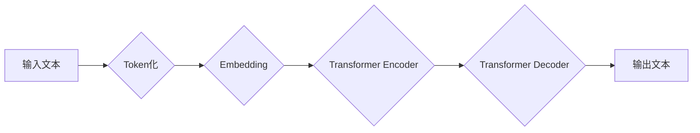

> Large Language Model (LLM), 训练, 大规模数据, 深度学习, Transformer, 自然语言处理 (NLP)

## 1. 背景介绍

大型语言模型 (Large Language Model, LLM) 近年来在自然语言处理 (NLP) 领域取得了令人瞩目的成就。从文本生成、翻译到问答和代码编写，LLM 展示了强大的能力，深刻地改变了我们与语言交互的方式。然而，训练这些庞大的模型需要大量的计算资源和海量数据，这使得 LLM 的开发和应用面临着诸多挑战。

本篇文章将深入探讨 LLM 的训练过程，重点关注大规模数据和先进算法在其中扮演的关键角色。我们将从核心概念和算法原理出发，逐步深入到具体的训练步骤、数学模型和代码实现，并结合实际应用场景和未来发展趋势，为读者提供全面的理解。

## 2. 核心概念与联系

LLM 的训练本质上是一个机器学习的过程，旨在通过学习大量的文本数据来构建一个能够理解和生成人类语言的模型。

**2.1 核心概念**

* **Transformer:** Transformer 是一种基于注意力机制的神经网络架构，是 LLM 训练的核心。它能够有效地捕捉文本序列中的长距离依赖关系，显著提升了模型的性能。

* **深度学习:** 深度学习是一种机器学习的子领域，利用多层神经网络来学习复杂的模式。LLM 训练通常采用深度学习算法，例如反向传播算法。

* **自然语言处理 (NLP):** NLP 是计算机科学的一个分支，致力于使计算机能够理解和处理人类语言。LLM 是 NLP 领域的重要发展方向，为许多 NLP 任务提供了强大的工具。

**2.2 架构图**



## 3. 核心算法原理 & 具体操作步骤

**3.1 算法原理概述**

LLM 训练的核心算法是基于 Transformer 架构的深度学习算法。其主要原理是通过训练模型参数来最小化预测文本与真实文本之间的差异。

**3.2 算法步骤详解**

1. **数据预处理:** 将原始文本数据进行清洗、分词、标记等预处理操作，使其能够被模型理解。

2. **模型构建:** 根据 Transformer 架构构建模型，包括编码器和解码器。

3. **参数初始化:** 为模型参数进行随机初始化。

4. **前向传播:** 将预处理后的文本数据输入模型，计算模型输出的预测文本。

5. **损失函数计算:** 计算预测文本与真实文本之间的差异，使用损失函数衡量模型的性能。

6. **反向传播:** 利用梯度下降算法，根据损失函数的梯度更新模型参数。

7. **迭代训练:** 重复步骤 4-6，直到模型性能达到预设目标。

**3.3 算法优缺点**

* **优点:**

    * 能够捕捉文本序列中的长距离依赖关系。
    * 训练效果显著，在许多 NLP 任务中取得了突破性进展。

* **缺点:**

    * 训练成本高，需要大量的计算资源和数据。
    * 模型参数量大，部署和推理效率较低。

**3.4 算法应用领域**

* 文本生成
* 机器翻译
* 问答系统
* 代码生成
* 文本摘要

## 4. 数学模型和公式 & 详细讲解 & 举例说明

**4.1 数学模型构建**

LLM 的训练过程本质上是一个优化问题，目标是找到最优的模型参数，使得模型能够最小化预测文本与真实文本之间的差异。

**4.2 公式推导过程**

损失函数通常采用交叉熵损失函数，其公式如下：

$$
L = -\sum_{i=1}^{n} y_i \log(\hat{y}_i)
$$

其中：

* $y_i$ 是真实文本的第 i 个词的 one-hot 编码。
* $\hat{y}_i$ 是模型预测的第 i 个词的概率分布。
* $n$ 是文本序列的长度。

**4.3 案例分析与讲解**

假设我们训练一个 LLM 来预测下一个词。输入文本为 "The cat sat on the", 模型需要预测下一个词。

模型会根据输入文本的上下文信息，计算每个词的概率分布。例如，模型可能预测下一个词是 "mat"、"chair" 或 "table"。

损失函数会根据模型预测的概率分布与真实文本的下一个词进行比较，计算损失值。

通过反向传播算法，模型会根据损失值更新参数，使得模型预测的概率分布更接近真实文本。

## 5. 项目实践：代码实例和详细解释说明

**5.1 开发环境搭建**

* Python 3.7+
* PyTorch 或 TensorFlow
* CUDA 和 cuDNN

**5.2 源代码详细实现**

```python
import torch
import torch.nn as nn

class Transformer(nn.Module):
    # ... Transformer 模型的实现 ...

# 实例化模型
model = Transformer()

# 定义损失函数和优化器
criterion = nn.CrossEntropyLoss()
optimizer = torch.optim.Adam(model.parameters())

# 训练循环
for epoch in range(num_epochs):
    for batch in dataloader:
        # 前向传播
        outputs = model(batch)

        # 计算损失
        loss = criterion(outputs, batch_labels)

        # 反向传播
        optimizer.zero_grad()
        loss.backward()

        # 更新参数
        optimizer.step()

# 保存模型
torch.save(model.state_dict(), 'model.pth')
```

**5.3 代码解读与分析**

* Transformer 模型的实现包括编码器和解码器，以及注意力机制。
* 损失函数和优化器用于训练模型。
* 训练循环迭代训练模型，直到达到预设目标。
* 最后，保存训练好的模型参数。

**5.4 运行结果展示**

训练完成后，可以使用保存的模型参数来进行文本生成、机器翻译等任务。

## 6. 实际应用场景

LLM 在许多实际应用场景中发挥着重要作用，例如：

* **聊天机器人:** LLM 可以用于构建更自然、更智能的聊天机器人，能够进行更流畅的对话。
* **文本摘要:** LLM 可以自动生成文本摘要，帮助用户快速了解文章内容。
* **机器翻译:** LLM 可以实现更准确、更自然的机器翻译，打破语言障碍。
* **代码生成:** LLM 可以根据自然语言描述生成代码，提高开发效率。

**6.4 未来应用展望**

随着 LLM 技术的不断发展，其应用场景将更加广泛，例如：

* **个性化教育:** LLM 可以根据学生的学习情况提供个性化的学习内容和辅导。
* **医疗诊断:** LLM 可以辅助医生进行疾病诊断，提高诊断准确率。
* **科学研究:** LLM 可以帮助科学家分析大规模数据，发现新的科学规律。

## 7. 工具和资源推荐

**7.1 学习资源推荐**

* **书籍:**

    * 《深度学习》
    * 《自然语言处理》

* **在线课程:**

    * Coursera: 深度学习
    * Udacity: 自然语言处理

**7.2 开发工具推荐**

* **PyTorch:** 深度学习框架
* **TensorFlow:** 深度学习框架
* **Hugging Face Transformers:** 预训练 Transformer 模型库

**7.3 相关论文推荐**

* 《Attention Is All You Need》
* 《BERT: Pre-training of Deep Bidirectional Transformers for Language Understanding》
* 《GPT-3: Language Models are Few-Shot Learners》

## 8. 总结：未来发展趋势与挑战

**8.1 研究成果总结**

LLM 训练取得了显著进展，模型性能不断提升，应用场景不断拓展。

**8.2 未来发展趋势**

* 模型规模进一步扩大
* 训练效率提升
* 泛化能力增强
* 伦理和安全问题得到重视

**8.3 面临的挑战**

* 计算资源需求高
* 数据标注成本高
* 偏见和歧视问题
* 虚假信息生成问题

**8.4 研究展望**

未来研究将重点关注以下方向：

* 更高效的训练算法
* 更强大的模型架构
* 更安全的模型应用


## 9. 附录：常见问题与解答

**9.1 如何选择合适的 LLM 模型？**

选择合适的 LLM 模型取决于具体的应用场景和需求。

**9.2 如何训练自己的 LLM 模型？**

训练自己的 LLM 模型需要大量的计算资源、数据和专业知识。

**9.3 如何解决 LLM 模型的偏见和歧视问题？**

可以通过数据预处理、模型训练和评估等方式来缓解 LLM 模型的偏见和歧视问题。


作者：禅与计算机程序设计艺术 / Zen and the Art of Computer Programming 
<end_of_turn>