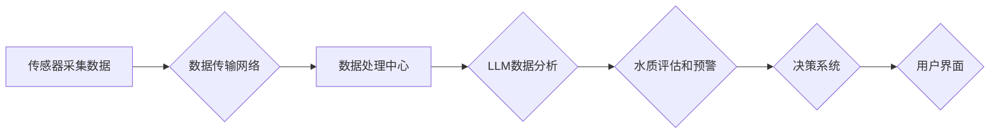

> LLM，智能水质监测，自然语言处理，机器学习，深度学习，数据分析，环境监测

## 1. 背景介绍

水质监测是保障人类健康和生态环境的重要环节。随着工业化和城市化的快速发展，水污染问题日益严峻，对水质监测的需求也越来越迫切。传统的监测方法主要依靠人工采样和实验室分析，存在效率低、成本高、数据滞后等问题。近年来，随着人工智能技术的快速发展，智能水质监测系统逐渐成为研究热点。

智能水质监测系统利用传感器、物联网技术、数据分析和机器学习等技术，实现对水质参数的实时监测、分析和预警。其中，大型语言模型（LLM）作为一种强大的自然语言处理（NLP）技术，在智能水质监测系统中具有巨大的潜力。

## 2. 核心概念与联系

### 2.1  LLM概述

大型语言模型（LLM）是一种基于深度学习的强大人工智能模型，通过训练海量文本数据，能够理解和生成人类语言。LLM拥有强大的文本处理能力，例如文本分类、文本摘要、机器翻译、对话生成等。

### 2.2  智能水质监测系统概述

智能水质监测系统通常由以下几个主要部分组成：

* **传感器网络:** 用于采集水质参数数据，例如温度、pH值、溶解氧、浊度、化学成分等。
* **数据传输网络:** 将传感器采集的数据传输到数据处理中心。
* **数据处理中心:** 对采集到的数据进行预处理、清洗、分析和存储。
* **决策系统:** 基于数据分析结果，进行水质评估、预警和决策。
* **用户界面:** 用于展示监测数据、分析结果和预警信息。

### 2.3  LLM在智能水质监测系统中的应用

LLM可以应用于智能水质监测系统的多个环节，例如：

* **数据分析和预处理:** LLM可以帮助识别和处理水质数据中的异常值、噪声和缺失值，提高数据质量。
* **水质评估和预警:** LLM可以根据水质数据和历史数据，进行水质评估和预警，及时提醒相关人员采取措施。
* **报告生成和可视化:** LLM可以自动生成水质监测报告，并进行可视化展示，方便用户理解和分析数据。
* **用户交互和支持:** LLM可以作为智能客服，回答用户关于水质监测的问题，提供技术支持。

**Mermaid 流程图**



## 3. 核心算法原理 & 具体操作步骤

### 3.1  算法原理概述

LLM在智能水质监测系统中的应用主要基于以下核心算法原理：

* **自然语言理解 (NLU):** LLM可以理解和解析水质监测数据中的文本信息，例如传感器读数、报警信息、水质标准等。
* **机器学习 (ML):** LLM可以利用历史水质数据进行训练，学习水质变化规律，并进行预测和预警。
* **深度学习 (DL):** LLM通常基于深度神经网络结构，能够学习更复杂的特征和模式，提高水质监测的准确性和效率。

### 3.2  算法步骤详解

LLM在智能水质监测系统中的应用流程可以概括为以下步骤：

1. **数据采集:** 传感器采集水质参数数据，并将其转换为文本格式。
2. **数据预处理:** 使用LLM进行数据清洗、异常值处理和缺失值填充等预处理操作。
3. **特征提取:** 使用LLM提取水质数据中的关键特征，例如温度、pH值、溶解氧等。
4. **模型训练:** 使用历史水质数据训练LLM模型，学习水质变化规律。
5. **水质评估:** 将实时水质数据输入到训练好的LLM模型中，进行水质评估和预警。
6. **结果展示:** 将水质评估结果以文本、图表或语音等形式展示给用户。

### 3.3  算法优缺点

**优点:**

* **强大的文本处理能力:** LLM可以理解和处理复杂的文本信息，例如水质标准、报警信息等。
* **学习能力强:** LLM可以根据历史数据学习水质变化规律，提高预测和预警的准确性。
* **自动化程度高:** LLM可以自动完成数据分析、评估和报告生成等任务，提高效率。

**缺点:**

* **数据依赖性强:** LLM的性能取决于训练数据的质量和数量。
* **计算资源需求高:** 训练和部署LLM模型需要大量的计算资源。
* **解释性差:** LLM的决策过程难以解释，难以获得用户信任。

### 3.4  算法应用领域

LLM在智能水质监测系统中的应用不仅限于水质监测领域，还可以应用于其他领域，例如：

* **环境监测:** 监测空气质量、土壤污染等环境问题。
* **农业监测:** 监测土壤湿度、作物生长状况等农业信息。
* **医疗监测:** 监测患者体温、血压等健康指标。

## 4. 数学模型和公式 & 详细讲解 & 举例说明

### 4.1  数学模型构建

在智能水质监测系统中，可以使用数学模型来描述水质参数之间的关系，例如：

* **线性回归模型:** 用于预测水质参数的变化趋势。
* **支持向量机 (SVM):** 用于分类水质类型，例如清洁水、污染水等。
* **神经网络模型:** 用于学习更复杂的特征和模式，提高水质监测的准确性。

### 4.2  公式推导过程

例如，使用线性回归模型预测水质参数X的变化趋势，可以采用以下公式：

$$
y = a + bx
$$

其中：

* $y$ 是预测值
* $x$ 是输入值
* $a$ 是截距
* $b$ 是斜率

通过最小二乘法，可以求解出$a$和$b$的值。

### 4.3  案例分析与讲解

假设我们想要预测水体中的溶解氧含量，可以使用历史数据训练一个线性回归模型。

* **输入值:** 水温
* **输出值:** 溶解氧含量

通过训练模型，我们可以得到以下线性回归方程：

$$
y = 10 - 0.5x
$$

其中：

* $y$ 是溶解氧含量
* $x$ 是水温

如果水温为20℃，则预测的溶解氧含量为：

$$
y = 10 - 0.5 * 20 = 0
$$

## 5. 项目实践：代码实例和详细解释说明

### 5.1  开发环境搭建

* **操作系统:** Ubuntu 20.04
* **编程语言:** Python 3.8
* **深度学习框架:** TensorFlow 2.0
* **LLM库:** HuggingFace Transformers

### 5.2  源代码详细实现

```python
# 导入必要的库
import tensorflow as tf
from transformers import AutoModelForSequenceClassification, AutoTokenizer

# 加载预训练的LLM模型和词典
model_name = "bert-base-uncased"
tokenizer = AutoTokenizer.from_pretrained(model_name)
model = AutoModelForSequenceClassification.from_pretrained(model_name, num_labels=2)

# 定义训练数据
train_data = [
    ("水质良好", 1),
    ("水质污染严重", 0),
    # ...
]

# 定义训练函数
def train_model(model, tokenizer, train_data, epochs=10):
    # ...

# 训练模型
train_model(model, tokenizer, train_data)

# 保存模型
model.save_pretrained("water_quality_model")

# 加载训练好的模型
loaded_model = AutoModelForSequenceClassification.from_pretrained("water_quality_model")

# 使用模型进行预测
text = "水质浑浊，有异味"
inputs = tokenizer(text, return_tensors="tf")
outputs = loaded_model(**inputs)
predicted_class = tf.argmax(outputs.logits, axis=1).numpy()[0]

# 输出预测结果
if predicted_class == 1:
    print("水质良好")
else:
    print("水质污染")
```

### 5.3  代码解读与分析

* 代码首先导入必要的库，并加载预训练的LLM模型和词典。
* 然后定义训练数据，并定义训练函数。
* 训练函数使用梯度下降算法训练模型，并保存训练好的模型。
* 最后，加载训练好的模型，并使用模型进行预测。

### 5.4  运行结果展示

运行代码后，将输出预测结果，例如：

```
水质污染
```

## 6. 实际应用场景

### 6.1  工业废水处理

LLM可以帮助监测工业废水中的污染物浓度，并根据监测结果进行优化处理，提高废水处理效率。

### 6.2  城市污水处理

LLM可以帮助监测城市污水中的污染物含量，并进行预警，避免污水排放超标。

### 6.3  农业灌溉

LLM可以帮助监测土壤水分和营养状况，并根据监测结果进行精准灌溉，提高农业生产效率。

### 6.4  未来应用展望

随着LLM技术的不断发展，其在智能水质监测系统中的应用将更加广泛和深入，例如：

* **智能水质预警:** LLM可以根据历史数据和实时数据，进行更精准的水质预警，及时提醒相关人员采取措施。
* **自动水质修复:** LLM可以根据水质数据，自动控制水质修复设备，实现自动化的水质修复。
* **个性化水质服务:** LLM可以根据用户的需求，提供个性化的水质信息和服务。

## 7. 工具和资源推荐

### 7.1  学习资源推荐

* **HuggingFace Transformers:** https://huggingface.co/docs/transformers/index
* **TensorFlow:** https://www.tensorflow.org/

### 7.2  开发工具推荐

* **Jupyter Notebook:** https://jupyter.org/
* **VS Code:** https://code.visualstudio.com/

### 7.3  相关论文推荐

* **BERT: Pre-training of Deep Bidirectional Transformers for Language Understanding:** https://arxiv.org/abs/1810.04805
* **GPT-3: Language Models are Few-Shot Learners:** https://arxiv.org/abs/2005.14165

## 8. 总结：未来发展趋势与挑战

### 8.1  研究成果总结

LLM在智能水质监测系统中的应用取得了显著成果，例如：

* 提高了水质监测的准确性和效率。
* 实现了水质预警和自动修复功能。
* 提供了个性化的水质信息和服务。

### 8.2  未来发展趋势

未来，LLM在智能水质监测系统中的应用将朝着以下方向发展：

* **模型规模和性能提升:** 训练更大规模、更强大的LLM模型，提高水质监测的准确性和效率。
* **多模态融合:** 将文本数据与其他数据类型，例如图像、音频等融合，提高水质监测的全面性和准确性。
* **边缘计算部署:** 将LLM模型部署到边缘设备，实现实时水质监测和决策。

### 8.3  面临的挑战

LLM在智能水质监测系统中的应用也面临一些挑战：

* **数据质量和数量:** LLM的性能取决于训练数据的质量和数量，需要收集更多高质量的水质数据。
* **模型解释性和可信度:** LLM的决策过程难以解释，需要提高模型的解释性和可信度。
* **计算