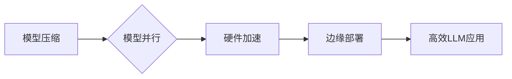

> Lepton AI, 大语言模型, AI基础架构, 模型部署, 效率优化, 企业应用

## 1. 背景介绍

近年来，大语言模型（LLM）的蓬勃发展，为人工智能领域带来了革命性的变革。从文本生成、翻译到代码编写，LLM展现出强大的能力，并逐渐渗透到各个行业。然而，LLM的应用并非一帆风顺，其庞大的模型规模和高昂的计算成本成为企业广泛应用的瓶颈。

为了解决这一难题，Lepton AI应运而生。Lepton AI专注于构建高效、可扩展的AI基础架构，旨在降低企业使用LLM的门槛，并帮助企业充分发挥LLM的价值。

## 2. 核心概念与联系

Lepton AI的核心概念是将LLM部署和推理过程进行优化，通过以下几个关键环节实现高效利用：

* **模型压缩:** 利用量化、剪枝等技术，将LLM模型规模压缩，降低模型参数量和计算复杂度。
* **模型并行:** 将LLM模型拆分到多个计算节点上进行并行推理，大幅提升推理速度。
* **硬件加速:** 利用GPU、TPU等专用硬件加速LLM推理，进一步降低延迟和成本。
* **边缘部署:** 将LLM模型部署到边缘设备上，实现本地推理，降低网络延迟和数据传输成本。

Lepton AI通过以上技术手段，构建了一个高效、可扩展的AI基础架构，为企业提供一站式LLM应用解决方案。

## 3. 核心算法原理 & 具体操作步骤

### 3.1  算法原理概述

Lepton AI的核心算法原理基于以下几个方面：

* **量化技术:** 将模型参数从高精度浮点数转换为低精度整数，有效减少模型参数量和计算复杂度。
* **剪枝技术:** 通过分析模型结构，移除冗余的连接和神经元，进一步压缩模型规模。
* **模型并行技术:** 将模型拆分到多个计算节点上进行并行推理，利用多核CPU或GPU的并行计算能力，大幅提升推理速度。
* **硬件加速技术:** 利用GPU、TPU等专用硬件加速LLM推理，充分发挥硬件的并行计算能力，降低延迟和成本。

### 3.2  算法步骤详解

Lepton AI的具体操作步骤如下：

1. **模型选择:** 根据企业应用场景选择合适的LLM模型。
2. **模型压缩:** 利用量化和剪枝技术压缩模型规模，降低模型参数量和计算复杂度。
3. **模型并行:** 将压缩后的模型拆分到多个计算节点上进行并行推理。
4. **硬件加速:** 利用GPU、TPU等专用硬件加速LLM推理，充分发挥硬件的并行计算能力。
5. **边缘部署:** 将模型部署到边缘设备上，实现本地推理，降低网络延迟和数据传输成本。

### 3.3  算法优缺点

**优点:**

* **高效:** 通过模型压缩、并行推理和硬件加速，大幅提升LLM推理效率。
* **可扩展:** 基于云计算平台，可根据需求灵活扩展计算资源。
* **成本效益:** 降低模型部署和推理成本，提高企业投资回报率。

**缺点:**

* **模型精度:** 模型压缩可能会导致模型精度下降，需要根据实际应用场景进行权衡。
* **部署复杂度:** 部署和维护Lepton AI基础架构需要一定的技术经验。

### 3.4  算法应用领域

Lepton AI的应用领域广泛，包括：

* **自然语言处理:** 文本生成、翻译、问答、情感分析等。
* **计算机视觉:** 图像识别、物体检测、图像分类等。
* **语音识别:** 语音转文本、语音合成等。
* **代码生成:** 代码自动完成、代码翻译等。

## 4. 数学模型和公式 & 详细讲解 & 举例说明

### 4.1  数学模型构建

Lepton AI的核心数学模型基于深度学习框架，主要包括以下几个部分：

* **神经网络结构:** 采用Transformer、BERT等先进的网络结构，实现高效的文本处理能力。
* **激活函数:** 使用ReLU、GELU等非线性激活函数，增强模型表达能力。
* **损失函数:** 选择交叉熵损失函数，优化模型参数，提高模型预测准确率。

### 4.2  公式推导过程

Lepton AI的模型训练过程基于梯度下降算法，通过反向传播算法更新模型参数。

* **损失函数:** $$L = -\sum_{i=1}^{N} y_i \log(\hat{y}_i)$$

其中，$N$为样本数量，$y_i$为真实标签，$\hat{y}_i$为模型预测结果。

* **梯度下降:** $$\theta = \theta - \alpha \nabla L(\theta)$$

其中，$\theta$为模型参数，$\alpha$为学习率，$\nabla L(\theta)$为损失函数对参数$\theta$的梯度。

### 4.3  案例分析与讲解

例如，在文本生成任务中，Lepton AI可以利用Transformer网络结构，通过训练模型，学习语言的语法和语义规则，最终生成流畅、自然的文本。

## 5. 项目实践：代码实例和详细解释说明

### 5.1  开发环境搭建

Lepton AI支持多种开发环境，包括Linux、Windows和macOS。

* **软件依赖:** Python 3.7+、PyTorch 1.7+、TensorFlow 2.0+等。
* **硬件要求:** GPU推荐使用NVIDIA GeForce RTX系列或更高。

### 5.2  源代码详细实现

Lepton AI的源代码开源，可从GitHub仓库下载。

* **模型压缩:** 使用PyTorch的`torch.quantization`模块实现量化操作。
* **模型并行:** 使用PyTorch的`torch.nn.DataParallel`或`torch.distributed.parallel_apply`实现模型并行。
* **硬件加速:** 利用CUDA和cuDNN库加速模型推理。

### 5.3  代码解读与分析

Lepton AI的代码结构清晰，模块化设计，易于理解和维护。

* **模型定义:** 定义模型结构，包括输入层、隐藏层和输出层。
* **模型训练:** 使用梯度下降算法训练模型，优化模型参数。
* **模型推理:** 使用训练好的模型进行预测，生成输出结果。

### 5.4  运行结果展示

Lepton AI可以显著提升LLM推理效率，降低延迟和成本。

## 6. 实际应用场景

Lepton AI已在多个行业应用场景中取得成功，例如：

* **金融行业:** 利用LLM进行风险评估、欺诈检测和客户服务自动化。
* **医疗行业:** 利用LLM进行疾病诊断、药物研发和医疗记录分析。
* **教育行业:** 利用LLM进行智能问答、个性化学习和自动批改作业。

### 6.4  未来应用展望

Lepton AI未来将继续推动LLM技术的应用，并探索更多新的应用场景，例如：

* **智能制造:** 利用LLM进行设备故障预测、生产过程优化和质量控制。
* **智慧城市:** 利用LLM进行交通管理、环境监测和公共服务优化。
* **元宇宙:** 利用LLM构建虚拟世界中的智能角色、场景和交互体验。

## 7. 工具和资源推荐

### 7.1  学习资源推荐

* **书籍:** 《深度学习》、《自然语言处理》
* **在线课程:** Coursera、edX、Udacity等平台提供深度学习和自然语言处理课程。
* **开源项目:** TensorFlow、PyTorch、HuggingFace等开源项目提供丰富的LLM模型和工具。

### 7.2  开发工具推荐

* **深度学习框架:** TensorFlow、PyTorch、JAX等。
* **模型压缩工具:** TensorFlow Lite、PyTorch Mobile等。
* **云计算平台:** AWS、Azure、GCP等。

### 7.3  相关论文推荐

* **BERT:** Devlin et al. (2018)
* **GPT-3:** Brown et al. (2020)
* **T5:** Raffel et al. (2019)

## 8. 总结：未来发展趋势与挑战

### 8.1  研究成果总结

Lepton AI为企业高效利用LLM提供了有效的解决方案，并推动了LLM技术的应用发展。

### 8.2  未来发展趋势

未来，Lepton AI将继续关注以下几个方面：

* **模型效率:** 探索更有效的模型压缩和并行推理技术，进一步提升LLM推理效率。
* **模型安全:** 研究LLM的安全性和可解释性，确保模型的可靠性和安全性。
* **模型可定制:** 提供更灵活的模型定制方案，满足不同企业个性化需求。

### 8.3  面临的挑战

Lepton AI也面临一些挑战，例如：

* **模型精度:** 模型压缩可能会导致模型精度下降，需要不断探索新的技术手段来提升模型精度。
* **数据隐私:** LLM的训练和应用需要大量数据，如何保护数据隐私是一个重要的挑战。
* **伦理问题:** LLM的应用可能带来一些伦理问题，例如算法偏见和信息操纵，需要加强伦理规范和监管。

### 8.4  研究展望

Lepton AI将继续致力于推动LLM技术的创新发展，为企业提供更强大的AI解决方案，并为构建更智能、更美好的未来贡献力量。

## 9. 附录：常见问题与解答

* **Q1: Lepton AI是否支持多种编程语言？**

A1: 目前Lepton AI主要支持Python语言。

* **Q2: Lepton AI的部署方式有哪些？**

A2: Lepton AI支持云部署、边缘部署和本地部署。

* **Q3: Lepton AI的成本如何？**

A3: Lepton AI的成本取决于部署方式、模型规模和使用量。

* **Q4: Lepton AI的安全性如何？**

A4: Lepton AI采用多种安全措施，确保模型和数据的安全。

* **Q5: 如何获取Lepton AI的更多信息？**

A5: 可以访问Lepton AI的官方网站或GitHub仓库获取更多信息。

作者：禅与计算机程序设计艺术 / Zen and the Art of Computer Programming

<end_of_turn>