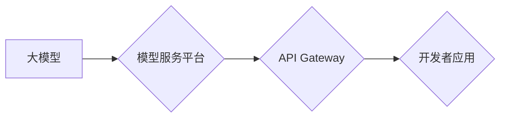

> 大模型、AI Agent、Agent即服务、应用开发、模型部署、微服务架构

## 1. 背景介绍

近年来，大模型技术取得了飞速发展，其强大的泛化能力和知识表示能力为人工智能的广泛应用提供了基础。然而，将大模型应用于实际场景仍然面临着诸多挑战，例如模型部署、资源消耗、可解释性等。

为了解决这些问题，"Agent即服务" (Agent-as-a-Service, AaaS) 应运而生。AaaS 将大模型封装成可复用的服务，通过标准化的接口提供给开发者，简化了模型的部署和调用过程，降低了开发门槛，并促进了大模型的灵活应用。

## 2. 核心概念与联系

**2.1  AI Agent**

AI Agent 是一个能够感知环境、做出决策并执行行动的智能体。它通常由以下几个部分组成：

* **感知模块:** 收集环境信息，例如传感器数据、文本、图像等。
* **推理模块:** 对收集到的信息进行分析和理解，做出决策。
* **执行模块:** 执行决策，与环境进行交互。

**2.2  Agent即服务 (AaaS)**

AaaS 是将 AI Agent 封装成可复用的服务，通过标准化的接口提供给开发者。开发者可以通过调用 AaaS 接口，轻松集成 AI Agent 到自己的应用中，无需关心模型的训练、部署和维护等细节。

**2.3  核心架构**



**2.3.1  大模型:** 作为 AaaS 的核心，大模型提供强大的推理能力和知识表示能力。

**2.3.2  模型服务平台:** 负责模型的部署、管理和调度。

**2.3.3  API Gateway:** 提供标准化的接口，方便开发者调用模型服务。

**2.3.4  开发者应用:** 利用 AaaS 接口，集成 AI Agent 到自己的应用中。

## 3. 核心算法原理 & 具体操作步骤

**3.1  算法原理概述**

AaaS 的核心算法原理是将大模型转化为可复用的服务，并通过标准化的接口提供给开发者。

**3.2  算法步骤详解**

1. **模型训练:** 使用大规模数据集训练大模型，获得预训练模型。
2. **模型部署:** 将预训练模型部署到模型服务平台，并进行优化和调优。
3. **接口定义:** 定义标准化的 API 接口，方便开发者调用模型服务。
4. **服务发布:** 将模型服务发布到 API Gateway，供开发者访问。
5. **开发者调用:** 开发者通过 API 接口调用模型服务，获取模型预测结果。

**3.3  算法优缺点**

**优点:**

* 简化了模型的部署和调用过程。
* 降低了开发门槛，方便开发者使用大模型。
* 提高了模型的复用性，降低了开发成本。

**缺点:**

* 模型服务平台需要具备强大的计算能力和存储能力。
* API 接口的设计需要考虑性能和安全性。
* 模型服务需要进行持续的维护和更新。

**3.4  算法应用领域**

AaaS 广泛应用于以下领域:

* **自然语言处理:** 文本分类、情感分析、机器翻译等。
* **计算机视觉:** 图像识别、物体检测、图像分割等。
* **语音识别:** 语音转文本、语音合成等。
* **推荐系统:** 商品推荐、内容推荐等。

## 4. 数学模型和公式 & 详细讲解 & 举例说明

**4.1  数学模型构建**

AaaS 的数学模型可以抽象为一个黑盒模型，其输入为用户请求，输出为模型预测结果。

**4.2  公式推导过程**

由于 AaaS 的具体实现方式多种多样，其数学模型和公式推导过程也会有所不同。

**4.3  案例分析与讲解**

例如，在自然语言处理领域，AaaS 可以用于构建一个文本分类模型。

假设我们有一个文本分类任务，需要将文本分类为正类和负类。我们可以使用一个二分类模型，其输出为一个概率值，表示文本属于正类的概率。

模型的输出可以表示为：

$$
P(y=1|x) = \sigma(w^T x + b)
$$

其中：

* $P(y=1|x)$ 是文本属于正类的概率。
* $x$ 是文本的特征向量。
* $w$ 是模型的参数向量。
* $b$ 是模型的偏置项。
* $\sigma$ 是 sigmoid 函数。

## 5. 项目实践：代码实例和详细解释说明

**5.1  开发环境搭建**

* Python 3.7+
* TensorFlow 2.0+
* PyTorch 1.0+
* Docker

**5.2  源代码详细实现**

```python
from flask import Flask, request, jsonify

app = Flask(__name__)

# 加载模型
model = load_model("model.h5")

@app.route('/predict', methods=['POST'])
def predict():
    data = request.get_json()
    # 预处理数据
    processed_data = preprocess(data)
    # 模型预测
    prediction = model.predict(processed_data)
    # 返回预测结果
    return jsonify({'prediction': prediction.tolist()})

if __name__ == '__main__':
    app.run(debug=True)
```

**5.3  代码解读与分析**

* 使用 Flask 框架构建一个简单的 API 服务。
* 使用 `load_model()` 函数加载预训练模型。
* 使用 `predict()` 函数处理用户请求，并返回模型预测结果。

**5.4  运行结果展示**

启动 API 服务后，可以使用 Postman 等工具发送 POST 请求到 `/predict` 接口，并传入文本数据。API 服务会返回模型预测结果。

## 6. 实际应用场景

**6.1  智能客服**

AaaS 可以用于构建智能客服系统，自动回复用户咨询，提高客服效率。

**6.2  个性化推荐**

AaaS 可以用于构建个性化推荐系统，根据用户的兴趣和行为推荐相关商品或内容。

**6.3  自动写作**

AaaS 可以用于构建自动写作工具，帮助用户生成文章、文案等。

**6.4  未来应用展望**

随着大模型技术的不断发展，AaaS 将在更多领域得到应用，例如医疗诊断、金融风险评估、教育辅助等。

## 7. 工具和资源推荐

**7.1  学习资源推荐**

* TensorFlow 官方文档: https://www.tensorflow.org/
* PyTorch 官方文档: https://pytorch.org/
* OpenAI API: https://beta.openai.com/docs/api-reference

**7.2  开发工具推荐**

* Docker: https://www.docker.com/
* Flask: https://flask.palletsprojects.com/
* FastAPI: https://fastapi.tiangolo.com/

**7.3  相关论文推荐**

* "BERT: Pre-training of Deep Bidirectional Transformers for Language Understanding"
* "GPT-3: Language Models are Few-Shot Learners"
* "T5: Text-to-Text Transfer Transformer"

## 8. 总结：未来发展趋势与挑战

**8.1  研究成果总结**

AaaS 作为大模型应用的一种新模式，取得了显著的进展。

**8.2  未来发展趋势**

* 模型能力提升: 大模型的规模和能力将不断提升，提供更强大的推理能力和知识表示能力。
* 算法优化: 模型服务平台的算法将不断优化，提高模型的效率和准确性。
* 应用场景拓展: AaaS 将应用于更多领域，解决更多实际问题。

**8.3  面临的挑战**

* 模型安全性: 确保模型的安全性，防止模型被恶意利用。
* 模型可解释性: 提高模型的可解释性，帮助用户理解模型的决策过程。
* 模型公平性: 确保模型的公平性，避免模型产生偏见。

**8.4  研究展望**

未来，AaaS 将朝着更智能、更安全、更公平的方向发展。

## 9. 附录：常见问题与解答

**9.1  如何部署 AaaS 服务？**

可以使用 Docker 等容器化技术部署 AaaS 服务。

**9.2  如何选择合适的模型？**

根据具体的应用场景选择合适的模型，例如文本分类、图像识别等。

**9.3  如何评估模型性能？**

可以使用准确率、召回率、F1-score 等指标评估模型性能。


作者：禅与计算机程序设计艺术 / Zen and the Art of Computer Programming 
<end_of_turn>