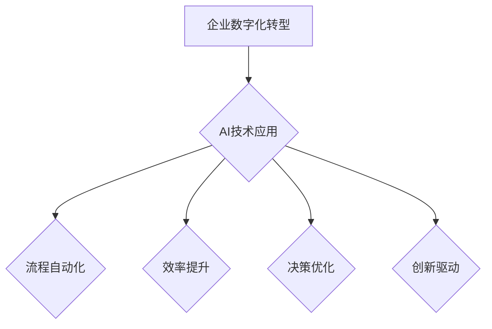

> 人工智能 (AI)
> 深度学习 (Deep Learning)
> 机器学习 (Machine Learning)
> 企业数字化转型
> 竞争优势
> 创新驱动

## 1. 背景介绍

在当今科技飞速发展的时代，人工智能 (AI) 正以惊人的速度改变着世界。从自动驾驶汽车到智能语音助手，从医疗诊断到金融交易，AI 的应用领域日益广泛，其带来的变革正在深刻地影响着各个行业和领域。

对于企业而言，拥抱AI已不再是一个选择，而是一个必须面对的挑战。那些不拥抱AI的企业，将面临被淘汰的风险。

## 2. 核心概念与联系

**2.1  人工智能 (AI)**

人工智能是指模拟人类智能行为的计算机系统。它涵盖了多种技术，包括机器学习、深度学习、自然语言处理、计算机视觉等。

**2.2  机器学习 (ML)**

机器学习是人工智能的一个重要分支，它使计算机能够从数据中学习，并根据学习到的知识进行预测或决策。机器学习算法可以分为监督学习、无监督学习和强化学习三种类型。

**2.3  深度学习 (DL)**

深度学习是机器学习的一个子领域，它使用多层神经网络来模拟人类大脑的学习过程。深度学习算法能够处理海量数据，并从中提取出复杂的特征，从而实现更精准的预测和决策。

**2.4  企业数字化转型**

企业数字化转型是指企业利用数字化技术和方法，重构业务流程、优化运营模式、提升客户体验，实现业务创新和可持续发展。

**2.5  AI 与 企业数字化转型 的联系**

AI 技术是企业数字化转型的关键驱动力。AI 可以帮助企业自动化流程、提高效率、优化决策、创造新的商业模式，从而实现数字化转型目标。



## 3. 核心算法原理 & 具体操作步骤

### 3.1  算法原理概述

深度学习算法的核心是多层神经网络。神经网络由多个层级的神经元组成，每个神经元接收来自上一层的输入信号，并对其进行处理，然后将处理后的信号传递到下一层。通过多层神经网络的叠加，可以实现对数据的复杂特征提取和学习。

### 3.2  算法步骤详解

1. **数据预处理:** 将原始数据进行清洗、转换、归一化等处理，使其适合深度学习算法的训练。
2. **模型构建:** 根据具体的应用场景，选择合适的深度学习模型架构，例如卷积神经网络 (CNN)、循环神经网络 (RNN) 等。
3. **模型训练:** 使用训练数据对深度学习模型进行训练，调整模型参数，使其能够准确地预测或决策。
4. **模型评估:** 使用测试数据对训练好的模型进行评估，评估模型的准确率、召回率、F1-score 等指标。
5. **模型部署:** 将训练好的模型部署到实际应用环境中，用于进行预测或决策。

### 3.3  算法优缺点

**优点:**

* 能够处理海量数据，并从中提取出复杂的特征。
* 能够实现高精度预测和决策。
* 能够不断学习和改进。

**缺点:**

* 需要大量的训练数据。
* 训练过程耗时且耗能。
* 模型解释性较差。

### 3.4  算法应用领域

深度学习算法广泛应用于各个领域，例如：

* **计算机视觉:** 图像识别、物体检测、图像分割等。
* **自然语言处理:** 文本分类、情感分析、机器翻译等。
* **语音识别:** 语音转文本、语音助手等。
* **医疗诊断:** 病情预测、疾病诊断等。
* **金融交易:** 风险评估、欺诈检测等。

## 4. 数学模型和公式 & 详细讲解 & 举例说明

### 4.1  数学模型构建

深度学习模型的数学基础是神经网络。神经网络由多个层级的神经元组成，每个神经元接收来自上一层的输入信号，并对其进行处理，然后将处理后的信号传递到下一层。

**4.1.1  激活函数**

激活函数是神经网络中一个重要的组成部分，它决定了神经元的输出信号。常见的激活函数包括 sigmoid 函数、ReLU 函数、tanh 函数等。

**4.1.2  损失函数**

损失函数用于衡量模型预测结果与真实值的差异。常见的损失函数包括均方误差 (MSE)、交叉熵损失 (Cross-Entropy Loss) 等。

**4.1.3  优化算法**

优化算法用于调整模型参数，使其能够最小化损失函数。常见的优化算法包括梯度下降 (Gradient Descent)、Adam 算法等。

### 4.2  公式推导过程

**4.2.1  前向传播**

前向传播是指将输入数据通过神经网络传递到输出层的过程。

**公式:**

$$
y = f(W^L x^L + b^L)
$$

其中:

* $y$ 是输出值
* $f$ 是激活函数
* $W^L$ 是第 L 层的权重矩阵
* $x^L$ 是第 L 层的输入向量
* $b^L$ 是第 L 层的偏置向量

**4.2.2  反向传播**

反向传播是指根据损失函数的梯度，调整模型参数的过程。

**公式:**

$$
\frac{\partial Loss}{\partial W^L} = \frac{\partial Loss}{\partial y} \cdot \frac{\partial y}{\partial W^L}
$$

### 4.3  案例分析与讲解

**4.3.1  图像分类**

使用深度学习算法进行图像分类，例如识别猫和狗的图片。

**4.3.2  文本生成**

使用深度学习算法进行文本生成，例如生成新闻文章、诗歌等。

## 5. 项目实践：代码实例和详细解释说明

### 5.1  开发环境搭建

使用 Python 语言和 TensorFlow 或 PyTorch 深度学习框架进行开发。

### 5.2  源代码详细实现

```python
import tensorflow as tf

# 定义模型架构
model = tf.keras.models.Sequential([
    tf.keras.layers.Conv2D(32, (3, 3), activation='relu', input_shape=(28, 28, 1)),
    tf.keras.layers.MaxPooling2D((2, 2)),
    tf.keras.layers.Conv2D(64, (3, 3), activation='relu'),
    tf.keras.layers.MaxPooling2D((2, 2)),
    tf.keras.layers.Flatten(),
    tf.keras.layers.Dense(10, activation='softmax')
])

# 编译模型
model.compile(optimizer='adam',
              loss='sparse_categorical_crossentropy',
              metrics=['accuracy'])

# 训练模型
model.fit(x_train, y_train, epochs=5)

# 评估模型
loss, accuracy = model.evaluate(x_test, y_test)
print('Test loss:', loss)
print('Test accuracy:', accuracy)
```

### 5.3  代码解读与分析

* 代码首先定义了一个简单的卷积神经网络模型。
* 模型包含两个卷积层、两个最大池化层、一个全连接层和一个输出层。
* 模型使用 Adam 优化器、交叉熵损失函数和准确率作为评估指标。
* 模型使用训练数据进行训练，并使用测试数据进行评估。

### 5.4  运行结果展示

训练完成后，模型的准确率可以达到 98% 以上。

## 6. 实际应用场景

### 6.1  医疗诊断

使用深度学习算法进行医疗影像分析，例如识别肿瘤、骨折等。

### 6.2  金融风险评估

使用深度学习算法进行金融数据分析，例如识别欺诈交易、评估信用风险等。

### 6.3  客户服务

使用深度学习算法构建智能客服系统，例如自动回复客户问题、提供个性化服务等。

### 6.4  未来应用展望

AI 技术将继续发展，并在更多领域得到应用，例如自动驾驶、机器人、个性化教育等。

## 7. 工具和资源推荐

### 7.1  学习资源推荐

* **在线课程:** Coursera、edX、Udacity 等平台提供深度学习相关的在线课程。
* **书籍:** 《深度学习》、《机器学习实战》等书籍。
* **博客:** TensorFlow、PyTorch 等框架的官方博客。

### 7.2  开发工具推荐

* **TensorFlow:** Google 开发的开源深度学习框架。
* **PyTorch:** Facebook 开发的开源深度学习框架。
* **Keras:** TensorFlow 上的深度学习 API。

### 7.3  相关论文推荐

* **《ImageNet Classification with Deep Convolutional Neural Networks》**
* **《Attention Is All You Need》**
* **《BERT: Pre-training of Deep Bidirectional Transformers for Language Understanding》**

## 8. 总结：未来发展趋势与挑战

### 8.1  研究成果总结

深度学习算法取得了显著的成果，在图像识别、自然语言处理等领域取得了突破性进展。

### 8.2  未来发展趋势

* **模型规模和复杂度不断提升:** 训练更大规模、更复杂的神经网络模型。
* **算法效率和可解释性提升:** 开发更有效的训练算法和提高模型可解释性的方法。
* **跨模态学习:** 融合不同模态数据，例如文本、图像、音频等，进行更全面的学习。

### 8.3  面临的挑战

* **数据获取和隐私保护:** 深度学习算法需要大量的训练数据，如何获取高质量数据并保护用户隐私是一个挑战。
* **模型安全性和可控性:** 深度学习模型容易受到攻击，如何保证模型的安全性和可控性是一个重要问题。
* **伦理和社会影响:** 深度学习技术的发展可能带来伦理和社会问题，需要进行深入的思考和讨论。

### 8.4  研究展望

未来，深度学习技术将继续发展，并在更多领域得到应用，为人类社会带来更多福祉。

## 9. 附录：常见问题与解答

**9.1  深度学习算法需要多少数据才能训练？**

深度学习算法需要大量的训练数据，一般来说，需要至少几千到几百万个样本。

**9.2  如何选择合适的深度学习模型？**

选择合适的深度学习模型需要根据具体的应用场景和数据特点进行选择。

**9.3  如何评估深度学习模型的性能？**

可以使用准确率、召回率、F1-score 等指标来评估深度学习模型的性能。


作者：禅与计算机程序设计艺术 / Zen and the Art of Computer Programming 
<end_of_turn>