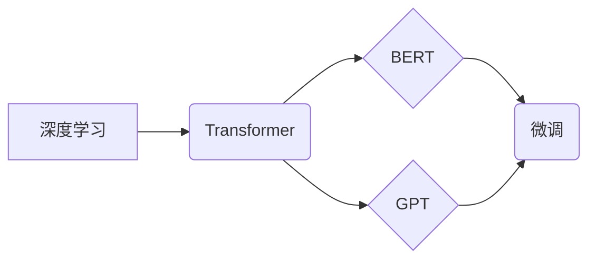

> 大模型、深度学习、PyTorch 2.0、微调、模型开发、环境搭建、Transformer、BERT、GPT

## 1. 背景介绍

近年来，深度学习技术取得了飞速发展，大模型的涌现更是推动了人工智能领域的革命性变革。从文本生成、机器翻译到图像识别、语音合成，大模型展现出强大的应用潜力，深刻地改变着人们的生活方式和工作模式。

然而，大模型的开发和部署也面临着诸多挑战：

* **高昂的训练成本:** 大模型通常拥有数十亿甚至数千亿的参数，训练需要大量的计算资源和时间，成本极高。
* **模型规模与效率的权衡:** 随着模型规模的不断增大，模型的训练和推理效率会下降，需要不断探索新的模型架构和训练方法来提高效率。
* **数据获取和预处理的难度:** 大模型的训练需要海量高质量的数据，数据获取和预处理是一个复杂且耗时的过程。
* **模型可解释性和安全性:** 大模型的决策过程往往难以理解，缺乏可解释性，同时存在潜在的安全风险，需要进一步研究和解决。

## 2. 核心概念与联系

大模型的开发主要涉及以下核心概念：

* **深度学习:** 深度学习是一种机器学习的子领域，利用多层神经网络来模拟人类大脑的学习过程，能够从海量数据中自动提取特征和知识。
* **Transformer:** Transformer是一种新型的神经网络架构，能够有效处理序列数据，例如文本和语音，在自然语言处理领域取得了突破性的进展。
* **BERT:** BERT (Bidirectional Encoder Representations from Transformers) 是基于 Transformer 的预训练语言模型，能够理解上下文信息，在文本分类、问答系统等任务中表现出色。
* **GPT:** GPT (Generative Pre-trained Transformer) 是一种基于 Transformer 的生成式语言模型，能够生成流畅自然的文本，在文本摘要、机器翻译等任务中展现出强大的能力。
* **微调:** 微调是指在预训练模型的基础上，针对特定任务进行进一步训练，能够提高模型在特定领域的性能。

**核心概念架构图:**



## 3. 核心算法原理 & 具体操作步骤

### 3.1  算法原理概述

Transformer 是一种基于注意力机制的神经网络架构，能够有效处理序列数据。其核心思想是通过自注意力机制来捕捉序列中不同元素之间的关系，从而更好地理解上下文信息。

### 3.2  算法步骤详解

1. **输入嵌入:** 将输入序列中的每个单词或子词转换为向量表示，称为词嵌入。
2. **多头自注意力:** 对词嵌入进行多头自注意力计算，捕捉每个词与其他词之间的关系。
3. **前馈神经网络:** 对自注意力输出进行前馈神经网络处理，进一步提取特征。
4. **位置编码:** 添加位置信息到词嵌入中，使模型能够理解词序。
5. **堆叠层:** 将多头自注意力和前馈神经网络层堆叠在一起，形成多层Transformer网络。
6. **输出层:** 将最终的隐藏状态转换为输出向量，用于预测目标值。

### 3.3  算法优缺点

**优点:**

* **并行计算能力强:** Transformer 的自注意力机制能够并行计算，提高训练效率。
* **长距离依赖关系处理能力强:** 自注意力机制能够捕捉长距离依赖关系，比传统的循环神经网络更有效地处理长序列数据。
* **可解释性强:** 自注意力机制的权重可以直观地反映词之间的关系，提高模型的可解释性。

**缺点:**

* **计算复杂度高:** Transformer 的自注意力机制计算量较大，训练成本较高。
* **参数量大:** Transformer 模型参数量较大，需要大量的计算资源和存储空间。

### 3.4  算法应用领域

Transformer 算法在自然语言处理领域有着广泛的应用，例如：

* **文本分类:** 识别文本的类别，例如情感分析、主题分类等。
* **问答系统:** 回答用户提出的问题，例如搜索引擎、聊天机器人等。
* **机器翻译:** 将文本从一种语言翻译成另一种语言。
* **文本摘要:** 生成文本的简短摘要。
* **代码生成:** 自动生成代码。

## 4. 数学模型和公式 & 详细讲解 & 举例说明

### 4.1  数学模型构建

Transformer 模型的数学模型主要包括以下几个部分：

* **词嵌入层:** 将输入序列中的每个单词或子词转换为向量表示。
* **多头自注意力层:** 计算每个词与其他词之间的关系。
* **前馈神经网络层:** 对自注意力输出进行进一步处理。
* **位置编码层:** 添加位置信息到词嵌入中。
* **输出层:** 将最终的隐藏状态转换为输出向量。

### 4.2  公式推导过程

**自注意力机制:**

$$
Attention(Q, K, V) = \frac{exp(Q \cdot K^T / \sqrt{d_k})}{exp(Q \cdot K^T / \sqrt{d_k})} \cdot V
$$

其中:

* $Q$: 查询矩阵
* $K$: 键矩阵
* $V$: 值矩阵
* $d_k$: 键向量的维度

**多头自注意力:**

$$
MultiHead(Q, K, V) = Concat(head_1, head_2, ..., head_h) \cdot W_o
$$

其中:

* $head_i$: 第 $i$ 个注意力头的输出
* $h$: 多头数量
* $W_o$: 线性变换矩阵

### 4.3  案例分析与讲解

假设我们有一个句子 "The cat sat on the mat"，将其转换为词嵌入向量表示。然后，使用多头自注意力机制计算每个词与其他词之间的关系。例如，"cat" 与 "sat" 之间的关系会比较强，因为它们在语义上紧密相关。

## 5. 项目实践：代码实例和详细解释说明

### 5.1  开发环境搭建

1. 安装 Python 3.7 或更高版本。
2. 安装 PyTorch 2.0 库。
3. 安装其他必要的库，例如 NumPy、pandas、transformers 等。

### 5.2  源代码详细实现

```python
import torch
from transformers import BertTokenizer, BertModel

# 加载预训练模型和词典
tokenizer = BertTokenizer.from_pretrained('bert-base-uncased')
model = BertModel.from_pretrained('bert-base-uncased')

# 输入文本
text = "The cat sat on the mat."

# 将文本转换为输入序列
input_ids = tokenizer.encode(text, add_special_tokens=True)
input_ids = torch.tensor([input_ids])

# 将输入序列传递给模型进行推理
outputs = model(input_ids)

# 获取模型输出
last_hidden_state = outputs.last_hidden_state
```

### 5.3  代码解读与分析

* `BertTokenizer` 用于将文本转换为模型可识别的输入序列。
* `BertModel` 是预训练的 BERT 模型，用于提取文本的特征表示。
* `encode()` 方法将文本转换为输入序列，并添加特殊的标记符。
* `tensor()` 方法将输入序列转换为 PyTorch 的张量。
* `model()` 方法将输入序列传递给模型进行推理。
* `last_hidden_state` 是模型输出的最后一个隐藏状态，包含了文本的特征表示。

### 5.4  运行结果展示

模型输出的 `last_hidden_state` 是一个多维张量，包含了每个词的特征表示。我们可以使用这些特征表示来进行后续的文本分析任务，例如文本分类、情感分析等。

## 6. 实际应用场景

### 6.1  文本分类

BERT 模型在文本分类任务中表现出色，例如情感分析、主题分类等。

### 6.2  问答系统

BERT 模型能够理解上下文信息，因此在问答系统中能够准确地回答用户的问题。

### 6.3  机器翻译

BERT 模型能够捕捉语言之间的语义关系，因此在机器翻译任务中能够生成更准确的翻译结果。

### 6.4  未来应用展望

随着大模型技术的不断发展，其应用场景将会更加广泛，例如：

* **个性化推荐:** 根据用户的兴趣和偏好，推荐个性化的商品、服务和内容。
* **自动写作:** 自动生成新闻报道、小说、诗歌等文本。
* **智能客服:** 提供更加智能和人性化的客服服务。
* **医疗诊断:** 辅助医生进行疾病诊断和治疗方案制定。

## 7. 工具和资源推荐

### 7.1  学习资源推荐

* **Hugging Face Transformers:** https://huggingface.co/docs/transformers/index
* **PyTorch 官方文档:** https://pytorch.org/docs/stable/index.html
* **深度学习书籍:** 《深度学习》、《动手学深度学习》

### 7.2  开发工具推荐

* **Jupyter Notebook:** https://jupyter.org/
* **VS Code:** https://code.visualstudio.com/

### 7.3  相关论文推荐

* **BERT: Pre-training of Deep Bidirectional Transformers for Language Understanding:** https://arxiv.org/abs/1810.04805
* **Attention Is All You Need:** https://arxiv.org/abs/1706.03762

## 8. 总结：未来发展趋势与挑战

### 8.1  研究成果总结

近年来，大模型的开发取得了显著进展，在自然语言处理、计算机视觉等领域取得了突破性的成果。

### 8.2  未来发展趋势

* **模型规模的进一步扩大:** 随着计算资源的不断提升，大模型的规模将会进一步扩大，模型能力将会得到进一步提升。
* **模型训练效率的提高:** 研究人员将继续探索新的训练方法和算法，提高模型训练效率。
* **模型可解释性和安全性:** 研究人员将更加关注模型的可解释性和安全性，开发更加可靠和安全的模型。

### 8.3  面临的挑战

* **高昂的训练成本:** 大模型的训练成本仍然很高，需要大量的计算资源和时间。
* **数据获取和预处理的难度:** 大模型的训练需要海量高质量的数据，数据获取和预处理是一个复杂且耗时的过程。
* **模型可解释性和安全性:** 大模型的决策过程往往难以理解，缺乏可解释性，同时存在潜在的安全风险。

### 8.4  研究展望

未来，大模型研究将朝着更加高效、可解释、安全的方向发展，并将应用于更多领域，为人类社会带来更多福祉。

## 9. 附录：常见问题与解答

**Q1: 如何选择合适的预训练模型？**

**A1:** 选择预训练模型需要根据具体的应用场景和任务需求进行选择。Hugging Face Transformers 库提供了丰富的预训练模型，可以根据任务类型、模型大小、语言等条件进行筛选。

**Q2: 如何进行模型微调？**

**A2:** 模型微调是指在预训练模型的基础上，针对特定任务进行进一步训练。微调过程通常包括以下步骤：

1. 加载预训练模型。
2. 调整模型参数，例如冻结部分层，调整学习率等。
3. 使用特定任务的数据进行训练。
4. 评估模型性能，并根据需要进行调整。

**Q3: 如何评估大模型的性能？**

**A3:** 大模型的性能评估方法取决于具体的应用场景和任务类型。常用的评估指标包括准确率、召回率、F1-score、BLEU 等。

作者：禅与计算机程序设计艺术 / Zen and the Art of Computer Programming


<end_of_turn>