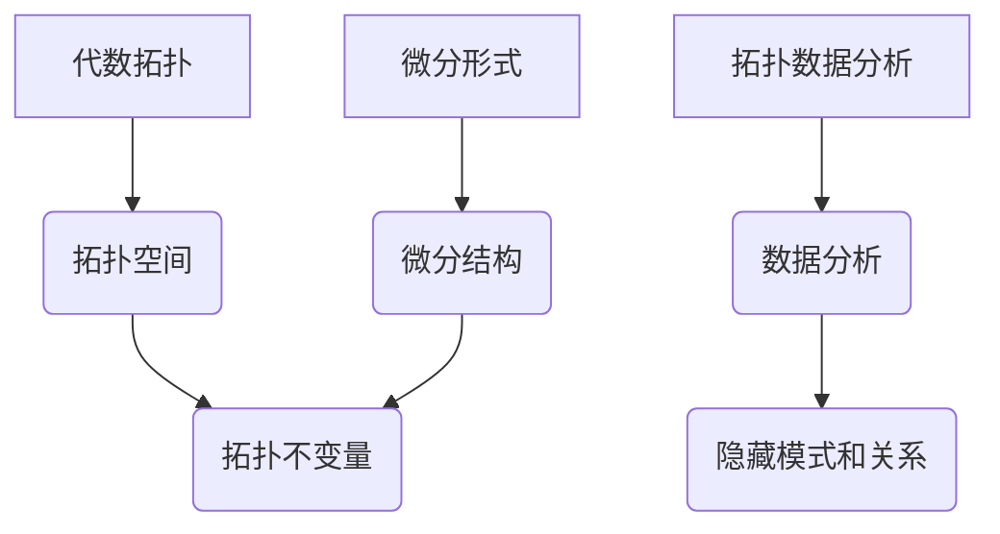

代数拓扑，微分形式，拓扑数据分析，机器学习，数据可视化

## 1. 背景介绍

在现代数据科学和机器学习领域，数据分析和可视化已经成为至关重要的环节。传统的统计方法和机器学习算法往往难以处理高维、复杂的数据结构。代数拓扑，作为一种数学工具，提供了一种新的视角来理解和分析数据。它通过将数据映射到拓扑空间，并利用拓扑不变量来刻画数据的结构和性质。微分形式作为代数拓扑的重要工具，可以用来描述和计算拓扑空间上的微分结构，从而为数据分析提供更丰富的工具和方法。

近年来，拓扑数据分析 (TDA) 作为代数拓扑在数据分析领域的应用，取得了显著进展。TDA 利用拓扑不变量来捕捉数据的整体结构和趋势，能够揭示传统方法难以发现的隐藏模式和关系。微分形式在TDA中扮演着重要的角色，它可以用来计算拓扑空间上的微分结构，例如曲率、挠度等，这些信息可以用来更好地理解数据的几何性质和拓扑特征。

## 2. 核心概念与联系

**2.1 代数拓扑**

代数拓扑研究的是拓扑空间的代数性质。它通过将拓扑空间映射到代数对象，例如群、环、模等，来研究空间的结构和性质。拓扑不变量是代数拓扑的核心概念，它指的是拓扑空间的性质，在连续变形下保持不变。例如，一个空间的孔数就是一个拓扑不变量。

**2.2 微分形式**

微分形式是微积分和拓扑学中的重要工具，它可以用来描述和计算拓扑空间上的微分结构。微分形式可以看作是函数在拓扑空间上的推广，它可以取值于实数域或复数域。微分形式的运算包括外积、楔积和积分等，这些运算可以用来计算拓扑空间上的微分结构，例如曲率、挠度等。

**2.3 拓扑数据分析 (TDA)**

拓扑数据分析 (TDA) 是一种利用代数拓扑方法来分析数据的方法。TDA 将数据映射到拓扑空间，并利用拓扑不变量来刻画数据的结构和性质。TDA 可以用来发现数据的整体结构和趋势，揭示传统方法难以发现的隐藏模式和关系。

**2.4 核心概念联系**

代数拓扑和微分形式在拓扑数据分析中密切相关。微分形式可以用来描述和计算拓扑空间上的微分结构，而拓扑不变量可以用来刻画数据的整体结构和性质。TDA 利用这两个工具来分析数据，揭示数据的隐藏模式和关系。



## 3. 核心算法原理 & 具体操作步骤

### 3.1 算法原理概述

在代数拓扑中，常用的算法包括：

* **单形单纯形化:** 将数据点映射到一个简单的拓扑空间，例如三角形或四面体。
* **伯恩斯定理:** 计算拓扑空间的孔数，可以用来刻画数据的整体结构。
* **持久性图:** 通过跟踪单形的出现和消失时间，可以用来分析数据的变化趋势。

### 3.2 算法步骤详解

**3.2.1 单形单纯形化**

1. 将数据点映射到一个简单的拓扑空间，例如三角形或四面体。
2. 将数据点连接起来，形成一个三角形或四面体的网络。
3. 计算网络的拓扑结构，例如孔数、边界等。

**3.2.2 伯恩斯定理**

1. 计算拓扑空间的单形链群。
2. 计算单形链群的同调群。
3. 伯恩斯定理将同调群与拓扑空间的孔数相关联。

**3.2.3 持久性图**

1. 跟踪单形的出现和消失时间。
2. 将出现和消失时间绘制成一个图，称为持久性图。
3. 持久性图可以用来分析数据的变化趋势。

### 3.3 算法优缺点

**优点:**

* 可以处理高维、复杂的数据结构。
* 可以揭示传统方法难以发现的隐藏模式和关系。
* 可以提供对数据的整体结构和趋势的理解。

**缺点:**

* 计算复杂度较高。
* 需要一定的数学背景知识。
* 对数据的预处理要求较高。

### 3.4 算法应用领域

* **机器学习:** 用于特征提取、数据降维、异常检测等。
* **数据可视化:** 用于生成拓扑图、持久性图等，帮助理解数据的结构和趋势。
* **生物信息学:** 用于分析基因表达数据、蛋白质结构等。
* **材料科学:** 用于分析材料的微观结构和力学性能。

## 4. 数学模型和公式 & 详细讲解 & 举例说明

### 4.1 数学模型构建

在代数拓扑中，常用的数学模型包括：

* **单形:** 单形是拓扑空间的基本构建块，例如点、线段、三角形、四面体等。
* **单形链群:** 单形链群是所有单形的组合，它可以用来描述拓扑空间的结构。
* **同调群:** 同调群是单形链群的同调群，它可以用来刻画拓扑空间的孔数和边界等拓扑性质。

### 4.2 公式推导过程

**伯恩斯定理:**

$$
\beta_i(X) = \text{rank}(H_i(X))
$$

其中：

* $\beta_i(X)$ 是拓扑空间 $X$ 的 $i$ 维孔数。
* $H_i(X)$ 是拓扑空间 $X$ 的 $i$ 维同调群。
* $\text{rank}(H_i(X))$ 是 $H_i(X)$ 的秩。

**持久性图:**

$$
\text{persistence}(s) = \text{max}(t_s, t_e) - \text{min}(t_s, t_e)
$$

其中：

* $s$ 是一个单形。
* $t_s$ 是单形 $s$ 的出现时间。
* $t_e$ 是单形 $s$ 的消失时间。

### 4.3 案例分析与讲解

**案例:**

考虑一个简单的拓扑空间，例如一个圆。

* 圆的 0 维孔数为 1，表示圆上有 1 个点。
* 圆的 1 维孔数为 0，表示圆没有环。

**分析:**

通过伯恩斯定理，我们可以计算出圆的拓扑不变量。

**持久性图:**

如果我们对圆上的数据点进行持久性图分析，可以观察到单形的出现和消失时间，从而了解数据的变化趋势。

## 5. 项目实践：代码实例和详细解释说明

### 5.1 开发环境搭建

* **操作系统:** Linux, macOS, Windows
* **编程语言:** Python
* **库:**

    * **Scikit-learn:** 机器学习库
    * **NumPy:** 数值计算库
    * **Matplotlib:** 数据可视化库
    * **Persistence:** TDA 库

### 5.2 源代码详细实现

```python
import numpy as np
from sklearn.datasets import make_blobs
from persistence import plot_persistence_diagram

# 生成数据
X, y = make_blobs(n_samples=1000, centers=3, random_state=42)

# TDA 分析
persistence_diagram = plot_persistence_diagram(X, 
                                              min_persistence=0.1, 
                                              max_persistence=1.0)

# 显示结果
plt.show()
```

### 5.3 代码解读与分析

* **数据生成:** 使用 `make_blobs` 函数生成三个中心点的聚类数据。
* **TDA 分析:** 使用 `plot_persistence_diagram` 函数进行 TDA 分析，计算持久性图。
* **结果显示:** 使用 `plt.show` 函数显示持久性图。

### 5.4 运行结果展示

运行代码后，会生成一个持久性图，可以观察到数据的拓扑结构和变化趋势。

## 6. 实际应用场景

### 6.1 机器学习

* **特征提取:** TDA 可以用来提取数据的拓扑特征，作为机器学习模型的输入特征。
* **数据降维:** TDA 可以用来降维数据，保留数据的拓扑结构信息。
* **异常检测:** TDA 可以用来检测异常数据点，因为异常数据点通常具有不同的拓扑结构。

### 6.2 数据可视化

* **拓扑图:** TDA 可以用来生成拓扑图，帮助理解数据的结构和关系。
* **持久性图:** TDA 可以用来生成持久性图，分析数据的变化趋势。

### 6.3 其他领域

* **生物信息学:** TDA 可以用来分析基因表达数据、蛋白质结构等。
* **材料科学:** TDA 可以用来分析材料的微观结构和力学性能。

### 6.4 未来应用展望

* **深度学习:** 将 TDA 与深度学习结合，开发新的拓扑数据分析方法。
* **可解释性:** 利用 TDA 提高机器学习模型的可解释性。
* **新领域应用:** 将 TDA 应用于更多新的领域，例如医学、金融等。

## 7. 工具和资源推荐

### 7.1 学习资源推荐

* **书籍:**

    * "Topological Data Analysis: A Primer" by Gunnar Carlsson
    * "Data Science for Business" by Foster Provost and Tom Fawcett

* **在线课程:**

    * Coursera: "Topological Data Analysis" by Gunnar Carlsson
    * edX: "Introduction to Topological Data Analysis" by University of California, San Diego

### 7.2 开发工具推荐

* **Python:** 

    * **Persistence:** TDA 库
    * **Scikit-learn:** 机器学习库
    * **NumPy:** 数值计算库
    * **Matplotlib:** 数据可视化库

* **R:**

    * **tda:** TDA 库
    * **ggplot2:** 数据可视化库

### 7.3 相关论文推荐

* "Topological Data Analysis: A Primer" by Gunnar Carlsson
* "Persistent Homology for Data Analysis" by Herbert Edelsbrunner and John Harer
* "Data Science for Business" by Foster Provost and Tom Fawcett

## 8. 总结：未来发展趋势与挑战

### 8.1 研究成果总结

代数拓扑中的微分形式应用研究取得了显著进展，为数据分析和可视化提供了新的工具和方法。TDA 可以处理高维、复杂的数据结构，揭示传统方法难以发现的隐藏模式和关系。

### 8.2 未来发展趋势

* **深度学习:** 将 TDA 与深度学习结合，开发新的拓扑数据分析方法。
* **可解释性:** 利用 TDA 提高机器学习模型的可解释性。
* **新领域应用:** 将 TDA 应用于更多新的领域，例如医学、金融等。

### 8.3 面临的挑战

* **计算复杂度:** TDA 的计算复杂度较高，需要开发更有效的算法。
* **数据预处理:** TDA 对数据的预处理要求较高，需要开发更 robust 的预处理方法。
* **理论基础:** TDA 的理论基础尚不完善，需要进一步的研究和发展。

### 8.4 研究展望

未来，代数拓扑中的微分形式应用研究将继续深入发展，为数据分析和可视化提供更强大的工具和方法。


## 9. 附录：常见问题与解答

**Q1: TDA 和传统机器学习算法有什么区别？**

**A1:** TDA 和传统机器学习算法的区别在于：

* TDA 关注数据的整体结构和趋势，而