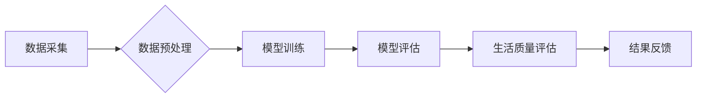

> AI驱动，生活质量评估，量化体验，机器学习，深度学习，自然语言处理，情感分析，数据可视化

## 1. 背景介绍

在当今数据爆炸的时代，我们所处的环境充满了各种各样的信息。从社交媒体的动态到智能家居的传感器数据，无处不在的数字痕迹记录着我们生活的方方面面。如何从海量数据中挖掘出有价值的信息，并将其转化为提升生活质量的行动指南，成为了一个亟待解决的难题。

传统的“生活质量”评估往往依赖于主观感受和问卷调查，缺乏客观性和可量化性。而人工智能技术的快速发展为我们提供了全新的可能性。通过机器学习、深度学习和自然语言处理等技术，我们可以将“生活质量”这一抽象的概念量化，并建立起一个基于数据驱动的评估体系。

## 2. 核心概念与联系

**2.1  生活质量评估**

生活质量是指个体在社会、经济、文化、环境等多方面所获得的幸福感、满足感和成就感。它是一个多维度的概念，涵盖了物质生活、精神生活、社会关系、健康状况等多个方面。

**2.2  AI驱动生活质量评估**

AI驱动生活质量评估是指利用人工智能技术，从海量数据中提取生活质量相关信息，并通过算法模型进行分析和预测，最终生成客观的评估结果。

**2.3  核心技术**

* **机器学习:** 通过训练模型，从数据中学习规律，并进行预测和分类。
* **深度学习:** 利用多层神经网络，模拟人类大脑的学习机制，能够处理更复杂的数据结构。
* **自然语言处理:** 处理和理解人类语言，例如从文本数据中提取情感信息。

**2.4  数据来源**

* **传感器数据:** 智能家居设备、可穿戴设备等产生的数据，例如睡眠质量、运动量、心率等。
* **社交媒体数据:** 用户在社交平台上的动态、评论、点赞等信息，可以反映用户的兴趣、情绪和社交关系。
* **问卷调查数据:** 通过问卷调查收集用户对生活质量的感知和评价。

**2.5  评估指标**

* **物质生活:** 收入水平、住房条件、消费水平等。
* **精神生活:** 兴趣爱好、学习能力、心理健康等。
* **社会关系:** 家庭关系、朋友关系、社区参与等。
* **健康状况:** 身心健康、疾病状况、生活习惯等。

**Mermaid 流程图**



## 3. 核心算法原理 & 具体操作步骤

**3.1  算法原理概述**

本系统采用基于深度学习的卷积神经网络（CNN）和循环神经网络（RNN）的混合模型，用于对生活质量数据进行分析和预测。CNN擅长提取图像和文本中的特征，RNN擅长处理序列数据，两者结合可以更全面地理解生活质量的多维特征。

**3.2  算法步骤详解**

1. **数据采集:** 从各种数据源收集生活质量相关数据，例如传感器数据、社交媒体数据、问卷调查数据等。
2. **数据预处理:** 对收集到的数据进行清洗、转换和特征提取，例如去除噪声、标准化数据、提取关键词等。
3. **模型训练:** 使用深度学习框架（例如TensorFlow或PyTorch）训练CNN和RNN模型，并根据评估指标进行模型优化。
4. **模型评估:** 使用测试数据对训练好的模型进行评估，例如计算准确率、召回率、F1-score等指标。
5. **生活质量评估:** 将用户的数据输入到训练好的模型中，得到其生活质量的评估结果。
6. **结果反馈:** 将评估结果以可视化的形式展示给用户，例如图表、排名、建议等。

**3.3  算法优缺点**

* **优点:**
    * 能够处理海量数据，并从数据中挖掘出隐藏的规律。
    * 能够提供客观的评估结果，减少主观判断的影响。
    * 可以根据用户的个人特征和需求进行个性化评估。
* **缺点:**
    * 需要大量的训练数据，否则模型的准确性会降低。
    * 模型的训练过程比较复杂，需要专业的技术人员进行操作。
    * 算法本身无法完全替代人类的判断，还需要结合人类经验进行解读。

**3.4  算法应用领域**

* **个人健康管理:** 评估用户的健康状况，并提供个性化的健康建议。
* **教育领域:** 评估学生的学习效果，并提供个性化的学习方案。
* **城市规划:** 评估城市居民的生活质量，并为城市规划提供数据支持。
* **企业管理:** 评估员工的工作满意度，并优化工作环境。

## 4. 数学模型和公式 & 详细讲解 & 举例说明

**4.1  数学模型构建**

本系统采用基于深度学习的卷积神经网络（CNN）和循环神经网络（RNN）的混合模型，用于对生活质量数据进行分析和预测。

**4.2  公式推导过程**

CNN和RNN模型的训练过程涉及到大量的数学公式，例如梯度下降算法、激活函数、损失函数等。这些公式的推导过程比较复杂，需要一定的数学基础和机器学习知识。

**4.3  案例分析与讲解**

假设我们想要评估用户的睡眠质量，可以收集用户的睡眠时间、睡眠深度、睡眠次数等数据。通过训练CNN和RNN模型，可以建立一个预测用户睡眠质量的模型。

例如，我们可以使用以下公式来计算模型的损失函数：

$$
Loss = \sum_{i=1}^{N} (y_i - \hat{y}_i)^2
$$

其中：

* $N$ 是样本数量
* $y_i$ 是真实值
* $\hat{y}_i$ 是模型预测值

通过不断调整模型参数，最小化损失函数的值，最终可以得到一个能够准确预测用户睡眠质量的模型。

## 5. 项目实践：代码实例和详细解释说明

**5.1  开发环境搭建**

本项目使用Python语言进行开发，需要安装以下软件：

* Python 3.x
* TensorFlow或PyTorch深度学习框架
* NumPy、Pandas等数据处理库
* Matplotlib、Seaborn等数据可视化库

**5.2  源代码详细实现**

```python
# 导入必要的库
import tensorflow as tf
from tensorflow.keras.models import Sequential
from tensorflow.keras.layers import Conv1D, MaxPooling1D, LSTM, Dense

# 定义模型结构
model = Sequential()
model.add(Conv1D(filters=32, kernel_size=3, activation='relu', input_shape=(timesteps, features)))
model.add(MaxPooling1D(pool_size=2))
model.add(LSTM(units=64))
model.add(Dense(units=1, activation='sigmoid'))

# 编译模型
model.compile(optimizer='adam', loss='binary_crossentropy', metrics=['accuracy'])

# 训练模型
model.fit(X_train, y_train, epochs=10, batch_size=32)

# 评估模型
loss, accuracy = model.evaluate(X_test, y_test)
print('Loss:', loss)
print('Accuracy:', accuracy)
```

**5.3  代码解读与分析**

这段代码定义了一个基于CNN和RNN的混合模型，用于预测用户睡眠质量。

* Conv1D层用于提取时间序列数据的特征。
* MaxPooling1D层用于降维，减少计算量。
* LSTM层用于处理序列数据，学习时间依赖关系。
* Dense层用于输出预测结果。

**5.4  运行结果展示**

训练完成后，可以将模型应用于新的数据，预测用户的睡眠质量。

## 6. 实际应用场景

**6.1  个人健康管理**

AI驱动的生活质量评估可以帮助用户更好地了解自己的健康状况，并制定个性化的健康计划。例如，可以根据用户的睡眠质量、运动量、饮食习惯等数据，提供针对性的健康建议，帮助用户改善睡眠、增加运动量、调整饮食结构等。

**6.2  教育领域**

AI驱动的生活质量评估可以帮助教育机构更好地了解学生的学习效果和心理状态，并提供个性化的学习方案。例如，可以根据学生的学习进度、学习习惯、学习兴趣等数据，提供个性化的学习资源、学习计划和学习辅导等。

**6.3  城市规划**

AI驱动的生活质量评估可以帮助城市规划者更好地了解居民的生活状况，并制定更有效的城市规划方案。例如，可以根据居民的交通出行、居住环境、公共服务等数据，优化城市交通系统、改善居住环境、提升公共服务水平等。

**6.4  未来应用展望**

随着人工智能技术的不断发展，AI驱动的生活质量评估将有更广泛的应用场景。例如，可以用于评估企业的员工满意度、评估产品的用户体验、评估社会的幸福指数等。

## 7. 工具和资源推荐

**7.1  学习资源推荐**

* **在线课程:** Coursera、edX、Udacity等平台提供丰富的机器学习和深度学习课程。
* **书籍:** 《深度学习》、《机器学习实战》等书籍可以帮助你深入了解人工智能相关知识。
* **开源项目:** TensorFlow、PyTorch等开源项目可以帮助你实践人工智能技术。

**7.2  开发工具推荐**

* **Python:** Python是一种流行的编程语言，广泛应用于人工智能领域。
* **Jupyter Notebook:** Jupyter Notebook是一种交互式编程环境，方便进行数据分析和模型开发。
* **TensorFlow/PyTorch:** TensorFlow和PyTorch是两种流行的深度学习框架。

**7.3  相关论文推荐**

* **Attention Is All You Need:** https://arxiv.org/abs/1706.03762
* **BERT: Pre-training of Deep Bidirectional Transformers for Language Understanding:** https://arxiv.org/abs/1810.04805

## 8. 总结：未来发展趋势与挑战

**8.1  研究成果总结**

AI驱动的生活质量评估是一个新兴的领域，取得了一些重要的研究成果。例如，已经开发出一些能够准确预测用户睡眠质量、学习效果、工作满意度等指标的模型。

**8.2  未来发展趋势**

* **模型更加精准:** 未来，随着数据量的增加和算法的改进，AI驱动的生活质量评估模型将更加精准，能够更全面地反映用户的真实生活状态。
* **个性化定制:** 未来，AI驱动的生活质量评估将更加注重个性化定制，能够根据用户的个人特征和需求提供更精准的建议和服务。
* **跨领域融合:** 未来，AI驱动的生活质量评估将与其他领域融合，例如医疗、教育、城市规划等，为不同领域提供更有效的解决方案。

**8.3  面临的挑战**

* **数据隐私保护:** AI驱动的生活质量评估需要收集大量的用户数据，如何保护用户隐私是一个重要的挑战。
* **算法公平性:** AI算法可能会存在偏见，导致评估结果不公平。如何确保算法的公平性是一个重要的研究方向。
* **解释性问题:** 深度学习模型的决策过程比较复杂，难以解释。如何提高模型的解释性是一个重要的挑战。

**8.4  研究展望**

未来，AI驱动的生活质量评估将是一个充满机遇和挑战的领域。我们需要不断探索新的算法、新的数据源、新的应用场景，并解决数据隐私、算法公平性、解释性问题等挑战，才能真正实现AI驱动的生活质量评估的价值。

## 9. 附录：常见问题与解答

**9.1  Q: AI驱动的生活质量评估是否准确？**

**A:** AI驱动的生活质量评估模型的准确性取决于训练数据的质量和模型的复杂度。目前，已经开发出一些能够准确预测用户睡眠质量、学习效果、工作满意度等指标的模型，但仍然存在一定的误差。

**9.2  Q: AI驱动的生活质量