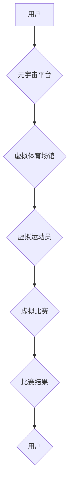

> 元宇宙、虚拟现实、增强现实、体育赛事、游戏技术、区块链、数字孪生、云计算

## 1. 背景介绍

体育赛事是人类文明的重要组成部分，它不仅展现了运动员的竞技精神和身体素质，也凝聚了人们的热情和情感。随着科技的飞速发展，元宇宙的概念应运而生，它将虚拟世界与现实世界深度融合，为我们提供全新的体验和交互方式。元宇宙奥运会作为一种全新的体育赛事模式，将利用元宇宙技术，为全球观众带来一场前所未有的虚拟体育盛宴。

## 2. 核心概念与联系

元宇宙奥运会的核心概念包括：

* **元宇宙:**  一个持久、共享、沉浸式的虚拟世界，用户可以通过虚拟身份在其中进行社交、娱乐、工作等活动。
* **虚拟现实 (VR):**  通过头戴式设备，模拟真实世界的环境和场景，用户可以身临其境地体验虚拟世界。
* **增强现实 (AR):**  将虚拟元素叠加到现实世界中，用户可以通过手机或眼镜等设备，看到虚拟信息和物体。
* **数字孪生:**  利用虚拟模型模拟现实世界中的物体或系统，可以用于训练、模拟和预测。

**元宇宙奥运会架构流程图:**



## 3. 核心算法原理 & 具体操作步骤

### 3.1  算法原理概述

元宇宙奥运会需要运用多种算法来实现虚拟比赛的真实性和交互性。其中，关键算法包括：

* **运动轨迹预测算法:**  根据运动员的运动数据和运动规律，预测运动员的未来运动轨迹，实现虚拟运动员的逼真运动。
* **物理引擎:**  模拟虚拟世界的物理规则，例如重力、碰撞、摩擦等，使虚拟比赛更加真实。
* **渲染算法:**  将虚拟场景和运动员渲染成可视化的图像，并根据用户的视角进行动态更新。
* **网络传输算法:**  保证虚拟比赛的实时性和流畅性，实现用户和虚拟运动员之间的实时交互。

### 3.2  算法步骤详解

1. **数据采集:**  收集运动员的运动数据，例如速度、加速度、姿态等。
2. **数据预处理:**  对采集到的数据进行清洗、转换和特征提取。
3. **运动轨迹预测:**  利用机器学习算法，例如神经网络，对运动员的运动数据进行建模，预测运动员的未来运动轨迹。
4. **物理引擎模拟:**  将预测的运动轨迹输入到物理引擎中，模拟运动员在虚拟环境中的运动。
5. **渲染和显示:**  将虚拟场景和运动员渲染成图像，并根据用户的视角进行动态更新。
6. **网络传输:**  将虚拟比赛的实时数据传输到用户的设备上，实现用户和虚拟运动员之间的实时交互。

### 3.3  算法优缺点

**优点:**

* **逼真度高:**  利用先进的算法和技术，可以实现虚拟运动员的逼真运动和虚拟比赛的真实感。
* **交互性强:**  用户可以与虚拟运动员进行互动，例如发指令、进行比赛等。
* **可扩展性强:**  元宇宙平台可以容纳更多的虚拟比赛和用户，满足全球观众的需求。

**缺点:**

* **技术难度高:**  实现虚拟比赛的真实性和交互性需要运用多种先进技术，技术难度较大。
* **硬件要求高:**  用户需要配备相应的硬件设备，例如VR头显和高性能电脑，才能体验元宇宙奥运会。
* **内容丰富度:**  目前元宇宙奥运会的虚拟比赛项目相对有限，需要不断丰富内容才能吸引更多用户。

### 3.4  算法应用领域

元宇宙奥运会所使用的算法不仅可以应用于体育赛事，还可以应用于其他领域，例如：

* **游戏开发:**  用于开发更加逼真和交互性的游戏。
* **军事训练:**  用于模拟真实的作战场景，进行军事训练。
* **医疗教育:**  用于模拟人体器官和疾病，进行医学教育和培训。

## 4. 数学模型和公式 & 详细讲解 & 举例说明

### 4.1  数学模型构建

元宇宙奥运会的虚拟比赛需要建立数学模型来描述运动员的运动轨迹、物理碰撞、虚拟环境的渲染等。常用的数学模型包括：

* **运动学模型:**  描述运动员的运动状态，例如位置、速度、加速度等。
* **动力学模型:**  描述运动员受到的力，以及这些力对运动员运动状态的影响。
* **碰撞检测模型:**  检测虚拟运动员之间的碰撞，并计算碰撞后的运动状态。
* **渲染模型:**  描述虚拟场景的几何形状、材质和光照等，生成可视化的图像。

### 4.2  公式推导过程

例如，运动学模型中常用的公式是：

* **位移:**  $s = v_0t + \frac{1}{2}at^2$
* **速度:**  $v = v_0 + at$
* **加速度:**  $a = \frac{dv}{dt}$

其中，$s$表示位移，$v$表示速度，$v_0$表示初始速度，$a$表示加速度，$t$表示时间。

### 4.3  案例分析与讲解

假设一个虚拟运动员在虚拟赛道上进行跑步比赛，我们可以利用运动学模型来预测其运动轨迹。

* 设定初始速度为$v_0 = 5$米/秒，加速度为$a = 1$米/秒²，时间间隔为$dt = 0.1$秒。
* 利用公式$s = v_0t + \frac{1}{2}at^2$计算运动员在每个时间间隔内的位移。
* 将计算出的位移数据连接起来，即可得到运动员的运动轨迹。

## 5. 项目实践：代码实例和详细解释说明

### 5.1  开发环境搭建

元宇宙奥运会项目可以使用Unity3D游戏引擎进行开发。Unity3D是一个跨平台的游戏引擎，支持多种编程语言，例如C#。

### 5.2  源代码详细实现

以下是一个简单的虚拟运动员运动轨迹预测代码示例：

```csharp
using UnityEngine;

public class VirtualAthlete : MonoBehaviour
{
    public float speed = 5f;
    public float acceleration = 1f;

    private Vector3 velocity;

    void Update()
    {
        velocity += acceleration * Time.deltaTime * Vector3.forward;
        transform.position += velocity * Time.deltaTime;
    }
}
```

### 5.3  代码解读与分析

* `speed`属性表示运动员的初始速度。
* `acceleration`属性表示运动员的加速度。
* `velocity`变量存储运动员的当前速度。
* `Update()`函数在每帧更新时执行，计算运动员的运动轨迹。
* `velocity += acceleration * Time.deltaTime * Vector3.forward;`语句计算运动员的速度变化，并将其添加到当前速度中。
* `transform.position += velocity * Time.deltaTime;`语句更新运动员的位置，使其沿着运动轨迹移动。

### 5.4  运行结果展示

运行此代码后，虚拟运动员将在场景中以匀加速运动，其运动轨迹将呈现一条抛物线。

## 6. 实际应用场景

元宇宙奥运会可以应用于以下场景：

* **虚拟体育训练:**  运动员可以在虚拟环境中进行训练，模拟真实的比赛场景，提高竞技水平。
* **体育赛事直播:**  观众可以通过VR/AR设备，身临其境地观看体育赛事，体验更加沉浸式的观赛体验。
* **体育赛事推广:**  元宇宙平台可以举办虚拟体育赛事，吸引更多用户参与，推广体育运动。

### 6.4  未来应用展望

未来，元宇宙奥运会将更加丰富多彩，例如：

* **更多虚拟比赛项目:**  除了传统的体育项目，还可以加入虚拟现实特有的项目，例如虚拟攀岩、虚拟滑雪等。
* **更逼真的虚拟环境:**  利用更先进的渲染技术，打造更加逼真的虚拟体育场馆和比赛场景。
* **更丰富的用户交互:**  用户可以与虚拟运动员互动，例如进行比赛、训练、交流等。

## 7. 工具和资源推荐

### 7.1  学习资源推荐

* **Unity3D官方文档:**  https://docs.unity3d.com/
* **Unreal Engine官方文档:**  https://docs.unrealengine.com/
* **VR/AR开发教程:**  https://www.youtube.com/results?search_query=vr+ar+development+tutorial

### 7.2  开发工具推荐

* **Unity3D:**  https://unity.com/
* **Unreal Engine:**  https://www.unrealengine.com/
* **Blender:**  https://www.blender.org/

### 7.3  相关论文推荐

* **The Metaverse: A New Paradigm for Human Interaction and Collaboration:**  https://arxiv.org/abs/2112.09808
* **Virtual Reality in Sports: A Review:**  https://www.tandfonline.com/doi/abs/10.1080/17456916.2020.1804777

## 8. 总结：未来发展趋势与挑战

### 8.1  研究成果总结

元宇宙奥运会作为一种全新的体育赛事模式，融合了虚拟现实、增强现实、数字孪生等先进技术，为全球观众带来一场前所未有的虚拟体育盛宴。

### 8.2  未来发展趋势

未来，元宇宙奥运会将朝着以下方向发展：

* **更加逼真的虚拟环境:**  利用更先进的渲染技术，打造更加逼真的虚拟体育场馆和比赛场景。
* **更丰富的用户交互:**  用户可以与虚拟运动员互动，例如进行比赛、训练、交流等。
* **更广泛的应用场景:**  元宇宙奥运会可以应用于体育训练、赛事直播、体育赛事推广等多个领域。

### 8.3  面临的挑战

元宇宙奥运会的发展也面临着一些挑战：

* **技术难度高:**  实现虚拟比赛的真实性和交互性需要运用多种先进技术，技术难度较大。
* **硬件要求高:**  用户需要配备相应的硬件设备，例如VR头显和高性能电脑，才能体验元宇宙奥运会。
* **内容丰富度:**  目前元宇宙奥运会的虚拟比赛项目相对有限，需要不断丰富内容才能吸引更多用户。

### 8.4  研究展望

未来，我们需要继续加强对元宇宙技术的研发，降低技术门槛，提高用户体验，并不断丰富元宇宙奥运会的虚拟比赛项目，使其成为一种更加普及和受欢迎的体育赛事模式。

## 9. 附录：常见问题与解答

**Q1: 元宇宙奥运会需要什么样的硬件设备才能体验？**

A1:  体验元宇宙奥运会需要配备VR头显、高性能电脑和稳定的网络连接。

**Q2: 元宇宙奥运会与现实世界体育赛事有什么区别？**

A2:  元宇宙奥运会是虚拟的体育赛事，运动员和观众都在虚拟环境中进行互动，而现实世界体育赛事是真实的体育比赛。

**Q3: 元宇宙奥运会对体育运动的发展有什么影响？**

A3:  元宇宙奥运会可以为体育运动提供新的发展方向，例如虚拟训练、虚拟赛事推广等，并促进体育运动的普及和发展。


作者：禅与计算机程序设计艺术 / Zen and the Art of Computer Programming 
<end_of_turn>